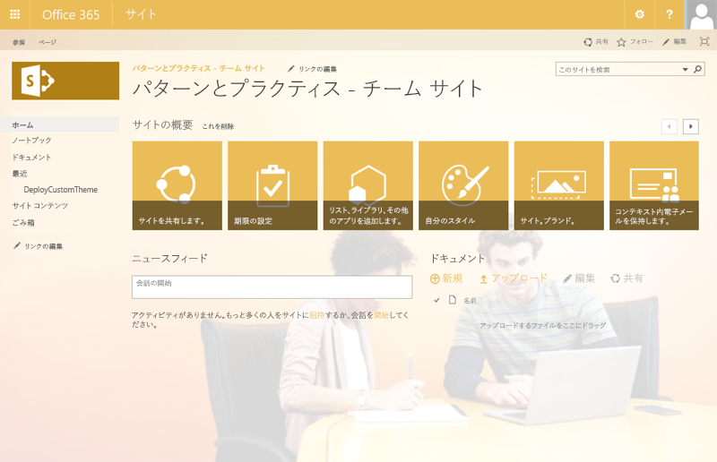
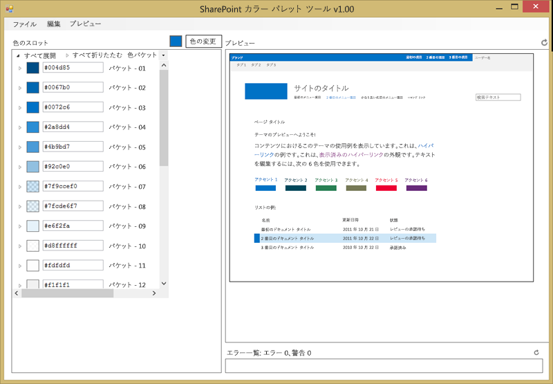

SharePoint アドイン モデルでの SharePoint サイトのブランド化
========================================================

概要
-------

新しい SharePoint アドイン モデルで SharePoint サイトをブランド化するために使用するアプローチは、完全信頼コード / ファーム ソリューションの場合とは異なります。一般的な完全信頼コード (FTC) / ファーム ソリューションのブランド化シナリオでは、カスタム マスター ページ、Web テンプレート、JavaScript、CSS ファイル、および画像を作成してカスタム ブランドを実装します。さらに、SharePoint テーマや構成済みの外観を作成してカスタム ブランドを実装する場合もあります。通常、これらの成果物は、宣言型コードと FTC / ファーム ソリューションを使用して資産を展開して SharePoint サイトに登録する機能にパッケージ化されます。

SharePoint アドイン モデルのブランド化シナリオでは、FTC / ファーム ソリューションのブランド化シナリオに関連するすべてのオプションが使用可能です。どのオプションを選択するかに関わらず、リモート プロビジョニング パターンを使用して SharePoint サイトでブランド化資産を展開して登録できます。

用語
-----------

この記事で使用されている **SharePoint テーマ**という用語は、MSDN の他の記事、MS ブログ、およびインターネット上では意味が拡大されて使用されています。MSDN の用語において、**SharePoint テーマ**とは、SharePoint サイトに適用されるカラー パレット / 配色 (.spcolor ファイル) を特に指します。PnP の用語において、**SharePoint テーマ**と**構成済みの外観**は同じものを指します。

SharePoint テーマは、数多くある [SharePoint テーマ エクスペリエンス コンポーネント](https://msdn.microsoft.com/en-us/library/office/jj927174.aspx)の 1 つです。

この記事では、すべてのブランド化オプションを簡潔に説明するため、**SharePoint テーマ**という用語を厳密に技術的な項目の意味で使用しています。 

SharePoint サイトをカスタム ブランド化する理由
----------------------------------------------------

SharePoint サイトにカスタム ブランド化を適用する理由は数多くあります。その理由には、企業のアイデンティティ、使いやすさ、マーケティングなどが含まれます。  

SharePoint サイトのカスタム ブランド化については、大まかに次のような基本ガイドラインが提供されています。

- SharePoint サイトにブランド化を適用する場合、可能であればいつでも、Office 365 テーマ、SharePoint サイト テーマ エクスペリエンス コンポーネント、および構成済みの外観を使用します。
- テーマが要件を満たさない場合は、代替 CSS オプションを使用していくつかの CSS 設定を調整できます。
- SharePoint サイトの要素を変更または非表示にするには、JavaScript 埋め込みを使用できます。
- カスタム マスター ページを使用して SharePoint サイトをカスタマイズすることができますが、長期にわたる追加コストと将来の更新に関する課題が生じることに留意してください。
    + ほとんどの場合、テーマ、構成済みの外観、および代替 CSS により、一般的なすべてのブランド化シナリオを達成できます。
    + カスタム マスター ページを使用する場合は、Office 365 に主要な機能更新が適用されたときにカスタム マスター ページに変更を適用する準備をしておいてください。
- テーマ、構成済みの外観、およびすべてのブランド化成果物を SharePoint サイトに展開して登録するには、リモート プロビジョニングを使用します。
- テーマ、構成済みの外観、およびその他のブランド化成果物を SharePoint サイトに展開して登録する場合、宣言型コードまたはサンドボックス コードを使用しないでください。  

要約すると、Office 365 SharePoint サイトではカスタマイズされたブランド化がサポートされます。この記事は、カスタマイズの短期的および長期的な影響を運用とメンテナンスの観点から考慮するのに役立ちます。これは、実際には SharePoint に限定されず、任意のプラットフォームで構築されたすべての IT ソリューションに当てはまる経験則です。

上記のガイドラインを使用してカスタマイズされた Office 365 SharePoint サイトの例を以下に示します。このケースでは、カスタム ブランド化は Office 365 テーマを使用して実装され、リモート プロビジョニング パターンで SharePoint CSOM API を使用して SharePoint サイトに展開および登録されています。

これは、「[CSOM を使用したテーマ管理 (O365 PnP サンプル)](https://github.com/OfficeDev/PnP/tree/master/Samples/Branding.DeployCustomThemeWeb)」からの例です。



SharePoint サイトへのブランド カスタマイズの適用に関する課題
-----------------------------------------------------------
**Office 365 テーマ対 SharePoint テーマ**

Office 365 テーマと SharePoint テーマが異なることを理解することは重要です。SharePoint サイトのブランド化に SharePoint テーマと構成済みの外観が使用されることを理解することも重要です。このリストでは、これらのさまざまな項目について説明しています。  

- **Office 365 テーマ**は、Office 365 テナンシーの上部ナビゲーション バーをブランド化するために使用します。これは Office 365 SharePoint サイトでのみサポートされ、オンプレミスではサポートされません。
- **SharePoint テーマ**により、色が SharePoint サイトに適用されます。
- **構成済みの外観**により、色、フォント、マスター ページ、および背景画像が SharePoint サイトに適用されます。 

**Office 365 テーマ**には以下のコンポーネントが含まれています。  

- カスタム ロゴ
- カスタム ロゴの URL
- 背景画像
- 基本色
- アクセント カラー
- ナビゲーション バーの背景色
- テキストとアイコンの色
- アプリ メニュー アイコン

Office 365 テーマの詳細については、「[組織で使用する Office 365 のテーマをカスタマイズする](https://support.office.com/en-au/article/Customize-the-Office-365-theme-for-your-organization-8275da91-7a48-4591-94ab-3123a3f79530)」を参照してください。

**SharePoint テーマ**には、以下のコンポーネントが含まれています。  

- カラー パレット (.spcolor ファイル)

*Office 365 SharePoint サイトの SharePoint テーマには、マスター ページ、マスター ページ プレビュー、構成済みの外観が含まれないことに注意してください。* これは、SharePoint サイトでブランド化を実装するときにカスタム マスター ページを使用しないとする上記のガイダンスに適合しています。

**オンプレミス SharePoint 2013 サイトで使用される構成済みの外観**には、以下のコンポーネントの 1 つ以上が含まれます。  

- カラー パレット (.spcolor ファイル) - SharePoint テーマとも呼ばれます
- フォント パターン (.spfont ファイル)
- 背景画像
- マスタ ページ
- マスター ページ プレビュー

これらのコンポーネントの詳細については、「[SharePoint 2013 のテーマの概要](https://msdn.microsoft.com/en-us/library/office/jj927174.aspx)」の記事を参照してください。

**Office 365 SharePoint 2013 サイトで使用される構成済みの外観**には、以下のコンポーネントの 1 つ以上が含まれます。  

- カラー パレット (.spcolor ファイル) - SharePoint テーマとも呼ばれます
- フォント パターン (.spfont ファイル)
- 背景画像
- マスタ ページ

**チーム サイト対発行サイト**

SharePoint サイトにカスタム ブランド化を適用するときは、チーム サイトと発行サイトの両方をブランド化する必要があります。一般に、オンプレミスと Office 365 の両方のシナリオで、SharePoint 上に構築されたイントラネットにチーム サイトと発行サイトの組み合わせが使用されます。  

カスタム ブランド化の要件では、テーマや JavaScript 埋め込み手法では実現できない特定のレイアウト変更がしばしば要求されます。

そのようなシナリオでは、チーム サイトで要求されるカスタム ブランド化は発行サイトの場合ほど多くなく、通常はモバイル デバイス用の標準の SharePoint コンテンポラリ表示でチーム サイト用にのバイル デバイスを十分にサポートできます。そのようなわけで、発行サイトにはカスタム マスター ページだけを使用し、チーム サイトのブランド化には、構成済みの外観として定義されたカスタム SharePoint テーマ (.spcolor ファイル)、フォント パターン (.spfont ファイル)、および背景画像を使用することをお勧めします。

**展開**

通常、カスタム ブランド化は、サイトがプロビジョニングされるときに適用されます。リモート プロビジョニング プロセスは、この方法に最適です。通常、Web ブラウザーを使用して SharePoint ブランド化カスタマイズを手動で適用するのは、拡張して他のサイト コレクションやサブサイトを含める計画のない単一の SharePoint サイトを試作または変更するときだけです。 

ブランド カスタマイズを SharePoint サイトに適用するためのオプション
--------------------------------------------------------

新しい SharePoint アドイン モデルを使用してブランド カスタマイズを SharePoint サイトに適用する場合、いくつかのオプションから選択できます。

- Office 365 テーマを使用して SharePoint サイトをブランド化する。
- SharePoint サイト用の構成済みの外観を変更する。
- SharePoint カラー パレット ツールを使用して SharePoint テーマ用のカラー パレットを作成する。
- 代替 CSS を使用して SharePoint サイトをブランド化する。
- SharePoint テーマ用の配色を手動で作成する。 
- SharePoint テーマ用のフォント パターンを手動で作成する。
- JavaScript 埋め込みを使用して、SharePoint サイト上のコンポーネントを表示または非表示にする。
- SharePoint サイト用のカスタム マスター ページとページ レイアウトを作成する。
- SharePoint サイト用の構成済みの外観を作成する。

Office 365 テーマを使用して SharePoint サイトをブランド化する
--------------------------------------------------

SharePoint サイトにブランド化を適用する最も簡単な方法は、O365 テナンシーの Office テーマを変更することです。

- Office 365 テーマを使用すると、すべての Office 365 サービスにわたってブランド化を一元的に制御できます。
    + 現時点では、Office 365 テーマに関連付けられる設定の数には制限があります。
- Office 365 テーマは、SharePoint サイト レベルでオーバーライドすることができます。
- Office 365 テーマは Office 365 テナントにのみ存在し、オンプレミス SharePoint には存在しません。
- Office 365 テーマを使用すると、SharePoint サイトをかなり柔軟にブランド化できます。
- Office 365 テーマは、短期および長期間にわたり、非常に簡単かつ低コストで実装してメンテナンスできます。

**Office 365 テーマを使用して SharePoint サイトをブランド化するのに適した場合**

このオプションが適しているのは、ブランド化のニーズがそれほど具体的でなく、SharePoint サイトの Office バー部分に使用する新しい配色、ロゴ、および背景画像を探しているだけといった場合です。***アプリ メニュー アイコンを変更する唯一の方法は Office 365 テーマであることに注意してください。***

**推奨される展開アプローチ**

Office 365 テナンシー用の Office 365 テーマは、Web ブラウザーまたはリモート プロビジョニング パターンを使用して変更できます。

SharePoint サイト用の構成済みの外観を変更する
----------------------------------------------
SharePoint サイトにブランド化を適用するもう 1 つの簡単な方法は、SharePoint サイトの構成済みの外観を変更することです。  

- 構成済みの外観には [サイト設定] ページからアクセスします。  
- SharePoint には構成済みの外観が複数付属しており、そこから選択できます。
- 構成済みの外観は、Office 365 テナントとオンプレミスの両方の SharePoint に存在します。
- 構成済みの外観を使用すると、SharePoint サイトをかなり柔軟にブランド化できます。
    + 構成済みの外観は、配色とフォント パターン、背景画像、およびマスター ページのコレクションです。
- 構成済みの外観は、短期および長期間にわたり、非常に簡単かつ低コストで実装できます。
- 構成済みの外観には、標準のマスター ページまたはカスタムのマスター ページを含めることができます。
- 構成済みの外観はサイトごとのレベルで使用できます。
 
**SharePoint サイト用の構成済みの外観を変更するのに適した場合**

このオプションが適しているのは、ブランド化のニーズがそれほど具体的でなく、サイトに使用する新しい配色、背景画像、およびマスター ページを探しているだけといった場合です。

**推奨される展開アプローチ**

SharePoint サイト用の構成済みの外観は、Web ブラウザーまたはリモート プロビジョニング パターンを使用して変更できます。

SharePoint カラー パレット ツールを使用して SharePoint テーマ用のカラー パレットを作成する
--------------------------------------------------------------------------------------
[SharePoint カラー パレット ツール](http://www.microsoft.com/en-gb/download/details.aspx?id=38182) (下の図) を使用すると、SharePoint テーマの配色を簡単に作成できます。このツールは、*WYSIWYG (What You See Is What You Get)* エクスペリエンスを提供します。このツールで作成した配色を保存すると、.spcolor ファイルが生成されます。



- SharePoint サイト用のカスタムの配色は、短期および長期間にわたり、非常に簡単かつ低コストで実装してメンテナンスできます。
    + カスタムの配色は構成済みの外観の一部にすぎないことに留意してください。
- カスタムの配色を使用すると、SharePoint サイトをかなり柔軟にブランド化できます。
- 構成済みの外観を使用して、サイトごとのレベルで配色を適用することができます。

**SharePoint サイト用のカスタムの配色を作成するのに適した場合**

このオプションが適しているのは、ブランド化のニーズに新しい配色が含まれているが、レイアウトの変更やさまざまな Office 365 SharePoint コンポーネントの表示や非表示は必要でない場合です。

**推奨される展開アプローチ**

Web ブラウザーまたはリモート プロビジョニング パターンを使用して、ツールで作成した .spcolor ファイルを SharePoint サイトにアップロードし、それを含む構成済みの外観を作成し、SharePoint サイトに適用できます。

代替 CSS を使用して SharePoint サイトをブランド化する
--------------------------------------------
カスタムのカスケード スタイル シート (CSS) ファイルを作成し、SharePoint サイト用の代替 CSS ファイルとして設定することもできます。  

- 代替 CSS を使用すると、SharePoint に付属する標準の CSS 設定をオーバーライドすることができます。
- 代替 CSS のアプローチを使用すると、色やフォントだけでなく、レイアウトの設定も制御することができます。 
- 代替 CSS を短期および長期間にわたって実装およびメンテナンスするには、中程度の量の投資が必要です。
- 代替 CSS を使用すると、SharePoint サイトをかなり柔軟にブランド化できます。
- 代替 CSS はサイトごとのレベルで使用できます。

**代替 CSS を使用して SharePoint サイトをブランド化するのに適した場合**

このオプションが適しているのは、ブランド化のニーズに新しい配色、フォント、および最小限のレイアウト変更が含まれているが、さまざまな Office 365 SharePoint コンポーネントの表示や非表示は必要でない場合です。

**推奨される展開アプローチ**

Web ブラウザーまたはリモート プロビジョニング パターンを使用して、CSS ファイルを SharePoint サイトにアップロードし、SharePoint サイトに適用できます。

SharePoint テーマ用の配色を手動で作成する
------------------------------------------------------
メモ帳などのテキスト エディターや Visual Studio を使用して .spcolor ファイルを手動で作成することもできます。.spcolor ファイルのスニペット例を下に示します。

```XML
<?xml version="1.0" encoding="utf-8"?>
<s:colorPalette isInverted="false" previewSlot1="BackgroundOverlay" previewSlot2="BodyText" previewSlot3="AccentText" xmlns:s="http://schemas.microsoft.com/sharepoint/">
<s:color name="BodyText" value="444444" />
<s:color name="SubtleBodyText" value="777777" />
<s:color name="StrongBodyText" value="262626" />
```

- SharePoint サイト用のカスタムの配色は、短期および長期間にわたり、非常に簡単かつ低コストで実装してメンテナンスできます。
    + カスタムの配色は構成済みの外観の一部にすぎないことに留意してください。
- カスタムの配色を使用すると、SharePoint サイトをかなり柔軟にブランド化できます。
- 構成済みの外観を使用して、サイトごとのレベルで配色を適用することができます。
 
**SharePoint サイト用の配色を手動で作成するのに適した場合**

このオプションが適しているのは、ブランド化のニーズに新しい配色が含まれているが、レイアウトの変更やさまざまな Office 365 SharePoint コンポーネントの表示や非表示は必要でない場合です。

**推奨される展開アプローチ**

Web ブラウザーまたはリモート プロビジョニング パターンを使用して、ツールで作成した .spcolor ファイルを SharePoint サイトにアップロードできます。

SharePoint テーマ用のフォント パターンを手動で作成する
----------------------------------------------------
SharePoint サイト用のフォント パターンを作成することにより、SharePoint サイトで使用するフォントを定義することもできます。メモ帳などのテキスト エディターや Visual Studio を使用して .spfont ファイルを手動で作成する必要があります。.spfont ファイルのスニペット例を下に示します。

```XML
<?xml version="1.0" encoding="utf-8"?>
<s:fontScheme name="Bodoni" previewSlot1="title" previewSlot2="body" xmlns:s="http://schemas.microsoft.com/sharepoint/">
    <s:fontSlots>
        <s:fontSlot name="title">
            <s:latin typeface="Bodoni Book" eotsrc="/_layouts/15/fonts/BodoniBook.eot" woffsrc="/_layouts/15/fonts/BodoniBook.woff" ttfsrc="/_layouts/15/fonts/BodoniBook.ttf" svgsrc="/_layouts/15/fonts/BodoniBook.svg" largeimgsrc="/_layouts/15/fonts/BodoniBookLarge.png" smallimgsrc="/_layouts/15/fonts/BodoniBookSmall.png" />
            <s:ea typeface="" />
            <s:cs typeface="Segoe UI Light" />
            <s:font script="Arab" typeface="Segoe UI Light" />
```

- SharePoint サイト用のカスタムのフォント パターンは、短期および長期間にわたり、非常に簡単かつ低コストで実装してメンテナンスできます。  
    + カスタムのフォント パターンは構成済みの外観の一部にすぎないことに留意してください。
- カスタムのフォント パターンを使用すると、SharePoint サイトをかなり柔軟にブランド化できます。
- 構成済みの外観を使用して、サイトごとのレベルでフォント パターンを適用することができます。

**SharePoint サイト用のフォント パターンを手動で作成するのに適した場合**

このオプションが適しているのは、ブランド化のニーズに新しいフォント パターンが含まれているが、レイアウトの変更やさまざまな Office 365 SharePoint コンポーネントの表示や非表示は必要でない場合です。

**推奨される展開アプローチ**

Web ブラウザーまたはリモート プロビジョニング パターンを使用して、.spfont ファイルを SharePoint サイトにアップロードできます。

JavaScript 埋め込みを使用して、SharePoint サイト上のコンポーネントを表示または非表示にする
-------------------------------------------------------------------------
JavaScript 埋め込みを使用すると、SharePoint サイトにカスタムのブランド化を適用できます。JavaScript 埋め込みでは、SharePoint サイトの全ページで実行される JavaScript が登録されます。内部的には、JavaScript 埋め込みではスクリプト ブロック定義に割り当てられたカスタム アクションが利用されます。これらのカスタム アクションが SharePoint サイトに追加されることにより、スクリプト ブロック内の JavaScript が実行されます。要約すると、このアプローチにより JavaScript コードを実行できます。ブランド化のシナリオにおいて、一般的な JavaScript コードでは JQuery を使用してドキュメント オブジェクト モデル (DOM) を操作します。

JavaScript を使用して SharePoint サイトをカスタマイズする方法については、[この記事](Customize-your-SharePoint-site-UI-by-using-JavaScript.md)を参照してください。  

- SharePoint サイト用の JavaScript 埋め込みを短期および長期間にわたって実装およびメンテナンスするには、中程度の量の投資が必要です。
- SharePoint サイト用の JavaScript 埋め込みを使用すると、SharePoint サイトをかなり柔軟にブランド化できます。
- JavaScript 埋め込みはサイトごとのレベルで適用できます。
- SharePoint サイトでダウンロード最小化戦略 (MDS) が有効になっている場合は、使用する JavaScript 埋め込みが正しく実行されることを特に注意して確認する必要があります。上記の記事では、この点が詳しく説明されています。

**JavaScript 埋め込みを使用して SharePoint サイト上のコンポーネントを表示または非表示にするのに適した場合**

このオプションが適しているのは、SharePoint に付属する要素を表示、非表示または変更する必要がある場合です。たとえば、JavaScript 埋め込みを使用して、標準の上部ナビゲーション コントロールを独自のカスタム クライアント側ナビゲーション コントロールに置き換えることができます。

**推奨される展開アプローチ**

リモート プロビジョニング パターンを使用して、JavaScript が埋め込まれた変更を SharePoint サイトに展開できます。

SharePoint サイト用のカスタム マスター ページとページ レイアウトを作成する
-----------------------------------------------------------------
カスタム ブランド化の要件を実装する唯一の方法がカスタム マスター ページであるシナリオでは、カスタム マスター ページとページ レイアウトを作成することができます。この記事の冒頭でこのアプローチに関連する長期的なメンテナンス コストに関して述べられた点に注意してください。

- SharePoint サイト用のカスタム マスター ページを使用すると、最高レベルのカスタマイズ (無制限) を実行できます。
- SharePoint サイト用のカスタム マスター ページを短期および長期間にわたって実装およびメンテナンスするには、大量の時間が必要です。
- サービス更新プログラムに付属する標準のマスター ページへの変更は、カスタム マスター ページには反映されません。
- カスタム マスター ページはサイトごとのレベルで適用できます。
- カスタム マスター ページを使用する場合、最初は標準のマスター ページをニーズに合わせて変更することをお勧めします。
    + カスタム マスター ページでカスタマイズする量は最小限にしてください。これにより、標準のマスター ページに O365 サービスが加えた変更をカスタム マスター ページに複製しなければならない場合に、カスタム マスター ページを容易に更新できます。  
- SharePoint マスター ページには必須のコンテンツ プレースホルダーが多数あり、削除するとページでエラーが発生します。必須のコンテンツ プレースホルダーを削除した場合は、展開してそのマスター ページをサイトに割り当てたときにエラーが表示されるため、そのことがわかります。

**SharePoint サイト用のカスタム マスター ページとページ レイアウトが適しているケース** このオプションが適しているのは、ブランド化のニーズが非常に具体的である場合や、発行サイトを使用している場合です。

**推奨される展開アプローチ**

Web ブラウザーを使用してカスタム マスター ページを手動でアップロードし、構成された外観に手動で割り当てることができます。

リモート プロビジョニング パターンを使用してカスタム マスター ページをアップロードし、SharePoint サイトに割り当てることもできます。

SharePoint サイト用の構成済みの外観を作成する
----------------------------------------------
構成済みの外観には、上で説明した .spcolor および .spfont ファイルが含まれています。マスター ページと背景画像も含まれます。構成済みの外観は、SharePoint サイトへの展開用にパッケージ化された資産ではありません。むしろ、マスター ページへの URL、.spcolor ファイル、.spfont ファイル、および背景画像が含まれる特殊な SharePoint リスト内のリスト アイテムです。構成済みの外観を SharePoint サイトに適用すると、これらのアイテムすべてが設定され、構成済みの外観で定義されているブランド化資産が実装されます。

次の図は、Web ブラウザーを使用して Office 365 SharePoint サイト用の構成済みの外観を作成する例を示しています。オレンジ色で強調表示されている部分に注目してください。この部分は、上で説明した .spcolor および .spfont ファイルを示しています。.spcolor ファイルがテーマ URL と呼ばれていることに注意してください。これは、Office 365 SharePoint サイト用の SharePoint テーマの説明と一致します。

![構成済みの外観に含まれるフィールド:[タイトル] には、「My Theme」と記入されています。 [名前] には、「My Theme's Name」と記入されています。 [マスター ページの URL] には、「https://site.sharepoint.com/_catalogs/masterpage/seattle.master」と記入されています。 [テーマの URL] には、「https://site.sharepoint.com/_catalogs/theme/15/custom.spcolor」と記入されています。「.spcolor」はオレンジ色で強調表示されています。 [イメージの URL] には、「https://site.sharepoint.com/_catalogs/theme/15/custom-bg.jpg」と記入されています。 [フォント パターンの URL] には、「https://site.sharepoint.com/_catalogs/theme/15/custom.spfont」と記入されています。「.spfont」はオレンジ色で強調表示されています。 表示順序には 100 が含まれています。](media/Recipes/Themes/new-theme-browser.png)

- SharePoint サイト用の構成済みの外観を使用すると、適度なレベルのカスタマイズを実行できます。
- SharePoint サイト用の構成済みの外観を短期および長期間にわたって実装およびメンテナンスするには、少量の時間が必要です。
- 構成済みの外観はサイトごとのレベルで適用できます。

**SharePoint サイト用の構成済みの外観を作成するのに適した場合**

このオプションが適しているのは、ブランド化のニーズがそれほど具体的でなく、サイトに使用する新しい配色、フォント パターン、および背景画像を探しているだけといった場合です。

このオプションは、ブランド化の要件を実装するためにカスタム マスター ページを含める必要がある場合にも適しています。

**推奨される展開アプローチ**

構成済みの外観を構成する資産を Web ブラウザーによってアップロードした後、構成済みの外観を Web ブラウザーで作成するか、構成済みの外観を構成する資産をリモート プロビジョニング パターンによってアップロードした後、構成済みの外観を SharePoint リストで作成することができます。

# 選択されたパスに関する特定の課題 #
次の箇条書きは、選択されたパターンに関する特定の課題を示しています。展開におけるブランド化の方法を決定するときはこれらも考慮に入れる必要があります。

- Office 365 テーマはかなり制限されており、主にページのスイート ナビゲーション セクションを制御する
- SharePoint テーマはサイトに適用される時間に依存します。選択したテーマがサイトに適用されるとき、必要な CSS ファイルが SharePoint で spcolor および spfont ファイルに基づいて動的に作成されます。そのため、SharePoint UI 用の新しい CSS 定義が導入されると、メンテナンスの要件が発生します。
- 代替 CSS のアプローチは標準スタイルのオーバーライドに基づいています。新しい oob CSS 定義が導入されると、サイトが影響を受け、関連するカスタム CSS ファイルに変更を適用しなければならなくなる可能性があります。
- マスター ページは、常に標準のマスター ページに基づいて作成されます。標準のマスター ページに新しいコントロールまたはレイアウト構造が導入されると、カスタム マスター ページだけでなく使用されるサイトも更新が必要になる可能性があります。
 
概要
-------
次の図は、SharePoint サイトを高いレベルでブランド化するためのオプションをすべてまとめたものです。


関連リンク
=============
- [SharePoint カラー パレット ツール](http://www.microsoft.com/en-gb/download/details.aspx?id=38182)
- Ignite 2015 - [反復可能なパターンとプラクティスによる Office 365 での安全な SharePoint ブランド化の詳細](https://channel9.msdn.com/Events/Ignite/2015/BRK3164)
- [JavaScript を使用して SharePoint サイト UI をカスタマイズする](Customize-your-SharePoint-site-UI-by-using-JavaScript.md)
- ガイダンス記事: [http://aka.ms/OfficeDevPnPGuidance](http://aka.ms/OfficeDevPnPGuidance "ガイダンス記事")
- MSDN リファレンス: [http://aka.ms/OfficeDevPnPMSDN](http://aka.ms/OfficeDevPnPMSDN "MSDN リファレンス")
- ビデオ: [http://aka.ms/OfficeDevPnPVideos](http://aka.ms/OfficeDevPnPビデオ"Videos")

関連する PnP サンプル
===================

- [CSOM を使用したテーマ管理 (O365 PnP サンプル)](https://github.com/OfficeDev/PnP/tree/master/Samples/Branding.DeployCustomThemeWeb)
- [サイトにテーマを設定する (O365 PnP サンプル)](https://github.com/OfficeDev/PnP/tree/master/Samples/Branding.SetThemeToSite)
- [SharePoint 用アプリでの SharePoint テーマの設定 (O365 PnP サンプル)](https://github.com/OfficeDev/PnP/tree/master/Samples/Branding.Themes)
- [標準の Seattle マスター応答の作成 (O365 PnP サンプル)](https://github.com/OfficeDev/PnP/tree/master/Samples/Branding.InjectResponsiveCSS)
- [Web オブジェクトの AlternateCSSUrl および SiteLogoUrl (O365 PnP サンプル)](https://github.com/OfficeDev/PnP/tree/master/Samples/Branding.AlternateCSSAndSiteLogo)
- https://github.com/OfficeDev/PnP にあるサンプルとコンテンツ

適用対象
==========
- Office 365 マルチテナント (MT)
- Office 365 専用 (D) *一部*
- SharePoint 2013 オンプレミス - *一部*

*専用およびオンプレミスの場合のパターンは SharePoint アドイン モデル手法と同じですが、使用可能なテクノロジは異なる可能性があります。*
