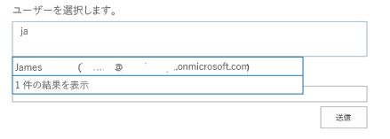
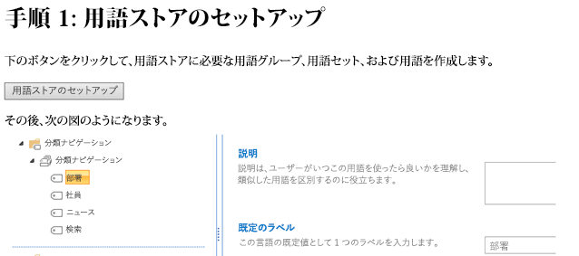

# SharePoint のプロバイダー ホスト型アドインを使用して UX コントロールを作成する

ホスト Web の UX コントロールと同様に機能および動作する、SharePoint プロバイダー ホスト型アドインの UX コントロールを作成します。 

_**適用対象:** Office 365? | SharePoint 2013? | SharePoint Online_

この記事では、プロバイダー ホスト型アドインで UX コントロールを実装する方法を示す 3 つのサンプルについて説明します。

- [Core.PeoplePicker](https://github.com/OfficeDev/PnP/tree/dev/Components/Core.PeoplePicker) ? ユーザー選択コントロールを追加する方法を示します。
    
- [Core.TaxonomyMenu](https://github.com/OfficeDev/PnP/tree/dev/Components/Core.TaxonomyMenu) ? ローカライズ可能な分類メニュー コントロールを実装する方法を示します。
    
- [Core.TaxonomyPicker](https://github.com/OfficeDev/PnP/tree/dev/Components/Core.TaxonomyPicker) ? 分類選択コントロールを実装する方法を示します。
    
これらのサンプルでは、JavaScript および JSOM を使用して SharePoint と情報をやり取りし、 [クロス ドメイン ライブラリ](https://msdn.microsoft.com/en-us/library/office/fp179927%28v=office.15%29.aspx) を使用してアドインからホスト サイト ドメインへの関数呼び出しを処理します。

## ユーザー選択のコントロール
<a name="bmPeoplePicker"> </a>

[Core.PeoplePicker](https://github.com/OfficeDev/PnP/tree/dev/Components/Core.PeoplePicker) サンプルには、プロバイダー ホスト型アドインにユーザー選択コントロールを実装する方法が示されています。ユーザーが名前をテキスト入力ボックスに入力し始めると、コントロールは一致する可能性のある名前をユーザー プロファイル ストアで検索し、それらを UI に表示します。アドインは、構成と拡張が可能なユーザー選択コントロールを表示します。これはリモート ホストで実行され、ホスト サイトのユーザー プロファイル ストアでクエリを実行して、ユーザー入力と照合します。

**図 1. ユーザー選択コントロール**


    

                **メモ:**サンプルの Visual Studio 2013 ソリューションには、アドインの展開時に確実にアドイン Web を作成するための、「Dummy」というモジュールが含まれています。 クロス ドメイン呼び出しには、アドイン Web が必要です。

Core.PeoplePickerWeb プロジェクトの Scripts フォルダーには、app.js と peoplepickercontrol.js ファイルが含まれています (追加の言語サポート用のユーザー選択リソース ファイルもあります)。app.js ファイルはクロス ドメイン ライブラリを使用してクライアント コンテキストをフェッチし、Default.aspx ファイルの HTML をユーザー選択コントロールにフックします。Default.aspx ファイルには、テキスト ボックスとユーザー検索機能の両方を実装する  `<div>` タグが含まれています。

**メモ:**  この記事で提供されるコードは、明示または黙示のいかなる種類の保証なしに現状のまま提供されるものであり、特定目的への適合性、商品性、権利侵害の不存在についての暗黙的な保証は一切ありません。

```
<div id="divAdministrators" class="cam-peoplepicker-userlookup ms-fullWidth">
  <span id="spanAdministrators"></span>
<asp:TextBox ID="inputAdministrators" runat="server" CssClass="cam-peoplepicker-edit" Width="70"></asp:TextBox>
</div>
<div id="divAdministratorsSearch" class="cam-peoplepicker-usersearch ms-emphasisBorder"></div>
<asp:HiddenField ID="hdnAdministrators" runat="server" />

```

app.js ファイルは、ユーザー選択コントロールを作成して構成します。

```
//Make a people picker control.
//1. context = SharePoint Client Context object
//2. $('#spanAdministrators') = SPAN that will 'host' the people picker control
//3. $('#inputAdministrators') = INPUT that will be used to capture user input
//4. $('#divAdministratorsSearch') = DIV that will show the 'drop-down' of the picker
//5. $('#hdnAdministrators') = INPUT hidden control that will host a resolved users
peoplePicker = new CAMControl.PeoplePicker(context, $('#spanAdministrators'), $('#inputAdministrators'), $('#divAdministratorsSearch'), $('#hdnAdministrators'));
// required to pass the variable name here!
peoplePicker.InstanceName = "peoplePicker";
// Hookup everything.
peoplePicker.Initialize();

```

ユーザー選択コントロールは JSOM ライブラリ の  **ClientPeoplePickerWebServiceInterface** オブジェクトに対してクエリを実行して、入力した文字列と一致する名前のユーザーの検索を開始します。

```
if (searchText.length >= parent.GetMinimalCharactersBeforeSearching()) {
                            resultDisplay = 'Searching...';
                            if (typeof resultsSearching != 'undefined') {
                                resultDisplay = resultsSearching;
                            }

                  var searchbusy = parent.Format('<div class=\'ms-emphasisBorder\' style=\'width: 400px; padding: 4px; border-left: none; border-bottom: none; border-right: none; cursor: default;\'>{0}</div>', resultDisplay);
                            parent.PeoplePickerDisplay.html(searchbusy);
                            // Display the suggestion box.
                            parent.ShowSelectionBox();

                   var query = new SP.UI.ApplicationPages.ClientPeoplePickerQueryParameters();
                            query.set_allowMultipleEntities(false);
                            query.set_maximumEntitySuggestions(2000);
                            query.set_principalType(parent.GetPrincipalType());
                            query.set_principalSource(15);
                            query.set_queryString(searchText);
                            var searchResult = SP.UI.ApplicationPages.ClientPeoplePickerWebServiceInterface.clientPeoplePickerSearchUser(parent.SharePointContext, query);

                  // Update the global queryID variable so that you can correlate incoming delegate calls.
                            parent._queryID = parent._queryID + 1;
                            var queryIDToPass = parent._queryID;
                            parent._lastQueryID = queryIDToPass;

                  // Make the SharePoint request.
                            parent.SharePointContext.executeQueryAsync(Function.createDelegate(this, function () { parent.QuerySuccess(queryIDToPass, searchResult); }),
                                                Function.createDelegate(this, function () { parent.QueryFailure(queryIDToPass); }));

```

## 分類メニュー コントロール
<a name="bmTaxMenu"> </a>

[Core.TaxonomyMenu](https://github.com/OfficeDev/PnP/tree/dev/Components/Core.TaxonomyMenu) サンプルには、用語ストアからデータを読み込むローカライズ可能な分類メニュー コントロールをプロバイダー ホスト型アドインに実装する方法が示されています。また、アドインは メニューに読み込む必要な用語ストアの言語、グループ、セット、および用語をセットアップし、表示言語を設定するユーザーの言語の優先順位を確認します。

アドインは、用語ストアをセットアップし、用語をその用語ストアに読み込む  **TaxonomyHelper** クラス (CSOM) を実装します。ナビゲーション リンクを表示する JavaScript ファイルをサイトのルート フォルダーにアップロードします。

アドインは用語ストアをホスト ストアにセットアップします。また、CSOM オブジェクトとメソッドを使用して、用語のグループおよびセットを作成し、4 つの用語を用語セットに読み込みます。 

**図 2. 用語ストアのセットアップ画面**



**[用語ストアのセットアップ]** ボタンを選択すると、アドインは以下を実行します。

- 用語ストアで必要な言語 (英語、ドイツ語、フランス語、およびスウェーデン語) が有効になっていることを確認します。
    
- 用語グループと用語セットを作成し、4 つの新しい用語を用語セットに読み込みます。
    
**TaxonomyHelper** クラスの次のコードは、必要な言語が有効であることを確認し、有効でない場合はそれらを有効にします。

```
var languages = new int[] { 1031, 1033, 1036, 1053 };
            Array.ForEach(languages, l => { 
                if (!termStore.Languages.Contains(l)) 
                    termStore.AddLanguage(l); 
            });

            termStore.CommitAll();
            clientContext.ExecuteQuery();

// Create the term group.
termGroup = termStore.CreateGroup("Taxonomy Navigation", groupId);
                clientContext.Load(termGroup);
                clientContext.ExecuteQuery();
```

最後に、同じ  **TaxonomyHelper** クラスの次のコードは、ドイツ語、フランス語、スウェーデン語のラベルと一緒に新しい用語をそれぞれ作成します。また、用語ストア管理ツールの **Simple Link or Header** プロパティと同等の **_Sys_Nav_SimpleLinkUrl** プロパティの値を設定します。この場合、各用語の URL は元のルート サイトをポイントします。

```
var term = termSet.CreateTerm(termName, 1033, Guid.NewGuid());
term.CreateLabel(termNameGerman, 1031, false);
term.CreateLabel(termNameFrench, 1036, false);
term.CreateLabel(termNameSwedish, 1053, false);
term.SetLocalCustomProperty("_Sys_Nav_SimpleLinkUrl", clientContext.Web.ServerRelativeUrl);
```

次に、アドインはホスト サイトのルート フォルダーに topnav.js ファイルを挿入します。このファイルには、この用語セットからのリンクをホスト サイトのホーム ページのナビゲーションに挿入する JavaScript が含まれています。アドイン UI は、アドインが JavaScript ファイルをアップロードした後に、ナビゲーション リンクがホスト サイトに表示される方法も示します。

topnav.js ファイルの次のコードでは、JSOM を使用してユーザーの優先言語が確認されます。

```
var targetUser = "i:0#.f|membership|" + _spPageContextInfo.userLoginName;
        context = new SP.ClientContext.get_current();
var peopleManager = new SP.UserProfiles.PeopleManager(context);
var userProperty = peopleManager.getUserProfilePropertyFor(targetUser, "SPS-MUILanguages");
```

次いでアドインは、ユーザーの優先言語が有効な言語のいずれかと一致するかどうかを判別します。一致するものが検出されると、次のコードによって、ユーザーの優先言語の用語および関連付けられているラベルが取得されます。

```
while (termEnumerator.moveNext()) {
    var currentTerm = termEnumerator.get_current();
    var label = currentTerm.getDefaultLabel(lcid);

    termItems.push(currentTerm);
    termLabels.push(label);
    context.load(currentTerm);
```

最後に、topnav.js ファイルの次のコードは、用語を含むリンクをホスト サイトの最上位のナビゲーション要素に挿入します。

```
html += "<ul style='margin-top: 0px; margin-bottom: 0px;'>"
        for (var i in termItems) {
            var term = termItems[i];
            var termLabel = termLabels[i];
            var linkName = termLabel.get_value() != 0 ? termLabel.get_value() : term.get_name();
            var linkUrl = term.get_localCustomProperties()['_Sys_Nav_SimpleLinkUrl'];

            html += "<li style='display: inline;list-style-type: none; padding-right: 20px;'><a href='" + linkUrl + "'>" + linkName + "</a></li>";
        }
        html += "</ul>";

        $('#DeltaTopNavigation').html(html);
        SP.UI.Notify.removeNotification(nid);
```

## 分類選択コントロール
<a name="bmTaxPicker"> </a>

[Core.TaxonomyPicker](https://github.com/OfficeDev/PnP/tree/dev/Components/Core.TaxonomyPicker) サンプルは、プロバイダー ホスト型アドインに分類選択コントロールを実装する方法を示します。ユーザーがテキスト入力ボックスに用語を入力し始めると、コントロールは用語ストアで一致する可能性のあるものを検索し、入力ボックスの下のリストに表示します。

アドインは JSOM 分類ピッカーの要件に準拠する HTML ページを作成し、コントロールを追加して構成します。また、JSOM ライブラリを使用して、ホスト サイトの用語ストアでクエリを実行します。分類ピッカーは SharePoint Managed Metadata Service と通信します。この通信では、閉じられた用語セットを読み込み、オープンな用語セットに書き込めるように、分類アクセス許可の範囲で書き込みアクセス許可が必要になります。AppManifest.xml ファイルで適切な範囲の書き込みアクセス許可が設定されていることを確認します。

[Core.TaxonomyPicker](https://github.com/OfficeDev/PnP/tree/dev/Components/Core.TaxonomyPicker) プロジェクトの Scripts フォルダーには、app.js ファイルと taxonomypickercontrol.js ファイルがあります (追加の言語サポート用の分類ピッカー リソース ファイルもあります)。app.js ファイルは、クロス ドメイン ライブラリを使用してクライアント コンテキストをフェッチし、Default.aspx ファイルの HTML を分類選択コントロールにフックします。Default.aspx ファイルには、テキスト ボックスと分類選択機能の両方を実装する非表示フィールドが含まれます。これはまた、箇条書きのリストも追加して、用語ストアから返される候補を表示します。

```
<div style="left: 50%; width: 600px; margin-left: -300px; position: absolute;">
            <table>
                <tr>
                    <td class="ms-formlabel" valign="top"><h3 class="ms-standardheader">Keywords Termset:</h3></td>
                    <td class="ms-formbody" valign="top">
                        <div class="ms-core-form-line" style="margin-bottom: 0px;">
                            <asp:HiddenField runat="server" id="taxPickerKeywords" />
                        </div>
                    </td>
                </tr>
            </table>

            <asp:Button runat="server" OnClick="SubmitButton_Click" Text="Submit" />

            <asp:BulletedList runat="server" ID="SelectedValues" DataTextField="Label" />
</div>
```

app.js ファイルは、分類選択コントロールを作成して構成します。

```
// Load scripts for calling taxonomy APIs.
                    $.getScript(layoutsRoot + 'init.js',
                        function () {
                            $.getScript(layoutsRoot + 'sp.taxonomy.js',
                                function () {
                                    // Bind the taxonomy picker to the default keywords term set.
                                    $('#taxPickerKeywords').taxpicker({ isMulti: true, allowFillIn: true, useKeywords: true }, context);
                                });
                        });

```

分類選択コントロールは次のコードを使用して、JSOM の  **TaxonomySession** インスタンスを開き、用語ストアからすべての用語を読み込みます。

```
// Get the taxonomy session by using CSOM.
            var taxSession = SP.Taxonomy.TaxonomySession.getTaxonomySession(spContext);
            //Use the default term store...this could be extended here to support additional term stores.
            var termStore = taxSession.getDefaultSiteCollectionTermStore();

            // Get the term set based on the properties of the term set.
            if (this.Id != null)
                this.RawTermSet = termStore.getTermSet(this.Id); // Get term set by ID.
            else if (this.UseHashtags)
                this.RawTermSet = termStore.get_hashTagsTermSet(); // Get the hashtags term set.
            else if (this.UseKeywords)
                this.RawTermSet = termStore.get_keywordsTermSet(); // Get the keywords term set.

            // Get all terms for the term set and organize them in the async callback.
            this.RawTerms = this.RawTermSet.getAllTerms();
            spContext.load(this.RawTermSet);
            spContext.load(this.RawTerms);
            spContext.executeQueryAsync(Function.createDelegate(this, this.termsLoadedSuccess), Function.createDelegate(this, this.termsLoadedFailed));

```

分類選択コントロールは読み込んだ用語から一致する可能性のあるものを検索し、必要に応じて、新しい用語を用語ストアに追加します。

## その他のリソース
<a name="bk_addresources"> </a>

- [SharePoint 2013 および SharePoint Online の UX コンポーネント](ux-components-in-sharepoint-2013-and-sharepoint-online.md)
    
- [クロスドメイン ライブラリを使用してアドインから SharePoint 2013 のデータにアクセスする](http://msdn.microsoft.com/library/bc37ff5c-1285-40af-98ae-01286696242d%28Office.15%29.aspx)
