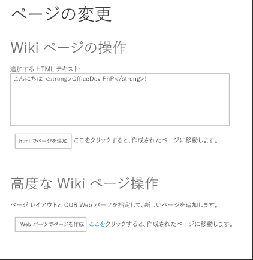
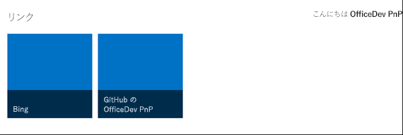
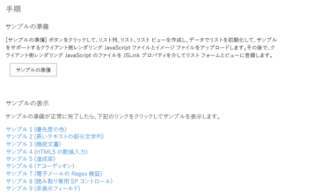
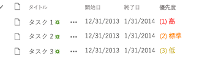
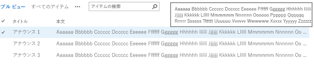
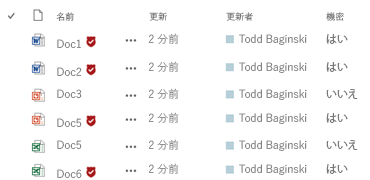
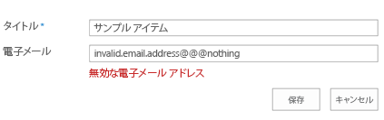
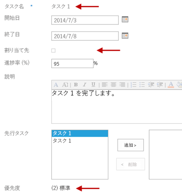
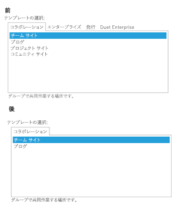

# SharePoint のプロバイダー ホスト型アドインを使用して UX をカスタマイズする

プロバイダー ホスト型アドインを使用して SharePoint UX コンポーネントをリモートでカスタマイズします。 

_**適用対象:** Office 365? | SharePoint 2013? | SharePoint Online_

この記事では、SharePoint UX コンポーネントをカスタマイズするためのベスト プラクティスを示すサンプルを説明します。次のシナリオが含まれています。

- ページ操作 (wiki ページの追加および変更)。
    
- モーダル ダイアログ ボックスにおけるアドインとデータの表示。
    
- 個人用 UI 要素の作成。
    
- クライアント側レンダリング (SharePoint リスト内のフィールドのレンダリングをカスタマイズする JSLink ファイルの展開)。
    
- Web パーツとアドイン パーツの操作 (プロバイダー ホスト型アドインのアドイン スクリプト パーツのリモートからのプロビジョニングと実行)。
    
- データの集計とキャッシング (SharePoint に対するサービス呼び出し回数を削減するための HTML5 ローカル ストレージと HTTP cookies の使用)。

## ページ操作
<a name="bmPageManipulate"> </a>

[Core.ModifyPages](https://github.com/OfficeDev/PnP/tree/dev/Samples/Core.ModifyPages) サンプルには、次の 2 つのページ操作シナリオが含まれています。

- wiki ページの作成。
    
- wiki ページのレイアウトの変更。 
    
このサンプルでは、既定のサイト ページ ライブラリと既存のすぐに利用できるレイアウトを使用します。また、カスタムの wiki ページ ライブラリとレイアウトを使用するように更新することもできます。 アドイン UI には、どちらも wiki ページを作成する 2 つのボタンと、作成する wiki ページを表示するための 2 つのリンクが含まれます。

**図 1. ページ操作サンプル用の開始ページ**



最初のシナリオのサンプル コードは、wiki ページを既に作成しているかどうかを判別します。作成していない場合には、コードはファイルをサイト ページに追加し、その URL を返します。

**メモ:** この記事で提供されるコードは、明示または黙示のいかなる種類の保証なしに現状のまま提供されるものであり、特定目的への適合性、商品性、権利侵害の不存在についての暗黙的な保証は一切ありません。

```
var newpage = pageLibrary.RootFolder.Files.AddTemplateFile(newWikiPageUrl, TemplateFileType.WikiPage);
ctx.Load(newpage);
ctx.ExecuteQuery();
wikiPageUrl = String.Format("sitepages/{0}", wikiPageName);
```

どちらのシナリオの場合にも、サンプルは **LabHelper** という名前のヘルパー クラスの **AddHtmlToWikiPage** メソッドを使用して、テキスト ボックスで入力された HTML を追加します。 このメソッドはフォームからの HTML を、wiki ページの _WikiField_ フィールド内に挿入します。

```
public void AddHtmlToWikiPage(ClientContext ctx, Web web, string folder, string html, string page)
        {
            Microsoft.SharePoint.Client.Folder pagesLib = web.GetFolderByServerRelativeUrl(folder);
            ctx.Load(pagesLib.Files);
            ctx.ExecuteQuery();

            Microsoft.SharePoint.Client.File wikiPage = null;

            foreach (Microsoft.SharePoint.Client.File aspxFile in pagesLib.Files)
            {
                if (aspxFile.Name.Equals(page, StringComparison.InvariantCultureIgnoreCase))
                {
                    wikiPage = aspxFile;
                    break;
                }
            }

            if (wikiPage == null)
            {
                return;
            }

            ctx.Load(wikiPage);
            ctx.Load(wikiPage.ListItemAllFields);
            ctx.ExecuteQuery();

            string wikiField = (string)wikiPage.ListItemAllFields["WikiField"];

            Microsoft.SharePoint.Client.ListItem listItem = wikiPage.ListItemAllFields;
            listItem["WikiField"] = html;
            listItem.Update();
            ctx.ExecuteQuery();
        }
```

2 番目のシナリオのサンプル コードは、新しい **WebPartEntity** インスタンスを作成します。 その後、ヘルパー クラス内のメソッドを使用して、Web パーツに XML を設定します。 この XML はプロモートされたリンク リストを表示します。これには、[http://www.bing.com](http://www.bing.com) と [OfficeDev/PnP GitHub](https://github.com/OfficeDev/PnP) リポジトリのホーム ページの両方が含まれます。

```
WebPartEntity wp2 = new WebPartEntity();
wp2.WebPartXml = new LabHelper().WpPromotedLinks(linksID, string.Format("{0}/Lists/{1}", 
                                                                Request.QueryString["SPHostUrl"], "Links"), 
                                                                string.Format("{0}/{1}", Request.QueryString["SPHostUrl"], 
                                                                scenario2PageUrl), "$Resources:core,linksList");
wp2.WebPartIndex = 1;
wp2.WebPartTitle = "Links";

new LabHelper().AddWebPartToWikiPage(ctx, ctx.Web, "SitePages", wp2, scenario2Page, 2, 1, false);
new LabHelper().AddHtmlToWikiPage(ctx, ctx.Web, "SitePages", htmlEntry.Text, scenario2Page, 2, 2);

this.hplPage2.NavigateUrl = string.Format("{0}/{1}", Request.QueryString["SPHostUrl"], scenario2PageUrl);
```

ヘルパー コードは **XsltListViewWebPart** Web パーツ内のテーブルが含まれる、プロモートされたリンクを表示します。

**図 2. XsltListViewWebPart とプロモートされたリンク テーブルが含まれる 2 番目の wiki ページ**



**LabHelper** インスタンスの **WpPromotedLinks** オブジェクトには、Wiki ページに埋め込まれる Web パーツの外観を定義する XML が含まれます。 次に、**AddWebPartToWikiPage** メソッドが新しく定義された Web パーツを Wiki ページの新しい `div` タグに挿入します。

```
XmlDocument xd = new XmlDocument();
            xd.PreserveWhitespace = true;
            xd.LoadXml(wikiField);

            // Sometimes the wikifield content seems to be surrounded by an additional div. 
            XmlElement layoutsTable = xd.SelectSingleNode("div/div/table") as XmlElement;
            if (layoutsTable == null)
            {
                layoutsTable = xd.SelectSingleNode("div/table") as XmlElement;
            }

            XmlElement layoutsZoneInner = layoutsTable.SelectSingleNode(string.Format("tbody/tr[{0}]/td[{1}]/div/div", row, col)) as XmlElement;
            // - space element
            XmlElement space = xd.CreateElement("p");
            XmlText text = xd.CreateTextNode(" ");
            space.AppendChild(text);

            // - wpBoxDiv
            XmlElement wpBoxDiv = xd.CreateElement("div");
            layoutsZoneInner.AppendChild(wpBoxDiv);

            if (addSpace)
            {
                layoutsZoneInner.AppendChild(space);
            }

            XmlAttribute attribute = xd.CreateAttribute("class");
            wpBoxDiv.Attributes.Append(attribute);
            attribute.Value = "ms-rtestate-read ms-rte-wpbox";
            attribute = xd.CreateAttribute("contentEditable");
            wpBoxDiv.Attributes.Append(attribute);
            attribute.Value = "false";
            // - div1
            XmlElement div1 = xd.CreateElement("div");
            wpBoxDiv.AppendChild(div1);
            div1.IsEmpty = false;
            attribute = xd.CreateAttribute("class");
            div1.Attributes.Append(attribute);
            attribute.Value = "ms-rtestate-read " + wpdNew.Id.ToString("D");
            attribute = xd.CreateAttribute("id");
            div1.Attributes.Append(attribute);
            attribute.Value = "div_" + wpdNew.Id.ToString("D");
            // - div2
            XmlElement div2 = xd.CreateElement("div");
            wpBoxDiv.AppendChild(div2);
            div2.IsEmpty = false;
            attribute = xd.CreateAttribute("style");
            div2.Attributes.Append(attribute);
            attribute.Value = "display:none";
            attribute = xd.CreateAttribute("id");
            div2.Attributes.Append(attribute);
            attribute.Value = "vid_" + wpdNew.Id.ToString("D");

            ListItem listItem = webPartPage.ListItemAllFields;
            listItem["WikiField"] = xd.OuterXml;
            listItem.Update();
            ctx.ExecuteQuery();
```

## モーダル ダイアログ ボックスにおけるアドインとデータの表示
<a name="bmPageManipulate"> </a>

[Core.Dialog](https://github.com/OfficeDev/PnP/tree/dev/Scenarios/Core.Dialog) サンプルは、モーダル ダイアログ ボックス リンクを埋め込むための 2 つの方法を示しています。これらのリンクは、プロバイダー ホスト型アドイン ページを SharePoint ホスト サイトに表示します。このアドインはクライアント オブジェクト モデル (CSOM) を使用して、ダイアログ ボックスを開始してそこに情報を表示するためのカスタム アクションと JavaScript を作成します。この情報の一部はホスト サイトに由来するため、JavaScript オブジェクト モデル (JSOM) を使用してホスト サイトからも情報を取得します。さらに、アドインは SharePoint ホスト サイトとは異なるドメインで実行されているので、SharePoint クロス ドメイン ライブラリを使用してホスト サイトへの呼び出しも行います。


            **メモ:**このシナリオにおけるクロス ドメイン ライブラリの使用法の詳細については、「[クロスドメイン ライブラリを使用してアドインから SharePoint 2013 のデータにアクセスする](http://msdn.microsoft.com/library/bc37ff5c-1285-40af-98ae-01286696242d%28Office.15%29.aspx)」を参照してください。

開始ページはダイアログ ボックスに表示されます。表示コンテキスト (ダイアログ ボックスかフル ページか) を考慮し、表示上の違いを処理するため、アドインは表示されているのがダイアログ ボックスかどうかを判別します。これは、ダイアログ ボックスを開始するリンクと一緒に渡されるクエリ文字列パラメーターを使用することによって行われます。

```
private string SetIsDlg(string isDlgValue)
        {
            var urlParams = HttpUtility.ParseQueryString(Request.QueryString.ToString());
            urlParams.Set("IsDlg", isDlgValue);
            return string.Format("{0}://{1}:{2}{3}?{4}", Request.Url.Scheme, Request.Url.Host, Request.Url.Port, Request.Url.AbsolutePath, urlParams.ToString());
        }
```

たとえば、コンテンツがダイアログ ボックスに表示されているかどうかに応じて、特定の UI 要素 (ボタンなど) を表示することや、異なるページ レイアウトを表示することさえできます。

開始ページ UI には、ダイアログ ボックスへのリンクを作成するための 2 つのオプションが、ホスト Web 上のすべてのリストの一覧と共に表示されます。また、 **[OK]** ボタンと **[キャンセル]** ボタンも表示されます。ダイアログ ボックスのコンテキストでこれらのボタンを使用すると、ダイアログ ボックスを閉じたり、アドインで追加アクションのプロンプトを表示したりすることができます。

**[メニュー項目の追加]** ボタンを選択すると、ダイアログ ボックスを開始する **CustomActionEntity** オブジェクトがアドインによって作成されます。 その後、**AddCustomAction** という名前の [OfficeDevPnP コア拡張メソッド](https://github.com/OfficeDev/PnP/tree/dev/OfficeDevPnP.Core)を使用して、**[サイトの設定]** メニューに新しいカスタム アクションを追加します。

```
StringBuilder modelDialogScript = new StringBuilder(10);
modelDialogScript.Append("javascript:var dlg=SP.UI.ModalDialog.showModalDialog({url: '");
modelDialogScript.Append(String.Format("{0}", SetIsDlg("1")));
modelDialogScript.Append("', dialogReturnValueCallback:function(res, val) {} });");       

// Create a custom action.
CustomActionEntity customAction = new CustomActionEntity()
{
  Title = "Office AMS Dialog sample",                
  Description = "Shows how to start an add-in inside a dialog box.",
  Location = "Microsoft.SharePoint.StandardMenu",
  Group = "SiteActions",
  Sequence = 10000,
  Url = modelDialogScript.ToString(),
};

// Add the custom action to the site.
cc.Web.AddCustomAction(customAction);
```

**AddCustomAction** メソッドは、SharePoint サイトに関連付けられている **UserCustomActions** コレクションにカスタム アクションを追加します。

```
var newAction = existingActions.Add();
            newAction.Description = customAction.Description;
            newAction.Location = customAction.Location;
            if (customAction.Location == JavaScriptExtensions.SCRIPT_LOCATION)
            {
                newAction.ScriptBlock = customAction.ScriptBlock;
            }
            else
            {
                newAction.Sequence = customAction.Sequence;
                newAction.Url = customAction.Url;
                newAction.Group = customAction.Group;
                newAction.Title = customAction.Title;
                newAction.ImageUrl = customAction.ImageUrl;
                if (customAction.Rights != null)
                {
                    newAction.Rights = customAction.Rights;
                }
            }
            newAction.Update();
            web.Context.Load(web, w => w.UserCustomActions);
            web.Context.ExecuteQuery();
```

**[Script Editor Web パーツでページを追加]** ボタンを選択すると、アドインは **AddWikiPage** メソッドと **AddWebPartToWikiPage** メソッドを使用して、サイト ページ ライブラリ内に Wiki ページを作成し、そのページに構成済みのスクリプト エディター Web パーツを追加します。

```
string scenario1Page = String.Format("scenario1-{0}.aspx", DateTime.Now.Ticks);
string scenario1PageUrl = cc.Web.AddWikiPage("Site Pages", scenario1Page);
cc.Web.AddLayoutToWikiPage("SitePages", WikiPageLayout.OneColumn, scenario1Page);
WebPartEntity scriptEditorWp = new WebPartEntity();
scriptEditorWp.WebPartXml = ScriptEditorWebPart();
scriptEditorWp.WebPartIndex = 1;
scriptEditorWp.WebPartTitle = "Script editor test"; 
cc.Web.AddWebPartToWikiPage("SitePages", scriptEditorWp, scenario1Page, 1, 1, false);
```

**AddWikiPage** メソッドが、サイト ページ ライブラリを読み込みます。アドイン [OfficeDevPnP コア](https://github.com/OfficeDev/PnP/tree/dev/OfficeDevPnP.Core) によって指定された wiki ページがまだ存在しない場合には、ページが作成されます。

```
public static string AddWikiPage(this Web web, string wikiPageLibraryName, string wikiPageName)
        {
            string wikiPageUrl = "";


            var pageLibrary = web.Lists.GetByTitle(wikiPageLibraryName);

            web.Context.Load(pageLibrary.RootFolder, f => f.ServerRelativeUrl);
            web.Context.ExecuteQuery();

            var pageLibraryUrl = pageLibrary.RootFolder.ServerRelativeUrl;
            var newWikiPageUrl = pageLibraryUrl + "/" + wikiPageName;

            var currentPageFile = web.GetFileByServerRelativeUrl(newWikiPageUrl);

            web.Context.Load(currentPageFile, f => f.Exists);
            web.Context.ExecuteQuery();

            if (!currentPageFile.Exists)
            {
                var newpage = pageLibrary.RootFolder.Files.AddTemplateFile(newWikiPageUrl, TemplateFileType.WikiPage);

                web.Context.Load(newpage);
                web.Context.ExecuteQuery();

                wikiPageUrl = UrlUtility.Combine("sitepages", wikiPageName);
            }

            return wikiPageUrl;
        }
```

**AddWebPartToWikiPage** メソッドは、新しく定義された Web パーツを Wiki ページの新しい `<div>` タグに挿入します。 次に JSOM とクロス ドメイン ライブラリを使用して、ホスト Web 上の SharePoint リストの一覧に読み込まれる情報を取得します。

```
function printAllListNamesFromHostWeb() {
        var context;
        var factory;
        var appContextSite;
        var collList;

        context = new SP.ClientContext(appWebUrl);
        factory = new SP.ProxyWebRequestExecutorFactory(appWebUrl);
        context.set_webRequestExecutorFactory(factory);
        appContextSite = new SP.AppContextSite(context, spHostUrl);

        this.web = appContextSite.get_web();
        collList = this.web.get_lists();
        context.load(collList);

        context.executeQueryAsync(
            Function.createDelegate(this, successHandler),
            Function.createDelegate(this, errorHandler)
        );
```

## 個人用 UI 要素
<a name="bmPersonalized"> </a>

[Branding.UIElementPersonalization](https://github.com/OfficeDev/PnP/tree/dev/Samples/Branding.UIElementPersonalization) サンプルは、埋め込みの JavaScript と、ユーザー プロファイルおよび SharePoint リストに格納されている値とを使用して、ホスト Web 上の UI 要素を個別設定する方法を示しています。また、ホスト サイトへの呼び出しを最小限に抑えるため、HTML5 ローカル ストレージも使用しています。

このサンプルの開始ページでは、ユーザー プロファイル ページの **[自分について]** セクションに 3 つの文字列 (XX、YY、ZZ) のいずれかを追加するよう求めるプロンプトが表示されます。

アドインには、3 つのイメージと SharePoint リストが展開されています。このリストには、各イメージのタイトルと URL が含まれています。また、各イメージを 3 つの文字列のいずれかに結び付ける、追加フィールドも展開されています。 **[カスタマイズの挿入]** ボタンを選択すると、アドインによって personalize.js ファイルがユーザーのカスタム アクション コレクションに埋め込まれます。

```
public void AddPersonalizeJsLink(ClientContext ctx, Web web)
        {
            string scenarioUrl = String.Format("{0}://{1}:{2}/Scripts", this.Request.Url.Scheme,
                                                this.Request.Url.DnsSafeHost, this.Request.Url.Port);
            string revision = Guid.NewGuid().ToString().Replace("-", "");
            string personalizeJsLink = string.Format("{0}/{1}?rev={2}", scenarioUrl, "personalize.js", revision);

            StringBuilder scripts = new StringBuilder(@"
                var headID = document.getElementsByTagName('head')[0]; 
                var");

            scripts.AppendFormat(@"
                newScript = document.createElement('script');
                newScript.type = 'text/javascript';
                newScript.src = '{0}';
                headID.appendChild(newScript);", personalizeJsLink);
            string scriptBlock = scripts.ToString();

            var existingActions = web.UserCustomActions;
            ctx.Load(existingActions);
            ctx.ExecuteQuery();

            var actions = existingActions.ToArray();
            foreach (var action in actions)
            {
                if (action.Description == "personalize" &amp;&amp;
                    action.Location == "ScriptLink")
                {
                    action.DeleteObject();
                    ctx.ExecuteQuery();
                }
            }

            var newAction = existingActions.Add();
            newAction.Description = "personalize";
            newAction.Location = "ScriptLink";
            
            newAction.ScriptBlock = scriptBlock;
            newAction.Update();
            ctx.Load(web, s => s.UserCustomActions);
            ctx.ExecuteQuery();
        }
```

SharePoint チーム サイトは、既定で[ダウンロード最小化戦略 (MDS)](http://msdn.microsoft.com/en-us/library/office/dn456544%28v=office.15%29.aspx) を使用するため、personalize.js ファイル内のコードは、それ自体をまず MDS に登録しようとします。 このため、JavaScript が含まれるページを読み込むと、MDS エンジンはメイン関数 (**RemoteManager_Inject**) を開始します。 MDS が無効な場合は、この関数がすぐに開始されます。

```
// Register script for MDS, if possible.
RegisterModuleInit("personalize.js", RemoteManager_Inject); //MDS registration
RemoteManager_Inject(); //non-MDS run

if (typeof (Sys) != "undefined" &amp;&amp; Boolean(Sys) &amp;&amp; Boolean(Sys.Application)) {
    Sys.Application.notifyScriptLoaded();h
}

if (typeof (NotifyScriptLoadedAndExecuteWaitingJobs) == "function") {
    NotifyScriptLoadedAndExecuteWaitingJobs("scenario1.js");
}
// The RemoteManager_Inject function is the entry point for loading the other scripts that perform the customizations. When a given script depends on another script, be sure to load the dependent script after the one on which it depends. This sample loads the JQuery library before the personalizeIt function that uses JQuery.
function RemoteManager_Inject() {

    var jQuery = "https://ajax.aspnetcdn.com/ajax/jQuery/jquery-2.0.2.min.js";

    // Load jQuery. 
    loadScript(jQuery, function () {

        personalizeIt();

    });
}
```

**personalizeIt()** 関数は HTML5 ローカル ストレージをチェックしてから、ユーザー プロファイル情報を検索します。ユーザー プロファイル情報が見つかると、取得した情報を HTML5 ローカル ストレージに格納します。

```
function personalizeIt() {
    clientContext = SP.ClientContext.get_current();

    var fileref = document.createElement('script');
    fileref.setAttribute("type", "text/javascript");
    fileref.setAttribute("src", "/_layouts/15/SP.UserProfiles.js");
    document.getElementsByTagName("head")[0].appendChild(fileref);

    SP.SOD.executeOrDelayUntilScriptLoaded(function () {        

        // Get localstorage values if they exist.
        buCode = localStorage.getItem("bucode");
        buCodeTimeStamp = localStorage.getItem("buCodeTimeStamp");

        // Determine whether the page already has embedded personalized image.
        var pageTitle = $('#pageTitle')[0].innerHTML;
        if (pageTitle.indexOf("img") > -1) {
            personalized = true;
        }
        else {
            personalized = false;
        }        

        // If nothing is in localstorage, get profile data, which will also populate localstorage.
        if (buCode == "" || buCode == null) {
            getProfileData(clientContext);
            personalized = false;
        }
        else {
            // Check for expiration.            
            if (isKeyExpired("buCodeTimeStamp")) {                
                getProfileData(clientContext);

                if (buCode != "" || buCode != null) {
                    // Set timestamp for expiration.
                    currentTime = Math.floor((new Date().getTime()) / 1000);
                    localStorage.setItem("buCodeTimeStamp", currentTime);

                    // Set personalized to false so that the code can check for a new image in case buCode was updated.
                    personalized = false;
                }
            }            
        }

        // Load image or make sure it is current based on the value in AboutMe.
        if (!personalized) {
            loadPersonalizedImage(buCode);
        }


    }, 'SP.UserProfiles.js');
}
```

また、personalize.js ファイルにはローカル ストレージ キーが有効期限切れかどうかを判別するチェックを行うコードも含まれます。これは HTML5 ローカル ストレージに組み込まれません

```
// Check to see if the key has expired
function isKeyExpired(TimeStampKey) {

    // Retrieve the example setting for expiration in seconds.
    var expiryStamp = localStorage.getItem(TimeStampKey);

    if (expiryStamp != null &amp;&amp; cacheTimeout != null) {

        // Retrieve the timestamp and compare against specified cache timeout settings to see if it is expired.
        var currentTime = Math.floor((new Date().getTime()) / 1000);

        if (currentTime - parseInt(expiryStamp) > parseInt(cacheTimeout)) {
            return true; //Expired
        }
        else {
            return false;
        }
    }
    else {
        //default 
        return true;
    }
}
```

## クライアント側のレンダリング
<a name="bmPersonalized"> </a>

[Branding.ClientSideRendering](https://github.com/OfficeDev/PnP/tree/dev/Samples/Branding.ClientSideRendering) サンプルは、プロバイダー ホスト型アドインを使用して SharePoint 成果物および JSLink ファイルをリモートでプロビジョニングする方法を示しています。これらの成果物やファイルは、クライアント側のレンダリングを使用して、SharePoint リスト フィールドの外観や動作をカスタマイズします。JSLink ファイルとクライアント側のレンダリングを使用すると、SharePoint ページ上のコントロール (リスト ビュー、リスト フィールド、追加および編集のフォーム) をレンダリングする方法を制御できます。この制御機能によって、カスタム フィールドの種類を減らしたり、まったく削除したりすることができます。クライアント側のレンダリングによって、リスト フィールドの外観をリモートで制御できるようにようになります。

このサンプルは、[クライアント側のレンダリング (JSLink) コード サンプル](http://code.msdn.microsoft.com/office/Client-side-rendering-JS-2ed3538a)の JSLink サンプルを結合して、JSLink ファイルをプロビジョニングする SharePoint 用の単一のプロバイダー ホスト型アドインにします。クライアント側のレンダリングを使用すると、HTML や JavaScript などの標準的な Web テクノロジを用いてカスタムおよび事前定義されたフィールドの種類のレンダリング ロジックを定義できます。

サンプルを開始すると、開始ページで、すべてのサンプルをプロビジョニングするよう求めるプロンプトが表示されます。

**図 3. クライアント側のレンダリングのサンプルの開始ページ**



**[サンプルの準備]** を選択すると、アドインによって、イメージ、および各サンプルで使用されるすべての SharePoint リスト、リスト ビュー、リスト アイテム、フォーム、JavaScript ファイルが展開されます。アドインは、スタイル ライブラリに JSLink-Samples という名前のフォルダーを作成し、そのフォルダーに JavaScript ファイルをアップロードします。**UploadFileToFolder** メソッドが、各 JavaScript ファイルにおけるアップロードとチェックを実行します。

```
public static void UploadFileToFolder(Web web, string filePath, Folder folder)
        {
            using (FileStream fs = new FileStream(filePath, FileMode.Open))
            {
                FileCreationInformation flciNewFile = new FileCreationInformation();

                flciNewFile.ContentStream = fs;
                flciNewFile.Url = System.IO.Path.GetFileName(filePath);
                flciNewFile.Overwrite = true;

                Microsoft.SharePoint.Client.File uploadFile = folder.Files.Add(flciNewFile);
                uploadFile.CheckIn("CSR sample js file", CheckinType.MajorCheckIn);

                folder.Context.Load(uploadFile);
                folder.Context.ExecuteQuery();
            }
        }
```

### サンプル 1: リスト列に対する書式設定の適用

サンプル 1 は、書式設定をフィールド値に基づいてリスト列に適用する方法を示しています。優先度フィールド値 1 (高)、2 (標準)、3 (低) はそれぞれ赤、オレンジ、黄で表示されています。

**図 4. カスタム リスト フィールドの表示**



次の JavaScript によって、既定のフィールド表示が上書きされ、**[優先度]** リスト フィールド用の新しい表示テンプレートが作成されます。表示を上書きするフィールドについてのコンテキスト情報を匿名関数で読み込む手法が、すべてのサンプルで使用されています。

```
(function () {

    // Create object that has the context information about the field that you want to render differently.
    var priorityFiledContext = {};
    priorityFiledContext.Templates = {};
    priorityFiledContext.Templates.Fields = {
        // Apply the new rendering for Priority field in List View.
        "Priority": { "View": priorityFiledTemplate }
    };

    SPClientTemplates.TemplateManager.RegisterTemplateOverrides(priorityFiledContext);

})();

// This function provides the rendering logic for list view.
function priorityFiledTemplate(ctx) {

    var priority = ctx.CurrentItem[ctx.CurrentFieldSchema.Name];

    // Return HTML element with appropriate color based on the Priority column's value.
    switch (priority) {
        case "(1) High":
            return "<span style='color :#f00'>" + priority + "</span>";
            break;
        case "(2) Normal":
            return "<span style='color :#ff6a00'>" + priority + "</span>";
            break;
        case "(3) Low":
            return "<span style='color :#cab023'>" + priority + "</span>";
    }
}
```

### サンプル 2: 長いテキストの短縮

サンプル 2 は、**[お知らせ]** リストの **[本文]** フィールドに格納されている長いテキストを切り捨てる方法を示しています。 図 8 に示すように、リスト アイテムにマウスのポインターを合わせると、テキスト全体がポップアップとして表示されます。

**図 5. 短縮されたリスト フィールドがポップアップで表示される**



次の JavaScript は、**[本文]** フィールド テキストを短縮し、テキスト全体が **span** タグの **title** 属性に基づいてポップアップとして表示されます。

```
function bodyFiledTemplate(ctx) {

    var bodyValue = ctx.CurrentItem[ctx.CurrentFieldSchema.Name];

    // This regex expression is used to delete HTML tags from the Body field.
    var regex = /(<([^>]+)>)/ig;

    bodyValue = bodyValue.replace(regex, "");

    var newBodyValue = bodyValue;

    if (bodyValue &amp;&amp; bodyValue.length >= 100)
    {
        newBodyValue = bodyValue.substring(0, 100) + " ...";
    }

    return "<span title='" + bodyValue + "'>" + newBodyValue + "</span>";

}
```

### サンプル 3: ドキュメント名を含めたイメージの表示

サンプル 3 は、ドキュメント ライブラリ内のドキュメント名の横にあるイメージを表示する方法を示しています。 図 6 に示すように、**[非公開]** フィールド値が **[はい]** に設定されていると赤いバッジが表示されます。 

**図 6. ドキュメント名の横にある画像の表示**



次の JavaScript は **[非公開]** フィールド値をチェックし、その後、別のフィールド値に基づいて **[名前]** フィールド表示をカスタマイズします。このサンプルでは、**[サンプルの準備]** を選択したときにアップロードされるイメージを使用します。 

```
function linkFilenameFiledTemplate(ctx) {

    var confidential = ctx.CurrentItem["Confidential"];
    var title = ctx.CurrentItem["FileLeafRef"];

    // This Regex expression use to delete extension (.docx, .pdf ...) form the file name.
    title = title.replace(/\.[^/.]+$/, "")

    // Check confidential field value.
    if (confidential &amp;&amp; confidential.toLowerCase() == 'yes') {
        // Render HTML that contains the file name and the confidential icon
        return title + "&amp;nbsp;";
    }
    else
    {
        return title;
    }
}
```

### サンプル 4: 横棒グラフの表示

サンプル 4 は、タスク リストの **[進捗率 (%)]** フィールドに横棒グラフを表示する方法を示しています。 図 10 に示すように、横棒グラフの外観は **[進捗率 (%)]** フィールドの値によって異なります。 タスク リスト アイテムの作成および編集のために、横棒グラフはフォームにも表示されます。

次のコードによって、横棒グラフ表示が作成され、そのグラフにビューと表示のフォーム (**percentCompleteViewFiledTemplate**)、そして新しいフォームと編集フォーム (**percentCompleteEditFiledTemplate**) が関連付けられます。

```
// This function provides the rendering logic for View and Display forms.
function percentCompleteViewFiledTemplate(ctx) {

    var percentComplete = ctx.CurrentItem[ctx.CurrentFieldSchema.Name];
    return "<div style='background-color: #e5e5e5; width: 100px;  display:inline-block;'> \
            <div style='width: " + percentComplete.replace(/\s+/g, '') + "; background-color: #0094ff;'> \
            &amp;nbsp;</div></div>&amp;nbsp;" + percentComplete;

}

// This function provides the rendering logic for New and Edit forms.
function percentCompleteEditFiledTemplate(ctx) {

    var formCtx = SPClientTemplates.Utility.GetFormContextForCurrentField(ctx);

    // Register a callback just before submit.
    formCtx.registerGetValueCallback(formCtx.fieldName, function () {
        return document.getElementById('inpPercentComplete').value;
    });

    return "<input type='range' id='inpPercentComplete' name='inpPercentComplete' min='0' max='100' \
            oninput='outPercentComplete.value=inpPercentComplete.value' value='" + formCtx.fieldValue + "' /> \
            <output name='outPercentComplete' for='inpPercentComplete' >" + formCtx.fieldValue + "</output>%";
}
```

**図 7. [達成率] フィールドに表示される横棒グラフ**

![[達成率] フィールドに表示される横棒グラフ](media/customize-the-ux-by-using-sharepoint-provider-hosted-add-ins/fb36f27a-2eb7-4c5f-8428-b85b65369ea9.png)

### サンプル 5: レンダリング テンプレートの変更

サンプル 5 は、リスト ビューのレンダリング テンプレートを変更する方法を示しています。このビューにはリスト アイテム タイトルが表示され、タイトルを選択するとアコーディオンのように展開されます。図 8 に示すとおり、展開されたビューにはリスト アイテム フィールドがさらに示されます。

**図 8. 折りたたまれたリスト アイテムのビューと展開されたリスト アイテムのビュー**


次のコードは、テンプレートをセットアップし、リスト テンプレートに登録します。全体のレイアウトをセットアップしてから、**OnPostRender** イベント ハンドラーを使用して、リストがレンダリングされるときに実行される JavaScript 関数を登録します。この関数によってイベントが、CSS、およびアコーディオン機能を実装するイベント処理と関連付けられます。

```
(function () {

    // jQuery library is required in this sample.
    // Fallback to loading jQuery from a CDN path if the local is unavailable
    (window.jQuery || document.write('<script src="//ajax.aspnetcdn.com/ajax/jquery/jquery-1.10.0.min.js"><\/script>'));

    // Create object that has the context information about the field that you want to render differently.
    var accordionContext = {};
    accordionContext.Templates = {};

    // Be careful when adding the header for the template, because it will break the default list view render.
    accordionContext.Templates.Header = "<div class='accordion'>";
    accordionContext.Templates.Footer = "</div>";

    // Add OnPostRender event handler to add accordion click events and style.
    accordionContext.OnPostRender = accordionOnPostRender;

    // This line of code tells the TemplateManager that you want to change all the HTML for item row rendering.
    accordionContext.Templates.Item = accordionTemplate;

    SPClientTemplates.TemplateManager.RegisterTemplateOverrides(accordionContext);

})();

// This function provides the rendering logic.
function accordionTemplate(ctx) {
    var title = ctx.CurrentItem["Title"];
    var description = ctx.CurrentItem["Description"];

    // Return whole item html
    return "<h2>" + title + "</h2><p>" + description + "</p><br/>";
}

function accordionOnPostRender() {

    // Register event to collapse and expand when selecting accordion header.
    $('.accordion h2').click(function () {
        $(this).next().slideToggle();
    }).next().hide();

    $('.accordion h2').css('cursor', 'pointer');
}
```

### サンプル 6: フィールド値の検証

サンプル 6 は、正規表現を使用して、ユーザーが指定したフィールド値を検証する方法を示しています。ユーザーが無効な電子メール アドレスを [**Email**] フィールド テキスト ボックスに入力すると、赤いエラー メッセージが表示されます。図 9 に示すとおり、これはユーザーがリスト アイテムの作成または編集を行う場合に発生します。

**図 9. フィールドへの無効なテキスト入力に対するエラー メッセージ**



次のコードは、エラー メッセージを表示するためのプレース ホルダーを含んだテンプレートをセットアップし、ユーザーがフォームの送信を試みるときに起動するコールバック関数を登録します。最初のコールバックでは **[Email]** 列の値を返し、2 番目のコールバックでは正規表現を使用して文字列値を検証します。

```
function emailFiledTemplate(ctx) {

    var formCtx = SPClientTemplates.Utility.GetFormContextForCurrentField(ctx);

    // Register a callback just before submit.
    formCtx.registerGetValueCallback(formCtx.fieldName, function () {
        return document.getElementById('inpEmail').value;
    });

    // Create container for various validations.
    var validators = new SPClientForms.ClientValidation.ValidatorSet();
    validators.RegisterValidator(new emailValidator());

    // Validation failure handler.
    formCtx.registerValidationErrorCallback(formCtx.fieldName, emailOnError);

    formCtx.registerClientValidator(formCtx.fieldName, validators);

    return "<span dir='none'><input type='text' value='" + formCtx.fieldValue + "'  maxlength='255' id='inpEmail' class='ms-long'> \
            <br><span id='spnError' class='ms-formvalidation ms-csrformvalidation'></span></span>";
}

// Custom validation object to validate email format.
emailValidator = function () {
    emailValidator.prototype.Validate = function (value) {
        var isError = false;
        var errorMessage = "";

        //Email format Regex expression
        var emailRejex = /\S+@\S+\.\S+/;

        if (!emailRejex.test(value) &amp;&amp; value.trim()) {
            isError = true;
            errorMessage = "Invalid email address";
        }

        // Send error message to error callback function (emailOnError).
        return new SPClientForms.ClientValidation.ValidationResult(isError, errorMessage);
    };
};

// Add error message to spnError element under the input field element.
function emailOnError(error) {
    document.getElementById("spnError").innerHTML = "<span role='alert'>" + error.errorMessage + "</span>";
}
```

### サンプル 7: リスト アイテム編集フィールドを読み取り専用にする

サンプル 7 は、リスト アイテム編集フォーム フィールドを読み取り専用にする方法を示しています。図 10 に示すとおり、読み取り専用フィールドには編集コントロールが表示されません。

**図 10. カスタム リストの編集フォーム上の読み取り専用フィールド**



次のコード例では、リスト アイテム編集フォームの **[タイトル]**、**[担当者]**、**[優先度]** フィールドが編集コントロールなしでフィールド値だけを表示するように変更します。このコードは、さまざまなフィールドの種類の解析要件の処理方法を示しています。

```
function readonlyFieldTemplate(ctx) {

    // Reuse SharePoint JavaScript libraries.
    switch (ctx.CurrentFieldSchema.FieldType) {
        case "Text":
        case "Number":
        case "Integer":
        case "Currency":
        case "Choice":
        case "Computed":
            return SPField_FormDisplay_Default(ctx);

        case "MultiChoice":
            prepareMultiChoiceFieldValue(ctx);
            return SPField_FormDisplay_Default(ctx);

        case "Boolean":
            return SPField_FormDisplay_DefaultNoEncode(ctx);

        case "Note":
            prepareNoteFieldValue(ctx);
            return SPFieldNote_Display(ctx);

        case "File":
            return SPFieldFile_Display(ctx);

        case "Lookup":
        case "LookupMulti":
                return SPFieldLookup_Display(ctx);           

        case "URL":
            return RenderFieldValueDefault(ctx);

        case "User":
            prepareUserFieldValue(ctx);
            return SPFieldUser_Display(ctx);

        case "UserMulti":
            prepareUserFieldValue(ctx);
            return SPFieldUserMulti_Display(ctx);

        case "DateTime":
            return SPFieldDateTime_Display(ctx);

        case "Attachments":
            return SPFieldAttachments_Default(ctx);

        case "TaxonomyFieldType":
            //Re-use JavaScript from the sp.ui.taxonomy.js SharePoint JavaScript library
            return SP.UI.Taxonomy.TaxonomyFieldTemplate.renderDisplayControl(ctx);
    }
}

// User control needs specific formatted value to render content correctly.
function prepareUserFieldValue(ctx) {
    var item = ctx['CurrentItem'];
    var userField = item[ctx.CurrentFieldSchema.Name];
    var fieldValue = "";

    for (var i = 0; i < userField.length; i++) {
        fieldValue += userField[i].EntityData.SPUserID + SPClientTemplates.Utility.UserLookupDelimitString + userField[i].DisplayText;

        if ((i + 1) != userField.length) {
            fieldValue += SPClientTemplates.Utility.UserLookupDelimitString
        }
    }

    ctx["CurrentFieldValue"] = fieldValue;
}

// Choice control needs specific formatted value to render content correctly.
function prepareMultiChoiceFieldValue(ctx) {

    if (ctx["CurrentFieldValue"]) {
        var fieldValue = ctx["CurrentFieldValue"];

        var find = ';#';
        var regExpObj = new RegExp(find, 'g');

        fieldValue = fieldValue.replace(regExpObj, '; ');
        fieldValue = fieldValue.replace(/^; /g, '');
        fieldValue = fieldValue.replace(/; $/g, '');

        ctx["CurrentFieldValue"] = fieldValue;
    }
}

// Note control needs specific formatted value to render content correctly.
function prepareNoteFieldValue(ctx) {

    if (ctx["CurrentFieldValue"]) {
        var fieldValue = ctx["CurrentFieldValue"];
        fieldValue = "<div>" + fieldValue.replace(/\n/g, '<br />'); + "</div>";

        ctx["CurrentFieldValue"] = fieldValue;
    }
} 
```

### サンプル 8: フィールドの非表示

サンプル 8 は、リスト アイテムの新しいフォームと編集フォームでフィールドを非表示にする方法を示しています。 このサンプルでは、ユーザーがタスク リスト アイテムを作成または編集するときに、**[Predecessors]** フィールドを非表示にします。

このサンプルは、**CSR-Hide-Controls list** という名前のリストの編集および新規フォームとして展開します。 サンプルを展開した後でフォームを表示する方法の詳細については、「[Branding.ClientSideRendering](https://github.com/OfficeDev/PnP/tree/dev/Samples/Branding.ClientSideRendering)」を参照してください。

次のコードは、フォームの HTML で **[先行タスク]** フィールドを見つけて非表示にします。 フィールドは HTML に残りますが、ユーザーがブラウザーで見ることはできません。

```
(function () {

    // jQuery library is required in this sample.
    // Fallback to loading jQuery from a CDN path if the local is unavailable.
    (window.jQuery || document.write('<script src="//ajax.aspnetcdn.com/ajax/jquery/jquery-1.10.0.min.js"><\/script>'));

    // Create object that has the context information about the field that we want to render differently.
    var hiddenFiledContext = {};
    hiddenFiledContext.Templates = {}; 
    hiddenFiledContext.Templates.OnPostRender = hiddenFiledOnPreRender;
    hiddenFiledContext.Templates.Fields = {
        // Apply the new rendering for Predecessors field in New and Edit forms.
        "Predecessors": {
            "NewForm": hiddenFiledTemplate,
            "EditForm": hiddenFiledTemplate
        }
    };

    SPClientTemplates.TemplateManager.RegisterTemplateOverrides(hiddenFiledContext);

})();


// This function provides the rendering logic.
function hiddenFiledTemplate() {
    return "<span class='csrHiddenField'></span>";
}

// This function provides the rendering logic.
function hiddenFiledOnPreRender(ctx) {
    jQuery(".csrHiddenField").closest("tr").hide();
}

```

## Web パーツとアドイン パーツの操作
<a name="bmPersonalized"> </a>

[Core.AppScriptPart](https://github.com/OfficeDev/PnP/tree/dev/Samples/Core.AppScriptPart) サンプルは、アドイン スクリプト パーツを使用して、プロバイダー ホスト型アドインで実行されるスクリプトを SharePoint ページに埋め込む方法を示しています。このサンプルは、アドイン スクリプト パーツを展開し、それを Web パーツ ギャラリーから SharePoint ページに追加することによって、ホスト サイトのページ UI を変更する方法を示しています。

アドイン スクリプト パーツは、Web パーツ ギャラリーから SharePoint ページに追加可能である点で Web パーツと似ていますが、Web パーツの場合には .webpart ファイルがプロバイダー ホスト型アドインでリモートに実行される JavaScript ファイルを埋め込みます。アドイン スクリプト パーツの場合には、SharePoint ページの  `<div>` タグ内で実行されるので、IFrames で実行されるアドイン パーツに比べてよりレスポンシブなデザインとエクスペリエンスを提供できます。

開始ページには **[シナリオの実行]** ボタンが含まれます。このボタンはアドイン スクリプト パーツを Web パーツ ギャラリーに展開します。 次のコード例は、.webpart ファイルのコンテンツを含む **FileCreationInformationObject** インスタンスを構成し、新しいファイルを Web パーツ ギャラリーにアップロードします。 このコードは、アドイン パーツのインストール時に自動的に実行できます。また、サイト コレクションのプロビジョニング プロセスの一環としても実行できます。

```
var spContext = SharePointContextProvider.Current.GetSharePointContext(Context);
using (var clientContext = spContext.CreateUserClientContextForSPHost())
{
    var folder = clientContext.Web.Lists.GetByTitle("Web Part Gallery").RootFolder;
    clientContext.Load(folder);
    clientContext.ExecuteQuery();

    // Upload the OneDrive for Business Usage Guidelines.docx.
    using (var stream = System.IO.File.OpenRead(Server.MapPath("~/userprofileinformation.webpart")))
    {
        FileCreationInformation fileInfo = new FileCreationInformation();
        fileInfo.ContentStream = stream;
        fileInfo.Overwrite = true;
        fileInfo.Url = "userprofileinformation.webpart";
        File file = folder.Files.Add(fileInfo);
        clientContext.ExecuteQuery();
    }

    // Update the group for uplaoded web part.
    var list = clientContext.Web.Lists.GetByTitle("Web Part Gallery");
    CamlQuery camlQuery = CamlQuery.CreateAllItemsQuery(100);
    Microsoft.SharePoint.Client.ListItemCollection items = list.GetItems(camlQuery);
    clientContext.Load(items);
    clientContext.ExecuteQuery();
    foreach (var item in items)
    {
        // Random group name to differentiate it from the rest.
        if (item["FileLeafRef"].ToString().ToLowerInvariant() == "userprofileinformation.webpart")
        {
            item["Group"] = "add-in Script Part";
            item.Update();
            clientContext.ExecuteQuery();
        }
    }

    lblStatus.Text = string.Format("add-in script part has been added to web part gallery. You can find 'User Profile Information' script part under 'Add-in Script Part' group in the <a href='{0}'>host web</a>.", spContext.SPHostUrl.ToString());
}
```

この手順を終了すると、Web パーツ ギャラリーの新しい **[アドイン スクリプト パート]** カテゴリ内に **[ユーザー プロファイル情報]** アドイン スクリプト パーツが見つかります。このアドイン スクリプト パーツをページに追加すると、リモートで実行される JavaScript によってページ上の情報の表示方法が制御されます。

編集モードでアドイン スクリプト パーツを表示すると、リモートで実行されている JavaScript ファイルがそれに埋め込まれていることを確認できます。userprofileinformation.js スクリプトは JSON を使用してホスト サイトのユーザー プロファイル情報を取得します。 

```
function sharePointReady() {
  clientContext = SP.ClientContext.get_current();

  var fileref = document.createElement('script');
  fileref.setAttribute("type", "text/javascript");
  fileref.setAttribute("src", "/_layouts/15/SP.UserProfiles.js");
  document.getElementsByTagName("head")[0].appendChild(fileref);

  SP.SOD.executeOrDelayUntilScriptLoaded(function () {

    //Get Instance of People Manager Class       
    var peopleManager = new SP.UserProfiles.PeopleManager(clientContext);

    //Get properties of the current user
    userProfileProperties = peopleManager.getMyProperties();
    clientContext.load(userProfileProperties);
    clientContext.executeQueryAsync(Function.createDelegate(this, function (sender, args) {
      var firstname = userProfileProperties.get_userProfileProperties()['FirstName'];
      var name = userProfileProperties.get_userProfileProperties()['PreferredName'];
      var title = userProfileProperties.get_userProfileProperties()['Title'];
      var aboutMe = userProfileProperties.get_userProfileProperties()['AboutMe'];
      var picture = userProfileProperties.get_userProfileProperties()['PictureURL'];

      var html = "<div><h2>Welcome " + firstname + "</h2></div><div><div style='float: left; margin-left:10px'><b>Name</b>: " + name + "<br /><b>Title</b>: " + title + "<br />" + aboutMe + "</div></div>";

      document.getElementById('UserProfileAboutMe').innerHTML = html;
    }), Function.createDelegate(this, function (sender, args) {
      console.log('The following error has occurred while loading user profile property: ' + args.get_message());
    }));
  }, 'SP.UserProfiles.js');
}

```

## 発行機能のプロビジョニング
<a name="bmPersonalized"> </a>

[Provisioning.PublishingFeatures](https://github.com/OfficeDev/PnP/tree/dev/Scenarios/Provisioning.PublishingFeatures) サンプルは、Office 365 でホストされる発行サイトに関連した一般的なタスク (たとえば、ページ レイアウト、マスター ページ、テーマのプロビジョニングと使用、ページ レイアウトへの JavaScript の埋め込みなど) を実行する方法を示しています。また、サブサイトで利用できるサイト テンプレート、およびホスト Web で利用できるページ レイアウトを制御するフィルターの適用方法も示しています。

プロバイダー ホスト型アドインは CSOM を使用して一般的に使用される UI 要素を発行サイトにプロビジョニングし、JavaScript を使用してページ レイアウトでより動的なエクスペリエンスを実現し、発行サイトに展開できるようにします。また、発行サイトにおいてマスター ページを使用する場合とテーマを使用する場合の違いも示します。


                **重要:**このサンプルで機能を動作させるには、サイトで発行機能をアクティブにする必要があります。 詳細については、「[発行機能を有効にする](https://support.office.com/en-us/article/Enable-publishing-features-479677a6-8b33-4ac7-907d-071c1c7e4518?CorrelationId=22291615-2acd-46be-8813-9e6c48d01a32&amp;ui=en-US&amp;rs=en-US&amp;ad=US)」を参照してください。

サンプルの開始ページには、発行サイトをカスタマイズするための次の 3 つのシナリオが示されます。 

- ページ レイアウトを展開する。
    
- マスター ページとテーマを展開する。
    
- 利用可能なページ レイアウトとサイト テンプレートをホスト サイト上でフィルター処理する。

### シナリオ 1: ページの展開

シナリオ 1 は、カスタムのページ レイアウトを展開する方法を示しています。 図 11 に示す **[Deploy page layouts]** ボタンを使用すると、新しいページ レイアウトと、そのレイアウトが使用するページが作成されます。

**図 11. ページ レイアウトを展開するためのボタン**


ホスト サイトで新しく作成されたデモ ページに移動すると、この新しいページを確認できます。このページには、JavaScript が埋め込まれていて、ユーザー プロファイル情報が表示されます。

このサンプルでは、ページ上にこのユーザー情報が表示されます。また、ページも追加されますが、この場合、**PublishingPageInformation** オブジェクトを使用して新しいページが作成されます。

サンプルはファイルをマスター ページ ギャラリーにアップロードし、それにページ レイアウト コンテンツ タイプを割り当てることによって新しいページ レイアウトを追加します。次のコードは、*.aspx ファイル (Visual Studio 2013 プロジェクトでリソースとして展開できます) のパスを取得し、それをマスター ページ ギャラリーのページ レイアウトとして追加します。

```
// Get the path to the file that you are about to deploy.
            List masterPageGallery = web.GetCatalog((int)ListTemplateType.MasterPageCatalog);
            Folder rootFolder = masterPageGallery.RootFolder;
            web.Context.Load(masterPageGallery);
            web.Context.Load(rootFolder);
            web.Context.ExecuteQuery();

            var fileBytes = System.IO.File.ReadAllBytes(sourceFilePath);

            // Use CSOM to upload the file.
            FileCreationInformation newFile = new FileCreationInformation();
            newFile.Content = fileBytes;
            newFile.Url = UrlUtility.Combine(rootFolder.ServerRelativeUrl, fileName);
            newFile.Overwrite = true;

            Microsoft.SharePoint.Client.File uploadFile = rootFolder.Files.Add(newFile);
            web.Context.Load(uploadFile);
            web.Context.ExecuteQuery();

            // Check out the file if needed.
            if (masterPageGallery.ForceCheckout || masterPageGallery.EnableVersioning)
            {
                if (uploadFile.CheckOutType == CheckOutType.None)
                {
                    uploadFile.CheckOut();
                }
            }

            // Get content type for ID to assign associated content type information.
            ContentType associatedCt = web.GetContentTypeById(associatedContentTypeID);

            var listItem = uploadFile.ListItemAllFields;
            listItem["Title"] = title;
            listItem["MasterPageDescription"] = description;
            // Set the item as page layout.
            listItem["ContentTypeId"] = Constants.PAGE_LAYOUT_CONTENT_TYPE;
            // Set the associated content type ID property
            listItem["PublishingAssociatedContentType"] = string.Format(";#{0};#{1};#", associatedCt.Name, associatedCt.Id);
            listItem["UIVersion"] = Convert.ToString(15);
            listItem.Update();

            // Check in the page layout if needed.
            if (masterPageGallery.ForceCheckout || masterPageGallery.EnableVersioning)
            {
                uploadFile.CheckIn(string.Empty, CheckinType.MajorCheckIn);
                listItem.File.Publish(string.Empty);
            }
            web.Context.ExecuteQuery();
```

ホスト サイトの **[ページ]** ライブラリに移動すると、新しいページが新しいページ レイアウトを使用していることを確認できます。

### シナリオ 2: マスター ページとテーマの展開

シナリオ 2 は、プロバイダー ホスト型アドインから、ホスト サイトのマスター ページとテーマを展開して設定する方法を示しています。 サンプルの開始ページで **[マスターを展開して使用する]** を選択すると、カスタムのマスター ページがホスト サイトに展開され、適用されます。 サイトのホーム ページに移動すると、新しいマスター ページを確認できます。

サンプルは、*.master ファイルをマスター ページ ギャラリーにアップロードし、それにマスター ページ コンテンツ タイプを割り当てることによって新しいマスター ページを追加します。次のコードは *.master ファイル (Visual Studio 2013 プロジェクトのリソースとして展開できます) のパスを取得し、それをマスター ページ ギャラリーでマスター ページとして追加します。

```
string fileName = Path.GetFileName(sourceFilePath);

            // Get the path to the file that you are about to deploy.
            List masterPageGallery = web.GetCatalog((int)ListTemplateType.MasterPageCatalog);
            Folder rootFolder = masterPageGallery.RootFolder;
            web.Context.Load(masterPageGallery);
            web.Context.Load(rootFolder);
            web.Context.ExecuteQuery();

            // Get the file name from the provided path.
            var fileBytes = System.IO.File.ReadAllBytes(sourceFilePath);

            // Use CSOM to upload the file.
            FileCreationInformation newFile = new FileCreationInformation();
            newFile.Content = fileBytes;
            newFile.Url = UrlUtility.Combine(rootFolder.ServerRelativeUrl, fileName);
            newFile.Overwrite = true;

            Microsoft.SharePoint.Client.File uploadFile = rootFolder.Files.Add(newFile);
            web.Context.Load(uploadFile);
            web.Context.ExecuteQuery();


            var listItem = uploadFile.ListItemAllFields;
            if (masterPageGallery.ForceCheckout || masterPageGallery.EnableVersioning)
            {
                if (uploadFile.CheckOutType == CheckOutType.None)
                {
                    uploadFile.CheckOut();
                }
            }

            listItem["Title"] = title;
            listItem["MasterPageDescription"] = description;
            // Set content type as master page.
            listItem["ContentTypeId"] = Constants.MASTERPAGE_CONTENT_TYPE;
            listItem["UIVersion"] = uiVersion;
            listItem.Update();
            if (masterPageGallery.ForceCheckout || masterPageGallery.EnableVersioning)
            {
                uploadFile.CheckIn(string.Empty, CheckinType.MajorCheckIn);
                listItem.File.Publish(string.Empty);
            }
            web.Context.Load(listItem);
            web.Context.ExecuteQuery();
```

次に、サイトを表す **Web** オブジェクトの **MasterUrl** プロパティと **CustomMasterUrl** プロパティの値として、新しいマスター ページの URL を設定します。 サンプルでは、これを処理するために、マスター ページ ギャラリーで新しいマスター ページの URL を取得するメソッドを使用し、その値を **Web.MasterUrl** プロパティと **Web.CustomMasterUrl** プロパティに割り当てます。

```
// Assign master page to the host web.
                clientContext.Web.SetMasterPagesForSiteByName("contoso.master", "contoso.master");

```

**[マスターを展開して使用する]** を選択すると、サンプルはカスタム テーマをホスト サイトに展開して適用します。 サンプルでは、カラー パレット、背景イメージ、テーマのフォント パターンの値が設定された新しいテーマをテーマ ギャラリーに追加して、これらを設定します (新しいテーマは Visual Studio 2013 プロジェクトのリソースとして展開できます)。 次のコードは新しいテーマを作成します。

```
List themesOverviewList = web.GetCatalog((int)ListTemplateType.DesignCatalog);
           web.Context.Load(themesOverviewList);
           web.Context.ExecuteQuery(); 
                ListItemCreationInformation itemInfo = new ListItemCreationInformation();
                Microsoft.SharePoint.Client.ListItem item = themesOverviewList.AddItem(itemInfo);
                item["Name"] = themeName;
                item["Title"] = themeName;
                if (!string.IsNullOrEmpty(colorFileName))
                {
                    item["ThemeUrl"] = UrlUtility.Combine(rootWeb.ServerRelativeUrl, string.Format(Constants.THEMES_DIRECTORY, Path.GetFileName(colorFileName)));
                }
                if (!string.IsNullOrEmpty(fontFileName))
                {
                    item["FontSchemeUrl"] = UrlUtility.Combine(rootWeb.ServerRelativeUrl, string.Format(Constants.THEMES_DIRECTORY, Path.GetFileName(fontFileName)));
                }
                if (!string.IsNullOrEmpty(backgroundName))
                {
                    item["ImageUrl"] = UrlUtility.Combine(rootWeb.ServerRelativeUrl, string.Format(Constants.THEMES_DIRECTORY, Path.GetFileName(backgroundName)));
                }
                item["DisplayOrder"] = 11;
                item.Update();
                web.Context.ExecuteQuery();
```

次の手順では、この新しいテーマをサイトのテーマとして設定します。それを行うために、次のコードはテーマ ギャラリーからテーマを取得し、その値をホスト サイトに適用します。

```
 CamlQuery query = new CamlQuery();
                // Find the theme by themeName.
                string camlString = string.Format(CAML_QUERY_FIND_BY_FILENAME, themeName);
                query.ViewXml = camlString;
                var found = themeList.GetItems(query);
                rootWeb.Context.Load(found);
                LoggingUtility.Internal.TraceVerbose("Getting theme: {0}", themeName);
                rootWeb.Context.ExecuteQuery();
                if (found.Count > 0)
                {
                    ListItem themeEntry = found[0];

                    / /Set the properties for applying the custom theme that was just uploaded.
                    string spColorURL = null;
                    if (themeEntry["ThemeUrl"] != null &amp;&amp; themeEntry["ThemeUrl"].ToString().Length > 0)
                    {
                        spColorURL = UrlUtility.MakeRelativeUrl((themeEntry["ThemeUrl"] as FieldUrlValue).Url);
                    }
                    string spFontURL = null;
                    if (themeEntry["FontSchemeUrl"] != null &amp;&amp; themeEntry["FontSchemeUrl"].ToString().Length > 0)
                    {
                        spFontURL = UrlUtility.MakeRelativeUrl((themeEntry["FontSchemeUrl"] as FieldUrlValue).Url);
                    }
                    string backGroundImage = null;
                    if (themeEntry["ImageUrl"] != null &amp;&amp; themeEntry["ImageUrl"].ToString().Length > 0)
                    {
                        backGroundImage = UrlUtility.MakeRelativeUrl((themeEntry["ImageUrl"] as FieldUrlValue).Url);
                    }

                    // Set theme for demonstration.
                    // TODO: Why is shareGenerated false? If deploying to root an inheriting, then maybe use shareGenerated = true.
                    web.ApplyTheme(spColorURL,
                                        spFontURL,
                                        backGroundImage,
                                        false);
                    web.Context.ExecuteQuery();
```

### シナリオ 3: 利用可能なページ レイアウトとサイト テンプレートのフィルター処理

シナリオ 3 では、ユーザーが新しいサイトにテンプレートを適用するときや、新しいページにレイアウトを適用するときに選択できるオプションを制限する方法を示しています。 サンプルの開始ページで **[ホスト Web にフィルターを適用]** を選択すると、サンプルはカスタム ページ レイアウトを既定として設定し、追加のページ レイアウトをユーザーが作成する新しいページの唯一のオプションとして設定します。 サンプルでは、ユーザーが新しいサブサイトを作成するときに利用可能なオプションの数も減らします。 図 12 は、フィルターの適用前と適用後のサイト テンプレートの選択ボックスを示しています。

**図 12. サンプルのフィルターが適用される前と後のサイト テンプレートの選択項目**



サンプルは、関連付けられている *.aspx ファイルを拡張メソッドに対するメソッドに渡して、既定のページ レイアウトと利用可能なページ レイアウトの両方を設定します。

```
                List<string> pageLayouts = new List<string>();
                pageLayouts.Add("ContosoLinksBelow.aspx");
                pageLayouts.Add("ContosoLinksRight.aspx");
                clientContext.Web.SetAvailablePageLayouts(clientContext.Web, pageLayouts);

                // Set default page layout for the site
                clientContext.Web.SetDefaultPageLayoutForSite(clientContext.Web, "ContosoLinksBelow.aspx");

```
このサンプルでは、同様の処理を行うことで利用できるサイト テンプレートを設定します。 この場合、各サイト テンプレートを定義する **WebTemplateEntity** インスタンスを、**SetAvailableWebTemplates** という拡張メソッドに渡します。

```
List<WebTemplateEntity> templates = new List<WebTemplateEntity>();
                templates.Add(new WebTemplateEntity() { LanguageCode = "1035", TemplateName = "STS#0" });
                templates.Add(new WebTemplateEntity() { LanguageCode = "", TemplateName = "STS#0" });
                templates.Add(new WebTemplateEntity() { LanguageCode = "", TemplateName = "BLOG#0" });
                clientContext.Web.SetAvailableWebTemplates(templates);

```

**SetAvailablePageLayouts**、**SetDefaultPageLayoutForSite**、**SetAvailableWebTemplates** の 3 つの拡張メソッドすべては、同じように動作します。これらのメソッドは、利用可能なレイアウトと既定のレイアウト、および利用可能なテンプレートを定義するキー/値のペアが含まれる XML ドキュメントを作成します。次に、それらのドキュメントを **SetPropertyBagValue** という別の拡張メソッドに渡します。このメソッドは、[OfficeDevPnPCore 拡張](https://github.com/OfficeDev/PnP/tree/dev/OfficeDevPnP.Core)で実装されています。該当するプロパティ バッグをセットアップした後、これらのプロパティ バッグは、インターフェイスでオプションをフィルター処理します。

3 つのメソッドのうち、**SetAvailableWebTemplates** は完全なパターンを示しています。

```
public static void SetAvailableWebTemplates(this Web web, List<WebTemplateEntity> availableTemplates)
        {
            string propertyValue = string.Empty;

            LanguageTemplateHash languages = new LanguageTemplateHash();
            foreach (var item in availableTemplates)
            {
                AddTemplateToCollection(languages, item);
            }

            if (availableTemplates.Count > 0)
            {
                XmlDocument xd = new XmlDocument();
                XmlNode xmlNode = xd.CreateElement("webtemplates");
                xd.AppendChild(xmlNode);
                foreach (var language in languages)
                {
                    XmlNode xmlLcidNode = xmlNode.AppendChild(xd.CreateElement("lcid"));
                    XmlAttribute xmlAttribute = xd.CreateAttribute("id");
                    xmlAttribute.Value = language.Key;
                    xmlLcidNode.Attributes.SetNamedItem(xmlAttribute);

                    foreach (string item in language.Value)
                    {
                        XmlNode xmlWTNode = xmlLcidNode.AppendChild(xd.CreateElement("webtemplate"));
                        XmlAttribute xmlAttributeName = xd.CreateAttribute("name");
                        xmlAttributeName.Value = item;
                        xmlWTNode.Attributes.SetNamedItem(xmlAttributeName);
                    }
                }
                propertyValue = xmlNode.OuterXml;
            }
            // Save the XML entry to property bag.
            web.SetPropertyBagValue(AvailableWebTemplates, propertyValue);
            // Set that templates are not inherited.
            web.SetPropertyBagValue(InheritWebTemplates, "False");

```

**InheritWebTemplates** プロパティ バッグを使用すると、サブサイトを作成するときに、通常では親サイトから継承するテンプレートが無視されるようにもなります。

## その他のリソース
<a name="bk_addresources"> </a>

- [SharePoint 2013 および SharePoint Online の UX コンポーネント](ux-components-in-sharepoint-2013-and-sharepoint-online.md)
    
- [Provisioning.Pages](https://github.com/OfficeDev/PnP/tree/dev/Scenarios/Provisioning.Pages)
    
- [Branding.ApplyBranding](https://github.com/OfficeDev/PnP/tree/dev/Samples/Branding.ApplyBranding)
