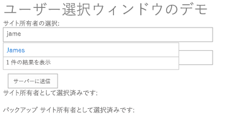
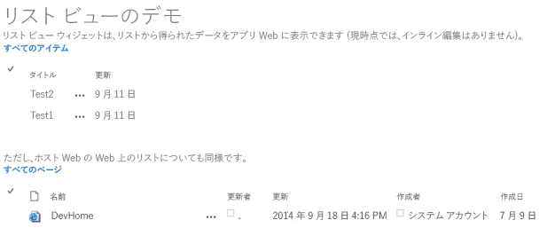

# Office Web ウィジェットを使用してホスト サイトからの情報を表示する

SharePoint プロバイダー ホスト型アドインに Office Web ウィジェット コントロールを実装して、ホスト サイトからの情報を表示します。

_**適用対象:** Office 365? | SharePoint 2013? | SharePoint Online_

Office Web ウィジェットを使用することにより、プロバイダー ホスト型アドインのコンテキストで SharePoint ホスト型サイトからの情報を表示できます。Office Web ウィジェットは、SharePoint ホスト型コントロールに似た、また同じように動作するように設計された一連のコントロールです。このコントロールは、[Office Web ウィジェット ライブラリ](http://www.nuget.org/packages/Microsoft.Office.WebWidgets.Experimental/)を提供する [NuGet](https://www.nuget.org/) パッケージとして提供されます。


              **注意:** Office Web ウィジェットはサード パーティの機能です。いくつかの制限があるため、注意して使用してください。詳細については、以下を参照してください。

[Core.OfficeWebWidgets](https://github.com/OfficeDev/PnP/tree/dev/Components/Core.OfficeWebWidgets) サンプルは、Office Web ウィジェット ライブラリに含まれているユーザー選択コントロールとリスト ビュー コントロールを実装する方法を示します。このサンプル アドインはコントロールを開始ページの HTML に挿入し、プロジェクトの Scripts フォルダーにある app.js JavaScript ファイルを使用してコントロールを構成します。

このサンプルの開始ページには、ユーザー選択コントロールが表示されています。このページでは、複数のユーザーを追加することができ、ユーザー入力用の 2 つのテキスト ボックスが含まれています。

**図 1.ユーザー選択デモの開始ページ**



Web プロジェクトの Default.aspx ファイルにある次のコードには、`<div>` タグの内側にユーザー選択コントロールが含まれています。

```
<div id="peoplePickerBackupSiteOwners" data-office-control="Office.Controls.PeoplePicker" data-office-options=
      '{ "placeholder" : "Please choose one or more backup site owner", 
      "allowMultipleSelections" : true,
      "onChange" : handleSiteOwnerBackupChange}'>
</div>

```

開始ページにはリスト ビュー コントロールも表示されます。ここには、SharePoint サイトのホスト Web とアドイン Web の両方からリストを表示できます。

**図 2.リスト ビュー コントロールの開始ページ**



Default.aspx ファイルの次の HTML には、リスト ビュー コントロールの 2 つインスタンスを表示するための `<div>` タグが含まれています。

```
The list view widget can show (currently no inline editing) data from a list on the add-in web:<br />
<div id="listViewAppWeb"></div>
        <br /><br />
        But the same applies for a list on the host web web:<br />
        <div id="listViewHostWeb"></div>
```

app.js ファイルの次のコードは、リスト ビュー コントロールの 2 つのインスタンスを作成します。

```
 var listViewAppWeb = new Office.Controls.ListView(document.getElementById("listViewAppWeb"),
          {
                     listUrl: appWebUrl + "/_api/web/lists/getbytitle('Announcements')"
           });

var listViewHostWeb = new Office.Controls.ListView(document.getElementById("listViewHostWeb"),
           {
                     listUrl: spHostUrl + "/_api/web/lists/getbytitle('Site Pages')"
           });
```

## その他のリソース
<a name="bk_addresources"> </a>

- [SharePoint 2013 および SharePoint Online の UX コンポーネント](ux-components-in-sharepoint-2013-and-sharepoint-online.md)
