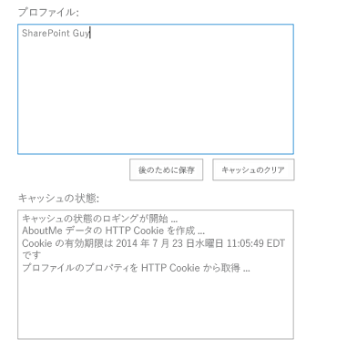

# SharePoint のプロバイダー ホスト型アドインのパフォーマンスを向上させる

リモート呼び出しを制限することで SharePoint のプロバイダー ホスト型アドインのパフォーマンスが向上します。

_**適用対象:** Office 365? | SharePoint 2013? | SharePoint Online_

SharePoint に対するリモート呼び出しの回数および頻度を制限することによって、SharePoint のプロバイダー ホスト型アドインのパフォーマンスを向上させることができます。ホスト サイトの呼び出し回数が多すぎると、パフォーマンスが低下します。リモート呼び出しの回数を制限するために、HTTP Cookie または HTML5 ローカル ストレージを実装できます。

[Performance.Caching](https://github.com/OfficeDev/PnP/tree/dev/Samples/Performance.Caching) サンプルには、HTTP Cookie または HTML5 ローカル ストレージを使用してデータをキャッシュする方法が示されています。このサンプルには、ユーザー プロファイルの [**自己紹介**] セクションの表示、データの追加、および後に備えてデータの保存が行える、2 個のプロバイダー ホスト型アドインが含まれています。アドインはユーザー プロファイルの情報を更新しません。また後で使用できるようにその情報をキャッシュに保存します。一方のサンプルは HTTP Cookie を使用してデータをキャッシュし、もう一方は HTML5 ローカル ストレージを使用します。

## キャッシュするために HTTP Cookie を使用する

HTTP Cookie サンプルの開始ページにあるテキスト ボックスに、ユーザー プロファイルの [ **自己紹介**] セクションの情報が表示されます。2 番目のテキスト ボックスには、新しい Cookie が作成されたかどうか、また既存の Cookie の有効期限が示されます。Cookie に格納される情報は 4095 バイトを超えることはできません。

**図 1. HTTP Cookie のキャッシュ サンプルでレンダリングされるデータ**



app.js ファイル (Web プロジェクトの Scripts フォルダーに存在します) は、**[後のために保存]** ボタンの動作を定義します。このコードでは、テスト Cookie を設定することによって、Cookie がブラウザーで有効であるかをまず確認します。Cookie が有効であれば、コードはユーザー プロファイル情報が既に Cookie に格納されているかどうかを判別します。格納されていない場合、JSON を使用して **[自己紹介]** の情報を検索し、その情報を Cookie に格納してからブラウザーに表示します。

次の関数では、Cookie と有効期限日が設定されます。

```c#
function setCookie(key, value, expiry, path, domain, secure) {
    var todaysDate = new Date();
    todaysDate.setTime(todaysDate.getTime());

    if (expiry == "") { expiry = "1"; }

    // The following line sets for n number of days. For hours, remove * 24. For minutes, remove * 60 * 24.
    if (expiry) {
        expiry = expiry * 1000 * 60 * 60 * 24;
    }

    var newExpiry = new Date(todaysDate.getTime() + (expiry));

    document.cookie = key + "=" + escape(value) +
        ( ( expiry ) ? ";expires=" + newExpiry : "" ) +
        ( ( path ) ? ";path=" + path : "" ) +
        ( ( domain ) ? ";domain=" + domain : "" ) +
        ((secure) ? ";secure" : "");

    cachingStatus += "\n" + "Creating http cookie for AboutMe data...";
    cachingStatus += "\n" + "Cookie will expire " + newExpiry;
    $('#status').text(cachingStatus);
}

```

## キャッシュするために HTML5 ローカル ストレージを使用する

HTML5 ローカル ストレージ サンプルの開始ページには、キャッシュ データに関するユーザー プロファイルの [ **自己紹介**] セクションからの情報が表示されます。テキスト ボックスには、この情報のほかにキャッシュされた情報の有効期限 (もしあれば) も表示されます。

**図 2. HTML 5 ローカル ストレージのキャッシュ サンプルでレンダリングされるデータ** app.js ファイル (Web プロジェクトの Scripts フォルダーに存在します) は、[ **後のために保存**] ボタンの動作を定義します。アドインは、以下の関数を使用して、ローカル ストレージが有効であることをまず確認します。

```c#
isHtml5StorageSupported = function () {
    try {
        return 'localStorage' in window &amp;&amp; window['localStorage'] !== null;
    } catch (e) {
        return false;
    }
    return false;
}

```

ローカル ストレージがサポートされている場合、関数はユーザー プロファイル情報が既にそこに格納されているかどうかを判別します。格納されていない場合、JSOM を使用して [ **自己紹介**] の情報を検索し、その情報をローカルに格納してからブラウザーに表示します。次のコードによって、[ **自己紹介**] の情報が "aboutMeValue" という名前のキーに格納されます。

```c#
var aboutMeValue = personProperties.get_userProfileProperties()['AboutMe'];
    $('#aboutMeText').val(aboutMeValue);

    // Add to local storage.
    localStorage.setItem("aboutMeValue", aboutMeValue);
    setLocalStorageKeyExpiry("aboutMeValue");

    cachingStatus += "\n" + "Populated local storage with profile properties...";
    $('#status').val(cachingStatus);

```

[ **キャッシュのクリア**] ボタンを押すとそのキーは削除され、ユーザー プロファイルの [ **自己紹介**] 情報が検索されて、その情報を格納する新しいローカル ストレージ キーが作成されます。既定では、アドインは有効期限を設定しませんが、app.js ファイルには、キャッシュ データの有効期限を設定する以下の関数が含まれます。

```c#
function setLocalStorageKeyExpiry(key) {

    // Check for expiration config values.
    var expiryConfig = localStorage.getItem(expiryConfigKey);
    
    // Check for existing expiration stamp.
    var existingStamp = localStorage.getItem(key + expiryKeySuffix);    

    // Override cached setting if a user has entered a value that is different than what is stored.
    if (expiryConfig != null) {
                
        var currentTime = Math.floor((new Date().getTime()) / 1000);
        expiryConfig = parseInt(expiryConfig);
        
        var newStamp = Math.floor((currentTime + expiryConfig));
        localStorage.setItem(key + expiryKeySuffix, newStamp);
        
        // Log status to window.        
        cachingStatus += "\n" + "Setting expiration for the " + key + " key...";
        $('#status').val(cachingStatus);
    }    
    else {
       
    }
}

```

ローカル ストレージ キーに格納された情報を検索する前に、コードは  **isKeyExpired** 関数を使用してキーの有効期限が切れていないかどうかを判別します。詳細については、「 [SharePoint のプロバイダー ホスト型アドインを使用して UX をカスタマイズする](customize-the-ux-by-using-sharepoint-provider-hosted-add-ins.md)」を参照してください。

## その他のリソース
<a name="bk_addresources"> </a>

- [SharePoint 2013 および SharePoint Online の UX コンポーネント](ux-components-in-sharepoint-2013-and-sharepoint-online.md)
    
- [SharePoint のプロバイダー ホスト型アドインを使用して UX をカスタマイズする](customize-the-ux-by-using-sharepoint-provider-hosted-add-ins.md)
    
- [Branding.UIElementPersonalization](https://github.com/OfficeDev/PnP/tree/dev/Samples/Branding.UIElementPersonalization)
    
- [Performance.Caching](https://github.com/OfficeDev/PnP/tree/dev/Samples/Performance.Caching)
