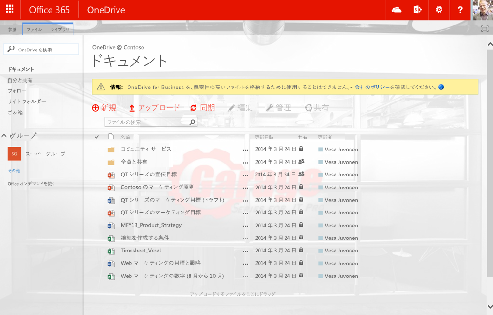
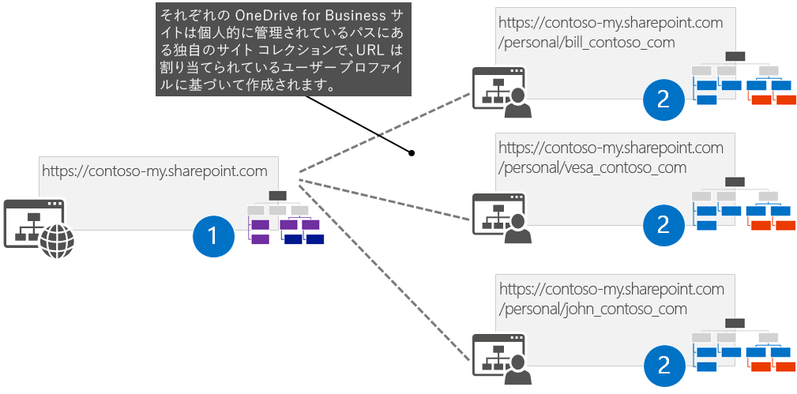
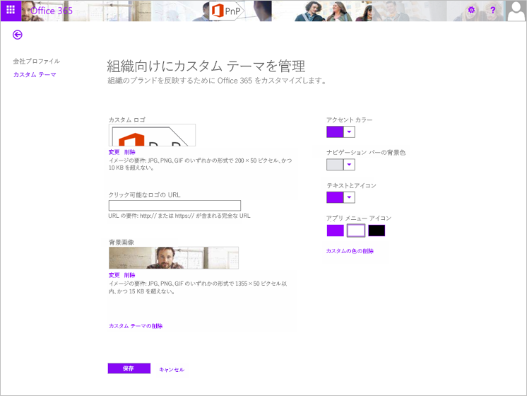
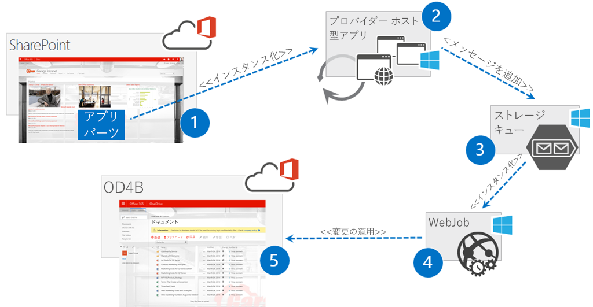
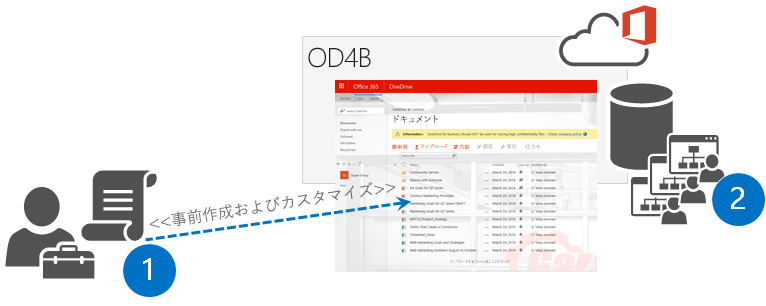
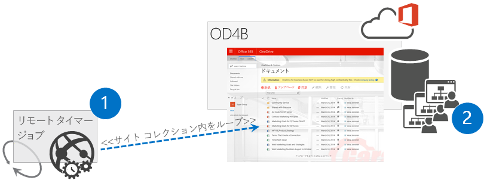
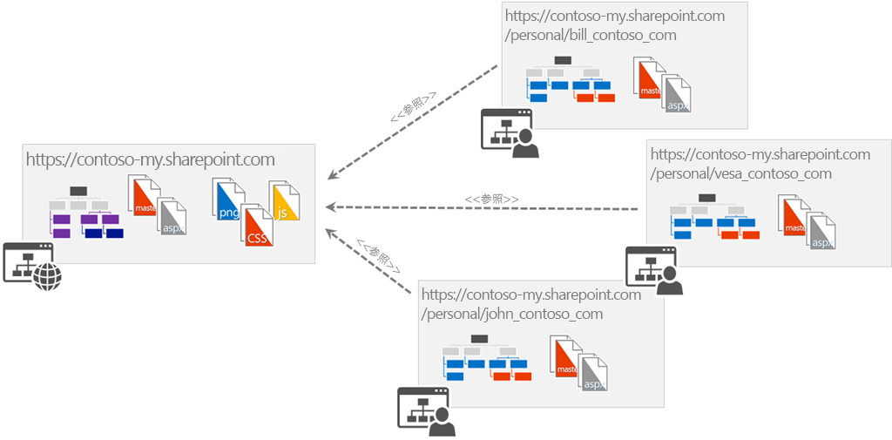
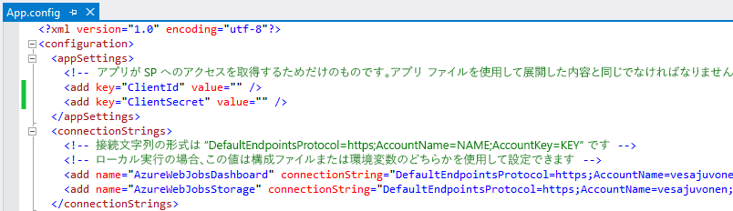
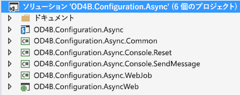

SharePoint アドイン モデルにおける Microsoft Azure のカスタマイズ
==================================================================

概要
-------

新しい SharePoint アドイン モデルで OneDrive for Business サイトをカスタマイズする方法は、完全信頼コードの場合とは異なります。一般的な完全信頼コード (FTC)/ ファーム ソリューション シナリオでは、SharePoint タイマー ジョブは SharePoint サーバー側オブジェクト モデル コードを使用して作成、ファーム ソリューションで展開、および SharePoint サーバーの全体管理 Web サイトで管理されます。このシナリオでは、SharePoint は、スケジュール設定とタイマー ジョブの実行の両方を処理します。 

SharePoint アドイン モデル シナリオでは、タイマー ジョブが作成され、SharePoint の外部でスケジュール設定されます。このシナリオでは、SharePoint はスケジュールの設定やタイマー ジョブの実行を行いません。

OneDrive for Business サイトをカスタマイズする理由
----------------------------------------------------
OneDrive for Business (OD4B) サイトへのカスタマイズの適用には、さまざまな側面があります。これらのサイトは SharePoint サイトであるため、カスタマイズが可能ですが、同時に、カスタマイズの短期的および長期的な影響を考慮する必要があります。

基本ガイドライン
---------------------

OD4B サイトのカスタマイズについては、大まかに次のような基本ガイドラインが提供されています。

- Office 365 のテーマまたは SharePoint サイトのテーマ エンジンを使用してブランド化カスタマイズを適用する
- テーマ エンジンが十分でない場合は、代替 CSS オプションを使用していくつかの CSS 設定を調整できます。
- カスタム マスター ページを使用して OD4B サイトをカスタマイズすることができますが、長期にわたる追加コストと将来の更新に関する課題が生じる可能性があります。
    + ほとんどの場合、テーマと代替 CSS を使用してすべての一般的なブランド化シナリオを実現できるため、これが制限要因になることはありません
    + カスタム マスター ページを使用する場合は、Office 365 に主要な機能更新プログラムが適用されたときにサイトに変更を適用する準備をしておいてください
- サイトの機能を変更または非表示にするには、JavaScript 埋め込みを使用できます
- CSOM を使用して、OD4B サイトの言語や地域の設定を制御できます (「[新しい API](http://blogs.msdn.com/b/vesku/archive/2014/12/15/latest-api-updates-in-client-side-object-model-dec-2014-cu-for-sp2013.aspx)」を参照)
- 必要なフィールドやその他の要素が変更されないよう、OD4B サイトでコンテンツ タイプやサイト列を使用することはお勧めしません。これにより、OD4B サイトの通常の使用で問題が発生する可能性があります。
    + OD4B のサイトを個人用の非構造化データおよびドキュメントであると考えてください。チーム サイトやコラボレーション サイトは、会社データやドキュメントのためにあります。これらのサイトでは、ユーザーは希望する情報管理ポリシーとメタデータを確実に使用できます。

要約すると、Office 365 では、カスタマイズは間違いなくサポートされており、OD4B サイトで使用し続けることができます。カスタマイズの短期的および長期的な影響を運用と保守の観点から考慮してください。これは、実際には SharePoint に限定されず、任意のプラットフォームで構築されたすべての IT ソリューションに当てはまる経験則です。

上記のガイドラインを使用してカスタマイズされた Office 365 OD4B サイトの例を以下に示します。ここでは Office 365 のテーマ、サイト テーマ、および JavaScript の埋め込みパターンと呼ばれる使用法を組み合わせることで、最終的な結果を実現しました。

OneDrive for Business サイトのカスタマイズを適用する場合の課題
-----------------------------------------------------------------

最初に、どのような課題があり、ここで何を解決しようとしているかを定義することから始めましょう。一般的に、各 OneDrive for Business は現在、SharePoint 2007 または 2010 バージョンで使用されていた個人用またはマイ サイトと同じ構造を使用しています。つまり、各 OneDrive for Business サイトは技術的には、独自のサイト コレクションであり、ブランド化やその他のカスタマイズを適用する一元化された場所はありません。

必要な構成を OneDrive for Business サイト (マイ サイトまたは個人用サイトを含む) に適用する従来のソリューションは、[ファーム レベルの機能の関連付け](http://cks.codeplex.com/releases/view/2824)に基づいていました。つまり、SharePoint ファームにファーム ソリューションを展開し、マイ サイトが作成されるたびにカスタム機能をアクティブ化するよう、機能フレームワークを使用してカスタム機能を関連付け、その後、必要なカスタマイズを適用していました。ファーム ソリューションを展開する必要があり、Office 365 のサイトではこれが不可能なため、このような方法は Office 365 では機能しません。したがって、必要な変更をサイトに適用するため、代替案を探す必要があります。

Office 365 では、OD4B サイトを作成するときにカスタム コードを添付できる集中管理イベントは発生しません。つまり、アプリケーション モデルのアプローチで一般的に使用される代替ソリューションについて考える必要はありません。古いモデルにこだわらず、新しい API と技術を使用して同じ最終結果を実現する方法を考えてください。純粋な要件の観点から、サイトにカスタマイズが適用される限り、カスタマイズの適用方法は問題ではありません。ビジネスの要件は機能の関連付けを使用しないことではなく、サポートされている技術的メカニズムを使用して必要なカスタマイズを適用することです。

カスタマイズを適用するためのさまざまなオプション
============================================

実際には、一元化されたカスタマイズを Office 365 の OD4B サイトに適用するさまざまなメカニズムが 4 つあります。手動のオプションを 5 番目のオプションとして検討することも可能です。ただし、数百や数千もの OD4B サイトがある場合、手動オプションの使用は現実的ではありません。別のオプションを次に示します。

1. Office 365 スイート レベルの設定 (Office 365 テーマおよび他の設定)
2. ユーザー コンテキストが含まれる非表示のアプリ パーツ
3. 構成を事前に作成して適用する
4. ユーザー プロファイルの更新に基づくリモート タイマー ジョブ

それぞれのオプションには長所と短所があり、適切なオプションは詳細なビジネス要件によって異なります。一部の設定は、Office 365 スイート レベルから適用することもできますが、多くの場合、より具体的な設定が必要になります。そのため、実際にカスタマイズを行う必要があります。結局のところ、すべては正確な要件と、短期的および長期的な影響におけるビジネス ケース分析に帰着します。

Office 365 スイート レベルの設定
-------------------------------

ご存じのように、Office 365 には SharePoint より多くの機能があります。Delve、Yammer、および予定されている多くのサービスのように、SharePoint アーキテクチャにさえ基づいていない、多くの追加サービスを次々に見つけることができます。つまり、企業のブランド化と構成とは SharePoint サイトの内容を制御することだけではなく、むしろエンド ユーザー エクスペリエンス全体や、さまざまなサービスで一貫性のある構成を提供する方法について考える必要があります。

これらの企業要件の典型的な例はブランド化です。これに対応するため、ある程度のレベルのブランド化をコントロールできる Office 365 テーマを導入しました。また、これ以外にも、サイト コレクション設定以外で一元化された場所からサイト管理やその他の設定を制御できるよう、Office 365 コンプライアンス センターなどの機能が予定されています。現在、これらは [Office 365 ロードマップ](http://office.microsoft.com/en-us/products/office-365-roadmap-FX104343353.aspx)に表示されています。

次の図は、今後すべての Office 365 サービスに適用される、Office 365 のテーマの現在の設定を示しています。

既定の Office 365 のテーマ設定は、OD4B サイト スイート バーを制御するためのものであるため、ほとんどの場合、少なくとも OD4B サイト全体で正しいブランド化要素を提供できるよう、このオプションをほかのオプションと組み合わせて使用することになります。Office 365 管理ツールで Office 365 のテーマ設定を変更すると、設定が OD4B サイトに適用されるまでに長い時間がかかります。しばらくお待ちください。

ユーザー コンテキストが含まれる非表示のアプリ パーツ
---------------------------------

これは、必要なカスタマイズ プロセスを開始するための場所としての一元化されたランディング  ページを使用する方法です。つまり、ユーザーがブラウザーを開いたときに常に表示される企業イントラネットのフロント  ページのように、一元的な場所を持つことを意味します。会社ランディング ページが AD のグループ ポリシー設定を使用して制御されている、中規模および大規模の企業では非常に一般的です。これにより会社のドメインに参加しているブラウザーの既定のウェルカム ページをエンド ユーザーが上書きするのを防ぎます。

ユーザーがイントラネットにアクセスすると、カスタム プロセスを開始する非表示のアプリ パーツがページに搭載されています。通常のユーザーはサイト作成プロセスが開始する前に一度 OD4B サイトを訪問する必要があるため、実際にはこのアプリ パーツは、OD4B サイトの作成全体を実行します。実際には非表示のアプリケーション パーツは、Azure でホストされるプロバイダー ホスト型アプリケーションのページをホストしています。次に、このページはカスタム プロセスを開始します。

では、このアプローチの論理設計について詳しく説明します。

1. 非表示のアプリ パーツを、エンドユーザーが到着する集中管理サイトに配置します。 通常これは、企業のイントラネットのフロント ページです。
2. アプリ パーツはプロバイダー ホスト型アプリのページをホストし、サーバー側のコードでは、必要なメタデータを Azure ストレージ キューに追加してカスタマイズ プロセスを開始します。つまり、このページのカスタマイズ要求のみを受信しますが、処理時間を通常どおり維持するため、実際には変更を適用しません。
3. これは、処理をキューに追加するために受信される、実際の Azure ストレージ キューです。このようにして、エンド ユーザーがイントラネットのフロント ページに留まる時間が問題とならないよう、カスタマイズ制御プロセスを非同期的に処理します。カスタマイズ プロセスを同期すると、ページの実行が完了するまでイントラネットのフロント ページでブラウザーを開いたままにするかは、エンドユーザーに依存します。これは間違いなく最適とは言えず、しばらく前のブログ記事に書いた[元の OD4B のカスタマイズ プロセス](http://blogs.msdn.com/b/vesku/archive/2013/11/25/office365-apply-automatically-custom-branding-to-personal-site-skydrive-pro.aspx)課題でした。
4. WebJob は次のストレージ キューにフックされ、ストレージ キューに新しいアイテムが配置されたときに呼び出されます。この WebJob は、正しいサイト コレクションにアクセスするため、キューのメッセージから必要なパラメーターとメタデータを受信します。WebJob は、App Only トークンを使用しており、テナントのレベルでサイト コレクションを操作するために必要なアクセス許可が付与されます。
5. 実際のカスタマイズは、ユーザーがプロセスを開始するためにイントラネットのフロント ページを訪問すると、そのユーザーのサイトに 1 つずつ適用されます。これは、間違いなく、OD4B サイトに適切な構成があることを確認する最も信頼性の高いプロセスです。また、更新の必要性があり、ユーザーが次回イントラネットのフロント ページにアクセスしたときに、必要な更新を OD4B サイトにも適用するようなカスタムのバージョン管理ロジックを簡単にプロセスに追加することもできます。ただし、このオプションでは、エンド ユーザーが到着する一元化された場所が必要です。

ファーム ソリューションを使用した従来の SharePoint 開発モデルに慣れている場合、これはワンタイム実行タイマー ジョブと非常に似たプロセスです。

構成を事前に作成して適用する
----------------------------------

このオプションは、ユーザーがアクセスする前の、OD4B サイトの事前作成に依存しています。これは、CSOM または REST のいずれかを使用して、一括プロセスで特定のユーザーの OD4B サイトを作成する[比較的新しい API](https://github.com/OfficeDev/PnP/tree/master/Samples/Provisioning.OneDriveProvisioning) を使用して実現できます。PowerShell スクリプトを使用するか、リモート API を呼び出す実際のコードを記述することで必要なコードを開始できます。

1. 管理者は、リモート作成 API を使用してユーザーの OD4B サイトを作成し、スクリプト プロセスの一部として OD4B サイトに必要なカスタマイズを適用します。
2. 実際の OD4B サイトは特定のユーザーのために Office 365 に作成され、ユーザー プロファイルに関連付けられます。

ある意味ではこれも非常に信頼性の高いプロセスですが、新しいユーザーの管理と更新を「手動」で行う必要があります。つまり、*非表示のアプリ パーツ*の方法を使用した場合より多くの作業が必要となります。これは、実行可能な確実に有効なアプローチであり、他のいくつかのファイル ソリューションから OD4B に移行し、実際のサイト作成を開始する前にエンド ユーザーが OD4B サイトに 1 回アクセスする必要がないようにする場合に特に便利です。

ユーザー プロファイルの更新に基づくリモート タイマー ジョブ
----------------------------------------------

この方法では、OD4B サイトの作成者を確認するためにユーザー プロファイルをスキャンした後、必要に応じて変更をサイトに適用します。つまり、SharePoint の外部で実行されるスケジュールされたジョブは、定期的に状態をチェック、必要なカスタマイズを実行します。スケジュールされたジョブは、Azure での WebJob として、または独自の Windows スケジューラーでスケジュールされた PowerShell スクリプトとしてシンプルに実行することができます。明らかに、展開の規模は選択したスケジュール設定オプションに大きな影響を与えます。

1. スケジュールされたタスクが開始し、OD4B サイトのプロビジョニングを行ったユーザーを確認するため、ユーザー プロファイルにアクセスします。
2. 実際のサイトは、個々のビジネス要件に基づいてカスタマイズされます。

このオプションのキーの欠点の 1 つは、カスタマイズが適用される前に、ユーザーが OD4B サイトにアクセスできる状況の可能性が明確にあるということです。同時に、このオプションは、エンドユーザーがサイト上の必要な設定を変更しないようにする、または OD4B サイトのコンテンツが会社ポリシーに沿っていることを確認するための他のオプションにとって興味深いアドオンでもあります。

アプリ パーツ ベースのカスタマイズの強化
-------------------------------------

ここでは、アプリ パーツ ベースのカスタマイズの強化機能についてより詳細に説明します。この方法は、OD4B サイトへの必要なカスタマイズの適用と管理を行う一般的なアプローチと見られます。このソリューションのソース コードと詳細については、[Office 365 Developer パターンおよびプラクティス ガイド](http://aka.ms/officedevpnp)で入手できます。

非表示のアプリ パーツのアプローチに続き、実際の論理設計 (以前、[このブログの投稿](http://blogs.msdn.com/b/vesku/archive/2013/11/25/office365-apply-automatically-custom-branding-to-personal-site-skydrive-pro.aspx)で説明しました) を示します。つまり、Office 365 環境に必要なアプリ パーツを配置できる集中管理イントラネットがあり、エンド ユーザーがブラウザーを開くと、ようこそページにリダイレクトされることを前提としています。エンド ユーザーがブラウザーを開くと常に一元化された場所から開始するよう、グループ ポリシーを使用して各会社ブラウザーに同じホーム ページを設定することは一般的です。この場所に、幅と高さのサイズを 0 ピクセルに設定可能なアプリ パーツを配置します。ここで重要なポイントは、エンド ユーザー コンテキストを使用して、プロバイダー ホスト型アドインのページを含むアプリ パーツを実行するということです。

**パフォーマンスの最適化と保守に関する考慮事項**

このアプリ パーツは、各ユーザーがイントラネットのフロント ページに到達するたびに実行されます。そのため、パフォーマンスへの影響や、コードを効率的に動作させ、コード実行の重要な部分のみを実際に必要なときに実行する方法を考慮する必要があります。最適化では、各サイトで使用されている実際の資産を配置する場所も考慮する必要があります。これらは、すべてのカスタマイズで取り組むことになる一般的な課題です。ここでは、アプリ モデルの実装で専念すべきことの短いリストを示します。

- 資産の場所 – 一元的なコンテンツ配信ネットワーク (CDN) ソリューションを、各サイト コレクションまたはルート サイト コレクションのどちらに配置しますか。
- クライアント側のブラウザーのキャッシュに関係なく最新バージョンスクリプトの (JavaScript) を実行し、最新バージョンの画像を確実に表示できる資産のリフレッシュ レートや、その確認方法は何ですか。
- コードの実行を削減し、Azure と Office 365 サービスに不要な負荷を避ける
- OD4B サイトに適用されるバージョンのカスタマイズ

**資産の場所**

これにはいくつかの解決策があります。参照コードの例では、会社のポリシーのメッセージを提供し、サブ サイトの作成の可能性を排除 (またはリンクを非表示に) するため、各 OD4B サイトで JavaScript の埋め込みを使用しています。この解決策では、必要な JavaScript ファイルを OneDrive for Business アドレス スキームのルート サイト コレクションにアップロードし、個々 の OD4B サイトでその 1 つの場所から直接そのファイルを参照します。つまり、変更が必要な場合、1 つの場所で JavaScript ファイルの保守と更新を行うことができます。

この参照用の実装では、WebJob が実行されるたびに、実際にこのファイルも更新します。この動作は確かに不要ですが、サンプル コードは、追加手順や可能性を使用せずに、できるだけ簡単に動作するように作られています。JavaScript ファイルをルート サイト コレクションに手動でアップロードし、そこから参照する場合と同じです。代替ソリューションとして、いくつかの CND を使用して必要なファイルを格納したり、プロバイダー ホスト型アプリ側から JavaScript を参照することもできます。ファイルのコピーが 1 つだけの場合は、次のようになります

**クライアント側キャッシュの課題と解決法**

JavaScript ベースのの実装での課題の 1 つは、クライアント側キャッシュです。使用されている JavaScript ファイルをダウンロードするとき、ブラウザーは、次回の要求でダウンロードする資産の量を減らすため、それらのファイルをキャッシュします。このことは、パフォーマンスの最適化の観点で優れていますが、JavaScript ファイルの更新が必要となったときに問題が発生します。最悪の場合、キャッシュされた JavaScript ファイルによって、更新後のバージョン導入された他の更新プログラムで例外が発生します。

この問題を排除するため、JavaScript URL 参照でリビジョン属性の使用を開始できます。ユーザー カスタム アクションを OD4B サイトに関連付けるときには、JavaScript の URL を含め、URL に一意の GUID を持たせます。サイト コレクションのルート サイトを示す参照の例を次に示します。追加の GUID は、URL の rev 属性の後に追加されます。特定の OD4B サイトでカスタマイザーが実行されるたびに、この属性が更新されます。実際には、OD4B サイトに新しいバージョンが追加されるまで JavaScript ファイルがブラウザーにキャッシュされます。OD4B サイトに新しいバージョンが追加されると、ブラウザーの URL が変わり、ブラウザーによって新しいバージョンがダウンロードされ、次回の更新後にそのバージョンがキャッシュされます。

- /OneDriveCustomization/OneDriveConfiguration.js?rev=4bb89029e7ba470e893170d4cba7de00

ユーザー カスタム アクション用の JavaScript URL の生成に使用されるコードを次に示します。
    
    /// 

    /// Just to build the JS path which can be then pointed to the OneDrive site.
    /// 

    /// <returns></returns>
    public string BuildJavaScriptUrl(string siteUrl)
    {
        // Solve root site collection URL
        Uri url = new Uri(siteUrl);
        string scenarioUrl = String.Format("{0}://{1}:{2}/{3}", 
                               url.Scheme, url.DnsSafeHost, 
                               url.Port, JSLocationFolderName);
       // Unique rev generated each time JS is added, so that we force browsers to 
       // refresh JS file wiht latest version
       string revision = Guid.NewGuid().ToString().Replace("-", "");
       return string.Format("{0}/{1}?rev={2}", scenarioUrl, JSFileName, revision);
    }

**コードの実行を削減する**

このページはイントラネットのフロント ページに非表示のアプリ パーツを搭載する方法に基づいているため、ユーザーがブラウザーを更新またはページに移動するたびにコードが実行されます。このフロント ページは多くの場合、企業内のユーザーの既定ブラウザーのホーム ページとして設定されているため、ブラウザー セッションを起動するたびにコードが実行されます。

ただし、OD4B のサイトに適用されるカスタマイズはそれほど頻繁に更新しないため、を更新しないため、カスタマイズ更新プロセス全体を開始しても意味はありません。これを実行することでストレージ キューの使用量や Web ジョブ実行を削減します。弊社の設計では CPU やその他のリソースをそれほど消費しないため、これによってプロバイダー ホスト型のアプリ側で関連付けられているコストが直接削減されます。

要求ごとに、処理が実行されないようにする最も簡単な方法では、従来のブラウザーの cookie を使用する方法です。この方法では、特定の有効期間、クライアント ブラウザーに特定の cookie を保存します。この cookie の存在を確認することで、cookie の有効期限が切れるまで実行をスキップできます。cookie の有効期限が切れると、OD4B サイトの実際のカスタマイズの状態を再確認します。

アプリ パーツのページ読み込みメソッドは、次のとおりです。このメソッドの呼び出しは、cookie の存在を確認し、cookie が存在する場合、実行が再度必要になるまで、実際のビジネス コードをスキップします。

    // Check if we should skip this check. We do this only once per hour to avoid 
    // perf issues and there's really no point even hitting the user profile 
    // in every request.
    if (CookieCheckSkip())
        return;

Cookie の実際の状況と cookie の設定は、次のように行われます。

    /// 

    /// Checks if we need to execute the code customization code again. 
    /// Timer set to 60 minutes to avoid constant execution of the code for nothing.
    /// 

    /// <returns></returns>
    private bool CookieCheckSkip()
    {
        // Get cookie from the current request.
        HttpCookie cookie = Request.Cookies.Get("OneDriveCustomizerCheck");
    
       // Check if cookie exists in the current request.
       if (cookie == null)
       {
           // Create cookie.
           cookie = new HttpCookie("OneDriveCustomizerCheck");
           // Set value of cookie to current date time.
           cookie.Value = DateTime.Now.ToString();
           // Set cookie to expire in 60 minutes.
           cookie.Expires = DateTime.Now.AddMinutes(60);
           // Insert the cookie in the current HttpResponse.
           Response.Cookies.Add(cookie);
           // Output debugging information
           WriteDebugInformationIfNeeded(
               string.Format(@"Cookie did not exist, adding new cookie with {0} 
                               as expiration. Execute code.",
                               cookie.Expires));
           // Since cookie did not existed, let's execute the code, 
           // so skip is false.
           return false;
       }
       else
       {
           // Output debugging information
           WriteDebugInformationIfNeeded(string.Format(@"Cookie did existed, 
                                       with {0} as expiration. Skipping code.", 
                                       cookie.Expires));
           //  Since cookie did existed, let's skip the code
           return true;
       }
    }

アプリ パーツ ページにあるコードを詳しく見ると、呼び出しのたびにエンド ユーザーに対して OD4B サイトの存在を確認していることがわかります。 この動作は、ユーザー プロファイルにアクセスすることによってのみ実行可能なため、コードはパフォーマンスに影響を与えます。 上記の cookie のチェックを使用することで、エンド ユーザー エクスペリエンスが向上し、実際の要件がないにもかかわらずユーザーのプロファイル サービスをヒットし続けるのを回避します。 また、必要な場合はすべてのプロセスをスキップするよう、*Page_Load* メソッドの最初のステップとして cookie の確認を配置しています。 コードのプロセスを表示する *Page_Load* メソッド (*Customizer.aspx*) の短いスニペットを次に示します。 

    protected void Page_Load(object sender, EventArgs e)
    {
        // Check if we should skip this check. We do this only once per hour to avoid 
        // perf issues and there's really no point even hitting the user profile 
        // in every request.
        if (CookieCheckSkip())
            return;
     
        var spContext = 
           SharePointContextProvider.Current.GetSharePointContext(Context);
       using (ClientContext clientContext = 
           spContext.CreateUserClientContextForSPHost())
       {
           // Get user profile
           ProfileLoader loader = ProfileLoader.GetProfileLoader(clientContext);
           UserProfile profile = loader.GetUserProfile();
           Microsoft.SharePoint.Client.Site personalSite = profile.PersonalSite;
    
           clientContext.Load(profile, prof => prof.AccountName);
           clientContext.Load(personalSite);
           clientContext.ExecuteQuery();
    
           // Let's check if the site already exists
           if (personalSite.ServerObjectIsNull.Value)
           {

**OD4B サイトに適用されるバージョンのカスタマイズ**

コード プロセスの最適化の 2 番目のレベルは、OD4B のサイトに展開されるカスタマイズのバージョンを具体的に管理することで行われます。つまり、OD4B サイトのプロパティ バッグにカスタマイズのバージョンを格納し、必要に応じてファイルや資産のみを更新します。WebJob の実行時、OD4B の現在のカスタマイズ バージョンとこれから展開するバージョンを比較し、OD4B サイト内にカスタマイズ バージョンが存在しない場合にのみ、必要な資産をアップロードし、他の設定を適用します。

この方法でも、必要でない場合は実際のカスタマイズ コードの更新や実行を行わないため、Microsoft Azure から必要なリソースを大幅に削減します。つまり、Microsoft Azure における CPU やその他のリソース使用量、および Office 365 に対する要求を削減します。

このサンプルで格納されているすべてのカスタマイズ ロジックは、*ApplySiteConfiguration* メソッド (*OD4B.Configuration.Async.Common.SiteModificationManager* クラス) にあります。また、このメソッドは、カスタマイズ プロセスを開始するための適切なパラメーターを持つ WebJob によっても呼び出されます。実際に操作を実行する前に、「Contoso_OneDriveVersion」のキーでプロパティ バッグの値をチェックし、サイト内の現在のバージョンが、適用を計画しているバージョンより低い場合にのみ実行が続行されます。コードを簡素化するために [Office PnP コア コンポーネント](https://github.com/OfficeDev/PnP-Sites-Core/tree/master/Core) を使用している実際のコードは、次のとおりです。

    // Check current site configuration status - is it already in right version?
    if (ctx.Web.GetPropertyBagValueInt(
        SiteModificationManager.OneDriveMarkerBagID, 0) 
        < SiteModificationManager.BrandingVersion)
    {

サイトにカスタマイズを適用すると、次回の実行に備え、適用されたカスタマイズ バージョンをプロパティ バッグに設定します。

    // Save current branding applied indicator to site
    ctx.Web.SetPropertyBagValue(SiteModificationManager.OneDriveMarkerBagID, SiteModificationManager.BrandingVersion);

これは比較的単純なプロセスですが、Azure から必要なリソースを大幅に削減し、Office 365 に対する不要なリモート操作も削減するため、パフォーマンスによい影響を与えます。

Azure で必要な構成
-----------------------------

このサンプルが正しく動作するために重要な要件は、Azure ストレージ データ サービスを作成し、それらを使用するプロジェクトに従ってストレージの接続文字列を更新しているということです。 Azure 管理ポータル (manage.windowssazure.com) で **[新規] > [データ サービス] > [ストレージ] > [クイック作成]** を選択するだけで、ストレージ サービスとして作成できます。 その後、名前、場所、およびその他のいくつかの設定を定義するだけで完了です。

![簡易作成の設定:[URL] フィールドは "myveryownstorage" に設定し、[場所/アフィニティ グループ] は "米国西部"、[サブスクリプション] は "MSDN Ultimate"、[レプリケーション] は "Geo 冗長" に設定します。](media/Recipes/OD4BCustomization/azure-config-1.png)

ストレージが作成されていると、接続文字列に必要なキーをコピーする必要があります。 ストレージの詳細ページに移動して、ページの一番下で *[アクセス キーの管理]* をクリックすると、キー情報にアクセスできます。

![[アクセス キーの管理] へのリンクが、ページの一番下で強調表示されています。](media/Recipes/OD4BCustomization/azure-config-2.png)

Visual Studio ソリューションで、次のプロジェクト用に App.config ファイルを更新する必要があります。各プロジェクトの詳細については、このブログの記事で後述します。

OD4B.Configuration.Async.WebJob OD4B.Configuration.Async.Console.SendMessage WebJob プロジェクトには 2 つのキーがあり、同じ接続を示すよう更新できます。SendMessage には、更新が必要なキーが 1 つだけあります。

リファレンス ソリューションの構造
----------------------------

この Visual Studio のソリューションは、多数のソリューションで構成されていますが、それぞれに非常に合理的な理由があります。ソリューションの各プロジェクトの概要と、それらが存在する理由、およびそれらの目的を次に示します。

**OD4B.Configuration.Async**

これは、SharePoitn をプロバイダー ホスト型アプリを SharePoint に導入し、必要なアクセス許可を要求する、実際の SharePoint アプリ プロジェクトです。 アプリ パーツ自体からテナント レベルの操作を実際に実行しないにもかかわらず、アドインの非常に高いアクセス許可を要求していることに注意してください。 これは、WebJob 実行では、このアプリ ファイルの同じクライアント ID とシークレットを使用するためです。 この方法を使用することで、SharePoint にアプリ ID とシークレットを手動で登録する必要はありません。ソリューションを超えて同じ ID とシークレットを使用します。

![アクセス許可の一覧:スコープ [テナント] には、FullControl のアクセス許可が付与されています。 スコープ [ユーザー プロファイル (ソーシャル)] には、FullControl のアクセス許可が付与されています。 チェック ボックス [アプリで SharePoint へのアプリ専用呼び出しを許可します。] はオンになっています。](media/Recipes/OD4BCustomization/app-permissions.png)

このプロジェクトには、ホスト Web に展開されるアプリ パーツ定義も含まれています。

**OD4B.Configuration.Async.Common**

このプロジェクトには、ストレージ キューに配置されるデータ オブジェクトの定義や、OD4B のサイトをカスタマイズするのための実際のビジネス ロジックのように、プロジェクトを超えた実際のビジネス ロジックと共有コードが含まれています。ここにコードを配置する理由は単純に、プロジェクトの作成時の、開発や操作のテストを簡単にするためです。一般的な開発のように、WebJob やアプリ パーツに直接ビジネス ロジック コードを配置しないでください。代わりにテストやコードの再利用を簡単にするためにビジネス ロジック レイヤーに配置してください。

OD4B サイトに対する実際の操作はすべて、*OD4B.Configuration.Async.Common.SiteModificationManager* クラスにあります。

**OD4B.Configuration.Async.Console.Reset**

このプロジェクトは、実際のカスタマイズに対するテストおよびデバッグ プロジェクトです。任意の OD4B サイトに、目的のカスタマイズを手動で適用するために使用できます。開発期間中、WebJob にフックされる前は、このプロジェクトは カスタマイズ プロセスをテストする弊社のテスト プロジェクトでした。プロジェクトは、デモやテストの目的で任意の OD4B サイトのカスタマイズをリセットするのにも使用できます。共通のプロジェクトには、実際のビジネス ロジックがあります。そのため、このプロジェクトは他と同じ *SiteModificationManager* クラスを使用して、サイトからカスタマイズを適用またはリセットします。

カスタマイズをテストするときには、メイン メソッドのコードで「適用」と「リセット」を切り替え、目的の操作を変更できます。

    static void Main(string[] args)
    {
     
        Uri url = 
            new Uri("https://vesaj-my.sharepoint.com/personal/vesaj_veskuonline_com");
     
            //get the new site collection
        string realm = TokenHelper.GetRealmFromTargetUrl(url);
        var token = TokenHelper.GetAppOnlyAccessToken(
                       TokenHelper.SharePointPrincipal, 
                       url.Authority, realm).AccessToken;
       using (var ctx = 
           TokenHelper.GetClientContextWithAccessToken(url.ToString(), 
           token))
       {
           // Uncomment the one you need for testing/reset
           // Apply(ctx, url);
           Reset(ctx);
       }
    }

app.config 内のこのプロジェクトのアプリ ID とシークレットが、テナントに必要なアクセス許可を与えたものと一致していることを確認する必要があります。プロジェクトを右クリックして **[デバッグ] > [新しいインスタンスを開始]**を選択することで、プロジェクトを簡単に実行し、実行されるコードを 1 行ずつ確認できます。

**OD4B.Configuration.Async.Console.SendMessage**

このプロジェクトは、アプリ パーツにフックされる前にストレージ キュー メカニズムをテストするため、ソリューションに追加されました。プロジェクトを使用して、ストレージ キューに新しいメッセージを追加するアプリ パーツ プロセスを回避できます。プロジェクトが正常に動作するよう、app.config に従ってストレージ キュー接続文字列を更新する必要があります。

プロジェクトを右クリックして [デバッグ] > [新しいインスタンスを開始] を選択することで、プロジェクトを簡単に実行し、実行されるコードを 1 行ずつ確認できます。

**OD4B.Configuration.Async.WebJob**

これは、Visual Studio 2013 Update 4 で導入された WebJob プロジェクト テンプレートを使用して作成された、実際の WebJob のプロジェクトです。このテンプレートを使用すると、正しい参照を配置して WebJob プロジェクトを簡単に作成できるようにします。また、プロジェクトの正しいクリック サポートにより、優れた展開の自動化を提供します。単にプロジェクトの初期バージョンまたは新しいバージョンのプロジェクトを右クリックし　[Azure Web ジョブとして発行] を選択すると発行ウィザードが開き、それらを Azure に展開できます。

![[Web の発行] ダイアログ ボックスが表示され、[接続] タブを示しています。 [サーバー] フィールドには、値 "vesaj-od4bconf.scm.azurewebsites.net:443" が入力されています。[サイト名] フィールドには、値 "vesaj-0d4bconf" が入力されています。[ユーザー名] フィールドは消されています。[パスワード] フィールドは、マスクされています。[パスワードの保存] チェック ボックスはオンになっています。[宛先 URL] フィールドには、値 "http://vesaj-od4bconf.azurewebsites.net" が入力されています。](media/Recipes/OD4BCustomization/publish-to-azure.png)

この WebJob は、キュー ベースの処理に必要な継続的な WebJob として作成されます。つまり、メイン メソッドでは、次のようにプロセスを連続で実行するのみ設定します。

    class Program
    {
        // Please set the following connection strings in app.config for this 
        // WebJob to run: AzureWebJobsDashboard and AzureWebJobsStorage
        static void Main()
        {
            var host = new JobHost();
            // The following code ensures that the WebJob will be 
            // running continuously
           host.RunAndBlock();
       }
    }

実際のキュー プロセスは、WebJobs を使用すると非常に簡単です。必要な操作は、メソッドに適した属性を設定し、アプリ構成内の Azure ストレージ接続文字列が適宜更新され、Microsoft Azure で作成したストレージ キューと一致していることを確認するだけです。次は、functions.cs クラスの *ProcessQueueMessage* メソッドです。WebJob から SharePoint にアクセスするための、App Only トークン モデルの使用方法に注意してください。これが動作するためには、プロジェクトの app.config に正しいアプリ ID とシークレットがコピーされたことを確認する必要があります。実際のビジネス ロジックは *SiteModificationManager* クラスにあるため、適切なクライアント コンテキストおよびパラメーターを使用して呼び出すだけです。

    // This function will get triggered/executed when a new message is written 
    // on an Azure Queue called queue.
    public static void ProcessQueueMessage(
        [QueueTrigger(SiteModificationManager.StorageQueueName)] 
        SiteModificationData request, TextWriter log)
    {
        Uri url = new Uri(request.SiteUrl);
     
        //Connect to the OD4B site sing App Only access
       string realm = TokenHelper.GetRealmFromTargetUrl(url);
       var token = TokenHelper.GetAppOnlyAccessToken(
           TokenHelper.SharePointPrincipal, url.Authority, realm).AccessToken;
    
       using (var ctx = TokenHelper.GetClientContextWithAccessToken(
           url.ToString(), token))
       {
           // Set configuration object properly for setting the config
           SiteModificationConfig config = new SiteModificationConfig()
           {
               SiteUrl = url.ToString(),
               JSFile = Path.Combine(Environment.GetEnvironmentVariable
                   ("WEBROOT_PATH"), "Resources\\OneDriveConfiguration.js"),
               ThemeName = "Garage",
               ThemeColorFile = Path.Combine(Environment.GetEnvironmentVariable
                   ("WEBROOT_PATH"), "Resources\\Themes\\Garage\\garagewhite.spcolor"),
               ThemeBGFile = Path.Combine(Environment.GetEnvironmentVariable
                   ("WEBROOT_PATH"), "Resources\\Themes\\Garage\\garagebg.jpg"),
               ThemeFontFile = "" // Ignored in this case, but could be also obviously set
           };
    
           new SiteModificationManager().ApplySiteConfiguration(ctx, config);
       }
    }

注目すべきもう 1 つの点は、Web ジョブを展開したときに、すべての依存アセンブリが Azure に適切にコピーされるよう、プロジェクトの SharePoint CSOM アセンブリ参照プロパティの *[ローカル コピー]* プロパティを設定していることを確認する必要があるということです。 これは、これらのアセンブリが既定では標準の Azure には格納されていないためです。このプロパティ *True* を設定することで、参照アセンブリが確実にクラウドにコピーされていることを確認します。

**OD4B.Configuration.AsyncWeb**

これは、Microsoft Azure でホストされる実際のプロバイダー ホスト型アプリです。アプリ パーツに搭載されたページを含むアプリ パーツは、イントラネットのフロント ページに配置されます。実際、このアプリの Default.aspx ページにすべての操作が含まれておらず、アプリの使用方法について詳しく説明します。

*注意してください。 一般的に、WebJob または App Only アクセスでアクセス拒否の問題が発生した場合、app.config 内のクライアント ID とシークレットを、このファイルの web.config の値と一致するよう更新したことを確認します。 Visual Studio は、特定のシナリオでこれらの値を変更できます。* 

WebJob でのキューの処理
--------------------------

ストレージ キューの使用は、Azure で利用可能な API を使用すると非常に簡単です。 開始する方法で最も簡単なものは、必要なすべての API とその他のパッケージをプロジェクトに関連付ける「*Windows Azure ストレージ*」Nuget API パッケージを使用する方法です。 この Nuget パッケージを追加した後、ストレージ キュー API を使用して処理を開始するだけです。 次のスニペットは、*OD4B.Configuration.Async.Common* プロジェクト (SiteModificationManager クラスの AddConfigRequestToQueue メソッド) のものです。このスニペットは実際のキューのメッセージ処理コードを含み、さまざまなプロジェクトで使用されています (開発時のデバッグを容易にします)。

    public void AddConfigRequestToQueue(
                string account, string siteUrl, string storageConnectionString)
    {
        CloudStorageAccount storageAccount = 
                            CloudStorageAccount.Parse(storageConnectionString);
     
        // Get queue... create if does not exist.
        CloudQueueClient queueClient = storageAccount.CreateCloudQueueClient();
        CloudQueue queue = 
           queueClient.GetQueueReference(SiteModificationManager.StorageQueueName);
       queue.CreateIfNotExists();
    
       // Pass in data for modification
       var newSiteConfigRequest = new SiteModificationData()
       {
           AccountId = account,
           SiteUrl = siteUrl
       };
    
       // Add entry to queue
       queue.AddMessage(
           new CloudQueueMessage(
               JsonConvert.SerializeObject(newSiteConfigRequest)));
    }

この場合、実際のキュー処理は、WebJob プロジェクトで行われていました。WebJob の場合、キューの処理を自動化するだけ特定の属性を使用できます。ここで行うべきことは、受信部分と送信部分の両方で同じストレージ接続文字列とキュー名の両方を使用していることを確認するだけです。

    // This function will get triggered/executed when a new message is written 
    // on an Azure Queue called queue.
    public static void ProcessQueueMessage(
        [QueueTrigger(SiteModificationManager.StorageQueueName)] 
        SiteModificationData request, TextWriter log)
    {
        Uri url = new Uri(request.SiteUrl);

これ以上簡単にすることはできません。キュー名が一致していることを確認するため、*SiteModificationManager.StorageQueueName* を両側で使用していることに注意してください。

**サイトに実際の構成を適用する**

この参照実装では、次のカスタマイズを各 OD4B サイトに実行しています。

- OD4B サイトで常に表示される会社ポリシー メッセージを追加します
- サイト コンテンツ ページからサブ サイト リンク の作成オプションを非表示にする
- 会社のブランド化と一致するよう OD4B サイトにカスタム テーマを適用する

会社のポリシー、およびサブ サイトの作成リンクの非表示は、JavaScript 埋め込みパターンで実行されます。このパターンは特定の JavaScript ファイルを参照してカスタム ユーザー アクションをサイト レベルに追加し、ページ要求ごとに実行されてます。つまり、クライアント側テクノロジを使用して任意のページの任意の要素を追加、削除、または更新し、ページ処理をコントロールできます。この方法を使用すると、カスタム マスター ページを導入する必要はありません。カスタム マスター ページでは、必要な変更が非常に小規模の場合、より長期的な保守コストが発生する可能性があります。

カスタム テーマの 2 つ目の操作では追加ファイルをサイトにアップロードし、テーマ設定として使用するようにそれらを設定する必要があります。機能フレームワーク要素の関連付けで将来混乱が発生するのを防ぐため、CSOM を厳密に使用して、必要なすべてのファイルをサイトにアップロードします。CSOM を使用して SharePoint ファイルをアップロードする方法は、非常にシンプルです。これは、間違いなく自動化を実行する最も簡単な方法であり、サンド ボックス ソリューションに対する xml 固有の構成の依存性について心配する必要はありません。OD4B.Configuration.Async.Common.SiteModificationManager クラスの実際のサイトの構成メソッドを次に示します。いくつかの必要な操作を簡素化するため、Office 365 Developer PnP コア コンポーネントを使用しています。

また、個人用 OD4B サイトをカスタマイズするたびに、JS の新しいバージョンをルート サイトにアップロードしています。これが最適なソリューションでないのは明らかですが、この参照ソリューションでは目的をわかりやすくするため使用しています。アプリがインストールされたときに 1 回だけ実行されるよう、JavaScript ファイルのアップロード操作をアプリの [インストール済み] イベントに追加することを検討できます。ただし、その場合、その JS ファイルの更新で追加作業を行う必要があります。

    // This function will get triggered/executed when a new message is written 
    // on an Azure Queue called queue.
    public static void ProcessQueueMessage(
        [QueueTrigger(SiteModificationManager.StorageQueueName)] 
        SiteModificationData request, TextWriter log)
    {
        Uri url = new Uri(request.SiteUrl);
     
        //Connect to the OD4B site using App Only token
       string realm = TokenHelper.GetRealmFromTargetUrl(url);
       var token = TokenHelper.GetAppOnlyAccessToken(
           TokenHelper.SharePointPrincipal, url.Authority, realm).AccessToken;
    
       using (var ctx = TokenHelper.GetClientContextWithAccessToken(
           url.ToString(), token))
       {
           // Set configuration object properly for setting the config
           SiteModificationConfig config = new SiteModificationConfig()
           {
               SiteUrl = url.ToString(),
               JSFile = Path.Combine(Environment.GetEnvironmentVariable
                   ("WEBROOT_PATH"), "Resources\\OneDriveConfiguration.js"),
               ThemeName = "Garage",
               ThemeColorFile = 
                   Path.Combine(Environment.GetEnvironmentVariable
                   ("WEBROOT_PATH"), "Resources\\Themes\\Garage\\garagewhite.spcolor"),
               ThemeBGFile = 
                   Path.Combine(Environment.GetEnvironmentVariable
                   ("WEBROOT_PATH"), "Resources\\Themes\\Garage\\garagebg.jpg"),
               ThemeFontFile = "" // Ignored in this case, but could be also set
           };
    
           new SiteModificationManager().ApplySiteConfiguration(ctx, config);
       }
    }

明らかに、必要な操作はお客様のビジネス要件に大きく依存しています。「[Office 365 Developer パターンおよびプラクティス](http://aka.ms/officedevpnp)」から CSOM ベースの操作を使用したさまざまなパターンと方法を見つけることができます。

WebJob ベースのソリューションについてのその他の注意事項
==========================================

Azure での WebJob 開発に関連するその他の注意事項をいくつか示します。 これは、間違いなく Office 365 のカスタマイズ全体で広く使用される、非常に強力な手法です。 WebJob テクノロジに基づいた新しいソリューションや拡張ソリューションが、Office 365 Developer パターンおよびプラクティスのプログラムにも追加されていることを確認できます。

WebJob とカスタマイズ プロセスのデバッグ
------------------------------------------

一般的にコードでは、最初にコンソール アプリケーションを使用した必要なコードのテストや、Visual Studio でのプロジェクトのテストに集中できるよう、実際の操作を実際の最終的な実行 プロセスの外に配置することをお勧めします。この方法では、最終的なプロセス (ここでは WebJob)  に実際にフックする前に、実際のビジネス ロジックが完全に機能していることを確認できます。この参照ソリューションでは、すべてのビジネス コードを OD4B.Configuration.Async.Common.SiteModificationManager クラスに配置し、そここからさまざまな場所から呼び出しました。

これは、開発期間中は、ビジネス ロジックが完全に安定していることを確認するため、OD4B.Configuration.Async.Console.Reset コンソール アプリケーションを使用して、サイトから必要なだけカスタマイズのテストやリセットを行うことができたことを意味していました。これは、SharePoint アドイン モデルや Azure 開発とは関係ありません。使用するテクノロジに関係なく、実際的な手順を追った開発プラクティスです。MCM for SharePoint 証明書トレーニングの講演者をしていた時、これを [NKOTB メソッド](https://www.youtube.com/watch?v=iCrargw1rrM)と表していましたが、業界標準の用語ではありません。

Visual Studio 2014 Update 4 では、WebJobs のデバッグの側面から、優れた改善点が導入されました。新しく導入された Azure 接続およびプロジェクト テンプレートでは、Azure 側で実行する WebJob でリモート デバッグを実際に実行できます。WebJob を Azure に展開する必要があり、その後で *[サーバー エクスプローラー]* で WebJob インスタンスを右クリックし、コンテキスト メニューから *[デバッガーの接続]* を選択してデバッグ セッションを開始できます。

![[サーバー エクスプローラー] では、ネストされたオブジェクトが [Web サイト]、[vesaj-od4bconf]、[Web ジョブ]、[連続番号]、OD4BConfigurationAsyncWebJob"] の順に展開されています。 [OD4BConfigurationAsyncWebJob] に重ねてコンテキスト メニューが表示され、コンテキスト メニューオプションの [デバッガーのアタッチ] が強調表示されています。](media/Recipes/OD4BCustomization/server-explorer.png)

参照ソリューションには、キューに適切な書式のメッセージをキューに送信するテスターもあります。*OD4B.Configuration.Async.Console.SendMessage* プロジェクトは単純に、アプリ パーツを任意の場所に強制的に展開することなく WebJob プロセスをデバッグする機会を提供するために作られました。ここで再び、プロセス全体をステップ バイ ステップでデバッグおよびテストします。

WebJob 環境変数
----------------------------

WebJobs の興味深い点の 1 つは、Azure Web サイトで実行されているが、実行場所は Azure の通常の Web サイトとは若干異なるということです。追加のファイルまたは資産を WebJob と共に Azure に展開し、WebJob コードで従来の相対パスを使用してこれらの資産を直接参照できると想定していた場合、課題に直面する可能性があります。

この場合、カスタム テーマに対し 1 つの JavaScript ファイルといくつかのファイルがあり、それらは必要に応じて SharePoint サイトにアップロードができるよう、Azure Web サイトに展開されていました。特定の Web サイトの下でファイルの分岐を展開すると、Azure でそれらのファイルを表示できます。

![[サーバー エクスプローラー] では、ネストされたオブジェクトが [Web サイト]、[vesaj-od4bconf]、[ファイル]、[リソース]、[テーマ]、[Garage] の順に展開されていて、[Garage] フォルダー内のファイルが表示されています。](media/Recipes/OD4BCustomization/azure-web-site.png)

通常、Azure Web サイトでは、次の形式を使用してこれらのファイルを参照できていました。

    string path = HostingEnvironment.MapPath(
        string.Format("~/{0}", "Resources/OneDriveConfiguration.js"));

ただし、WebJobs は別の場所で実行され、IIS のコンテキストではないため、WebJob プロセスのコンテキストからマッピングを行うことはできず、ファイルに対する上記の参照は機能しません。ここで、WebJob 固有の環境変数が役立ちます。参照ソリューションのケースでは、WebJob 固有の環境変数 WEBROOT_PATH を使用して、関連付けられた Web サイト フォルダーのアクセス権を取得しました。

    string jsFile = Path.Combine(
        Environment.GetEnvironmentVariable("WEBROOT_PATH"), 
        "Resources\\OneDriveConfiguration.js");

また、役立つ可能性がある WebJobs 用の環境変数が他にもいくつかあります。コードを使用して別の環境変数をチェックすることができ、GitHub には[この](https://gist.github.com/sayedihashimi/831d8883cdf1d23823f3)ための優れた参考資料があります。

ソリューションとアクションを示すビデオ
================================================


            [このビデオ](http://video.ch9.ms/ch9/053b/3496f324-dc88-4e1f-937f-e1a177fc053b/OD4BCustomizer_high.mp4)はソリューションの構造の説明や、Office 365 環境で使用して OneDrive for Business サイトを変更する方法など、実践でのソリューションを示しています。

関連リンク
=============
- [OneDrive for Business サイト ブランド化のカスタマイズ](Customization-Options-For-OD4B-Sites.md)
- ガイダンス記事: [http://aka.ms/OfficeDevPnPGuidance](http://aka.ms/OfficeDevPnPGuidance "ガイダンス記事")
- MSDN リファレンス: [http://aka.ms/OfficeDevPnPMSDN](http://aka.ms/OfficeDevPnPMSDN "MSDN リファレンス")
- ビデオ: [http://aka.ms/OfficeDevPnPVideos](http://aka.ms/OfficeDevPnPビデオ"Videos")

関連する PnP サンプル
===================

- [OD4B.Configuration.Async (O365 PnP サンプル)](https://github.com/OfficeDev/PnP/tree/master/Solutions/OD4B.Configuration.Async)
- [Provisioning.OneDriveProvisioning (O365 PnP サンプル)](https://github.com/OfficeDev/PnP/tree/master/Samples/Provisioning.OneDriveProvisioning)
- [Office PnP コア コンポーネント](https://github.com/OfficeDev/PnP-Sites-Core/tree/master/Core)
- https://github.com/OfficeDev/PnP にあるサンプルとコンテンツ

適用対象
==========
- Office 365 マルチテナント (MT)
- Office 365 専用 (D) *一部*
- SharePoint 2013 オンプレミス - *一部*

*専用およびオンプレミスの場合のパターンは SharePoint アドイン モデル手法と同じですが、使用可能なテクノロジは異なる可能性があります。*
