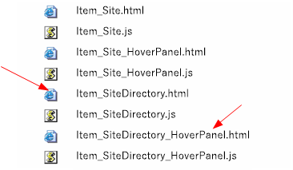
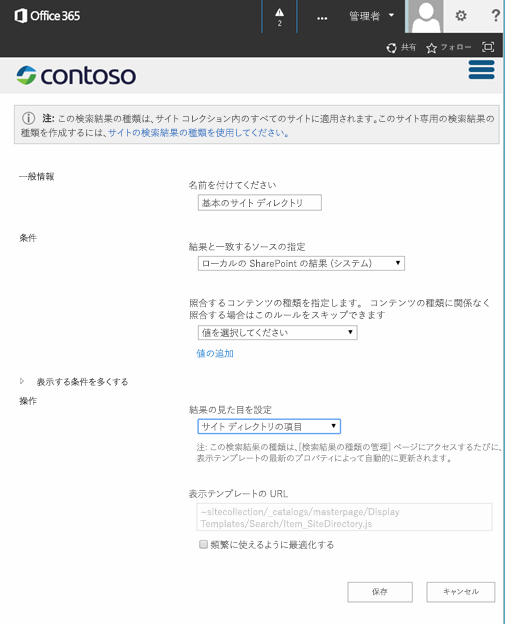
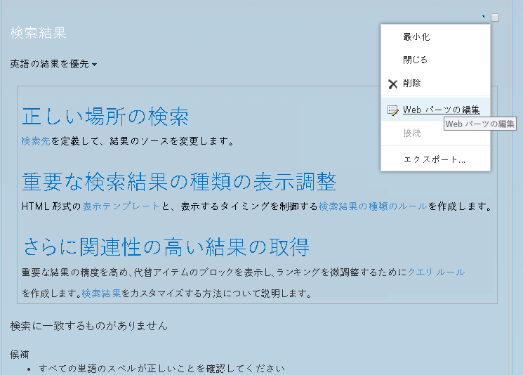
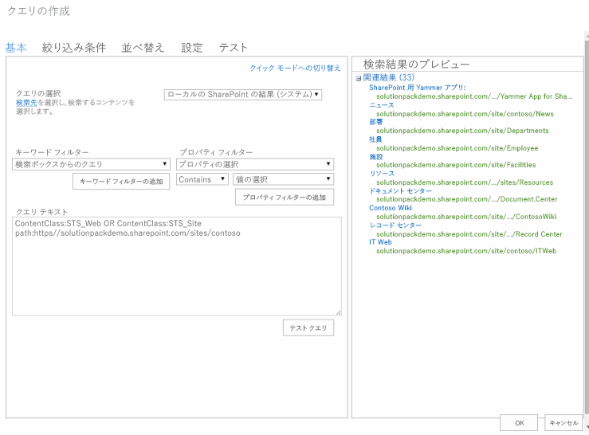
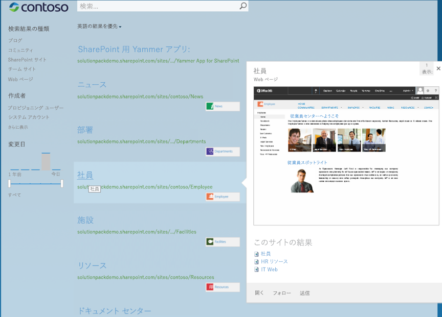
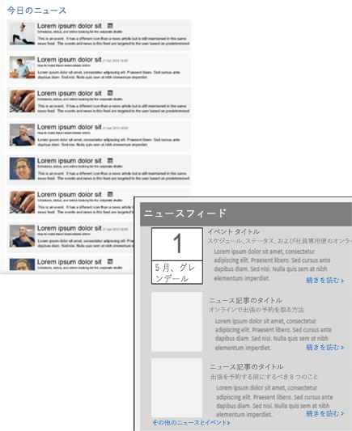
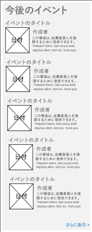
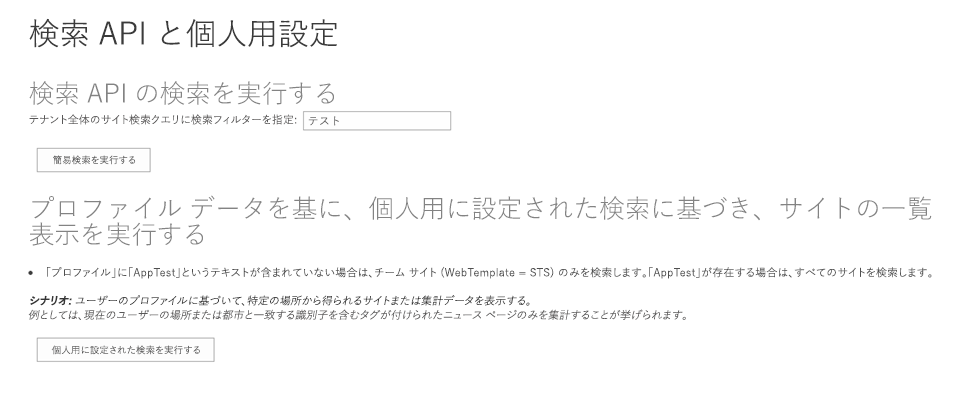
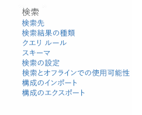

# SharePoint の検索のカスタマイズ

検索ベースのサイト ディレクトリ、カスタマイズ検索、または検索構成プロパティを使用して、カスタマイズした SharePoint 2013 および SharePoint Online の検索シナリオを作成します。 

_**適用対象:** Office 365 | SharePoint 2013 | SharePoint Add-ins? | SharePoint Online_

## 検索ベースのサイト ディレクトリ

SharePoint 検索では、カスタム コードを記述せずに検索ベースのサイト ディレクトを作成することができます。 

サイト ディレクトリを作成するには、次の手順を実行します。

1. サイト ディレクトリの表示テンプレートを作成します。
    
2. サイト ディレクトリの検索結果の種類を定義します。
    
3. 結果ページを作成します。
    
4. 検索結果 Web パーツ プロパティを編集します。
    
サイト ディレクトリの表示テンプレートを作成するには、次の手順を実行します。

**メモ** この手順では、サイトに関連する表示テンプレートを変更せずに使用します。サイト ディレクトリの結果の表示方法を変更する場合、作成する表示テンプレートを変更します。

1. [ **マスター ページ ギャラリー**] にマップされたネットワーク ドライブを開きます。詳細については、「 [[方法]: SharePoint 2013 マスター ページ ギャラリーへのネットワーク ドライブの割り当て](http://msdn.microsoft.com/en-us/library/office/jj733519%28v=office.15%29.aspx)」を参照してください。
    
2. 実行しようとする内容に最も良く適合する表示テンプレート HTML ファイルをコピーします。サイト ディレクトリのシナリオの場合は、Item_Site.html と Item_Site_HoverPanel.html です。これらのファイルは両方とも、マップされたネットワーク ドライブの  `\Display Templates\Search` フォルダーにあります。
    
3. 次のように Item_SiteDirectory.html と Item_SiteDirectory_HoverPanel.html のコピーの名前を変更します。
    
    **図 1. サイト ディレクトリ表示テンプレート**

    

4. Item_SiteDirectory.html ファイルを開き、次のように変更します。
    
    - `<title>` タグの値を "Site Item" から "Site Directory" に変更します。
    
    - `<div>` 開始タグの後の最初の `<body>` タグを `<div id="Item_Site">` から `<div id="Item_SiteDirectory">` に変更します。
    
    - ホバー パネル表示テンプレート JavaScript ファイルの名前を `var hoverUrl = "~sitecollection/_catalogs/masterpage/Display Templates/Search/Item_Site_HoverPanel.js";`から `var hoverUrl = "~sitecollection/_catalogs/masterpage/Display Templates/Search/Item_SiteDirectory_HoverPanel.js";` に変更します。
    
5. Item_SiteDirectory_HoverPanel.html ファイルを開き、次のように変更します。
    
    - `<div>` 開始タグの後の `<body>` タグを `<title>Site Hover Panel Test</title>`から `<title>Site Directory Hover Panel</title>` に変更します。
    
    - `<title>` タグを `<div id="Item_Site_HoverPanel">` から `<div id="Item_SiteDirectory_HoverPanel">` に変更します。
    
サイト ディレクトリの検索結果の種類を定義するには、次の手順を実行します。

1. [ **サイト設定**]  >  [ **検索**]  >  [ **検索結果の種類**] に移動し、 [ **新しい検索結果の種類**] を選択します。
    
2. 新しい検索結果の種類の名前を "Basic Site Directory" にします。
    
3. **[これらの結果をどのように表示しますか?]** ボックスで、**[サイト ディレクトリ]** を選択します。
    
    **図 2. サイト結果構成**

    

4. [ **保存**] を選択します。
    
結果ページを作成するには、次の手順を実行します。

1. [ **サイト設定**] メニューで、 [ **サイト コンテンツ**] を選択します。
    
2. [ **ページ**] を選択します。
    
3. [ **ページ**] ライブラリで、[ **ファイル**]  >  [ **新しいドキュメント**]  >  [ **ページ**] を選択します。
    
4. [ **ページの作成**] ページで、[ **タイトル**] に "Site Directory"、[ **URL 名**] に "sitedirectory" を指定します。
    
5. [ **作成**] を選択します。
    
検索結果 Web パーツのプロパティを編集するには、次の手順を実行します。

1. [ **サイト ディレクトリ**] ページで、[ **設定**]  >  [ **ページの編集**] を選択します。
    
2. **[検索結果 Web パーツ]** で、**[Web パーツ]** メニューを選択し、**[Web パーツの編集]** を選択します。
    
    **図 3. Web パーツ メニュー**

    

3. Web パーツ ツール ウィンドウで、 [ **クエリの変更**] を選択し、クエリ ビルダーを開きます。
    
4. [ **クエリ テキスト**] フィールドに次を入力します。 `ContentClass:STS_Web OR ContentClass:STS_Site path:http://<YourServer>`
    
5. [ **クエリのテスト**] を選択し、構文が正しいことを確認します。[ **検索結果のプレビュー**] ウィンドウに、[ _クエリ テキスト_] の  **path** に指定したサイト内のサブサイトが表示されるはずです。
    
    **図 4. 検索結果 Web パーツ クエリ ビルダー**

    

6. [ **OK**] をクリックしてクエリ ビルダーを閉じます。
    
7. [ **表示テンプレート**] で、 [ **検索結果の種類を使用したアイテムの表示**] を選択します。
    
8. [ **アイテムの検索結果の種類**] ドロップダウン リストの [ **Basic Site Directory**] を選択します。
    
9. [ **外観**] セクションで、[ **タイトル**] を "Sites I have access to" に変更します。
    
10. [ **OK**] を選択して Web パーツに対する変更を保存し、Web パーツ ツール ウィンドウを閉じます。以下の図には、検索ベースのサイト ディレクトリ ページの例が示されています。
    
    **図 5. Contoso の検索ベースのサイト ディレクトリの例**

    

## カスタマイズ検索の結果

カスタマイズ検索は、検索要求の送信元ユーザーを対象に検索結果を表示する場合に使用されます。このセクションでは、カスタマイズ検索に関するいくつかのシナリオと、それらのシナリオを実装する方法について説明します。

### ニュース シナリオ

このシナリオでは、ユーザーを対象にニュースやイベントなど、関連するコンテンツを示す検索アドインを作成します。

**図 6. ニュースのカスタマイズ検索のシナリオ**



ニュース シナリオを実装するには、SharePoint 検索結果 Web パーツと既定の表示テンプレート (タイトル、説明、ロールアップ イメージを含むニュース情報を表示する) を使用します。最初の10 個のニュース アイテムを表示します。ユーザーがロールアップ イメージ、タイトル、または [詳細はこちら] リンクを選択すると、ニュース記事のページが読み込まれます。

あるいは、クエリ API (CSOM または REST) を使用する検索アドインを作成できます。検索アドインのプロパティを使用することによって、表示されるニュース アイテムの数を構成可能にできます。

もう 1 つのオプションでは、クエリ API を使用し、検索結果を取得するクエリ API コードをページ レイアウトに直接追加します。

ユーザー固有のニュースやイベント情報を表示するには、次の手順を実行します。

1. 部署、地域、言語などのユーザー プロファイルのプロパティに基づいてニュースやイベントの結果をフィルター処理するように、クエリを変更します。
    
2. ニュースやイベント アイテムのタイトル、説明、ロールアップ イメージ、および URL のプロパティを取得します。
    
3. 組み合わせたニュースとイベントを  **LastModifiedDate** プロパティに基づいて並び替えるロジックを実装します。

### 予定イベントのシナリオ

このシナリオでは、検索アドインは、ユーザーを対象に関連するイベントを表示します。

**図 7. 予定イベントのカスタマイズ検索のシナリオ**



このシナリオを実装するために、SharePoint 検索結果 Web パーツを構成して、予定イベント情報のみを取得するようにクエリを変更できます。これを実行するには、Web パーツの [クエリ テキスト] に `ContentClass:STS_ListItem_Events` を指定します。イベントの検索結果の表示方法を変更するには、イベント情報を表示するためのカスタム表示テンプレートを作成します。

ユーザーがイメージ、タイトル、または [詳細はこちら] リンクを選択するとイベント情報が読み込まれるように、アイテム表示テンプレートを変更できます。また、ユーザーが [ **もっと表示する**] を選択すると、Web パーツに次の 10 項目のイベントの検索結果が表示されるようにコントロール表示テンプレートを変更することもできます。

クエリ API を使用して同等の検索結果を取得する検索アドインを作成することもできます。既定で最新の 10 項目の予定イベントのみを表示するように検索アドインを構成できますが、検索アドイン プロパティを使用してこの設定を構成可能にしてください。 

### おすすめのニュース シナリオ

このシナリオでは、検索アドインは、企業イントラネットや部門のランディング ページなどに、特定のユーザーを対象とするおすすめコンテンツとして検索結果を表示します。HTML を使用した jQuery プラグインを含むアドイン パーツを使用してこのシナリオを実装できます。このパーツは、検索 REST サービスまたはクエリ CSOM を使用して SharePoint から検索結果を取得し、検索結果を表示します。

### カスタマイズ検索のコード サンプル

「 [SharePoint 2013: SharePoint アドインで検索結果を個人用に設定する](http://code.msdn.microsoft.com/SharePoint-2013-Personalizi-fb6ddcf9)」サンプルには、基本的な検索の例と、検索クエリ CSOM を使用するカスタマイズ検索の結果の例が示されています。基本的な検索の例では、テナント全体の検索に使用される検索フィルターをユーザーは指定できます。サイトは、ユーザーによって指定されるフィルターに基づいて検索されます。

この例では、 **SharePointContextProvider** クラスを使用して SharePoint コンテキストを最初に取得します。

```
var spContext = SharePointContextProvider.Current.GetSharePointContext(Context);
```

次に、ユーザーの入力内容に基づいてクエリが作成されます。サイト コレクションへのクエリが制限され、 **ProcessQuery** メソッドが呼び出されます。このメソッドの呼び出しでは、コンテキストとクエリが渡されます。その後、 **ProcessQuery** の結果が結果テーブルとして返されます。このテーブルは **FormatResults** メソッドによって解析されます。

```
using (var clientContext = spContext.CreateUserClientContextForSPHost())
{
    string query = searchtext.Text + " contentclass:\"STS_Site\"";
    ClientResult<ResultTableCollection> results = ProcessQuery(clientContext, query);
    lblStatus1.Text = FormatResults(results);
}
```

**ProcessQuery** メソッドは、検索クエリを表す **KeywordQuery** オブジェクトを作成します。

```
KeywordQuery keywordQuery = new KeywordQuery(ctx);
keywordQuery.QueryText = keywordQueryValue;
keywordQuery.RowLimit = 500;
keywordQuery.StartRow = 0;
keywordQuery.SelectProperties.Add("Title");
keywordQuery.SelectProperties.Add("SPSiteUrl");
keywordQuery.SelectProperties.Add("Description");
keywordQuery.SelectProperties.Add("WebTemplate");
keywordQuery.SortList.Add("SPSiteUrl", Microsoft.SharePoint.Client.Search.Query.SortDirection.Ascending);
```

**ExecuteQuery_Client(Query)** メソッドが呼び出されて、検索クエリが SharePoint に送信されます。 検索結果は、**ClientResult<T&gt;** オブジェクトに返されます。

```
SearchExecutor searchExec = new SearchExecutor(ctx);
ClientResult<ResultTableCollection> results = searchExec.ExecuteQuery(keywordQuery);
ctx.ExecuteQuery();
```

**FormatResults** メソッドは検索結果を反復処理して、結果の値を表示する HTML テーブルを作成します。

```
string responseHtml = "<h3>Results</h3>";
responseHtml += "<table>";
responseHtml += "<tr><th>Title</th><th>Site URL</th><th>Description</th><th>Template</th></tr>";
if (results.Value[0].RowCount > 0)
{
 foreach (var row in results.Value[0].ResultRows)
 {
   responseHtml += "<tr>";
   responseHtml += string.Format("<td>{0}</td>", row["Title"] != null ? row["Title"].ToString() : "");
   responseHtml += string.Format("<td>{0}</td>", row["SPSiteUrl"] != null ? row["SPSiteUrl"].ToString() : "");
   responseHtml += string.Format("<td>{0}</td>", row["Description"] != null ? row["Description"].ToString() : "");
   responseHtml += string.Format("<td>{0}</td>", row["WebTemplate"] != null ? row["WebTemplate"].ToString() : "");
   responseHtml += "</tr>";
 }
}
responseHtml += "</table>";
```

**ResolveAdditionalFilter** メソッドは "Apptest" の有無をチェックします。これが見つかった場合、すべての種類のサイト テンプレートのリストが検索結果として返されます。見つからなかった場合、STS Web テンプレートのみが検索結果として返されます。

```
private string ResolveAdditionalFilter(string aboutMeValue)
{
    if (!aboutMeValue.Contains("AppTest"))
    {
        return "WebTemplate=STS";
    }
    return "";
}
```

次いでこの例ではクエリを作成し、検索結果の取得、書式設定、表示を実行するために  **ProcessQuery** および **FormatResults** メソッドを呼び出します。

```
string query = "contentclass:\"STS_Site\" " + templateFilter;
ClientResult<ResultTableCollection> results = ProcessQuery(clientContext, query);
lblStatus2.Text = FormatResults(results);
```

以下の図に、この例の UI を示します。

**図 8. カスタマイズ検索結果のサンプル UI**



## 検索構成の移植性

SharePoint 2013 と SharePoint Online では、サイト コレクションやサイト間で、カスタマイズされた検索構成の設定をエクスポートしたり、インポートしたりできます。Search Service アプリケーション (SSA) レベルでは、カスタマイズされた検索構成設定のエクスポートのみを実行できます。これをプログラムで行うには、検索 API を使用する必要があります。エクスポート オプションは、SharePoint UI では使用できません。

「 [SharePoint 2013: SharePoint Online の検索設定のインポートとエクスポート](http://code.msdn.microsoft.com/SharePoint-2013-Import-and-6287b5ac)」サンプルには、コンソール アプリケーションで検索 CSOM を使用して、SharePoint Online サイトの検索設定をインポートおよびエクスポートする方法が示されています。

### 移植可能な設定の構成

カスタマイズされた検索構成の設定をエクスポートするときに、SharePoint 2013 は XML 形式で検索構成ファイルを作成します。この検索構成ファイルには、SSA、サイト コレクション、またはサイト レベル (エクスポートを開始した場所) でのエクスポート可能なカスタマイズされたすべての検索構成設定が含まれます。サイト コレクションの検索構成ファイルには、サイト コレクション内の個々のサイトからの検索構成設定は含まれません。

検索構成ファイルをインポートすると、SharePoint 2013 は、サイト コレクションまたはサイト (インポートを開始した場所) に、カスタマイズされた検索構成設定を作成し、それを有効にします。

表 1 に、エクスポートおよびインポート可能な設定、およびその他のカスタマイズされた検索構成設定との依存関係を一覧で示します。カスタマイズされた検索構成設定が異なるレベルのカスタマイズされた検索構成設定に依存する場合、関連するすべてのレベルの設定をエクスポートおよびインポートする必要があります。

**表 1. エクスポートおよびインポート可能な検索設定**

|**構成設定**|**依存関係**|
|:-----|:-----|
|結果ブロック、昇格した結果、およびユーザー セグメントを含むクエリ ルール|検索先、検索結果の種類、検索スキーマ、ランク付けモデル|
|検索先|検索スキーマ|
|検索結果の種類|検索スキーマ、検索先、表示テンプレート|
|検索スキーマ|なし|
|ランク付けモデル|検索スキーマ|

カスタマイズされた検索構成設定を SSA からエクスポートし、その設定をサイト コレクションおよびサイトにインポートすることができます。しかし、カスタマイズされた検索構成設定を SSA にインポートすることはできません。また、既定の検索構成設定をエクスポートすることもできません。

サイトまたはサイト コレクションのレベルでは、SharePoint UI を使用して検索構成設定をエクスポートまたはインポートすることができます。これらの設定は、 [ **サイト設定**] ページの [ **検索**] セクションにあります。

**サイトの設定 - 検索**



これらの設定は、**[サイト コレクションの管理]** セクションでも使用できます。あるいは、SharePoint 2013 検索 CSOM を使用して、プログラムによってこれらの設定をインポートおよびエクスポートすることもできます。

### 検索構成ファイル

次の表に、検索構成をサポートするスキーマ ファイルを一覧表示します。スキーマ形式の詳細については、「[SharePoint 検索設定の移植性スキーマ](http://msdn.microsoft.com/en-us/library/office/dn627953%28v=office.15%29.aspx)」を参照してください。

**メモ** スキーマ ファイルは [http://download.microsoft.com/download/1/2/2/12204CDE-56A6-4B2F-9719-4EA25FDA7743/SP15_search_settings_portability_schema.zip](http://download.microsoft.com/download/1/2/2/12204CDE-56A6-4B2F-9719-4EA25FDA7743/SP15_search_settings_portability_schema.zip) からダウンロードできます。 

**表 2. 検索設定の移植性スキーマ**

|**スキーマ**|**説明**|
|:-----|:-----|
|[SPS15XSDSearchSet1](http://msdn.microsoft.com/en-us/library/office/dn639116%28v=office.15%29.aspx)|検索先を表す XML を指定します。|
|[SPS15XSDSearchSet2](http://msdn.microsoft.com/en-us/library/office/dn639118%28v=office.15%29.aspx)|SSA 検索インスタンスを管理するための管理タイプとメンバーを表す XML を指定します。これには、検索結果アイテムの種類とプロパティ ルールの設定が含まれます。|
|[SPS15XSDSearchSet3](http://msdn.microsoft.com/en-us/library/office/dn639120%28v=office.15%29.aspx)|クエリ ルール、検索先、管理プロパティ、クロールされたプロパティ、およびランク付けモデルを含む設定を表す XML を指定します。|
|[SPS15XSDSearchSet4](http://msdn.microsoft.com/en-us/library/office/dn639117%28v=office.15%29.aspx)|その他のスキーマで使用される列挙を表す XML を指定します。|
|[SPS15XSDSearchSet5](http://msdn.microsoft.com/en-us/library/office/dn639119%28v=office.15%29.aspx)|その他のスキーマで使用される  **ResultType** のような列挙を表す XML を指定します。|
|[SPS15XSDSearchSet6](http://msdn.microsoft.com/en-us/library/office/dn639115%28v=office.15%29.aspx)|**Microsoft.Office.Server.Search.Administration** スキーマで使用される列挙を表す XML を指定します。|

### CSOM を使用した構成設定の移植

検索構成設定をインポートおよびエクスポートするために必要な CSOM API は、 **Microsoft.SharePoint.Client.Search.Portability** 名前空間の **SearchConfigurationPortability** クラスにあります。

以下のコードの例は、サイトの検索構成設定をエクスポートする方法を示しています。

```
private static void ExportSearchSettings(ClientContext context, string settingsFile)
{
   SearchConfigurationPortability sconfig = new SearchConfigurationPortability(context);
   SearchObjectOwner owner = new SearchObjectOwner(context, SearchObjectLevel.SPWeb);
   ClientResult<string> configresults = sconfig.ExportSearchConfiguration(owner);
   context.ExecuteQuery();
   string results = configresults.Value;
   System.IO.File.WriteAllText(settingsFile, results);
}
```

以下のコードは、サイトの検索構成設定をインポートする方法を示しています。

```
private static void ImportSearchSettings(ClientContext context, string settingsFile)
{
   SearchConfigurationPortability sconfig = new SearchConfigurationPortability(context);
   SearchObjectOwner owner = new SearchObjectOwner(context, SearchObjectLevel.SPWeb);
   sconfig.ImportSearchConfiguration(owner, System.IO.File.ReadAllText(settingsFile));
   context.ExecuteQuery();            
}
```

## その他のリソース
<a name="bk_addresources"> </a>

- [SharePoint 2013 と SharePoint Online での検索ソリューション](search-solutions-in-sharepoint-2013-and-sharepoint-online.md)
    
- [SharePoint 2013: SharePoint Online の検索設定のインポートとエクスポート](http://code.msdn.microsoft.com/SharePoint-2013-Import-and-6287b5ac)
    
- [SharePoint 2013: SharePoint アドインの検索結果を個人用に設定する](http://code.msdn.microsoft.com/SharePoint-2013-Personalizi-fb6ddcf9)
