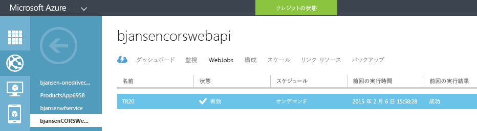
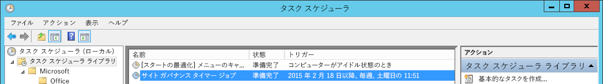
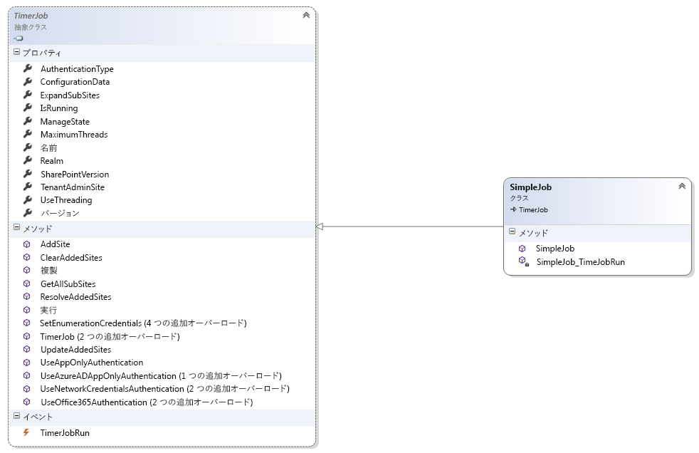
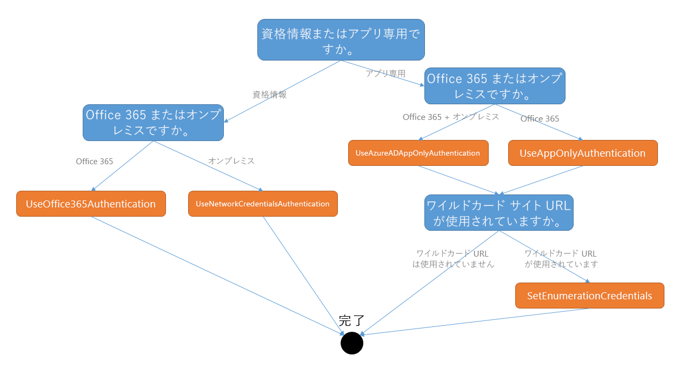
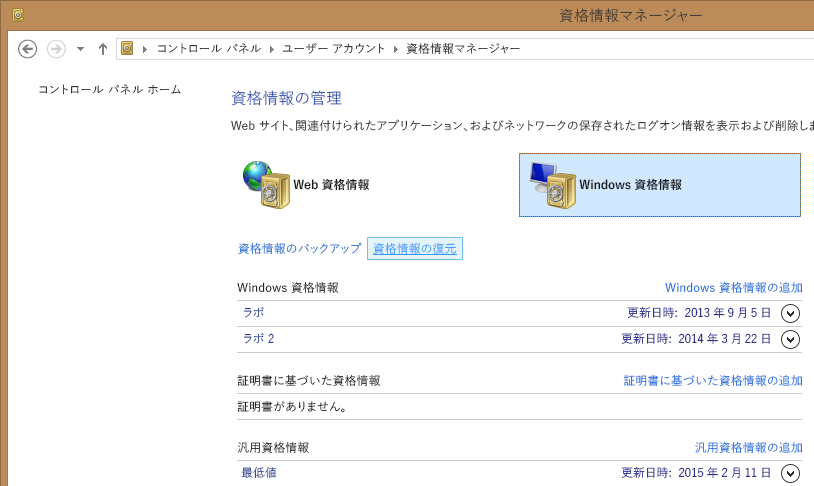
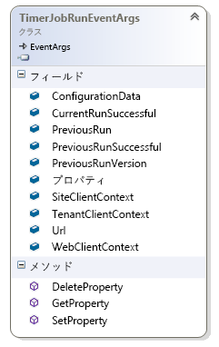

# タイマー ジョブ フレームワーク #

PnP タイマー ジョブ フレームワークは、SharePoint サイトに対して動作するバック グラウンド プロセスの作成を容易にするために設計されたクラスのセットです。タイマー ジョブ フレームワークは、オンプレミスの完全信頼コード タイマー ジョブと似ています (`SPJobDefinition`)。タイマー ジョブ フレームワークと完全信頼コード タイマー ジョブの主な相違点は、タイマー ジョブ フレームワークはクライアント側 API のみを使用するため、SharePoint の外部で実行できる (および必要がある) ことです。タイマー ジョブ フレームワークを使用することで、SharePoint Online に対して動作するタイマー ジョブの作成が可能になります。

タイマー ジョブを作成したら、スケジュールを設定して実行する必要があります。2 つの最も一般的なオプションは、次のとおりです。

- ホスティング プラットフォームが **Microsoft Azure** の場合、タイマー ジョブを **Azure WebJobs** として展開および実行できます。
- ホスティング プラットフォームが **Windows Server** の場合 (例: オンプレミスの SharePoint の場合)、タイマー ジョブは **Windows スケジューラー**として展開および実行できます。

タイマー ジョブの概要のビデオについては、[この PnP のビデオ](http://channel9.msdn.com/blogs/OfficeDevPnP/Introduction-to-the-PnP-timer-job-framework)がタイマー ジョブ フレームワークを紹介し、タイマー ジョブの簡単な例を示します。

## タイマー ジョブの簡単な例 ##
この章では、非常に単純なタイマー ジョブを作成する方法を示します。 このサンプルの目標は、読者に簡易ビューを提供することです。タイマー ジョブ フレームワークの詳細な説明は後ほど提供します。 

**注:** 「Hello world」サンプルから実際のコンテンツ有効期限ジョブまで、10 の個別タイマー ジョブを使用した、より広範な PnP ソリューションについては、https://github.com/OfficeDev/PnP/tree/dev/Solutions/Core.TimerJobs.Samples を参照してください。

単純なタイマー ジョブを作成する方法を次に示します。

### 手順 1:コンソール プロジェクトを作成し、PnP コアを参照する ###
この最初の手順では、「コンソール」型の新しいプロジェクトを作成し、次のいずれかの方法で PnP のコア ライブラリを参照します。

- Office 365 Developer パターンおよびプラクティスのコア Nuget パッケージをプロジェクトに追加します。[v15 (オンプレミス) および for v16 (Office 365) 用 Nuget パッケージ](https://www.nuget.org/packages?q=pnp)があります。これは優先オプションです。
- 既存の PnP コア ソース プロジェクトを自分のプロジェクトに追加します。これにより、デバッグ時に PnP コア  コードを実行できるようになります。**注:** ユーザーは、常にこのコードを PnP に追加された最新の変更内容に更新する必要があります。

### 手順 2:タイマー ジョブ クラスを作成し、タイマー ジョブのロジックを追加する ###
1. タイマー ジョブの名前付きクラスを追加します`SimpleJob`。
2. クラスに、`TimerJob`抽象基本クラスを継承させます。
3. コンストラクターで、タイマー ジョブに名前を付け (`base("SimpleJob")`) 、`TimerJobRun` イベント ハンドラーに接続します。
4. タイマー ジョブのロジックを`TimerJobRun` イベント ハンドラーに追加します。

結果は、次のようになります。
```C#
using System;
using System.Collections.Generic;
using System.Linq;
using System.Text;
using System.Threading.Tasks;
using Microsoft.SharePoint.Client;
using OfficeDevPnP.Core.Framework.TimerJobs;

namespace Core.TimerJobs.Samples.SimpleJob
{
    public class SimpleJob: TimerJob
    {
        public SimpleJob() : base("SimpleJob")
        {
            TimerJobRun += SimpleJob_TimerJobRun;
        }

        void SimpleJob_TimerJobRun(object sender, TimerJobRunEventArgs e)
        {
            e.WebClientContext.Load(e.WebClientContext.Web, p => p.Title);
            e.WebClientContext.ExecuteQueryRetry();
            Console.WriteLine("Site {0} has title {1}", e.Url, e.WebClientContext.Web.Title);
        }
    }
}
```

### 手順 3:タイマー ジョブを使用するように Program.cs を更新する ###
前の手順で作成されたタイマー ジョブは、まだ実行する必要があります。これを行うには、次の手順で`Program.cs`更新します。

1. タイマー ジョブ クラスをインスタンス化します。
2. タイマー ジョブの認証の詳細を提供します。次の例では、SharePoint Online への認証にユーザー名とパスワードを使用します。
3. タイマー ジョブ プログラムがアクセスする 1 つ以上のサイトを追加します。この例では、URL にワイルドカード文字を使用します。タイマー ジョブは、このワイルド  カード URL に一致するすべてのサイトで実行されます。
4. `Run` メソッドを呼び出すことにより、タイマー ジョブを開始します。

```C#
static void Main(string[] args)
{
    // Instantiate the Timer Job class
    SimpleJob simpleJob = new SimpleJob();
    
    // The provided credentials need access to the site collections you want to use
    simpleJob.UseOffice365Authentication("user@tenant.onmicrosoft.com", "pwd");

    // Add one or more sites to operate on
    simpleJob.AddSite("https://<tenant>.sharepoint.com/sites/d*");
    
    // Run the job
    simpleJob.Run();
}
```

## タイマー ジョブの展開オプション ##
前の手順は、シンプルなタイマー ジョブについて説明しています。次の手順では、タイマー ジョブを展開します。

タイマー ジョブは、ホスティング プラットフォーム上でスケジュールを設定する必要がある .exe ファイルです。選択したホスティング プラットフォームに応じて、展開は異なります。次のセクションでは、2 つの最も一般的なホスティング プラットフォーム オプションについて説明します。
- Microsoft Azure をホスティング プラットフォームに使用する
- Windows Server をホスティング プラットフォームに使用する

### Azure WebJobs を使用して Microsoft Azure にタイマー ジョブを展開する ###
タイマー ジョブを展開する前に、ユーザーの介入なしには、ジョブを実行できることを確認します。この記事のサンプルでは、ユーザーにパスワードまたは ClientSecret の入力を求めるメッセージが表示されます (詳細は「**認証**」を参照してください)。これはテストでは機能しますが、展開時に機能しません。すべての既存のサンプルでは、ユーザーに対し、`app.config` ファイルを使用したパスワードや ClientSecret の提供を許可しています。

```XML
  <appSettings>
    <add key="user" value="user@tenant.onmicrosoft.com"/>
    <add key="password" value="your password goes here!"/>
    <add key="domain" value="Contoso"/>
    <add key="clientid" value="a4cdf20c-3385-4664-8302-5eab57ee6f14"/>
    <add key="clientsecret" value="your clientsecret goes here!"/>
  </appSettings>
```

`app.config` ファイルにこれらの変更を追加した後、Visual Studio からタイマー ジョブを実行し、ユーザーの介入なしで実行されることを確認します。 

Azure への実際の展開は、Azure Web ジョブに基づいています。このタイマー ジョブの例を展開するには、以下の手順を実行します。

1. Visual Studio でプロジェクトを右クリックし、**[Azure WebJob として発行]** を選択します。
2. タイマー ジョブのスケジュールを提供し、**[OK]** をクリックします
3. 発行先として **[Microsoft Azure Websites]** を選択します。Azure にログインし、タイマー ジョブをホストする Azure Web サイトを選択するように求められます (必要に応じて新しく作成する場合もあります)。
4. **[発行]** をクリックし、WebJob を Azure にプッシュする
5. タイマー ジョブが発行された後は、Visual Studio または [Azure 管理ポータル](https://manage.windowsazure.com)ジョブをトリガーし、ジョブの実行を確認できます。



また、新しい [Azure ポータル](https://portal.azure.com)からジョブを選択し、**[実行]** をクリックしてタイマー ジョブを実行することもできます。新しいポータルから WebJobs を使用する方法の詳細については、「[WebJobs を使用してバック グラウンド タスクを実行する](https://azure.microsoft.com/en-us/documentation/articles/web-sites-create-web-jobs/)」の記事を参照してください。


**注:** Azure、WebJob の展開に関する詳細なガイダンスについては、「[Office 365 サイトで Azure  WebJobs をお使いになる前に(「タイマー ジョブ」)](https://github.com/OfficeDev/PnP-Guidance/blob/master/articles/Getting-Started-with-building-Azure-WebJobs-for-your-Office365-sites.md)」を参照してください。 

### Windows Scheduler を使用して Windows Server にタイマー ジョブを展開する ###
Windows Server に展開する場合、ユーザーの介入なしにタイマー ジョブを実行する必要があります。「**Azure WebJobs を使用して Microsoft Azure にタイマー ジョブを展開する**」に記載されているように、`app.config`ファイルを変更します。 

ジョブのリリース バージョンを、実行するサーバーにコピーします。**重要事項:**サーバー上に追加のファイルまたはプログラムをインストールしなくてもジョブを実行できるよう、関連するすべてのアセンブリ、.exe ファイルおよび .config ファイルをコピーします。 

タイマー ジョブの実行をスケジュールします。[Windows タスク スケジューラー](https://technet.microsoft.com/en-us/library/cc721871.aspx)内で組み込みを使用することを推奨します。Windows タスク スケジューラーを使用するには、以下の手順を実行します。

1. タスク スケジューラーを開きます([コントロール パネル] > [タスク スケジューラー])。
2. **[タスクの作成]** をクリックし、タスクを実行する名前とアカウントを指定します。
3. **[トリガー]** をクリックし、新しいトリガーを追加します。タイマー ジョブのスケジュールを指定します。
4. **[アクション]** をクリックし、「プログラムを開始する」アクション、タイマー ジョブの .exe ファイルの順に選択し、フォルダーで開始を設定します。
5. **[OK]** をクリックしてタスクを保存します。



## タイマー ジョブ フレームワークの詳細 ##
このセクションでは、タイマー ジョブ フレームワークの機能とそのしくみについて詳しく説明します。

### 構造体 ###
`TimerJob` クラスは、次のパブリック プロパティ、メソッド、およびイベントが含まれている抽象基本クラスです。



大部分のプロパティとメソッドについては、今後のセクションで詳しく説明します。ここでは、それ以外のプロパティとメソッドについて説明します。

- **IsRunning** プロパティ:タイマー ジョブが実行中かどうかを示す値を取得します。実行中の場合の値は **true**、実行中でない場合は **false** になります。
- **Name** プロパティ:タイマー ジョブの名前を取得します。名前は、タイマー ジョブのコンストラクターで最初に設定されます。
- **SharePointVersion** プロパティ:SharePoint のバージョンを取得または設定します。このプロパティは、読み込まれている Microsoft.SharePoint.Client.dll のバージョンに基づいて自動的に設定されます。通常は変更しないでください。ただし、v16 CSOM ライブラリを v15 (オンプレミス) 展開で使用する場合などはこのプロパティを変更できます。
- **Version** プロパティ:このタイマー ジョブのバージョンを取得します。バージョンは最初、タイマー ジョブのコンストラクターで設定されるか、コンストラクターで設定されない場合は既定値の 1.0 に設定されます。

タイマー ジョブの実行を準備するは、最初に**構成する**があります。

1. **認証**設定を提供します。
2. **範囲** (サイトのリスト) を提供します。
3. オプションとして、**タイマー ジョブ**のプロパティを設定します。

タイマー ジョブの実行が開始されると、実行の観点から次の全体的な手順が実行されます。

1. **サイトを解決する**:ワイルド カードのサイト URL (たとえば、https://tenant.sharepoint.com/sites/d*) は、既存サイトの実際のリストに解決されます。サブ サイトの展開が要求されると、解決済みのサイト リストがすべてのサブ サイトを使用して展開されます。
2. 現在のスレッド設定に基づいて**作業バッチを作成** し、バッチごとに 1 つのスレッドを作成します。
3. **スレッドは作業バッチを実行**し、リスト内の各サイトに対して`TimerJobRun`イベントを呼び出します。

各手順の詳細については、以下をご覧ください。

### 認証 ###
タイマー ジョブを使用する前に、タイマー ジョブは SharePoint への認証方法を把握する必要があります。フレームワークが現在サポートしているのは、**AuthenticationType** 列挙型、**Office365**、**NetworkCredentials** および **AppOnly** を使用した方法です。また、以下の図の方法を使用した場合でも、**AuthenticationType** プロパティは **Office365**、**NetworkCredentials** および **AppOnly** の適切な値に自動的に設定されます。以下のフローチャートでは、実行する手順を示します。それぞれの方法の詳細な説明は下にあります。



#### ユーザー資格情報 ####
**Office 365** の実行中のユーザーの資格情報を指定するには、次の 2 つのメソッドを使用できます。
```C#
public void UseOffice365Authentication(string userUPN, string password)
public void UseOffice365Authentication(string credentialName)
```

最初のメソッドでは、単にユーザー名とパスワードを受け入れます。2 番目のメソッドでは、Windows 資格情報マネージャーに保存されている汎用の資格情報を指定できます。下のスクリーン ショットは、`bertonline`汎用の資格情報を示しています。これを使用してタイマー ジョブを認証するため、2 つ目のメソッドのパラメーターとして「最低値」を提供します。



**オンプレミスの SharePoint** で実行する場合と同様のメソッドがあります:
```C#
public void UseNetworkCredentialsAuthentication(string samAccountName, string password, string domain)
public void UseNetworkCredentialsAuthentication(string credentialName)
```

#### App Only ####
App only はテナントを範囲とするアクセス許可を供与できるため、**優先されるメソッド**です。ユーザーの資格情報では、ユーザー アカウントに必要なアクセス許可が供与されている必要があります。 

**注:** 特定のサイト解決ロジックは、App Only 認証では機能しません。詳細は、次のセクションで説明します。 

App Only 認証のジョブを構成するには、次のいずれかのメソッドを使用します。
```C#
public void UseAppOnlyAuthentication(string clientId, string clientSecret)
public void UseAzureADAppOnlyAuthentication(string clientId, string clientSecret)
```

Office 365 またはオンプレミスの SharePoint のいずれかで同じメソッドを使用し、App Only 認証を使用したタイマー ジョブを環境間で容易に移動させることができます。

**注:** App Only を使用する場合、**AuthenticationType.AppOnly** で機能しない API を使用すると、タイマー ジョブ ロジックは失敗します。一般的な例として、検索 API、分類ストアへの書き込み、およびユーザー プロファイル API を使用があります。

### 実行するサイト ###
タイマー ジョブを 1 つ以上のサイトで実行する必要がある場合。タイマー ジョブにサイトを追加するには、以下のメソッドのセットを使用します。

```C#
public void AddSite(string site)
public void ClearAddedSites()
```

サイトを追加するには、完全修飾 URL (例: https://tenant.sharepoint.com/sites/dev) またはワイルドカード URL のいずれかを指定します。ワイルド カードの URL は、末尾に * が付く URL です (* は 1 つのみを使用でき、URL の最後の文字にする必要があります)。サンプル ワイルド カードの URL は https://tenant.sharepoint.com/sites/*  となり、そのサイトの管理パスの下の**すべて**のサイト コレクションを返します。別の例では、https://tenant.sharepoint.com/sites/dev*  は URL に「dev」が含まれるすべてのサイト コレクションを返します。

通常、サイトは、タイマー ジョブ オブジェクトをインスタンス化するプロジェクトによって追加されますが、必要に応じて、タイマー ジョブが渡されたサイトのリストを制御することもできます。次の例に示すように、`UpdateAddedSites` 仮想メソッドのメソッド上書きを追加してこれを実行します。

```C#
public override List<string> UpdateAddedSites(List<string> addedSites)
{
    // Let's assume we're not happy with the provided list of sites, so first clear it
    addedSites.Clear();

    // Manually adding a new wildcard Url, without an added URL the Timer Job will do...nothing
    addedSites.Add("https://bertonline.sharepoint.com/sites/d*");

    // Return the updated list of sites
    return addedSites;
}
```

ワイルド カードの URL を追加して認証を App Only に設定した後、列挙型の資格情報を指定します。列挙型の資格情報は、実際のサイトのリストを返すためのサイト照合アルゴリズムで使用されるサイト コレクションのリストを取得するために使用されます。サイト コレクションのリストを取得するため、タイマー フレームワークの動作 Office 365 (v16) とオンプレミス (v15) で異なります。
- Office 365:`Tenant.GetSiteProperties` メソッドは「標準」のサイト コレクションの読み取り、検索 API は OneDrive for Business サイト コレクションの読み取りに使用します。
- オンプレミス:すべてのサイト コレクションを読み取るために検索 API が使用されます。

検索 API がユーザー コンテキストで機能しない場合、タイマー ジョブは指定した列挙型資格情報をフォールバックします。 

**Office 365** の実行中のユーザーの資格情報を指定するには、次の 2 つのメソッドを使用できます。
```C#
public void SetEnumerationCredentials(string userUPN, string password)
public void SetEnumerationCredentials(string credentialName)
```

**オンプレミスの SharePoint** で実行する場合と同様のメソッドがあります:
```C#
public void SetEnumerationCredentials(string samAccountName, string password, string domain)
public void SetEnumerationCredentials(string credentialName)
```

最初のメソッドでは、単にユーザー名とパスワード、およびオプションでドメイン (オンプレミスの場合) を受け入れます。2 つめのメソッドは、Windows 資格情報マネージャーに保存されている汎用の資格情報を指定します。資格情報マネージャーの詳細については、「**認証**の章を参照してください。

#### サブ サイトの展開 ####
多くの場合、サイト コレクションのルート サイト、およびサイト コレクションのすべてのサブ サイトに対してタイマー ジョブ コードを実行する必要があります。これを行うには、**ExpandSubSites** プロパティを **true **に設定します。これにより、サイト解決手順の一部として、タイマー ジョブがサブ サイトに展開されます。

#### 解決されたサイトおよび展開されたサイトを上書きする ####
タイマー フレームワークでワイルド カードのサイトを解決し、オプションとしてサブ サイトを展開すると、次にサイトのリストを処理します。サイトのリストを処理する前に、サイトのリストの変更が必要となる場合があります。たとえば、特定のサイトを削除したり、リストにサイトを追加する場合があります。この手順は、`ResolveAddedSites` 仮想メソッドを上書きすることで実現できます。以下のサンプルは、`ResolveAddedSites` メソッドを上書きし、リストから 1 つのサイトを削除する方法を示しています。 

```C#
public override List<string> ResolveAddedSites(List<string> addedSites)
{
    // Use default TimerJob base class site resolving
    addedSites = base.ResolveAddedSites(addedSites);

    //Delete the first one from the list...simple change. A real life case could be reading the site scope 
    //from a SQL (Azure) DB to prevent the whole site resolving. 
    addedSites.RemoveAt(0);

    // return the updated list of resolved sites...this list will be processed by the Timer Job
    return addedSites;
}
```

### TimerJobRun イベント ###
タイマー ジョブ フレームワークでは、サイトのリストを作業バッチに分割します。サイトの各バッチは、独自のスレッドで実行されます。既定では、フレームワークによって 5 つのバッチと、それらの 5 つのバッチを実行する 5 つのスレッドが作成されます。タイマー ジョブのスレッド オプションの詳細については、「**スレッド **」セクションを参照してください。スレッドがバッチを処理する場合、`TimerJobRun` イベントは、タイマー フレームワークによってトリガーされ、タイマー ジョブを実行するために必要なすべての情報を提供します。タイマー ジョブはイベントとして実行されるため、コードを `TimerJobRun` イベントへのイベント ハンドラーに接続する必要があります。

```C#
public SimpleJob() : base("SimpleJob")
{
    TimerJobRun += SimpleJob_TimerJobRun;
}

void SimpleJob_TimerJobRun(object sender, TimerJobRunEventArgs e)
{
    // your Timer Job logic goes here
}
```

もう 1 つの方法では、次のようにインライン委任を使用します。

```C#
public SimpleJob() : base("SimpleJob")
{
    // Inline delegate
    TimerJobRun += delegate(object sender, TimerJobRunEventArgs e)
    {
        // your Timer Job logic goes here
    };
}
```

`TimerJobRun` イベントが発生すると、タイマー ジョブ ロジックを記述するために必要な情報を提供する `TimerJobRunEventArgs` オブジェクトを受け取ります。このクラスでは、次の属性とメソッドを使用できます。



いくつかのプロパティとすべてのメソッドは、次のセクションで説明するオプションの状態管理機能で使用されます。ただし、次のプロパティは、使用される構成に関係なく、すべてのイベントで常に使用できます。
- **Url** プロパティ:動作対象のタイマー ジョブのサイトの URL を取得または設定します。サイト コレクションのルート サイトを指定できますが、サイトの展開が行われた場合、サブ サイトにすることもできます。
- **ConfigurationData** プロパティ:追加のタイマー ジョブ構成データ (オプション) を取得または設定します。この構成データは、`TimerJobRunEventArgs` オブジェクトの一部としてと共に渡されます。
- **WebClientContext** プロパティ:現在の URL の `ClientContext` オブジェクトを取得または設定します。このプロパティは、*Url* プロパティで定義されるサイトの `ClientContext` オブジェクトです。これは通常、タイマー ジョブのコードで使用する`ClientContext`オブジェクトです。
- **SiteClientContext** プロパティ:サイト コレクションのルート サイトの `ClientContext` のオブジェクトを取得または設定します。このプロパティは、タイマー ジョブがアクセスするために必要な、ルート サイトへのアクセス権を提供します。たとえば、タイマー ジョブは、*SiteClientContext* プロパティを使用してページ レイアウトをマスター ページ ギャラリーに追加できます。
- **TenantClientContext** プロパティ:テナントの API で動作する `ClientContext` オブジェクトを取得または設定します。このプロパティは、テナント管理サイトの URL を使用して構築された `ClientContext`、オブジェクトを提供します。タイマー ジョブの `Tenant` イベント ハンドラーで `TimerJobRun` API を使用するには、この TenantClientContext プロパティを使用して新しい `Tenant` オブジェクトを作成します。

すべての `ClientContext`オブジェクトは、「**認証**セクションに記載されている認証情報を使用します。ユーザーの資格情報を使用することを選択した場合、ユーザー アカウントが、指定したサイトの操作に必要なアクセス許可を持っていることを確認してください。App Only を使用している場合は、テナントを範囲としたアクセス許可を App Only プリンシパルに設定することのが最適です。

### 状態管理 ###
タイマー ジョブのロジックを作成するとき、通常は、状態を永続化する必要があります。たとえば、サイトが最後に処理された時期を記録する、または、タイマー ジョブのビジネス ロジックをサポートするためにデータを保存するためなど。この理由から、タイマー ジョブ フレームワークには状態管理機能が搭載されています。状態管理では、標準およびカスタムのプロパティ セットを、処理されたサイトの Web プロパティ バッグの JSON シリアル化された文字列 (名前 = タイマー ジョブの名前 + 「_Properties」) として保存および取得します。以下は、`TimerJobRunEventArgs`オブジェクトの既定のプロパティです。
- **PreviousRun** プロパティ:前回の実行の日付と時刻を取得または設定します。
- **PreviousRunSuccessful** プロパティ:以前の実行が正常に完了したかどうかを示す値を取得または設定します。タイマー ジョブの作成者は、タイマー ジョブの実装の一部として **CurrentRunSuccessful** プロパティを設定し、正常に実行されるジョブにフラグを付けます。
- **PreviousRunVersion** プロパティ:以前の実行のタイマー ジョブ バージョンを取得または設定します。

これらの標準プロパティの横で、キーワードと値のペアを `Properties`オブジェクトの `TimerJobRunEventArgs` コレクションに追加し、独自のプロパティを指定することもできます。これを容易にするには、3 つの方法があります。
- **SetProperty** はプロパティを追加または更新します。
- **GetProperty** はプロパティの値を返します。
- **DeleteProperty** は、プロパティ コレクションからプロパティを削除します。

次のコードは、状態管理の使用方法を示します。

```C#
void SiteGovernanceJob_TimerJobRun(object o, TimerJobRunEventArgs e)
{
    try
    {
        string library = "";

        // Get the number of admins
        var admins = e.WebClientContext.Web.GetAdministrators();

        Log.Info("SiteGovernanceJob", "ThreadID = {2} | Site {0} has {1} administrators.", e.Url, admins.Count, Thread.CurrentThread.ManagedThreadId);

        // grab reference to list
        library = "SiteAssets";
        List list = e.WebClientContext.Web.GetListByUrl(library);

        if (!e.GetProperty("ScriptFileVersion").Equals("1.0", StringComparison.InvariantCultureIgnoreCase))
        {
            if (list == null)
            {
                // grab reference to list
                library = "Style%20Library";
                list = e.WebClientContext.Web.GetListByUrl(library);
            }

            if (list != null)
            {
                // upload js file to list
                list.RootFolder.UploadFile("sitegovernance.js", "sitegovernance.js", true);

                e.SetProperty("ScriptFileVersion", "1.0");
            }
        }

        if (admins.Count < 2)
        {
            // Oops, we need at least 2 site collection administrators
            e.WebClientContext.Site.AddJsLink(SiteGovernanceJobKey, BuildJavaScriptUrl(e.Url, library));
            Console.WriteLine("Site {0} marked as incompliant!", e.Url);
            e.SetProperty("SiteCompliant", "false");
        }
        else
        {
            // We're all good...let's remove the notification
            e.WebClientContext.Site.DeleteJsLink(SiteGovernanceJobKey);
            Console.WriteLine("Site {0} is compliant", e.Url);
            e.SetProperty("SiteCompliant", "true");
        }

        e.CurrentRunSuccessful = true;
        e.DeleteProperty("LastError");
    }
    catch(Exception ex)
    {
        e.CurrentRunSuccessful = false;
        e.SetProperty("LastError", ex.Message);
    }
}
```

状態は、1 つの JSON シリアル化プロパティに保存され、他のカスタマイズにも使用できます。たとえば、タイマー ジョブが状態エントリ「SiteCompliant = false」を作成した場合、タイマー ジョブはそのサイトが、準拠していないと判断したため、JavaScript ルーチンでユーザーの入力を求める可能性があります 

### Threading ###
既定のタイマー ジョブ フレームワークは、スレッドを使用して作業を並列化します。スレッドは、サブ サイトの拡張用 (要求された場合) と、各サイトに対して実際のタイマー ジョブのロジック (`TimerJobRun` イベント) サイト用の両方に使用されます。スレッドの実装を制御するには、次のプロパティを使用できます。
- **UseThreading** プロパティ:スレッドを使用するかどうかを示す値を取得または設定します。既定は **true** です。メイン アプリケーションを使用してすべてのアクションを実行するには、**false** に設定します。
- **MaximumThreads** プロパティ:このタイマー ジョブに使用するスレッドの数を取得または設定します。有効な値は 2 から 100 です。既定は 5 です。多数のスレッドが、必ずしも少ないスレッドより高速になるとは限りません。最適な数は、さまざまなスレッド数を使用してテストで取得する必要があります。既定の 5 スレッドは、ほとんどのシナリオでパフォーマンスを大幅に向上することがわかっています。 

#### 調整 ####
タイマー ジョブをスレッドを使用し、タイマー ジョブの操作は通常、リソースを集中的に使用する操作のため、タイマー ジョブの実行を制限することができます。タイマー ジョブ フレームワークおよび PnP コア全体の制限を正しく処理するためには、既定の `ExecuteQueryRetry` メソッドではなく、`ExecuteQuery` メソッドを使用します。

**注:** タイマー ジョブの実装コードで `ExecuteQueryRetry` を使用することが重要です。

#### 同時実行の問題 - 同じスレッド内のサイト コレクションのすべてのサブサイトを処理する ####

複数のスレッドを使用してサブ サイトを処理するときは、タイマー ジョブで同時実行の問題が発生する場合があります。次の例を使用します。スレッド A はサイト コレクション 1 の最初のサブ セットを処理し、スレッド B はサイト コレクション 1 の残りのサブ サイトを処理します。タイマー ジョブがサブ サイトとルート サイトの処理する場合 (`SiteClientContext` オブジェクトを使用して)、スレッド A とスレッド B の両方がルート サイトを処理するため、同時実行の問題が発生する可能性があります。同時実行の問題を回避するため (1 つのスレッド内でタイマー ジョブを実行せずに)、タイマー ジョブ内で `GetAllSubSites` メソッドを使用します。

次のコードは、タイマー ジョブ内で `GetAllSubSites` メソッドを使用する方法を示します。

```C#
public class SiteCollectionScopedJob: TimerJob
{
    public SiteCollectionScopedJob() : base("SiteCollectionScopedJob")
    {
        // ExpandSites *must* be false as we'll deal with that at TimerJobEvent level
        ExpandSubSites = false;
        TimerJobRun += SiteCollectionScopedJob_TimerJobRun;
    }

    void SiteCollectionScopedJob_TimerJobRun(object sender, TimerJobRunEventArgs e)
    {
        // Get all the sub sites in the site we're processing
        IEnumerable<string> expandedSites = GetAllSubSites(e.SiteClientContext.Site);

        // Manually iterate over the content
        foreach (string site in expandedSites)
        {
            // Clone the existing ClientContext for the sub web
            using (ClientContext ccWeb = e.SiteClientContext.Clone(site))
            {
                // Here's the Timer Job logic, but now a single site collection is handled in a single thread which 
                // allows for further optimization or prevents race conditions
                ccWeb.Load(ccWeb.Web, s => s.Title);
                ccWeb.ExecuteQueryRetry();
                Console.WriteLine("Here: {0} - {1}", site, ccWeb.Web.Title);
            }
        }
    }
}
```

### ログ収集 ###
タイマー ジョブのフレームワークは、PnP コア ライブラリの一部として PnP のコア ログ収集コンポーネントを使用します。組み込みの PnP コア ログ収集をアクティブ化するには、適切な構成ファイル (app.config または web.config) を使用して構成します。次の例は、必要な構文を示しています。

```XML
  <system.diagnostics>
    <trace autoflush="true" indentsize="4">
      <listeners>
        <add name="DebugListenter" type="System.Diagnostics.TextWriterTraceListener" initializeData="trace.log" />
        <!--<add name="consoleListener" type="System.Diagnostics.ConsoleTraceListener" />-->
      </listeners>
    </trace>
  </system.diagnostics>
```

上記の構成ファイルを使用すると、タイマー ジョブ フレームワークは `System.Diagnostics.TextWriterTraceListener` を使用して、タイマー ジョブの .exe と同じフォルダー内に trace.log というファイルを書き込みます。利用可能なその他のトレース リスナーには、次のようなものがあります。
- **ConsoleTraceListener** はログをコンソールに出力します。
- 「[クラウド診断 - Windows Azure でのログ収集とトレースを制御する](https://msdn.microsoft.com/en-us/magazine/ff714589.aspx)」に記載されているメソッド。このメソッドは、Microsoft.WindowsAzure.Diagnostics.**DiagnosticMonitorTraceListener** を使用します。その他の Azure の技術資料は、こちらにあります。
    - [Azure Web サイトの診断ログを有効にする](http://azure.microsoft.com/en-us/documentation/articles/web-sites-enable-diagnostic-log/)
    - [Visual Studio での Azure Web サイトのトラブルシューティング](http://azure.microsoft.com/en-us/documentation/articles/web-sites-dotnet-troubleshoot-visual-studio/)

タイマー ジョブ フレームワークと同じログ収集方法を、カスタムのタイマー ジョブ コードに使用することを強くお勧めします。タイマー ジョブ コード内で、PnP コア `Log` クラスを使用できます。

```C#
void SiteGovernanceJob_TimerJobRun(object o, TimerJobRunEventArgs e)
{
    try
    {
        string library = "";

        // Get the number of admins
        var admins = e.WebClientContext.Web.GetAdministrators();

        Log.Info("SiteGovernanceJob", "ThreadID = {2} | Site {0} has {1} administrators.", e.Url, admins.Count, Thread.CurrentThread.ManagedThreadId);

        // Additional Timer Job logic...

        e.CurrentRunSuccessful = true;
        e.DeleteProperty("LastError");
    }
    catch(Exception ex)
    {
        Log.Error("SiteGovernanceJob", "Error while processing site {0}. Error = {1}", e.Url, ex.Message);
        e.CurrentRunSuccessful = false;
        e.SetProperty("LastError", ex.Message);
    }
}
```
