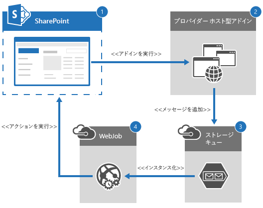

# SharePoint アドインで非同期操作を使用する

Microsoft Azure WebJobs を使用して SharePoint アドインに非同期操作を実装します。

_**適用対象:** SharePoint 2013 | SharePoint Add-ins? | SharePoint Online_

[Core.QueueWebJobUsage](https://github.com/OfficeDev/PnP/tree/dev/Samples/Core.QueueWebJobUsage) サンプルは、プロバイダー ホスト型アドインとaddins と Azure WebJobs を使用して、Office 365 で非同期操作を作成して実行する方法を示しています。

このソリューションを使用して、以下を行うことができます。

- リモート イベント レシーバーのパフォーマンスを改善します。
    
- SharePoint Online に移行して、オンプレミスの SharePoint 環境にあったものと同じタイマー ジョブ機能を実装します。 
    
- SharePoint 環境に対して実行する、長時間実行される処理を実装します。以下に例を示します。
    
    -  30 秒のタイムアウト間隔よりも長く実行する **AppInstalled** イベント。アドイン イベント ハンドラーには、非同期処理があります。詳細については、「[SharePoint アドインのイベントの処理](http://msdn.microsoft.com/library/c050d056-8548-4496-a053-016779d723d9%28Office.15%29.aspx)」および「[SharePoint アドインでアドイン イベント レシーバーを作成する](http://msdn.microsoft.com/library/f40c910f-12a2-4caa-8e91-c7a61ae540db%28Office.15%29.aspx)」を参照してください。
    
    - カスタム サイト コレクションのプロビジョニング。
    
    - Office 365 とオンプレミスのシステムの間のデータを同期する操作。
    
    - 複雑な計算を実行する操作。
    
次の図は、非同期操作が実行されるときに必要なコンポーネントと、それらのコンポーネント間の処理フローのアーキテクチャの概要を示しています。



Azure WebJobs を使用して、プロバイダー ホスト型アドインに非同期操作を実装するには、次のようにします。

1. SharePoint Online に展開されたアドインをユーザーが実行します。
    
2. プロバイダー ホスト型アドインは、Azure WebJob に必要な入力パラメーターを提供してから、新しいメッセージを Azure ストレージ キューに追加します。
    
3. Azure ストレージ キューは、継続して実行している Azure WebJob 内でイベントをトリガーして、新しいメッセージの処理を開始します。
    
4. Azure WebJob は、SharePoint Online サイトに対してカスタム ビジネス ロジックを実行します。 
    
**メモ:** Azure ストレージ キューへのメッセージの追加を実行するときには、Azure WebJob を実行するプロセスとは異なるプロセスが使用されます。そのため、アドインは 1 つのプロセスを使用して新しいメッセージをキューに追加してから Azure WebJob を使用してそれらのメッセージを別のプロセスで処理することにより、非同期操作を実装できます。 

## 始める前に

最初に、[Core.QueueWebJobUsage](https://github.com/OfficeDev/PnP/tree/dev/Samples/Core.QueueWebJobUsage) サンプル アドインを GitHub の [Office 365 Developer Patterns and Practices](https://github.com/OfficeDev/PnP/tree/dev) プロジェクトからダウンロードして、Azure アカウントを作成し、そのアカウントに詳細を追加して、Azure WebJob が実行していることを検証します。

Azure ストレージ アカウントを作成して Azure ストレージ キューにアクセスするには、次のようにします。

1. Microsoft の [Azure 管理ポータル](https://manage.windowsazure.com)にサインインします。
    
2. **[新規]**  >  **[データ サービス]**  >  **[ストレージ]**  >  **[簡易作成]** を選択します。
    
3. **[URL]** にドメイン名を入力します。たとえば、「**contoso**」と入力します。 
    
4. **[場所/アフィニティ グループ]** で、適切な場所を選択します。
    
5. **[レプリケーション]** で、**[地理冗長]** を選択します。 
    
6. **[ストレージ アカウントの作成]** を選択します。
    
新しく作成したストレージ アカウントに詳細を追加するには、次のようにします。

1. Azure ストレージ アカウントが作成されたら、**[アクセス キーの管理]** を選択します。
    
2. **[アクセス キーの管理]** で、**[ストレージ アカウント名]** と **[プライマリ アクセス キー]** をコピーします。
    
3. クライアント ID、クライアント シークレット、および Azure ストレージ アカウント情報をいくつかの構成ファイルに適用します。 
    
4. Helper Project\Core.QueueWebJobUsage.Console.SendMessage で、Program.cs を開いてサイトの URL を **siteUrl** ボックスに入力します。
    
5. Core.QueueWebJobUsage.Job の **[プロパティ]** で、**Microsoft.SharePoint.Client** および **Microsoft.SharePoint.Client.Runtime** 参照の **[ローカルにコピーする]** を **[True]** に設定します。**[ローカルにコピーする]** を **[True]** に設定すると、参照アセンブリが Azure にコピーされて、Azure WebJob は参照をそれらのアセンブリに解決できるようになります。
    
6. Azure、WebJob を展開します。詳細については、「[Web ジョブ プロジェクトをデプロイする](https://azure.microsoft.com/documentation/articles/websites-dotnet-deploy-webjobs/#deploy)」を参照してください。 
    
Azure WebJobs が実行していることを確認するには、次のようにします。

1. [Azure 管理ポータル](https://manage.windowsazure.com)にサインインします。
    
2. **[Web アプリ]** を選択して、入力した Microsoft Azure Web サイトを選択します。 
    
3. **[Web ジョブ]** を選択します。
    
4. Azure WebJob がリストに含まれていること、および **[スケジュール]** が **[連続的に実行]** に設定されていることを確認します。
    
5. **[構成]** を選択します。
    
6. **[アドイン設定]** で、**ClientId** と **ClientSecret** の新しいアドイン設定を作成します。**[ClientId]** と **[ClientSecret]** のキー/値ペアを Core.QueueWebJobUsage.Job\app.config ファイルからコピーします。
    
7. **[接続文字列]** で、**AzureWebJobsDashboard** と **AzureWebJobsStorage** の接続文字列を新しく作成します。**AzureWebJobsDashboard** と **AzureWebJobsStorage** のキー (名前)/値のペアを Core.QueueWebJobUsage.Job\app.config ファイルからコピーして、タイプを **[ユーザー定義]** に設定します。
    
8. **[保存]** を選択します。

### 構成設定の適用

次の表の情報を使用して、構成設定を Core.QueueWebJobUsage Visual Studio ソリューションに適用します。

|**ファイルの場所**|**更新するキー**|**更新する値情報**|
|:-----|:-----|:-----|
|Helper Project\Core.QueueWebJobUsage.Console.SendMessage\app.config| **StorageConnectionString**| **[Your Account name]** を Azure 管理ポータルからコピーしたストレージ アカウント名に置き換えます。|
||| **[Your Account Key]** を Azure 管理ポータルからコピーしたプライマリ アクセス キーに置き換えます。|
|Core.QueueWebJobUsageWeb\web.config| **StorageConnectionString**| **[YourAccountName]** を Azure 管理ポータルからコピーしたストレージ アカウント名に置き換えます。|
||| **[YourAccountKey]** を Azure 管理ポータルからコピーしたプライマリ アクセス キーに置き換えます。|
|Core.QueueWebJobUsage.Job\app.config| **StorageConnectionString**| **[YourAccountName]** を Azure 管理ポータルからコピーしたストレージ アカウント名に置き換えます。|
||| **[YourAccountKey]** を Azure 管理ポータルからコピーしたプライマリ アクセス キーに置き換えます。|
|| **ClientId**| **[Your Add-in ID]** を Core.QueueWebJobUsageWeb\web.config からコピーしたクライアント ID に置き換えます。|
|| **ClientSecret**| **[Your Add-in Secret]** を Core.QueueWebJobUsageWeb\web.config からコピーしたクライアント シークレットに置き換えます。|
|| **AzureWebJobsDashboard**| **[YourAccount]** を Azure 管理ポータルからコピーしたストレージ アカウント名に置き換えます。|
||| **[YourKey]** を Azure 管理ポータルからコピーしたプライマリ アクセス キーに置き換えます。|
|| **AzureWebJobsStorage**| **[YourAccount]** を Azure 管理ポータルからコピーしたストレージ アカウント名に置き換えます。|
||| **[YourKey]** を Azure 管理ポータルからコピーしたプライマリ アクセス キーに置き換えます。|

**メモ:** たとえば、Core.QueueWebJobUsageWeb の **ClientId** と **ClientSecret** が更新された場合、AppManifest.xml でバージョン番号を増分させるときには、Core.QueueWebJobUsage.Job\app.config の **ClientId** と **ClientSecret** を更新してください。

## Core.QueueWebJobUsage アドインを使用する

次の表は、Core.QueueWebJobUsage ソリューション内のすべての Visual Studio プロジェクトについて説明しています。

|**Visual Studio プロジェクト**|**説明**|
|:-----|:-----|
|Core.QueueWebJobUsage|SharePoint アドイン プロジェクト。以下の許可が必要です。<ul xmlns:xlink="http://www.w3.org/1999/xlink" xmlns:mtps="http://msdn2.microsoft.com/mtps" xmlns:mshelp="http://msdn.microsoft.com/mshelp" xmlns:ddue="http://ddue.schemas.microsoft.com/authoring/2003/5" xmlns:msxsl="urn:schemas-microsoft-com:xslt"><li><p>AllowAppOnlyPolicy</p></li><li><p>Web での FullControl 許可。</p></li></ul>|
|Core.QueueWebJobUsage.Common|このソリューションのビジネス オブジェクトとビジネス ロジック コード &mdash; ストレージ キューにメッセージを追加するメソッドなど &mdash; を含みます。 このプロジェクトは、異なるプロジェクト間でビジネス オブジェクトとビジネス ロジックを共有するために含まれています。 実装によってはこれが必要ない場合もあります。|
|Core.QueueWebJobUsage.Job|新しいメッセージが Azure ストレージ キューに追加されるときに実行される Azure WebJob。このプロジェクトには、カスタム ビジネス ロジック コードが含まれています。 |
|Core.QueueWebJobUsageWeb|Core.QueueWebJobUsage プロジェクトの UI が含まれる、プロバイダー ホスト型アドイン。 |
|Helper Project\Core.QueueWebJobUsage.Console.SendMessage|ストレージ アカウント情報とキュー作成プロセスを検証するため、およびこの記事で説明されているソリューション全体をセットアップせずにメッセージをキューに送信して処理するために使用できるヘルパー プロジェクト。 |

Core.QueueWebJobUsage コード サンプルを実行すると、プロバイダー ホスト型アドインが表示されて、**[同期処理]** と **[非同期処理]** の 2 つのボタンが示されます。**[同期処理]** を選択すると、Pages\Default.aspx の **btnSync_Click** が実行時間の長い同期プロセスをシミュレートします。このコード サンプルで、**btnSync_Click** は現行スレッドを 10 秒間スリープ状態にしてから、ドキュメント ライブラリを作成します。**[非同期処理]** を選択すると、Pages\Default.aspx の **btnAsync_Click** が以下を実行します。

1. 現在のユーザーを取得します。
    
2. Azure ストレージ キューに送信されるメッセージに含めるためのデータを格納する **SiteModifyRequest** ビジネス オブジェクトを作成します。このコード サンプルの場合、送信されるデータには、現行ユーザーの名前と現行サイトの URL が含まれています。
    
3. **SiteManager().AddAsyncOperationRequestToQueue** を呼び出して、メッセージを Azure ストレージ キューに追加します。
    
**メモ:**  この記事で提供されるコードは、明示または黙示のいかなる種類の保証なしに現状のまま提供されるものであり、特定目的への適合性、商品性、権利侵害の不存在についての暗黙的な保証は一切ありません。

```C#
protected void btnAsync_Click(object sender, EventArgs e)
        {

            var spContext = SharePointContextProvider.Current.GetSharePointContext(Context);

            using (var clientContext = spContext.CreateUserClientContextForSPHost())
            {
                // Get the current user.
                var currUser = clientContext.Web.CurrentUser;
                clientContext.Load(currUser);
                clientContext.ExecuteQuery();

                // Create business object, and then add the request to the queue.
                SiteModifyRequest request = new SiteModifyRequest() { RequestorName = currUser.Title, SiteUrl = Page.Request["SPHostUrl"] };
                new SiteManager().AddAsyncOperationRequestToQueue(request,
                                                                  ConfigurationManager.AppSettings["StorageConnectionString"]);

                processViews.ActiveViewIndex = 1;
                lblStatus.Text = "Asynchronous operation to create document library started.";
            }
        }
```

SiteManager.cs の Core.QueueWebJobUsage.Common で、**AddAsyncOperationRequestToQueue** は以下を実行します。

1. Core.QueueWebJobUsageWeb\web.config ファイルの [AccountName](https://msdn.microsoft.com/library/azure/microsoft.windowsazure.storage.cloudstorageaccount.aspx) および **AccountKey** 構成情報を使用して、**CloudStorageAccount** オブジェクトを作成します。
    
2. [CloudStorageAccount.CreateCloudQueueClient](https://msdn.microsoft.com/library/azure/microsoft.windowsazure.storage.cloudstorageaccount.createcloudqueueclient.aspx) を使用して Azure ストレージ キュー クライアントを作成します。
    
3. [CloudQueueClient.GetQueueReference](https://msdn.microsoft.com/library/azure/microsoft.windowsazure.storage.queue.cloudqueueclient.getqueuereference.aspx) を使用して、名前が **SiteManager.StorageQueueName** 定数の値と等しい Azure ストレージ キューへの参照を取得します。
    
4. [CloudQueue.CreateIfNotExists](https://msdn.microsoft.com/library/azure/microsoft.windowsazure.storage.queue.cloudqueue.createifnotexists.aspx) を使用して、Azure ストレージ キューが存在しない場合にそれを作成します。
    
5. [CloudQueue.AddMessage](https://msdn.microsoft.com/library/azure/microsoft.windowsazure.storage.queue.cloudqueue.addmessage.aspx) を使用して、新しいメッセージを Azure ストレージ キューに追加します。**modifyRequest** ビジネス オブジェクトは [CloudQueueMessage](https://msdn.microsoft.com/library/azure/microsoft.windowsazure.storage.queue.cloudqueuemessage.aspx) オブジェクトにシリアル化されて、Azure ストレージ キューに追加されます。

```C#
public void AddAsyncOperationRequestToQueue(SiteModifyRequest modifyRequest, 
                                                    string storageConnectionString)
        {
            CloudStorageAccount storageAccount =
                                CloudStorageAccount.Parse(storageConnectionString);

            // Get queue or create a new one if one does not exist.
            CloudQueueClient queueClient = storageAccount.CreateCloudQueueClient();
            CloudQueue queue = queueClient.GetQueueReference(SiteManager.StorageQueueName);
            queue.CreateIfNotExists();

            // Add a message to queue.
            queue.AddMessage(new CloudQueueMessage(JsonConvert.SerializeObject(modifyRequest)));
        }
```

メッセージが Azure ストレージ キューに追加された後に、継続して実行している Azure WebJob は新しいメッセージを待機して、その後それを処理します。Azure WebJob は Core.QueueWebJobUsage.Job に定義されています。Azure WebJob が実行すると、Core.QueueWebJobUsage.Job\Program.cs の Main は新しい **JobHost** を作成して、**RunAndBlock** を呼び出します。**JobHost** は、**QueueTrigger** 属性でマーク付けされた複数のメソッドへの呼び出しを調整して、特定のキューでメッセージを監視します。**RunAndBlock** は、Azure WebJob が継続的に実行することを保証し、**ProcessQueueMessage** を呼び出します。これは、新しいメッセージが Azure ストレージ キューに追加されるときにトリガーされるメソッドです。Azure WebJobs SDK は、**Main** スレッドを **ProcessQueueMessage** に関連付けます。詳細については、「[Azure App Service に .NET Web ジョブを作成する](https://azure.microsoft.com/documentation/articles/websites-dotnet-webjobs-sdk-get-started/)」を参照してください。

```C#
static void Main()
        {
            var host = new JobHost();
            // The following code ensures that the WebJob will run continuously.
            host.RunAndBlock();
        }
```

**ProcessQueueMessage** は、Azure ストレージ キューに追加される新しいメッセージを以下の方法で処理します。

1. **QueueTrigger** 属性を使用して、名前が **SiteManager.StorageQueueName** の値と等しいキューに新しいメッセージが書き込まれるとき、**ProcessQueueMessage** をトリガーする必要があることを指定します。
    
2. **ProcessQueueMessage** へのパラメーターとして渡された **log** 変数を使用して、Azure WebJob のログに書き込みます。
    
3. **SiteManager().PerformSiteModification** を呼び出して、サイトで長時間実行されるビジネス プロセスを実行します。このコード サンプルでは、スレッドが 10 秒間スリープ状態になってから、ドキュメント ライブラリが作成されます。

```C#
public static void ProcessQueueMessage(
            [QueueTrigger(SiteManager.StorageQueueName)] 
            SiteModifyRequest modifyRequest, TextWriter log)
        {
            log.WriteLine(string.Format("{0} '{1}' {2} '{3}'.",
                            "Received new site modification request with URL", 
                            modifyRequest.SiteUrl, 
                            "from person named as ", 
                            modifyRequest.RequestorName));
            
            try
            {
                Uri targetSite = new Uri(modifyRequest.SiteUrl);
                
                // Get the realm for the URL.
                string realm = TokenHelper.GetRealmFromTargetUrl(targetSite);

                // Get the access token for the URL.  
                // Requires this add-in to be registered with the tenant.
                string accessToken = TokenHelper.GetAppOnlyAccessToken(
                                                    TokenHelper.SharePointPrincipal,
                                                    targetSite.Authority, realm).AccessToken;

                // Get client context with access token.
                using (var ctx =
                    TokenHelper.GetClientContextWithAccessToken(
                                                    targetSite.ToString(), accessToken))
                {
                    // Call business logic code.
                    new SiteManager().PerformSiteModification(ctx, modifyRequest);
                }
            }
            catch (Exception ex)
            {
                log.WriteLine(string.Format("Site modification to URL {0} failed with following details.", modifyRequest.SiteUrl));
                log.WriteLine(ex.ToString());
                throw;
            }
        }
```

## その他のリソース
<a name="bk_addresources"> </a>

- Office 365 開発パターンとプラクティス (ソリューション ガイダンス)
    
- [SharePoint でリモート イベント レシーバーを使用する](Use-remote-event-receivers-in-SharePoint.md)
    
- [ChangeQuery と ChangeToken で SharePoint の変更ログを照会する](query-sharepoint-change-log-with-changequery-and-changeToken.md)
