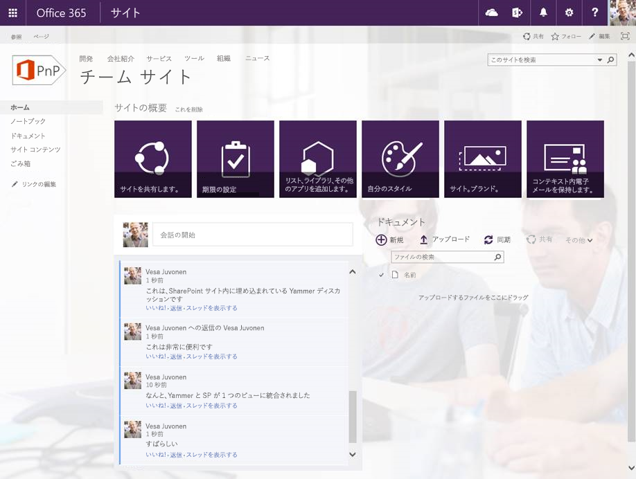

SharePoint アドイン モデルにおける Yammer の統合
=================================================

概要
-------

Yammer と SharePoint の統合方法は、完全信頼コードにおける新しい SharePoint アドイン モデルの場合と同じです。

基本ガイドライン
---------------------

Yammer と SharePoint の統合については、大まかに次のような基本ガイドラインが提供されています。

- Yammer の統合はオンプレミスと Office 365 SharePoint 環境の両方で使用できます。
- リモート プロビジョニング パターンを使用して、Yammer グループと Yammer OpenGraph オブジェクトを作成したり、新しい SharePoint サイトを作成するときのやり取りを容易にすることができます。
- 標準の埋め込み機能を使用して、Yammer と SharePoint を迅速かつ容易に統合する ことができます。
    + 埋め込みを行うには、アプリケーションに 400 ピクセル以上の HTML コンテナーが必要です。
- Yammer SDK および REST API を使用して、カスタマイズされた統合機能を作成できます。

Yammer と SharePoint を統合するオプション
-------------------------------------------

Yammer と SharePoint を統合するには、いくつかのオプションがあります。

- 埋め込み
    + グループ、トピック、マイ、およびユーザー フィード
    + OpenGraph のフィード
- Yammer OpenGraph API および/または Yammer REST API と Yammer SDK
    
埋め込み
-----

このオプションでは、SharePoint Web ページに Yammer のフィードを埋め込みます。
    
- このオプションは、迅速かつ簡単に実装されます。
- このオプションを使用すると、フィードの限定的な側面とその表示方法を制御できます。

SharePoint ページに埋め込みを使用すると、次のような外観になります。

次の表は、標準の埋め込みを使用してアクセス可能な Yammer のフィードの各種類について説明します。

フィード | 説明 | FeedType | 使用例
---- | ----------- | -------- | --------
マイ フィード | マイ フィードは、Yammer ユーザーに向けた会話が配信される場所です。 | MyFeed | 個人用サイト ホームページまたはワークスペース サイト。
ユーザー フィード | 特定のユーザーが Yammer に投稿したすべての会話。 | User | システム ディレクトリ内のユーザーのプロファイル ページ。
トピック フィード | Yammer のトピックにタグが付けられている会話のフィード。 | Topic | イントラネットのイベント ページ。
グループのフィード | 特定のグループに投稿されている会話のフィード。 | Group | イントラネットのチーム ページ。

上記の表に記載されている標準の Yammer フィード以上の機能が必要な場合は、OpenGraph 埋め込みオプションを使用できます。このオプションでは、フィードをより正確に制御できます。次の表に、このような例を示します。

フィード | 説明 | FeedType | 使用例
---- | ----------- | -------- | --------
コメント フィード | Yammer の Open Graph API を使用して、アプリケーション オブジェクト周辺の会話を容易にします。 | Custom | カスタム CRM アプリケーション、またはデジタル資産管理システム内のメディアの詳細ページの営業案件です。

**適切な場合**

Yammer フィードと SharePoint サイトを統合しようとしていて、埋め込みフィードの標準機能がニーズを満たしている場合。

**はじめに**

次のサンプルでは、サイトの既定のニュースフィードの代わりに、そのサイトに関連付けられている Yammer フィードをプロビジョニングする方法について説明します。

- [Provisioning.Yammer (O365 PnP サンプル)](https://github.com/OfficeDev/PnP/tree/master/Samples/Provisioning.Yammer)

[YammerUtility.cs](https://github.com/OfficeDev/PnP-Sites-Core/blob/master/Core/OfficeDevPnP.Core/Utilities/YammerUtility.cs) クラスの **CreateYammerGroupDiscussionPartXml** メソッドは、[OfficeDevPnP.Core](https://github.com/OfficeDev/PnP-Sites-Core/blob/master/Core/OfficeDevPnP.Core/OfficeDevPnP.Core) サンプルのものです。このメソッドは、サイトをプロビジョニングするときに SharePoint ページに追加されるアドイン パーツの定義の XML を作成します。コードの **feedType: 'group'** 部分に注意してください。ここでは、feedType が、標準グループの feedType を使用するよう設定されているのがわかります。

    public static string CreateYammerGroupDiscussionPartXml(string yammerNetworkName, int yammerGroupId, bool showHeader, bool showFooter, bool useSSO = true)
    {
        StringBuilder wp = new StringBuilder(100);
        wp.Append("<?xml version=\"1.0\" encoding=\"utf-8\" ?>");
        wp.Append("<webParts>");
        wp.Append(" <webPart xmlns='http://schemas.microsoft.com/WebPart/v3'>");
        wp.Append("     <metaData>");
        wp.Append("         <type name='Microsoft.SharePoint.WebPartPages.ScriptEditorWebPart, Microsoft.SharePoint, Version=16.0.0.0, Culture=neutral, PublicKeyToken=71e9bce111e9429c' />");
        wp.Append("         <importErrorMessage>Cannot import this Web Part.</importErrorMessage>");
        wp.Append("     </metaData>");
        wp.Append("     <data>");
        wp.Append("         <properties>");
        wp.Append("             <property name='Title' type='string'>$Resources:core,ScriptEditorWebPartTitle;</property>");
        wp.Append("             <property name='Description' type='string'>$Resources:core,ScriptEditorWebPartDescription;</property>");
        wp.Append("             <property name='ChromeType' type='chrometype'>None</property>");
        wp.Append("             <property name='Content' type='string'>");
        wp.Append("             <![CDATA[");
        wp.Append("                 

");
        wp.Append("                 ");
        wp.Append("                 ");
        wp.Append("             !!>!!");
        wp.Append("             </property>");
        wp.Append("         </properties>");
        wp.Append("     </data>");
        wp.Append(" </webPart>");
        wp.Append("</webParts>");

        return wp.ToString();
    }[YammerUtility.cs](https://github.com/OfficeDev/PnP-Sites-Core/blob/master/Core/OfficeDevPnP.Core/Utilities/YammerUtility.cs) クラスの **CreateYammerGroupDiscussionPartXml** メソッドは、[OfficeDevPnP.Core](https://github.com/OfficeDev/PnP-Sites-Core/blob/master/Core/OfficeDevPnP.Core/OfficeDevPnP.Core) サンプルのものです。このメソッドは、サイトをプロビジョニングするときに SharePoint ページに追加されるアドイン パーツの定義の XML を作成します。コードの **feedType: 'open-graph'** 部分に注意してください。ここでは、feedType が、OpenGraph API を使用するよう設定されているのがわかります。I.

    public static string CreateYammerOpenGraphDiscussionPartXml(string yammerNetworkName, string url, bool showHeader, 
                                                                    bool showFooter, string postTitle="", string postImageUrl="", 
                                                                    bool useSso = true, string groupId = "")
        {
            StringBuilder wp = new StringBuilder(100);
            wp.Append("<?xml version=\"1.0\" encoding=\"utf-8\" ?>");
            wp.Append("<webParts>");
            wp.Append(" <webPart xmlns='http://schemas.microsoft.com/WebPart/v3'>");
            wp.Append("     <metaData>");
            wp.Append("         <type name='Microsoft.SharePoint.WebPartPages.ScriptEditorWebPart, Microsoft.SharePoint, Version=16.0.0.0, Culture=neutral, PublicKeyToken=71e9bce111e9429c' />");
            wp.Append("         <importErrorMessage>Cannot import this Web Part.</importErrorMessage>");
            wp.Append("     </metaData>");
            wp.Append("     <data>");
            wp.Append("         <properties>");
            wp.Append("             <property name='Title' type='string'>$Resources:core,ScriptEditorWebPartTitle;</property>");
            wp.Append("             <property name='Description' type='string'>$Resources:core,ScriptEditorWebPartDescription;</property>");
            wp.Append("             <property name='ChromeType' type='chrometype'>None</property>");
            wp.Append("             <property name='Content' type='string'>");
            wp.Append("             <![CDATA[");
            wp.Append("                 

");
            wp.Append("                 ");
            wp.Append("                 ");
            wp.Append("             !!>!!");
            wp.Append("             </property>");
            wp.Append("         </properties>");
            wp.Append("     </data>");
            wp.Append(" </webPart>");
            wp.Append("</webParts>");

            return wp.ToString();
       「[Provisioning.Yammer (O365 PnP Sample)](https://github.com/OfficeDev/PnP/tree/master/Samples/Provisioning.Yammer)」の説明については、「[Yammer のフィードの SharePoint サイトへの統合 (O365 PnP ビデオ)](https://channel9.msdn.com/blogs/OfficeDevPnP/Integrate-Yammer-feeds-to-SharePoint-sites)」を参照してください。erYammer の埋め込みの詳細については、「[Yammer 埋め込みフィード (Yammer デベロッパー センター)](https://developer.yammer.com/v1.0/docs/embed)」の記事を参照してください。clYammer OpenGraph の詳細については、「[Open Graph の概要と形式 (Yammer デベロッパー センター)](https://developer.yammer.com/v1.0/docs/open-graph)」の記事を参照してください。clYammer OpenGraph API と Yammer REST API と Yammer SDKSDKs
-----------------------------------------------------例ons. 
   このオプションは、実装に時間がかかります。entこのオプションでは、フィードのすべての側面、表示方法、および操作方法を制御できます。 it.適切な場合fit?**Yammer フィードと SharePoint サイトを統合しようとしていて、埋め込みフィードの標準機能がニーズを満たしていない場合。edsYammer フィードをサービスや長い時間のかかる操作に統合しようとする場合。ons.はじめにrtedYammer OpenGraph の詳細については、「[Open Graph の概要と形式 (Yammer デベロッパー センター)](https://developer.yammer.com/v1.0/docs/open-graph)」の記事を参照してください。clYammer SDK は、Yammer への認証機能を提供します。  Yammer SDK の詳細については、次の記事を参照してください。les:
JavaScript SDK SDK](https://developer.yammer.com/v1.0/docs/js-sdk)Ruby SDK SDK](https://developer.yammer.com/v1.0/docs/ruby-sdk)Python SDK SDK](https://developer.yammer.com/v1.0/docs/python-sdk)iOS SDK SDK](https://developer.yammer.com/v1.0/docs/ios-sdk).NET SDK SDK](https://developer.yammer.com/v1.0/docs/net-sdk)Windows Phone 8 SDK SDK](https://developer.yammer.com/v1.0/docs/windows-phone-8-sdYammer SDK を使用して Yammer への認証を行った後、Yammer REST API を呼び出すことができます。PIs.Yammer REST API の詳細については、記事「[REST API とレート制限 (Yammer デベロッパー センター)](https://developer.yammer.com/v1.0/docs/rest-api-rate-limits)」を参照してください。cle.認証に関する注意事項NoteSharePoint へのサインインに使用する資格情報と異なる資格情報を使用して SharePoint にサインインするシナリオでは、ユーザーのシングル サインオン機能を開発する場合があります。このようなシナリオの例となるのは、LiveID を使用して SharePoint にサインインし、Microsoft 個人用アカウントまたは会社アカウントを使用して Yammer にサインインする必要がある場合です。unシングルサインオン シナリオを実装するため、カスタムのコンポーネントを使用した SharePoint ページにユーザーが初めてアクセスするとき、Yammer にサインインするようにユーザーをダイレクトすることができます。Yammer SDK を使用して Yammer にユーザーにサインインした後、ユーザーの更新トークンをユーザー プロファイルに保存できます。次回ページにアクセスしたときには、ユーザー プロファイルから更新トークンを取得して、認証に使用することができます。この方法を使用すると、エンド ユーザーは更新トークンの有効期限が切れたときにのみ Yammer にサインインする必要があります。re関連リンクinks
=============Yammer のフィードの SharePoint サイトへの統合 (O365 PnP ビデオ)deo)](https://channel9.msdn.com/blogs/OfficeDevPnP/Integrate-Yammer-feeds-to-SharePoint-sites)Yammer 埋め込みフィード (Yammer デベロッパー センター)ter)](https://developer.yammer.com/v1.0/docs/embed)Open Graph の紹介と形式 (Yammer デベロッパー センター)ter)](https://developer.yammer.com/v1.0/docs/open-graphガイダンス記事: [http://aka.ms/OfficeDevPnPGuidance](http://aka.ms/OfficeDevPnPGuidance "ガイダンス記事")es"MSDN リファレンス: [http://aka.ms/OfficeDevPnPMSDN](http://aka.ms/OfficeDevPnPMSDN "MSDN リファレンス")DN"ビデオ: [http://aka.ms/OfficeDevPnPVideos](http://aka.ms/OfficeDevPnPビデオ"Videos")os関連する PnP サンプルples
===================Provisioning.Yammer (O365 PnP サンプル)ple)](https://github.com/OfficeDev/PnP/tree/master/Samples/Provisioning.Yammer)OfficeDevPnP.CoreCore](https://github.com/OfficeDev/PnP-Sites-Core/blob/master/Core[http://aka.ms/OfficeDevPnP](http://aka.ms/OfficeDevPnP) にあるサンプルとコンテンツPn適用対象s to
=========Office 365 マルチテナント (MT)(MTOffice 365 専用 (D) (DSharePoint 2013 オンプレミスises
