# Office アドインの相互作用パターン
コンテンツ アドイン、作業ウィンドウ アドイン、Outlook アドインに一般的な UX の相互作用パターンを適用します。

 _ **適用対象:** Access apps for SharePoint?| apps for Office?| Excel?| Office Add-ins?| Outlook?| PowerPoint?| Project?| Word_

Office アドイン は、作成および生産性のエクスペリエンスを強化したり、より大規模な Web ベースのワークフローに Office ホスト アプリケーションのコンテンツを関連付けたりできます。多数の一般的なシナリオが、開発する可能性があるコンテンツ アドイン、作業ウィンドウ アドイン、Outlook アドインに適用されます。この記事では、いくつかの最も一般的なシナリオについて説明します。また、アドインの UX に推奨される相互作用パターンについて記載します。固有のシナリオに応じて、これらの相互作用パターンを分解および結合したり、混在および一致させたりできます。

 **一般的なアドインのシナリオ**

|**アドインの種類**|**一般的なシナリオ**|
|:-----|:-----|
|コンテンツ|
<ul xmlns:xlink="http://www.w3.org/1999/xlink" xmlns:mtps="http://msdn2.microsoft.com/mtps" xmlns:mshelp="http://msdn.microsoft.com/mshelp" xmlns:ddue="http://ddue.schemas.microsoft.com/authoring/2003/5" xmlns:msxsl="urn:schemas-microsoft-com:xslt"><li>
データの仮想化
</li><li>
ウィジェットとツール
</li></ul>|
|作業ウィンドウ|
<ul xmlns:xlink="http://www.w3.org/1999/xlink" xmlns:mtps="http://msdn2.microsoft.com/mtps" xmlns:mshelp="http://msdn.microsoft.com/mshelp" xmlns:ddue="http://ddue.schemas.microsoft.com/authoring/2003/5" xmlns:msxsl="urn:schemas-microsoft-com:xslt"><li>
データの変換と処理
</li><li>
より効果的かつ効率的なオーサリング
</li><li>
コンテンツの検索とメディアの挿入
</li><li>
コンテンツを Web サービスに発行またはアップロードする
</li></ul>|
|Outlook|
<ul xmlns:xlink="http://www.w3.org/1999/xlink" xmlns:mtps="http://msdn2.microsoft.com/mtps" xmlns:mshelp="http://msdn.microsoft.com/mshelp" xmlns:ddue="http://ddue.schemas.microsoft.com/authoring/2003/5" xmlns:msxsl="urn:schemas-microsoft-com:xslt"><li>
メール コンテンツと外部アプリケーションの間の関連付け
</li><li>
メールのメッセージや予定のコンテンツに関する追加情報の提供
</li><li>
生産性を上げるための情報の提供
</li></ul>|

## コンテンツ アドインによるデータの視覚化

これは、スプレッドシート内のデータからグラフを生成する Excel 用コンテンツ アドインの例です。

この相互作用パターンでは、グラフを生成するデータを選択し、バインドするまで、アドインはアクティブになりません。アドインの初期ビューで、アドインの目的とアドインをアクティブにするためのステップを伝えることが重要です。 

|||
|:-----|:-----|
|
**スプレッドシート内のデータからグラフを生成する Excel 用コンテンツ アドイン**
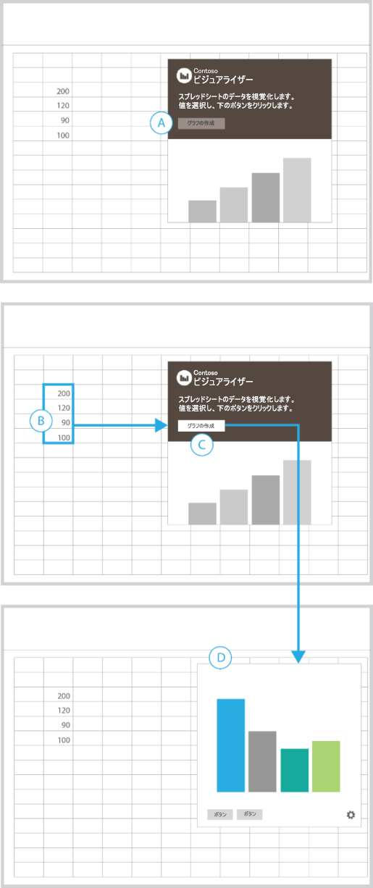|
<ul xmlns:xlink="http://www.w3.org/1999/xlink" xmlns:mtps="http://msdn2.microsoft.com/mtps" xmlns:mshelp="http://msdn.microsoft.com/mshelp" xmlns:ddue="http://ddue.schemas.microsoft.com/authoring/2003/5" xmlns:msxsl="urn:schemas-microsoft-com:xslt"><li>
ボタンを選択する前に操作を実行する必要があることを強調するには、無効化されたボタンと共に説明を表示します (A)。
</li><li>
セルの範囲を選択すると、[グラフの作成] ボタンがアクティブになります (B - C)。
</li><li>
コンテナーが視覚化され、前のビューに取って代わります (D)。
</li><li>
設定ボタン (歯車) と共にアドインの下端に UI を追加し、アドインのリセットや管理ができるビューに移動できるようにします。
</li></ul>以下のものに最適です。
<ul xmlns:xlink="http://www.w3.org/1999/xlink" xmlns:mtps="http://msdn2.microsoft.com/mtps" xmlns:mshelp="http://msdn.microsoft.com/mshelp" xmlns:ddue="http://ddue.schemas.microsoft.com/authoring/2003/5" xmlns:msxsl="urn:schemas-microsoft-com:xslt"><li>
アクティブ化の前にデータを選択する必要があるアドイン。
</li></ul>|

## 作業ウィンドウ アドインによるコンテンツの変換

これは、ドキュメント内のテキストを別の言語に翻訳する作業ウィンドウ アドインの例です。

この相互作用パターンでは、ドキュメント内で翻訳するテキストを最初に選択する必要があります。

|||
|:-----|:-----|
|
**ドキュメント内のテキストを別の言語に翻訳する作業ウィンドウ アドイン**
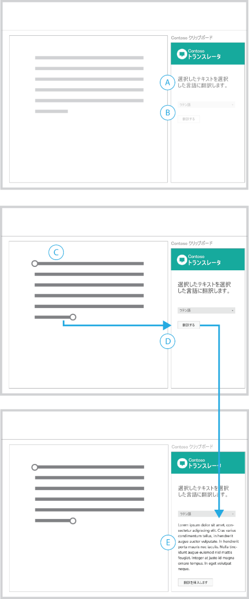|
<ul xmlns:xlink="http://www.w3.org/1999/xlink" xmlns:mtps="http://msdn2.microsoft.com/mtps" xmlns:mshelp="http://msdn.microsoft.com/mshelp" xmlns:ddue="http://ddue.schemas.microsoft.com/authoring/2003/5" xmlns:msxsl="urn:schemas-microsoft-com:xslt"><li>
見出しでアドインの目的を伝え、最初に選択を行う必要があることを示唆します (A)。
</li><li>
言語メニューと [翻訳] ボタンは無効になっており、処理を進める前に操作を実行する必要があることが強調されます。ドキュメント内のコンテンツを選択すると、これらの 2 つの要素がアクティブになります (D)。
</li><li>
[翻訳] を選択すると、UI が展開され、翻訳されたコンテンツとそのコンテンツをドキュメントに挿入するためのボタンが表示されます (E)。
</li><li>
初期ビューに戻れるように、 [クリア] または [リセット] ボタンを表示することもできます。
</li></ul>以下のものに最適です。
<ul xmlns:xlink="http://www.w3.org/1999/xlink" xmlns:mtps="http://msdn2.microsoft.com/mtps" xmlns:mshelp="http://msdn.microsoft.com/mshelp" xmlns:ddue="http://ddue.schemas.microsoft.com/authoring/2003/5" xmlns:msxsl="urn:schemas-microsoft-com:xslt"><li>
アクティブ化の前にデータを選択する必要があるアドイン。
</li><li>
シナリオを進めると展開または開示される UI。
</li></ul>|

## 作業ウィンドウ アドインによるデータの処理

これは、Excel のデータをチェックする作業ウィンドウ アドインの例です。

この相互作用パターンでは、開始するにはスプレッドシートのセルの範囲を選択する必要があります。

|||
|:-----|:-----|
|
**Excel のデータをチェックする作業ウィンドウ アドイン**
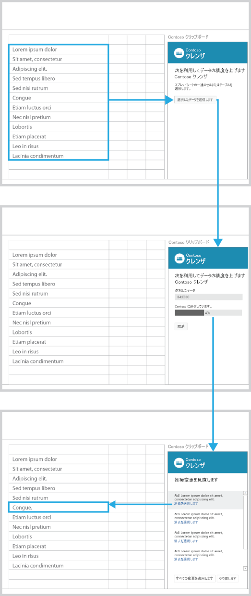|
<ul xmlns:xlink="http://www.w3.org/1999/xlink" xmlns:mtps="http://msdn2.microsoft.com/mtps" xmlns:mshelp="http://msdn.microsoft.com/mshelp" xmlns:ddue="http://ddue.schemas.microsoft.com/authoring/2003/5" xmlns:msxsl="urn:schemas-microsoft-com:xslt"><li>
アドインの目的が見出しで説明されます。説明は、作業を始める際の参考になります。
</li><li>
[選択データの送信] ボタンは無効になっており、処理を進めるためには操作の実行が必要なことが強調されています (A)。
</li><li>
スプレッドシート内のセルの範囲を選択すると (B)、[選択データの送信] ボタンがアクティブになります。
</li><li>
このボタンをクリックすると、UI は選択された範囲のセル、進行状況バー、および [キャンセル] ボタンで置き換えられます。
</li><li>
進行状況バーには処理の状態が表示され、[キャンセル] ボタンで処理を中断できます (D)。
</li><li>
処理が完了すると、結果が自動的に表示されます (E)。リストの要素を選択すると、スプレッドシート内の対応するセルがアクティブになります。
</li></ul>以下のものに最適です。
<ul xmlns:xlink="http://www.w3.org/1999/xlink" xmlns:mtps="http://msdn2.microsoft.com/mtps" xmlns:mshelp="http://msdn.microsoft.com/mshelp" xmlns:ddue="http://ddue.schemas.microsoft.com/authoring/2003/5" xmlns:msxsl="urn:schemas-microsoft-com:xslt"><li>
所要時間が不確かな処理。
</li></ul>|

## 作業ウィンドウ アドインによるコンテンツの分析

これは、入力した単語の定義を表示する作業ウィンドウ アドインの例です。

この相互作用パターンでは、結果を表示するにはドキュメント内のテキストを選択する必要があります。

|||
|:-----|:-----|
|
**入力した単語の定義を表示する作業ウィンドウ アドイン**
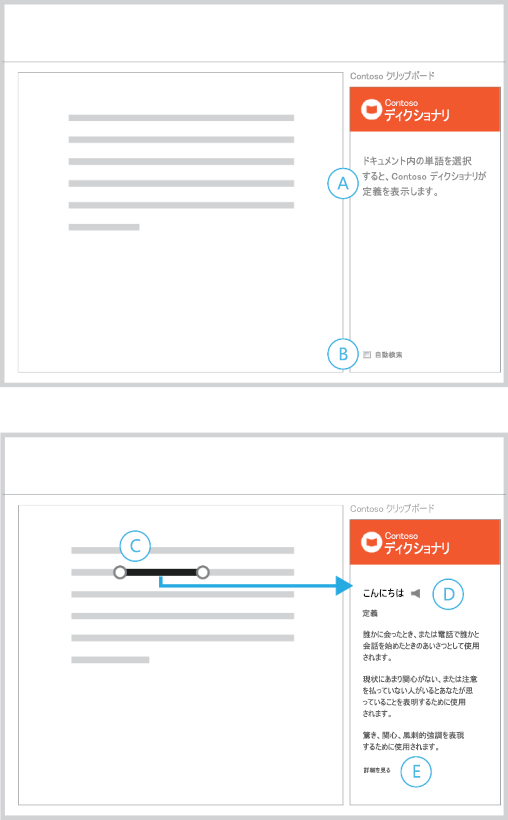|
<ul xmlns:xlink="http://www.w3.org/1999/xlink" xmlns:mtps="http://msdn2.microsoft.com/mtps" xmlns:mshelp="http://msdn.microsoft.com/mshelp" xmlns:ddue="http://ddue.schemas.microsoft.com/authoring/2003/5" xmlns:msxsl="urn:schemas-microsoft-com:xslt"><li>
見出しには、アドインの目的と作業の始め方が示されています (A)。
</li><li>
自動検索が既定では有効になっており、これを無効にするオプションも用意されています (B)。
</li><li>
選択を行うと、アドインは対応するコンテンツを表示します (D)。
</li><li>
詳細な情報を表示するためのリンクを提示します (E)。
</li></ul>以下のものに最適です。
<ul xmlns:xlink="http://www.w3.org/1999/xlink" xmlns:mtps="http://msdn2.microsoft.com/mtps" xmlns:mshelp="http://msdn.microsoft.com/mshelp" xmlns:ddue="http://ddue.schemas.microsoft.com/authoring/2003/5" xmlns:msxsl="urn:schemas-microsoft-com:xslt"><li>
作成時に自動的にコンテンツを返すアドイン。
</li><li>
アクティブ化の前にコンテンツを選択する必要があるアドイン。
</li></ul>|

## 作業ウィンドウ アドインによるコンテンツの検索

これは、コンテンツを検索するための作業ウィンドウ アドインの例です。

この相互作用パターンでは、検索ボックスに文字列を入力するか、対象コンテンツのリストから選択して開始します。

|||
|:-----|:-----|
|
**コンテンツを検索するための作業ウィンドウ アドイン**
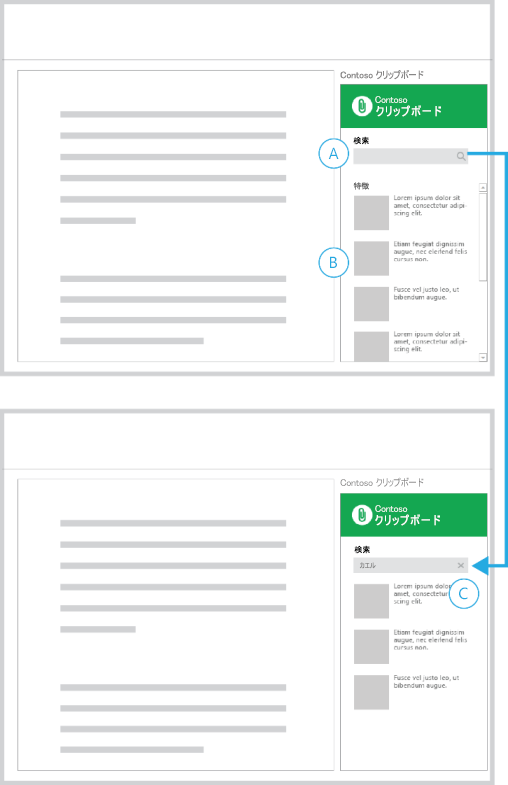|
<ul xmlns:xlink="http://www.w3.org/1999/xlink" xmlns:mtps="http://msdn2.microsoft.com/mtps" xmlns:mshelp="http://msdn.microsoft.com/mshelp" xmlns:ddue="http://ddue.schemas.microsoft.com/authoring/2003/5" xmlns:msxsl="urn:schemas-microsoft-com:xslt"><li>
初期ビューには [検索] ボックス (A) と対象コンテンツのリスト (B) が含まれます。
</li><li>
検索ボックスに文字列を入力すると、検索アイコンが閉じるアイコン (C) で置き換えられます。
</li><li>
閉じるアイコンをクリックすると、初期ビューに戻ります。
</li></ul>以下のものに最適です。
<ul xmlns:xlink="http://www.w3.org/1999/xlink" xmlns:mtps="http://msdn2.microsoft.com/mtps" xmlns:mshelp="http://msdn.microsoft.com/mshelp" xmlns:ddue="http://ddue.schemas.microsoft.com/authoring/2003/5" xmlns:msxsl="urn:schemas-microsoft-com:xslt"><li>
作成時に自動的にコンテンツを返すアドイン。
</li><li>
アクティブ化の前にコンテンツを選択する必要があるアドイン。
</li></ul>|

## 作業ウィンドウ アドインによるメディアの挿入

この相互作用パターンでは、検索結果からイメージを選択し、ドキュメントに挿入できます。

|||
|:-----|:-----|
|
**イメージを挿入するための作業ウィンドウ アドイン**
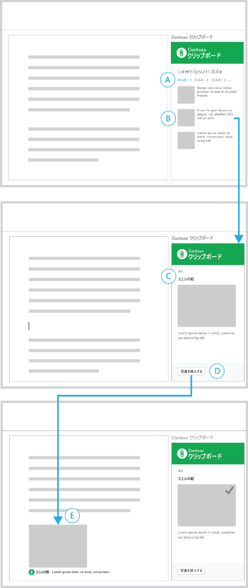|
<ul xmlns:xlink="http://www.w3.org/1999/xlink" xmlns:mtps="http://msdn2.microsoft.com/mtps" xmlns:mshelp="http://msdn.microsoft.com/mshelp" xmlns:ddue="http://ddue.schemas.microsoft.com/authoring/2003/5" xmlns:msxsl="urn:schemas-microsoft-com:xslt"><li>
検索結果のリストをフィルター処理し (A)、挿入するコンテンツを選択しました (B)。
</li><li>
選択したコンテンツの詳細ビューが表示されます (C)。表示されるボタンをクリックするとリストに戻ります。
</li><li>
[写真の挿入] ボタンがフッター部分に配置されています (D)。このボタンをクリックすると、ドキュメント内にイメージが挿入されます。
</li><li>
挿入されるコンテンツには、イメージの提供元に関する短い説明が含まれます (E)。 
</li><li>
このアドインの UI では、操作が成功したことを視覚的に確認できます。
</li></ul>以下のものに最適です。
<ul xmlns:xlink="http://www.w3.org/1999/xlink" xmlns:mtps="http://msdn2.microsoft.com/mtps" xmlns:mshelp="http://msdn.microsoft.com/mshelp" xmlns:ddue="http://ddue.schemas.microsoft.com/authoring/2003/5" xmlns:msxsl="urn:schemas-microsoft-com:xslt"><li>
コンテンツを挿入するためのアドイン。
</li></ul>|

## 作業ウィンドウ アドインによる選択したテキストの挿入

この相互作用パターンでは、検索結果からテキストを選択し、ドキュメントに挿入します。

|||
|:-----|:-----|
|
**テキストを挿入するための作業ウィンドウ アドイン**
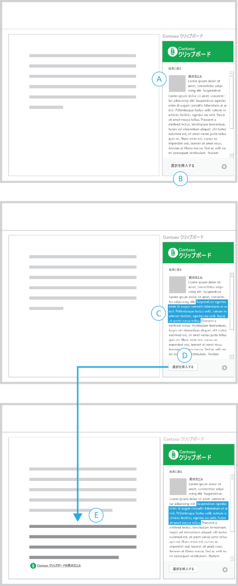|
<ul xmlns:xlink="http://www.w3.org/1999/xlink" xmlns:mtps="http://msdn2.microsoft.com/mtps" xmlns:mshelp="http://msdn.microsoft.com/mshelp" xmlns:ddue="http://ddue.schemas.microsoft.com/authoring/2003/5" xmlns:msxsl="urn:schemas-microsoft-com:xslt"><li>
コンテンツの一部の検索を既に完了しています (A)。
</li><li>
フッター部分には無効化された [選択範囲の挿入] ボタンが表示されます (B)。
</li><li>
テキスト文字列を選択すると (C)、[選択範囲の挿入] ボタンがアクティブになります。
</li><li>
このボタンをクリックすると、アドインは、選択されたテキストを、そのコンテンツ ソースへの参照と共にドキュメント内に挿入します (E)。
</li></ul>以下のものに最適です。
<ul xmlns:xlink="http://www.w3.org/1999/xlink" xmlns:mtps="http://msdn2.microsoft.com/mtps" xmlns:mshelp="http://msdn.microsoft.com/mshelp" xmlns:ddue="http://ddue.schemas.microsoft.com/authoring/2003/5" xmlns:msxsl="urn:schemas-microsoft-com:xslt"><li>
調査を実施してコンテンツを挿入するためのアドイン。
</li></ul>|

## 作業ウィンドウ アドインによる Web サービスへの発行

これは、ドキュメントをブログ投稿として発行するための作業ウィンドウ アドインの例です。

この相互作用パターンでは、ドキュメント内のコンテンツ作成を完了しているときに、そのコンテンツをブログに投稿しようとしています。

|||
|:-----|:-----|
|
**ドキュメントをブログ投稿として発行するための作業ウィンドウ アドイン**
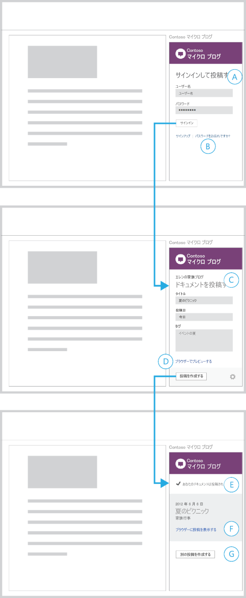|
<ul xmlns:xlink="http://www.w3.org/1999/xlink" xmlns:mtps="http://msdn2.microsoft.com/mtps" xmlns:mshelp="http://msdn.microsoft.com/mshelp" xmlns:ddue="http://ddue.schemas.microsoft.com/authoring/2003/5" xmlns:msxsl="urn:schemas-microsoft-com:xslt"><li>
最初に、資格情報を入力するためのサインイン フォームが表示されます (A)。
</li><li>
アカウントを作成したり、一般的なサインインの問題に対処したりするためのリンクが用意されています (B)。リンクをクリックすると、ページがブラウザーで開きます。
</li><li>
サインインすると、アドインは、ブログ投稿を新規作成するためのフォームを表示します (C)。
</li><li>
サインインした (投稿先の) アカウントの名前がアドインの上部に表示されます。投稿をプレビューするためのリンクがアドインによって表示されます (D)。このリンクをクリックすると、プレビューがブラウザーに表示されます。
</li><li>
[投稿を作成] をクリックすると、アドインは、ドキュメントのコンテンツが投稿されたことを確認するビューを表示します (E)。
</li><li>
投稿をブラウザーに表示するためのリンクや (F)、別の投稿を作成するためのボタン (G) もアドインによって提供されます。
</li></ul>以下のものに最適です。
<ul xmlns:xlink="http://www.w3.org/1999/xlink" xmlns:mtps="http://msdn2.microsoft.com/mtps" xmlns:mshelp="http://msdn.microsoft.com/mshelp" xmlns:ddue="http://ddue.schemas.microsoft.com/authoring/2003/5" xmlns:msxsl="urn:schemas-microsoft-com:xslt"><li>
ソーシャル ネットワーク、ブログ サイト、および Web サービスに対するコンテンツの出力、発行、または共有を行うアドイン。
</li><li>
サービスにサインインする必要があるアドイン。
</li></ul>|

## Outlook アドインによる人に関する追加情報の取得

 **例 1**

|||
|:-----|:-----|
|
**結果と詳細情報のページ**
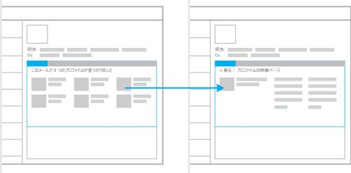|以下のものに最適です。
<ul xmlns:xlink="http://www.w3.org/1999/xlink" xmlns:mtps="http://msdn2.microsoft.com/mtps" xmlns:mshelp="http://msdn.microsoft.com/mshelp" xmlns:ddue="http://ddue.schemas.microsoft.com/authoring/2003/5" xmlns:msxsl="urn:schemas-microsoft-com:xslt"><li>
提示に適した大規模なデータ セットを持つコンテンツの幅広さを示す場合。
</li><li>
フル サイズのアドイン コンテナーを使用する詳細情報ページ。
</li><li>
前後移動のメリットがあるナビゲーション モデル。
</li></ul>|
 **例 2**

|||
|:-----|:-----|
|
**固定のナビゲーションを備えた詳細情報ページ**
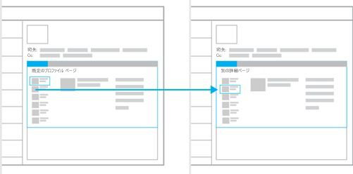|以下のものに最適です。
<ul xmlns:xlink="http://www.w3.org/1999/xlink" xmlns:mtps="http://msdn2.microsoft.com/mtps" xmlns:mshelp="http://msdn.microsoft.com/mshelp" xmlns:ddue="http://ddue.schemas.microsoft.com/authoring/2003/5" xmlns:msxsl="urn:schemas-microsoft-com:xslt"><li>
既定でデータセットの最初の結果を表示する場合。
</li><li>
タブのように機能するナビゲーション構造 (単一レベルの線型ナビゲーション)。
</li><li>
ナビゲーションを常時使用可能な状態にして選択の操作を減らす場合。
</li><li>
常にナビゲーションを表示する余地を残しておく場合。
</li></ul>|

## Outlook アドインによるコンテンツに関する追加情報の取得

 **例 1**

|||
|:-----|:-----|
|
**結果と詳細情報のページ**
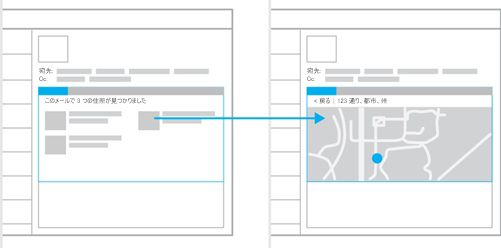|以下のものに最適です。
<ul xmlns:xlink="http://www.w3.org/1999/xlink" xmlns:mtps="http://msdn2.microsoft.com/mtps" xmlns:mshelp="http://msdn.microsoft.com/mshelp" xmlns:ddue="http://ddue.schemas.microsoft.com/authoring/2003/5" xmlns:msxsl="urn:schemas-microsoft-com:xslt"><li>
表示に適した大規模なデータ セットを持つコンテンツの幅広さを示す場合。
</li><li>
詳細表示の前に選択を行う必要がある場合。
</li><li>
フル サイズのアドイン コンテナーを使用する詳細ページ。
</li><li>
前後移動のメリットがあるナビゲーション モデル。
</li></ul>|
 **例 2**

|||
|:-----|:-----|
|
**副次的なコンテンツを示す詳細ページ**
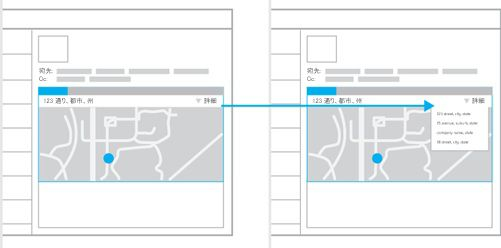|以下のものに最適です。
<ul xmlns:xlink="http://www.w3.org/1999/xlink" xmlns:mtps="http://msdn2.microsoft.com/mtps" xmlns:mshelp="http://msdn.microsoft.com/mshelp" xmlns:ddue="http://ddue.schemas.microsoft.com/authoring/2003/5" xmlns:msxsl="urn:schemas-microsoft-com:xslt"><li>
コンテンツの一部に焦点を当てようとする場合。
</li><li>
ユーザーによる操作なしにコンテンツを表示する場合。
</li><li>
固定的なナビゲーション (ナビゲーションを簡素かつ容易なものにするためにこのモデルに追加可能)。
</li></ul>|

## オンライン サービスへの接続とデータの表示

これは、オンライン サービスからデータとコンテンツを取得する相互作用パターンの例です。3 つのアドイン タイプ、すなわち、コンテンツ アドイン、作業ウィンドウ アドイン、Outlook アドインのすべてで利用できます。

 **例 1**

|||
|:-----|:-----|
|
**カルーセル**
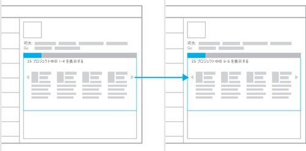|以下のものに最適です。
<ul xmlns:xlink="http://www.w3.org/1999/xlink" xmlns:mtps="http://msdn2.microsoft.com/mtps" xmlns:mshelp="http://msdn.microsoft.com/mshelp" xmlns:ddue="http://ddue.schemas.microsoft.com/authoring/2003/5" xmlns:msxsl="urn:schemas-microsoft-com:xslt"><li>
一度に 1 件ずつ表示したりグループ化して表示したりできる少量のデータ。
</li><li>
ギャラリー形式 (スライドショーやイメージ ギャラリー) でコンテンツを表示する場合。
</li><li>
"次へ/前へ" ナビゲーション モデルが有効な場合。
</li></ul>|
 **例 2**

|||
|:-----|:-----|
|
**ウィザード**
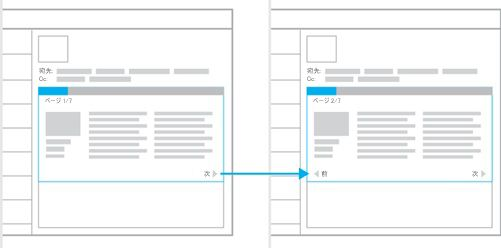|以下のものに最適です。
<ul xmlns:xlink="http://www.w3.org/1999/xlink" xmlns:mtps="http://msdn2.microsoft.com/mtps" xmlns:mshelp="http://msdn.microsoft.com/mshelp" xmlns:ddue="http://ddue.schemas.microsoft.com/authoring/2003/5" xmlns:msxsl="urn:schemas-microsoft-com:xslt"><li>
決まった順序で提示する必要があるコンテンツ。
</li><li>
一連の小さな部分ごとに利用するのが最適な大量のコンテンツ。
</li><li>
書籍のような利用エクスペリエンスが求められる場合。
</li><li>
一連の手順または操作によってタスクを完了する必要がある場合。
</li></ul>|
 **例 3**

|||
|:-----|:-----|
|
**フォーム、結果、および詳細情報**
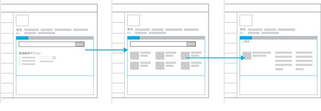|以下のものに最適です。
<ul xmlns:xlink="http://www.w3.org/1999/xlink" xmlns:mtps="http://msdn2.microsoft.com/mtps" xmlns:mshelp="http://msdn.microsoft.com/mshelp" xmlns:ddue="http://ddue.schemas.microsoft.com/authoring/2003/5" xmlns:msxsl="urn:schemas-microsoft-com:xslt"><li>
データ入力を必要とするアドイン
</li><li>
結果と詳細情報のパターンへのエントリポイント。
</li></ul>|

## その他の技術情報

- [Office アドインの設計ガイドライン](../add-in-design.md)
    
