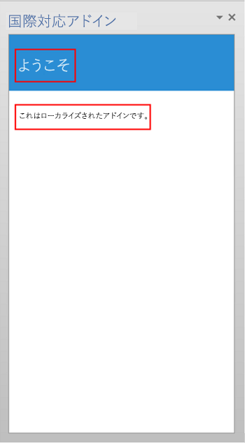

# Office アドインのローカライズ
UI 文字列、アドイン名、説明、アイコン、ソース ファイル、日付と時刻の形式など、Office アドイン にロケール固有のコンテンツを提供します。

 _ **適用対象:** Access apps for SharePoint?| apps for Office?| Excel?| Office Add-ins?| Outlook?| PowerPoint?| Project?| Word_

Office アドイン に適切なローカライズ方法を任意に選んで実装できます。JavaScript API と Office アドイン プラットフォームのマニフェスト スキーマには、いくつかの選択肢が用意されています。JavaScript API for Office を使用すると、ホスト アプリケーションのロケールに基づいてロケールを決定して文字列を表示したり、データのロケールに基づいてデータを変換または表示することができます。マニフェストを使用すると、ロケールに固有なアドイン ファイルの場所と説明的な情報を指定できます。または、Microsoft Ajax スクリプトを使用して、グローバリゼーションとローカライズをサポートできます。

## ロケール固有文字列を判別するための JavaScript API の使用


JavaScript API for Office は、ホスト アプリケーションまたはデータのロケールに対応する値の表示または変換をサポートする 2 つのプロパティを提供しています。


- [Context.displayLanguage](http://msdn.microsoft.com/library/732ba34c-c99f-4c00-836d-4250eb7f0dac%28Office.15%29.aspx) は、ホスト アプリケーションのユーザー インターフェイスのロケール (または言語) を指定します。次の例では、ホスト アプリケーションで en-US または fr-Fr のどちらのロケールが使用されるかを確認し、ロケールに合った挨拶文を表示します。
    
  ```
  function sayHelloWithDisplayLanguage() {
    var myLanguage = Office.context.displayLanguage;
    switch (myLanguage) {
        case 'en-US':
            write('Hello!');
            break;
        case 'fr-FR':
            write('Bonjour!');
            break;
    }
}
// Function that writes to a div with id='message' on the page.
function write(message){
    document.getElementById('message').innerText += message; 
}

  ```

- [Context.contentLanguage](http://msdn.microsoft.com/library/4fd063c2-0cd0-4b5b-8993-93d7ff8ce3bf%28Office.15%29.aspx) は、データのロケール (または言語) を指定します。前のコード サンプルでは、次のように **displayLanguage** プロパティをチェックしましたが、
    
  ```
  var myLanguage = Office.context.displayLanguage;
  ```


     `myLanguage` を **contentLanguage** プロパティに割り当てます。残りのコードはそのまま使用し、データのロケールに基づいて挨拶文を表示します。
    


  ```
  var myLanguage = Office.context.contentLanguage;
  ```


## マニフェストでのローカライズの制御


すべての Office アドインでは、マニフェストで [DefaultLocale](http://msdn.microsoft.com/library/04796a3a-3afa-dc85-db66-4677560c185c%28Office.15%29.aspx) 要素とロケールを指定します。既定では、Office アドイン プラットフォームと Office ホスト アプリケーションは、 [Description](http://msdn.microsoft.com/library/bcce6bad-23d0-7631-7d8c-1064b8453b5a%28Office.15%29.aspx) 要素、 [DisplayName](http://msdn.microsoft.com/library/529159ca-53bf-efcf-c245-e572dab0ef57%28Office.15%29.aspx) 要素、 [IconUrl](http://msdn.microsoft.com/library/c7dac2d4-4fda-6fc7-3774-49f02b2d3e1e%28Office.15%29.aspx) 要素 (存在する場合)、 [HighResolutionIconUrl](http://msdn.microsoft.com/library/cd5493c5-a019-0059-3009-236234a034f1%28Office.15%29.aspx) 要素 (存在する場合)、および **SourceLocation** 要素の値をすべてのロケールに適用します。オプションで、特定のロケールに対して特定の値を指定できます。それには、これら 5 つの要素について、追加のロケールに対応する **Override** 子要素を指定します。 **DefaultLocale** 要素の値と、 **Overrride** 要素の **Locale** 属性の値は、 [RFC 3066](http://www.ietf.org/rfc/rfc3066.txt) の「Tags for the Identification of Languages」に従って指定します。表 1. は、これらの要素でのローカライズのサポートの説明です。


**表 1. ローカライズのサポート**


|**要素**|**ローカライズのサポート**|
|:-----|:-----|
|**Description***|指定した各ロケールのユーザーには、Office ストア (またはプライベート カタログ) でアドインのローカライズされた説明が表示されます。Outlook アドインについては、アドインのインストール後に Exchange 管理センター (EAC) に表示される説明が該当します。|
|**DisplayName***|指定した各ロケールのユーザーには、Office ストア (またはプライベート カタログ) でアドインのローカライズされた説明が表示されます。Outlook アドインについては、アドインのインストール後に [Outlook アドイン] ボタンのラベルおよび EAC に表示される表示名が該当します。コンテンツ アドインおよび作業ウィンドウ アドインについては、アドインのインストール後にリボンに表示される表示名が該当します。|
|**IconUrl**|アイコンのイメージは省略可能です。ここで説明したオーバーライドと同じ方法で、特定のカルチャに特定のイメージを指定できます。アイコンを使用し、ローカライズした場合、指定した各ロケールのユーザーには、アドインのローカライズされたアイコン画像が表示されます。Outlook アドインについては、アドインのインストール後に EAC で表示されるアイコンが該当します。コンテンツ アドインおよび作業ウィンドウ アドインについては、アドインのインストール後にリボンに表示されるアイコンが該当します。|
|**HighResolutionIconUrl**
 >**重要**  この要素は、アドイン マニフェストのバージョン 1.1 を使用する場合にのみ使用できます。

|高解像度のアイコンのイメージは省略可能ですが、指定する場合は、 **IconUrl** 要素の後に指定する必要があります。 **HighResolutionIconUrl** が指定され、高解像度の dpi をサポートするデバイスにアドインがインストールされている場合、 **IconUrl** の値の代わりに **HighResolutionIconUrl** の値が使用されます。ここで説明したオーバーライドと同じ方法で、特定のカルチャに特定のイメージを指定できます。アイコンを使用し、ローカライズした場合、指定した各ロケールのユーザーには、アドインのローカライズされたアイコン画像が表示されます。Outlook アドインについては、アドインのインストール後に EAC で表示されるアイコンが該当します。コンテンツ アドインおよび作業ウィンドウ アドインについては、アドインのインストール後にリボンに表示されるアイコンが該当します。|
|**SourceLocation**|指定した各ロケールのユーザーには、そのロケールのアドイン専用にデザインした Web ページが表示されます。|

 >**メモ**  * Office でサポートされているロケールに限り、説明と表示名をローカライズできます。現在のリリースの Office でサポートされている言語とロケールの一覧については、「 [Office 2013 の言語識別子と OptionState ID 値](http://technet.microsoft.com/ja-jp/library/cc179219%28Office.15%29.aspx)」をご参照ください。


### 例

たとえば、Office アドインで  **DefaultLocale** を `en-us` に指定できます。次に示すように、アドインは、 **DisplayName** 要素に対して、ロケールが `fr-fr` の **Override** 子要素を指定できます。


```XML
<DefaultLocale>en-us</DefaultLocale>
…
<DisplayName DefaultValue="Video player">
    <Override Locale="fr-fr" Value="Lecteur video" />
</DisplayName>
```

このように指定すると、既定ではアドインは  `en-us` ロケールを想定します。ほとんどのロケールでは、英語の表示名 "Video player" が表示されます。ただし、クライアント コンピューターのロケールが `fr-fr` の場合は、フランス語の表示名 "Lecteur video" が表示されます。

次の例では、 **Description** 要素に対してロケールのオーバーライドを適用しています。最初に、既定のロケールを `en-us` に指定し、英語の説明を記述しています。その後で、 [Override](http://msdn.microsoft.com/library/d6a0e4f3-1cc9-c544-89bf-8923c7434316%28Office.15%29.aspx) 要素を使用して、 `fr-fr` ロケールに対応するフランス語の説明を記述しています。


```XML
    <DefaultLocale>en-us</DefaultLocale>
…
    <Description DefaultValue=
      "Watch YouTube videos referenced in the emails you receive 
      without leaving your email client.">
      <Override Locale="fr-fr" Value=
      "Visualisez les videos YouTube referencees dans vos courriers 
      electronique directement depuis Outlook et Outlook Web App."/>
    </Description>
```

このように指定すると、既定ではアドインは  `en-us` ロケールを想定します。ほとんどのロケールでは、 **DefaultValue** 属性で記述した英語の説明が表示されます。ただし、クライアント コンピューターのロケールが `fr-fr` の場合は、フランス語の説明が表示されます。

次の例では、アドインは、 `fr-fr` ロケールとカルチャに対してより適切な別のイメージを指定しています。既定ではイメージ DefaultLogo.png が表示されますが、クライアント コンピューターのロケールが `fr-fr` の場合は、イメージ FrenchLogo.png が表示されます。


```XML
<!-- Replace "domain" with a real web server name and path. -->
<IconUrl DefaultValue="https://<domain>/DefaultLogo.png"/>
    <Override Locale="fr-fr" Value="https://<domain>/FrenchLogo.png"/>
```

 **SourceLocation** 要素については、他のロケールをサポートする場合、該当する各ロケール用のソース HTML ファイルを個別に用意する必要があります。指定した各ロケールのユーザーには、そのロケール用にカスタマイズしてデザインした Web ページが表示されます。

Outlook アドインについては、 **SourceLocation** 要素もフォーム ファクターに合わせることができます。これにより、対応するフォーム ファクターごとに個別のローカライズされたソース HTML ファイルを指定できます。該当する各設定要素 ([DesktopSettings](http://msdn.microsoft.com/library/da9fd085-b8cc-2be0-d329-2aa1ef5d3f1c%28Office.15%29.aspx)、 [TabletSettings](http://msdn.microsoft.com/library/5c89cc7c-7ae0-49c9-fdd5-4c52118228f6%28Office.15%29.aspx)、または [PhoneSettings](http://msdn.microsoft.com/library/13e4eae3-8e8c-fd55-a1c2-3297b485f327%28Office.15%29.aspx)) に対し、1 つまたは複数の  **Override** 子要素を指定できます。次の例は、デスクトップ、タブレット、およびスマートフォンのフォーム ファクターの設定要素を示します。各フォーム ファクターには、既定のロケールを表す HTML ファイルとフランスのロケールを表す HTML ファイルがあります。


```XML
<DesktopSettings>
   <SourceLocation DefaultValue="https://contoso.com/Desktop.html">
      <Override Locale="fr-fr" Value="https://contoso.com/fr/Desktop.html" />
   </SourceLocation>
   <RequestedHeight>250</RequestedHeight>
</DesktopSettings>
<TabletSettings>
   <SourceLocation DefaultValue="https://contoso.com/Tablet.html">
      <Override Locale="fr-fr" Value="https://contoso.com/fr/Tablet.html" />
   </SourceLocation>
   <RequestedHeight>200</RequestedHeight>
</TabletSettings>
<PhoneSettings>
   <SourceLocation DefaultValue="https://contoso.com/Mobile.html">
      <Override Locale="fr-fr" Value="https://contoso.com/fr/Mobile.html" />
   </SourceLocation>

</PhoneSettings>

```


## 日付/時刻の形式のクライアント ロケールへの関連付け


ホスト アプリケーションのユーザー インターフェイスのロケールは  **displayLanguage** プロパティで取得できます。これにより、日付と時刻の値をホスト コンピューターの現在のロケールと一致する形式で表示することができます。その方法の 1 つが、Office アドイン がサポートする各ロケールで使用する日付と時刻の表示形式を指定したリソース ファイルを準備するという方法です。実行時には、アドインはそのリソース ファイルを使用して、 **displayLanguage** プロパティから取得したロケールに合致する適切な日付と時刻の形式を判断します。

ホスト コンピューターのデータのロケールは、 **contentLanguage** プロパティを使用して取得できます。この値に基づいて、日付と時刻の文字列を適切に変換または表示できます。たとえば、jp-JP ロケールでは日付と時刻の値は yyyy/MM/dd と表記され、fr-FR ロケールでは dd/MM/yyyy と表記されます。


## グローバリゼーションとローカライズでの Ajax の使用


Visual Studio で Office アドインを作成する場合, .NET Framework と Ajax を使用してクライアント スクリプト ファイルをグローバライズおよびローカライズできます。

現在のブラウザーのロケール設定に基づいて値を表示するには、Office アドイン向けの JavaScript コード内で [Date](http://msdn.microsoft.com/library/caf98d32-2de2-4704-8198-692350343681.aspx) および [Number](http://msdn.microsoft.com/library/c216d3a1-12ae-47d1-bca1-c3666d04572f.aspx) JavaScript 型の拡張と JavaScript [Date](http://msdn.microsoft.com/library/ce2202bb-7ec9-4f5a-bf48-3a04feff283e.aspx) オブジェクトをグローバライズして使用できます。詳細については、「 [Walkthrough: Globalizing a Date by Using Client Script](http://msdn.microsoft.com/library/69b34e6d-d590-4d03-a763-b7ae54b47d74.aspx)」を参照してください。

ローカライズされたリソース文字列をスタンドアロンの JavaScript ファイルに直接埋め込むことで、異なるロケール用のクライアント スクリプト ファイルを作成できます。クライアント スクリプト ファイルは、ブラウザーで設定されるかユーザーが指定できます。サポートされているすべてのロケールに個別のスクリプト ファイルを作成してください。各スクリプト ファイルには、特定のロケール用のリソース文字列を含むオブジェクトを JSON 形式で埋め込みます。ローカライズされた値は、スクリプトがブラウザーで実行されると適用されます。


## 例: ローカライズされた Office アドインの作成


このセクションでは、Office アドイン の説明、表示名、および UI をローカライズする方法の例を示します。

提供されているサンプル コードを実行するには、コンピューターで Microsoft Office 2013 を構成し、メニューとコマンドに使用される言語、編集と文章校正に使用される言語、またはその両方を切り替えることによって、アドインのテストを実行できるようにする必要があります。

また、Visual Studio 2015 Office アドイン プロジェクトを作成する必要があります。


 >**メモ**  Visual Studio 2015 をダウンロードするには、 [Office Developer Tools ページ](https://www.visualstudio.com/features/office-tools-vs) を参照してください。このページには、Office Developer Tools へのリンクもあります。


### 表示または編集用の追加言語を使用できるように Office 2013 を構成する

追加言語は、Office 2013 言語パックを使用してインストールできます。言語パックの詳細と入手先については、「 [Office 2013 の言語オプション](http://office.microsoft.com/ja-jp/language-packs/)」を参照してください。


 >**メモ**  MSDN サブスクリプション会員の方は、Office 2013 言語パックを既に利用している場合があります。サブスクリプションでダウンロード用の Office 2013 言語パックが提供されているかどうかを調べるには、 [MSDN サブスクリプションのホーム](https://msdn.microsoft.com/subscriptions/manage/) にアクセスし、 **[ソフトウェアのダウロード]** で「Office 2013 Language Pack」と入力します。次に、 **[検索]** を選択し、 **[自分のサブスクリプションで利用できる製品]** を選択します。 **[言語]** で、ダウンロードする言語パックのチェック ボックスをオンにして、 **[検索]** をクリックします。

言語パックをインストールしたら、インストールした言語を UI の表示、ドキュメント コンテンツの編集、またはその両方に使用するように Office 2013 を構成できます。この記事の例では、スペイン語の言語パックが適用された Office 2013 のインストールを使用します。


### Office アドイン プロジェクトの作成


1. Visual Studio で、 **[ファイル]**、 **[新しいプロジェクト]** の順に選択します。
    
2.  **[新しいプロジェクト]** ダイアログ ボックスの **[テンプレート]** で、 **[Visual Basic]** または **[Visual C#]** を展開します。次に、 **[Office/SharePoint]** を展開し、 **[Office アドイン]** を選択します。
    
3.  **[Office アドイン]** をクリックし、アドインに名前 (たとえば「WorldReadyApp」) を付けて、 **[OK]** をクリックします。
    
4.  **[Office アドインの作成]** ダイアログ ボックスで、 **[作業ウィンドウ]** を選択し、 **[次へ]** を選択します。次のページで、Word 以外のすべてのホスト アプリケーションのチェック ボックスをオフにします。 **[完了]** をクリックすると、プロジェクトが作成されます。
    

### アドインに使用されるテキストのローカライズ


別の言語にローカライズする必要があるのは、次の 2 つの領域に表示されるテキストです。


-  **アドインの表示名と説明** 。これは、アドインのマニフェスト ファイルのエントリによって制御されています。
    
-  **アドインの UI** 。アドインの UI に表示される文字列は、JavaScript コードを使用してローカライズできます。たとえば、ローカライズされた文字列を含む別個のリソース ファイルを使用します。
    
アドインの表示名と説明をローカライズするには、


1.  **ソリューション エクスプローラー**で、 **WorldReadyAddIn**、 **WorldReadyAddInManifest** の順に展開し、 **WorldReadyAddIn.xml** を選択します。
    
2. WorldReadyAddInManifest.xml で、 **DisplayName** 要素と **Description** 要素を次のコード ブロックに置き換えます。
    
     >**メモ**  この例の  **DisplayName** 要素および **Description** 要素で使用されているスペイン語にローカライズされた文字列を、別の言語にローカライズされた文字列で置き換えることができます。

  ```XML
  <DisplayName DefaultValue="World Ready add-in">
    <Override Locale="es-es" Value="Aplicacion de uso internacional"/>
  </DisplayName>
  <Description DefaultValue="An add-in for testing localization">
    <Override Locale="es-es" Value="Una aplicacion para la prueba de la localizacion"/>
  </Description>
  ```

3. たとえば、Office 2013 の表示言語を英語からスペイン語に変更してアドインを実行すると、アドインの表示名と説明がローカライズされたテキストで表示されます。
    
アドインの UI をレイアウトするには、


1. Visual Studio の **ソリューション エクスプローラー**で、 **Home.html** を選択します。
    
2. Home.html 内の HTML を次の HTML に置き換えます。
    
  ```HTML
  <!DOCTYPE html>
<html>
<head>
    <meta charset="UTF-8" />
    <meta http-equiv="X-UA-Compatible" content="IE=Edge" />
    <title></title>
    <script src="../../Scripts/jquery-1.8.2.js" type="text/javascript"></script>

    <link href="../../Content/Office.css" rel="stylesheet" type="text/css" />
    <script src="https://appsforoffice.microsoft.com/lib/1.0/hosted/office.js" type="text/javascript"></script>

    <!-- To enable offline debugging using a local reference to Office.js, use:                        -->
    <!-- <script src="../../Scripts/Office/MicrosoftAjax.js" type="text/javascript"></script>          -->
    <!--    <script src="../../Scripts/Office/1.0/office.js" type="text/javascript"></script>          -->

    <link href="../App.css" rel="stylesheet" type="text/css" />
    <script src="../App.js" type="text/javascript"></script>

    <link href="Home.css" rel="stylesheet" type="text/css" />
    <script src="Home.js" type="text/javascript"></script> <body>
    <!-- Page content -->
    <div id="content-header">
        <div class="padding">
            <h1 id="greeting"></h1>
        </div>
    </div>
    <div id="content-main">
        <div class="padding">
            <div>
                <p id="about"></p>
            </div>            
        </div>
    </div>
</body>
</html>
  ```

3. Visual Studio で、 **[ファイル]**、 **[AddIn\Home\Home.html の保存]** の順に選択します。
    
図 3 は、サンプル アドインを実行したときにローカライズされたテキストが表示される見出し (<h1>) 要素と段落 (<p>) 要素を示しています。

**図 3. アドインの UI**




#### ローカライズされた文字列を含むリソース ファイルの追加


JavaScript リソース ファイルには、アドインの UI に使用される文字列が含まれます。このサンプル アドインの UI には、あいさつ文を表示する <h1> 要素と、ユーザーにアドインを紹介する <p> 要素があります。

見出しと段落のローカライズされた文字列を有効にするには、文字列を別個のリソース ファイルに置きます。このリソース ファイルにより、ローカライズされた文字列の各セット用に個別の JavaScript Object Notation (JSON) オブジェクトを格納する JavaScript オブジェクトが作成されます。また、指定したロケールに対する適切な JSON オブジェクトを取得するためのメソッドも提供されます。

アドイン プロジェクトにリソース ファイルを追加するには、


1. Visual Studio の  **[ソリューション エクスプローラー]** で、サンプル アドインのための Web プロジェクトの **Add-in** フォルダーを選択し、 **[追加]** > **[JavaScript ファイル]** をクリックします。
    
2.  **[項目の名前を指定]** ダイアログ ボックスに「UIStrings.js」と入力します。
    
3. 次のコードを UIStrings.js ファイルに追加します。
    
  ```
  /* Store the locale-specific strings */

var UIStrings = (function ()
{
    "use strict";

    var UIStrings = {};

    // JSON object for English strings
    UIStrings.EN =
    {        
        "Greeting": "Welcome",
        "Introduction": "This is my localized add-in."        
    };


    // JSON object for Spanish strings
    UIStrings.ES =
    {        
        "Greeting": "Bienvenido",
        "Introduction": "Esta es mi aplicacion localizada."
    };

    UIStrings.getLocaleStrings = function (locale)
    {
        var text;
        
        // Get the resource strings that match the language.
        switch (locale)
        {
            case 'en-US':
                text = UIStrings.EN;
                break;
            case 'es-ES':
                text = UIStrings.ES;
                break;
            default:
                text = UIStrings.EN;
                break;
        }

        return text;
    };

    return UIStrings;
})();
  ```

UIStrings.js リソース ファイルは、アドインの UI のローカライズされた文字列を含むオブジェクト  **UIStrings** を作成します。

#### アドインの UI に使用するテキストのローカライズ


アドインでリソース ファイルを使用するには、リソース ファイルのスクリプト タグを Home.html に追加する必要があります。Home.html が読み込まれると、UIStrings.js が実行され、文字列の取得に使用する  **UIStrings** オブジェクトをコードで利用できるようになります。コードで **UIStrings** を利用できるようにするには、Home.html の head タグに次の HTML を追加します。


```HTML
<!-- Resource file for localized strings:                                                          -->
<script src="../UIStrings.js" type="text/javascript"></script>
```

これで、 **UIStrings** オブジェクトを使用してアドインの UI の文字列を設定できるようになりました。

ホスト アプリケーションのメニューとコマンドの表示に使用されている言語に基づいてアドインのローカライズを変更する場合は、 **Office.context.displayLanguage** プロパティを使用してその言語のロケールを取得します。たとえば、ホスト アプリケーションの言語でメニューとコマンドの表示にスペイン語が使用されている場合、 **Office.context.displayLanguage** プロパティは言語コード es-ES を返します。

ドキュメント コンテンツの編集に使用されている言語に基づいてアドインのローカライズを変更する場合は、 **Office.context.contentLanguage** プロパティを使用してその言語のロケールを取得します。たとえば、ホスト アプリケーションの言語でドキュメント コンテンツの編集にスペイン語が使用されている場合、 **Office.context.contentLanguage** プロパティは言語コード es-ES を返します。

ホスト アプリケーションが使用している言語がわかったら、 **UIStrings** を使用して、ホスト アプリーケーションの言語に一致するローカライズされた文字列のセットを取得します。

Home.js ファイルのコードを次のコードで置き換えます。このコードは、ホスト アプリケーションの表示言語または編集言語に基づいて、Home.html で UI 要素に使用される文字列を変更する方法を示しています。


 >**メモ**  編集言語に基づくアドインのローカライズの変更に切り替えるには、コード行  `var myLanguage = Office.context.contentLanguage;` をコメント解除し、コード行 `var myLanguage = Office.context.displayLanguage;` をコメント化します。


```
/// <reference path="../App.js" />
/// <reference path="../UIStrings.js" />


(function () {
    "use strict";

    // The initialize function must be run each time a new page is loaded.
    Office.initialize = function (reason)
    {
       
        $(document).ready(function () {
            app.initialize();

            // Get the language setting for editing document content.
            // To test this, uncomment the following line and then comment out the
            // line that uses Office.context.displayLanguage.
            // var myLanguage = Office.context.contentLanguage;

            // Get the language setting for UI display in the host application.
            var myLanguage = Office.context.displayLanguage;            
            var UIText;

            // Get the resource strings that match the language.
            // Use the UIStrings object from the UIStrings.js file
            // to get the JSON object with the correct localized strings.
            UIText = UIStrings.getLocaleStrings(myLanguage);            

            // Set localized text for UI elements.
            $("#greeting").text(UIText.Greeting);
            $("#about").text(UIText.Instruction);
        });
    };    
})();
```


### ローカライズされたアドインのテスト


ローカライズされたアドインをテストするには、ホスト アプリケーションで表示または編集に使用する言語を変更してから、アドインを実行します。

アドインで表示または編集に使用される言語を変更するには、


1. Word 2013 で、 **[ファイル]**、 **[オプション]**、 **[言語]** の順に選択します。図 4 に、 [言語] タブが開かれている **[Word のオプション]** ダイアログ ボックスを示します。
    
    **図 4. Word 2013 の [オプション] ダイアログ ボックスの言語オプション**

    ![Word 2013 [オプション] ダイアログ。](../../images/off15App_HowToLocalize_fig04.png)

2.  **[表示言語とヘルプ言語の選択]** で、表示に使用する言語 (たとえばスペイン語) を選択し、上向き矢印を選択してその言語をリストの一番上に移動します。または、編集に使用する言語を変更する場合は、 **[編集言語の選択]** で編集に使用する言語 (たとえばスペイン語) を選択し、 **[既定に設定]** を選択します。
    
3.  **[OK]** をクリックして選択内容を確認し、Word を閉じます。
    
サンプル アドインを実行します。作業ウィンドウ アドインが Word 2013 に読み込まれ、図 5 に示すようにアドインの UI の文字列がホスト アプリケーションで使用されている言語と一致するように変更されます。


**図 5. ローカライズされたテキストが表示されたアドインの UI**


## その他の技術情報


- [Office アドインの設計ガイドライン](../add-in-design.md)
    
- [Office 2013 の言語識別子と OptionState ID 値](http://technet.microsoft.com/ja-jp/library/cc179219%28Office.15%29.aspx)
    
