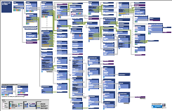

# JavaScript API for Office について
Office.js ファイルに実装されている JavaScript API for Office の機能領域について説明します。

 _ **適用対象:** Access apps for SharePoint?| apps for Office?| Excel?| Office Add-ins?| Outlook?| PowerPoint?| Project?| Word_

この記事では、JavaScript API for Office とその使用方法について取り上げます。リファレンス情報については、「 [JavaScript API for Office ](http://msdn.microsoft.com/ja-jp/library/b27e70c3-d87d-4d27-85e0-103996273298%28Office.15%29.aspx)」を参照してください。Excel Online を使用して Web ブラウザーで JavaScript API for Office コードを実行および編集する方法については、「 [Office の API チュートリアル](http://msdn.microsoft.com/ja-jp/office/dn449240.aspx)」を参照してください。Visual Studio プロジェクト ファイルを JavaScript API for Office の最新バージョンに更新する方法については、「 [JavaScript API for Office およびマニフェスト スキーマ ファイルのバージョンを更新する](../docs/develop/update-your-javascript-api-for-office-and-manifest-schema-version.md)」を参照してください。

 **ZoomIt による JavaScript API for Office のオブジェクト モデルの視覚的探索**

[](http://go.microsoft.com/fwlink/?LinkId=317268)
ズーム: [1.1](http://go.microsoft.com/fwlink/?LinkId=391751)
アドインの種類またはホストによるオブジェクト モデルの探索: [1.1](http://msdn.microsoft.com/library/b27e70c3-d87d-4d27-85e0-103996273298%28Office.15%29.aspx)

## アドインで JavaScript API for Office ライブラリを参照する


JavaScript API for Office ライブラリは、Excel-15.js、Outlook-15.js など、アプリケーション固有の実装を含む Office.js ファイルと関連 .js ファイルに実装されています。 `src` 属性が次の CDN URL に設定された `script` タグとを使用して、アドインの UI を実装する Web ページ (.html, .aspx、または .php ファイルなど) の `<head>` タグの内側にある [JavaScript API for Office ライブラリを参照](../../docs/develop/referencing-the-javascript-api-for-office-library-from-its-cdn.md)します。


```HTML
<script src="https://appsforoffice.microsoft.com/lib/1/hosted/Office.js"/>
```

これにより、アドインが最初に読み込まれるときに JavaScript API for Office ファイルのダウンロードとキャッシュを実行して、アドインが確実に指定したバージョンの最新の Office.js および関連ファイルを使用するようにします。


## アドインの初期化


 **適用対象:** すべてのアドインの種類

JavaScript API for Office は、 [Office](http://msdn.microsoft.com/library/c490b13d-ee52-4291-af5d-f4a5a11d3af0%28Office.15%29.aspx) オブジェクトを提供しています。このオブジェクトを使用すると、開発者は、Office アドイン の [initialize](http://msdn.microsoft.com/library/727adf79-a0b5-48d2-99c7-6642c2c334fc%28Office.15%29.aspx) イベントのリスナーを実装できます。API が読み込まれてアドインがユーザーのコンテンツの操作を開始できる状態になると、 **Office.initialize** イベントがトリガーされます。 **initialize** イベント ハンドラーのコードを使用すると、ユーザーに Excel のいくつかのセルを選択するよう促すメッセージを表示するなどの一般的なアドインの初期化のシナリオを実装してから、選択した値で初期化されたグラフを挿入することができます。また、初期化イベント ハンドラーを使用すると、バインドの確立、既定のアドインの設定値を使用するよう求めるメッセージの表示など、アドインのその他のユーザー設定のロジックを初期化することができます。

 **重要:** アドインに初期化タスクがない場合でも少なくとも、次の例のように、最小の **Office.initialize** イベント ハンドラー関数が含まれている必要があります。


```
Office.initialize = function () {
};
```

イベント ハンドラー  **Office.initialize** を含めていないと、アドインの起動時にエラーが発生するおそれがあります。また、ユーザーが Excel Online、PowerPoint Online、または Outlook Web App などの Office Online Web クライアントでアドインを使用しようとする場合、アドインの実行が失敗します。

アドインに複数のページが含まれている場合、新しいページが読み込まれるとき、そのページは  **Office.initialize** イベント ハンドラーを含んでいるかそのハンドラーを呼び出す必要があります。

アドインの初期化時のイベントのシーケンスの詳細については、「 [DOM とランタイム環境を読み込む](../../docs/develop/loading-the-dom-and-runtime-environment.md)」を参照してください。

作業ウィンドウとコンテンツ アドイン (Outlook アドインではない) では、 **initialize** イベント リスナー関数 の _reason_ パラメーターは、初期化をどのように行うかを指定する列挙体 [InitializationReason](http://msdn.microsoft.com/library/3a1fb60c-a6a7-4c73-b1d0-97096946382e%28Office.15%29.aspx) を提供します。たとえば、ユーザーが作業ウィンドウまたはコンテンツ アドインを Office クライアントのリボン UI から挿入した場合、またはアドインが既に含まれているドキュメントが開かれた場合、作業ウィンドウまたはコンテンツ アドインを初期化できます。

 **InitializationReason** 列挙体の値を使用すると、アドインが最初に挿入される場合とドキュメント内に既に存在する場合とで、それぞれ異なるロジックを実装できます。次の例は、前の例に追加できる簡単なロジックを示しており、 _reason_ 引数の値を使用して、作業ウィンドウ アドインまたはコンテンツ アドインが初期化された方法を示します。


```
Office.initialize = function (reason) {
    // Checks for the DOM to load using the jQuery ready function.
    $(document).ready(function () {
    // After the DOM is loaded, add-in-specific code can run.
    // Display initialization reason.
    if (reason == "inserted")
    write("The add-in was just inserted.");

    if (reason == "documentOpened")
    write("The add-in is already part of the document.");
    });
}

// Function that writes to a div with id='message' on the page.
function write(message){
    document.getElementById('message').innerText += message; 
}
```


## Context オブジェクト


 **適用対象:** すべてのアドインの種類

アドインが初期化されると、多数のさまざまなオブジェクトとランタイム環境でやり取りできます。アドインのランタイム コンテキストは、 [Context](http://msdn.microsoft.com/library/662883d5-b86f-4bdc-99f0-9ee9129ed16c%28Office.15%29.aspx) オブジェクトによって API に反映されます。 **Context** は中心的なオブジェクトで、これにより API の非常に重要なオブジェクト (たとえば、 [Document](http://msdn.microsoft.com/library/f8859516-cc1f-4b20-a8f3-cee37a983e70%28Office.15%29.aspx) オブジェクトや [Mailbox](../reference/outlook/Office.context.mailbox.md%28Office.15%29.md) オブジェクト) にアクセスできます。これらのオブジェクトにアクセスすると、次はドキュメントやメールボックスのコンテンツにアクセスできます。

たとえば、作業ウィンドウ アドインまたはコンテンツ アドインにおいて、 **Context** オブジェクトの [document](http://msdn.microsoft.com/library/92351713-9ea0-43e1-b549-dad93b3208b2%28Office.15%29.aspx) プロパティを使用して、 **Document** オブジェクトのプロパティおよびメソッドにアクセスし、Word 文書、Excel ワークシート、または Project スケジュールのコンテンツとやり取りできます。同様に、Outlook アドインにおいて、 **Context** オブジェクトの [mailbox](../reference/outlook/Office.context.mailbox.md%28Office.15%29.md) プロパティを使用して、 **Mailbox** オブジェクトのプロパティおよびメソッドにアクセスし、メッセージ、会議出席依頼または予定のコンテンツとやり取りできます。

 **Context** オブジェクトを使用すると、 [contentLanguage](http://msdn.microsoft.com/library/4fd063c2-0cd0-4b5b-8993-93d7ff8ce3bf%28Office.15%29.aspx) プロパティおよび [displayLanguage](http://msdn.microsoft.com/library/732ba34c-c99f-4c00-836d-4250eb7f0dac%28Office.15%29.aspx) プロパティにもアクセスできるので、ドキュメントやアイテム、またはホスト アプリケーションで使用するロケール (言語) を決定できます。また、 [roamingSettings](../reference/outlook/Office.context.html%28Office.15%29.md) プロパティを使用すると、 [RoamingSettings](https://dev.outlook.com/reference/add-ins/RoamingSettings.md%28Office.15%29.md) オブジェクトのメンバーにもアクセスできます。


## Document オブジェクト


 **適用対象:** コンテンツ アドインおよび作業ウィンドウ アドインの種類

Excel、PowerPoint、および Word のドキュメント データを操作するために、API には [Document](http://msdn.microsoft.com/library/f8859516-cc1f-4b20-a8f3-cee37a983e70%28Office.15%29.aspx) オブジェクトが用意されています。 **Document** オブジェクトのメンバーを使用すると、次のようにデータにアクセスできます。


- テキスト、隣接するセル (マトリックス)、またはテーブルの形式のアクティブな選択範囲への読み取りと書き込み。
    
- 表形式のデータ (マトリックスまたはテーブル)。
    
- バインド ( **Bindings** オブジェクトの "add" メソッドで作成)。
    
- カスタム XML パーツ (Word の場合のみ)。
    
- ドキュメント上のアドインごとに保持する設定またはアドインの状態。
    
また、 **Document** オブジェクトを使用すると、Project ドキュメント内のデータとやり取りすることができます。API の Project 固有の機能については、 [ProjectDocument](http://msdn.microsoft.com/library/1908af4f-93b9-4859-87e3-06942014fae1%28Office.15%29.aspx) 抽象クラスのメンバー内に文書化されています。Project 用の作業ウィンドウ アドインの作成の詳細については、「 [Project 用の作業ウィンドウ アドイン](../project/project-add-ins.md)」を参照してください。

これらのデータ アクセスの形式はすべて、抽象  **Document** オブジェクトのインスタンスから開始します。

作業ウィンドウ アプリまたはコンテンツ アドインが初期化されると、 **Context** オブジェクトの [document](http://msdn.microsoft.com/library/92351713-9ea0-43e1-b549-dad93b3208b2%28Office.15%29.aspx) プロパティを使用して **Document** オブジェクトのインスタンスにアクセスできます。 **Document** オブジェクトを使用すると、Word と Excel のドキュメントで共有される一般的なデータ アクセス関数を定義でき、Word 文書の **CustomXmlParts** オブジェクトにもアクセスできます。

 **Document** オブジェクトは、開発者がドキュメント コンテンツにアクセスするための 4 つの方法をサポートしています。


- 選択範囲ベースのアクセス
    
- バインドベースのアクセス
    
- カスタム XML パーツベースのアクセス (Word の場合のみ)
    
- ドキュメント全体へのアクセス (PowerPoint および Word のみ)
    
選択範囲ベースおよびバインドベースのデータ アクセス方法のしくみを理解するために、まず、データ アクセス API が、異なる Office アプリケーション間で一貫性のあるデータ アクセスを提供する方法について説明します。


### Office アプリケーション間での一貫性のあるデータ アクセス

 **適用対象:** コンテンツ アドインおよび作業ウィンドウ アドインの種類

異なる Office ドキュメント間でシームレスに動作する拡張機能を作成するために、JavaScript API for Office では、共通のデータ型と、異なるドキュメント コンテンツを 3 つの共通のデータ型に強制的に割り当てる機能を通じて、各 Office アプリケーションの特殊性を抽象化します。


#### 共通のデータ型

選択範囲ベースとバインドベースのどちらのデータ アクセスでも、ドキュメント コンテンツは、サポートされているすべての Office アプリケーション間に共通なデータ型を通じて公開されます。Office 2013では、3 つの主要なデータ型がサポートされています。


|**データ型**|**説明**|**ホスト アプリケーションのサポート**|
|:-----|:-----|:-----|
|テキスト|選択範囲またはバインド内のデータの文字列表現を提供します。|Excel 2013、Project 2013、および PowerPoint 2013 では、プレーン テキストのみがサポートされます。Word 2013 では、プレーン テキスト、HTML、および Office Open XML (OOXML) の 3 つのテキスト形式がサポートされます。Excel のセルでテキストが選択されている場合、セル内の一部のテキストのみが選択されていても、選択範囲ベースのメソッドでは、セルのすべてのコンテンツに対して読み取り、および書き込みを行います。Word や PowerPoint でテキストが選択されている場合、選択範囲ベースのメソッドでは、選択されている一連の文字に対してのみ読み取り、書き込みを行います。Project 2013 および PowerPoint 2013 では選択範囲ベースのデータ アクセスのみサポートしています。|
|マトリックス|選択範囲またはバインド内のデータを 2 次元の  **Array** として提供します。JavaScript では、これは、配列の配列として実装されています。たとえば、2 列の  **string** 値が 2 行ある場合、 ` [['a', 'b'], ['c', 'd']]` のようになり、1 列が 3 行ある場合は、 `[['a'], ['b'], ['c']]` のようになります。|マトリックス データ アクセスは Excel 2013 および Word 2013 でのみサポートされています。|
|テーブル|選択範囲またはバインド内のデータを [TableData](http://msdn.microsoft.com/library/2183ea52-5a40-4048-b9a4-7cd66bb0ad5d%28Office.15%29.aspx) オブジェクトとして提供します。 **TableData** オブジェクトは、 **headers** プロパティおよび **rows** プロパティを通じてデータを公開します。|テーブル データ アクセスは Excel 2013 と Word 2013 でのみサポートされています。|

#### データ型の強制型変換

 **Document** オブジェクトおよび [Binding](http://msdn.microsoft.com/library/42882642-d22b-47d2-a8d3-3aa8c6a4435e%28Office.15%29.aspx) オブジェクトにおけるデータ アクセス メソッドでは、これらのメソッドの _coercionType_ パラメーターおよび対応する [CoercionType](http://msdn.microsoft.com/library/735eaab6-5e31-4bc2-add5-9d378900a31b%28Office.15%29.aspx) 列挙値を使用した目的のデータ型の指定をサポートしています。バインドの実際の形状にかかわらず、さまざまな Office アプリケーションでは、要求されるデータ型にデータを強制的に型変換することによって、共通のデータ型をサポートします。たとえば、Word の表または段落が選択されている場合、開発者はそれをプレーン テキスト、HTML、Office Open XML、または表として読み取ることを指定でき、API 実装によって必要な変換やデータ変換が行われます。


 >**ヒント**   **どのようなタイミングでデータ アクセスにマトリックスを使用し、どのような場合にテーブルの coercionType を使用するか。**行と列が追加されたときに表形式データが動的に増えるようにし、またテーブル ヘッダーを使用する必要がある場合は、テーブル データ型を使用します ( **Document** または **Binding** オブジェクト データ アクセス メソッドの _coercionType_ パラメーターに `"table"` または **Office.CoercionType.Table** を指定)。データ構造体内での行と列の追加はテーブル データとマトリックス データの両方でサポートされていますが、行と列の追加はテーブル データでのみサポートされています。行と列を追加する予定がなく、データにヘッダー機能が必要ない場合は、マトリックス データ型を使用します (データ アクセス メソッドの  _coercionType_ パラメーターに `"matrix"` または **Office.CoercionType.Matrix** を指定)。このデータ型では、データとのやり取りについて、より単純なモデルを採用しています。

指定された型にデータを強制的に型変換できない場合は、コールバック内の [AsyncResult.status](http://msdn.microsoft.com/library/eec9c712-79eb-4365-88a1-6d77649727c1%28Office.15%29.aspx) プロパティが `"failed"` を返すため、 [AsyncResult.error](http://msdn.microsoft.com/library/51c46d36-972d-4d82-91aa-da99cbeb8d4f%28Office.15%29.aspx) プロパティを使用して [Error](http://msdn.microsoft.com/library/36d1d048-b888-4bb5-9321-d340bcbc86f4%28Office.15%29.aspx) オブジェクトにアクセスし、メソッド呼び出しが失敗した理由を確認できます。


## Document オブジェクトによる選択範囲の操作


 **Document** オブジェクトが公開しているメソッドを使用すると、ユーザーの現在の選択範囲に対して、"取得したら破棄する (get and forget)" 方式で読み取りと書き込みを行うことができます。これは、 **Document** オブジェクトの **getSelectedDataAsync** メソッドと **setSelectedDataAsync** メソッドで行います。

選択範囲に関する操作の実行方法を示すコード例については、「 [ドキュメントまたはスプレッドシート内のアクティブな選択範囲へのデータの読み取りおよび書き込み](../../docs/develop/read-and-write-data-to-the-active-selection-in-a-document-or-spreadsheet.md)」を参照してください。


## Bindings オブジェクトおよび Binding オブジェクトによるバインドの操作


バインドベースのデータ アクセスを使用すると、コンテンツ アドインおよび作業ウィンドウ アドインで、バインドに関連付けられた識別子を介して、ドキュメントまたはスプレッドシートの特定の領域に一貫性をもってアクセスできます。アドインは、最初に、ドキュメントの部分と一意の ID を関連付けるいずれかのメソッド ([addFromPromptAsync](http://msdn.microsoft.com/library/9dc03608-b08b-4700-8be1-3c86ae236799%28Office.15%29.aspx)、 [addFromSelectionAsync](http://msdn.microsoft.com/library/edc99214-e63e-43f2-9392-97ead42fc155%28Office.15%29.aspx)、または [addFromNamedItemAsync](http://msdn.microsoft.com/library/afbadac7-60c7-47cb-9477-6e9466ded44c%28Office.15%29.aspx)) を呼び出すことによって、バインドを確立する必要があります。バインドが確立されると、アドインは提供された ID を使用して、ドキュメントまたはスプレッドシート内の関連付けられた領域に含まれるデータにアクセスできます。バインドを作成すると、アドインには次のようなメリットがあります。


- 表、範囲、またはテキスト (隣接する一連の文字) など、サポートされている Office アプリケーション全体に共通のデータ構造へのアクセスを許可します。
    
- ユーザーによる選択を必要とせずに、読み取り/書き込み操作ができます。
    
- アドインとドキュメント内のデータの間にリレーションシップが確立されます。バインドはドキュメント内に保持され、後でアクセスできます。
    
また、バインドを確立すると、ドキュメントまたはスプレッドシートの特定の領域を範囲とする、データおよび選択範囲の変更イベントをサブスクライブできます。つまり、ドキュメントまたはスプレッドシート全体の全般的な変更ではなく、バインドされた領域内で発生する変更のみがアドインに通知されます。

[Bindings](http://msdn.microsoft.com/library/09979e31-3bfb-45be-adda-0f7cc2db1fe1%28Office.15%29.aspx) オブジェクトが公開している [getAllAsync](http://msdn.microsoft.com/library/ef902b73-cc4c-4551-95de-d8a51eeba82f%28Office.15%29.aspx) メソッドを使用すると、ドキュメントまたはスプレッドシートで確立されている一連のすべてのバインドにアクセスできます。個々のバインドに ID でアクセスするには、 [Bindings.getBindingByIdAsync](http://msdn.microsoft.com/library/2727c891-bc05-465c-9324-113fbfeb3fbb%28Office.15%29.aspx) メソッドまたは [Office.select](http://msdn.microsoft.com/library/23aeb136-da1f-4127-a798-99dc27bc4dae%28Office.15%29.aspx) メソッドを使用します。 **Bindings** オブジェクトのいずれかのメソッド ([addFromSelectionAsync](http://msdn.microsoft.com/library/edc99214-e63e-43f2-9392-97ead42fc155%28Office.15%29.aspx)、 [addFromPromptAsync](http://msdn.microsoft.com/library/9dc03608-b08b-4700-8be1-3c86ae236799%28Office.15%29.aspx)、 [addFromNamedItemAsync](http://msdn.microsoft.com/library/afbadac7-60c7-47cb-9477-6e9466ded44c%28Office.15%29.aspx)、または [releaseByIdAsync](http://msdn.microsoft.com/library/ad285984-8b44-435d-9b84-f0ade570c896%28Office.15%29.aspx)) を使用すると、新しいバインドを確立したり既存のバインドを削除したりできます。

 **addFromSelectionAsync** メソッド、 **addFromPromptAsync** メソッド、または **addFromNamedItemAsync** メソッドでバインドを作成する場合、 _bindingType_ パラメーターで指定するバインドには 3 種類あります。


|**バインドの種類**|**説明**|**ホスト アプリケーションのサポート**|
|:-----|:-----|:-----|
|テキスト バインド|テキストとして表現できるドキュメントの領域にバインドします。|Word では、連続する選択範囲の大部分が有効ですが、Excel では、単一セルの範囲のみがテキスト バインドの対象です。Excel では、プレーン テキストのみがサポートされます。Word では、3 つの形式 (プレーン テキスト、HTML、および Open XML for Office) がサポートされます。|
|マトリックス バインド|ヘッダーのない表形式データが含まれるドキュメントの固定領域にバインドします。マトリックス バインド内のデータは、2 次元の  **Array** として書き込みまたは読み取りが行われます。JavaScript では、これは、配列の配列として実装されています。たとえば、2 列の **string** 値が 2 行ある場合は ` [['a', 'b'], ['c', 'd']]` のように書き込みまたは読み取りが行われ、1 列が 3 行ある場合は `[['a'], ['b'], ['c']]` のように書き込みまたは読み取りが行われます。|Excel では、セルの連続する選択範囲を使用してマトリックス バインドを確立できます。Word では、表のみがマトリックス バインドをサポートします。|
|テーブル バインド|ヘッダーのあるテーブルが含まれるドキュメントの領域にバインドします。テーブル バインド内のデータは、[TableData](http://msdn.microsoft.com/library/2183ea52-5a40-4048-b9a4-7cd66bb0ad5d%28Office.15%29.aspx) オブジェクトとして書き込みまたは読み取りが行われます。 **TableData** オブジェクトは **headers** および **rows** プロパティを通じてデータを公開します。|Excel または Word の表はすべて、テーブル バインドの基礎にできます。テーブル バインドを確立すると、ユーザーが表に追加する新しい各行または各列が、自動的にバインドに含まれます。|
 **Bindings** オブジェクトの 3 つの "add" メソッドのいずれかを使用してバインドを作成すると、 [MatrixBinding](http://msdn.microsoft.com/library/35e8568e-9129-4c00-b30f-d8c3b2555f1e%28Office.15%29.aspx)、 [TableBinding](http://msdn.microsoft.com/library/1508795b-1c70-456c-b3bf-666d40cf8f50%28Office.15%29.aspx)、または [TextBinding](http://msdn.microsoft.com/library/6b71b21d-f64d-425c-99d9-c62b2a9969be%28Office.15%29.aspx) のうち対応するオブジェクトのメソッドを使用して、バインドのデータおよびプロパティを操作できます。この 3 つのオブジェクトはすべて、 **Binding** オブジェクトの [getDataAsync](http://msdn.microsoft.com/library/5372ffd8-579d-4fcb-9e5b-e9a2128f3201%28Office.15%29.aspx) メソッドおよび [setDataAsync](http://msdn.microsoft.com/library/6a59bb6d-40b6-4a95-9b98-d70d4616de09%28Office.15%29.aspx) メソッドを継承しているので、バインドされたデータを操作できます。

バインドに関する操作の実行方法を示すコード例については、「 [ドキュメントまたはスプレッドシート内の領域へのバインド](../../docs/develop/bind-to-regions-in-a-document-or-spreadsheet.md)」を参照してください。


## CustomXmlParts オブジェクトおよび CustomXmlPart オブジェクトによるカスタム XML パーツの操作


 **適用対象:** Word の作業ウィンドウ アドイン

API の [CustomXmlParts](http://msdn.microsoft.com/library/ba40cd4c-29bb-4f31-875d-6f1382fd1ee8%28Office.15%29.aspx) オブジェクトと [CustomXmlPart](http://msdn.microsoft.com/library/83f0e668-8236-4f2f-a20f-b173a9e3f65f%28Office.15%29.aspx) オブジェクトを使用すると、Word 文書内のカスタム XML パーツにアクセスできます。これにより、文書のコンテンツに対する XML 主導の操作が可能になります。 **CustomXmlParts** オブジェクトおよび **CustomXmlPart** オブジェクトとの連携のデモについては、「 [Word-Add-in-Work-with-custom-XML-parts](https://github.com/OfficeDev/Word-Add-in-Work-with-custom-XML-parts)」のコード例を参照してください。


## getFileAsync メソッドを使用したドキュメント全体の操作


 **適用対象:** Word および PowerPoint の作業ウィンドウ アドイン

[Document.getFileAsync](http://msdn.microsoft.com/library/78047418-89c4-4c7d-9427-4735b8559518%28Office.15%29.aspx) メソッド、および [File](http://msdn.microsoft.com/library/04923ddf-8efa-459f-aed5-d8c06385ca50%28Office.15%29.aspx) オブジェクトと [Slice](http://msdn.microsoft.com/library/011b5647-639b-4b06-8625-ba9de01bed4b%28Office.15%29.aspx) オブジェクトのメンバーは、一度に最大で 4 MB ずつのスライス (チャンク) に分割して Word および PowerPoint ドキュメント ファイル全体を取得する機能を提供します。詳細については、「 [アドインのドキュメントですべてのファイルを取得する方法](../../docs/develop/get-the-whole-document-from-an-add-in-for-powerpoint-or-word.md)」を参照してください。


## Mailbox オブジェクト


 **適用対象:** Outlook アドイン

Outlook アドインでは、主に [Mailbox](../reference/outlook/Office.context.mailbox.html%28Office.15%29.md) オブジェクトにより公開されている API のサブセットを使用します。Outlook アドイン専用のオブジェクトおよびメンバー (たとえば、 [Item](https://dev.outlook.com/reference/add-ins/Office.context.mailbox.item.html%28Office.15%29.md) オブジェクトなど) にアクセスするには、次のコード行に示すように、 **Context** オブジェクトの [mailbox](https://dev.outlook.com/reference/add-ins/Office.context.mailbox.md%28Office.15%29.md) プロパティを使用して、 **Mailbox** オブジェクトにアクセスします。


```
// Access the Item object.
var item = Office.context.mailbox.item;

```

さらに、Outlook アドインでは次のオブジェクトを使用できます。


-  **Office** オブジェクト?初期化で使用します。
    
-  **Context** オブジェクト?コンテンツおよび表示言語のプロパティへのアクセスで使用します。
    
-  **RoamingSettings** オブジェクト?Outlook アドイン固有のカスタム設定を、アドインがインストールされているユーザーのメールボックスに保存する際に使用します。
    
Outlook アドインでの JavaScript の使用については、「 [Outlook アドイン](../outlook/outlook-add-ins.md)」および「 [Outlook アドインのアーキテクチャと機能の概要](../outlook/overview.md)」を参照してください。


## API サポート マトリックス


この表は、アドインの種類 (コンテンツ、作業ウィンドウ、および Outlook) 全体でサポートされている API と機能、および [1.1 アドイン マニフェスト スキーマと機能 (JavaScript API for Office v1.1 でサポート)](../docs/develop/update-your-javascript-api-for-office-and-manifest-schema-version.md) を使用して [アドインがサポートする Office のホスト アプリケーション](cff9fbdf-a530-4f6e-91ca-81bcacd90dcd.md) を指定する際にこれらの API と機能をホストする Office アプリケーションについてまとめたものです。


|||||||||
|:-----|:-----|:-----|:-----|:-----|:-----|:-----|:-----|
||**ホスト名**|データベース|ブック|メールボックス|プレゼンテーション|ドキュメント|プロジェクト|
||**サポートされている** **ホスト アプリケーション**|Access Web アプリ|ExcelExcel Online|OutlookOutlook Web Appデバイス用 OWA|PowerPointPowerPoint Online|Word|Project|
|**サポートされているアドインの種類**|コンテンツ|はい|はい||はい|||
||作業ウィンドウ||はい||はい|√|はい|
||Outlook|||はい||||
|**サポートされているAPI 機能**|テキストの読み取り/書き込み||はい||はい|はい|√読み取り専用|
||マトリックスの読み取り/書き込み||はい|||はい||
||テーブルの読み取り/書き込み||はい|||はい||
||HTML の読み取り/書き込み|||||はい||
||Office Open XML の読み取り/書き込み|||||はい||
||タスク、リソース、ビュー、フィールド プロパティの読み取り||||||はい|
||選択変更イベント||はい|||はい||
||ドキュメント全体の取得||||はい|v||
||バインドとイベント バインド|v完全および部分的なテーブル バインドのみ|はい|||はい||
||カスタム XML パーツの読み取り/書き込み|||||はい||
||アドイン状態データの保持 (設定)|vホスト アドイン別|√ドキュメント別|√メールボックス別|√ドキュメント別|√ドキュメント別||
||設定変更イベント|はい|はい||はい|はい||
||アクティブ ビュー モードおよびビュー変更イベントの取得||||はい|||
||ドキュメント内の場所に移動||はい||はい|はい||
||ルールと RegEx を使用した文脈からのアクティブ化|||はい||||
||アイテム プロパティの読み取り|||はい||||
||ユーザー プロファイルの読み取り|||はい||||
||添付ファイルの取得|||はい||||
||ユーザー ID トークンの取得|||はい||||
||Exchange Web サービスの呼出|||はい||||
