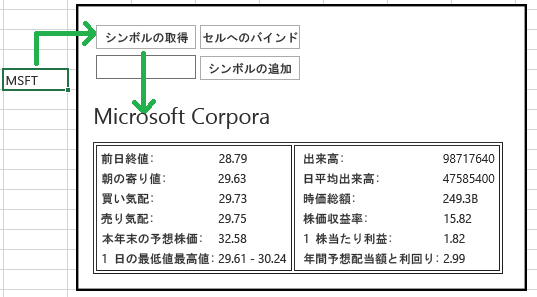
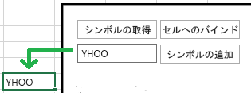
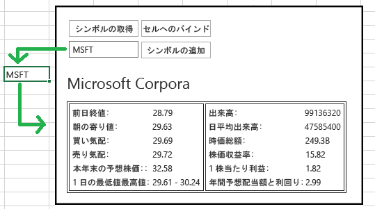

# Napa Office 365 開発ツールを使用して Excel 用コンテンツ アドインを作成する
Napa Office 365 開発ツール を使用して、ワークシートから株式銘柄コードを取得し、このコードに関連するデータをアドインに表示する Excel のコンテンツ アドインを作成します。また、このアドインでは、データをワークシートに書き戻す方法、イベントを処理する方法、およびワークシートのセルにバインドする方法も示されます。

 _ **適用対象:** apps for Office?| Excel?| Office Add-ins_

また、 [Visual Studio](http://msdn.microsoft.com/ja-jp/library/a23c5ce8-6de3-40f6-a86a-85d3592bef3e%28Office.15%29.aspx) や [テキスト エディター](http://msdn.microsoft.com/ja-jp/library/d5411d35-9ef6-4e21-ba2b-4d2b1ee81359%28Office.15%29.aspx)を使用して作業ウィンドウ アドインとコンテンツ アドインを作成することもできます。どのツールを使用するか分からない場合は、「 [開発の基本事項](privacy-and-security.md#StartBuildingApps_DevelopmentBasics)」を参照してください。

Napa の詳細については、「 [Napa Office 365 開発ツールで Office アドインを作成する](create-office-add-ins-with-napa.md)」を参照してください。


## 前提条件


- [Microsoft アカウント](http://www.microsoft.com/ja-jp/account/default.aspx)
    
- [Napa Office 365 開発ツール](https://www.napacloudapp.com/) Web アプリの URL
    

## 基本 Office アドインの作成


1. ブラウザーで [Napa Office 365 開発ツール](https://www.napacloudapp.com/) Web アプリを開き、Microsoft アカウントの資格情報を使用してサインインします。
    
2.  **[新しいプロジェクトの追加]** タイルをクリックします。
    
     **[新しいプロジェクトの追加]** タイルは、他のプロジェクトを既に作成している場合にのみ表示されます。これが最初のプロジェクトの場合は、次の手順に進んでください。
    

    **[新しいプロジェクト] タイル**

    

3.  **[Office のコンテンツ アドイン]** タイルを選択し、プロジェクトに「MyFirstContentAddin」という名前を付けます。既定の [ **基本のアドイン**] オプションを選択してから、 [ **作成**] ボタンを選択します。
    
    **[コンテンツ アドイン] タイル**

    
    コード エディターが開き、既定の Web ページが表示されます。このページには、何も作業しなくても実行できるサンプル コードが既に含まれています。
    

### サンプル Office アドインの実行


1. ページの脇にある  **[実行]** ボタン
![[実行] ボタン](../../images/Apps_NAPA_Run_Button.png)をクリックします。
    
    Excel Online が開き、サンプル Office アドインが表示されます。 **[ブックの編集] > [Excel Online で編集]** を選択して、アプリの各機能を確認してください。
    
2. 操作を確認できたら、Excel Online を終了します。
    

## プロジェクトへの HTML ファイルと JavaScript ファイルの追加


1. Napa で、[ **新しいフォルダー**] ボタンをクリックします。
    
2. フォルダーに「 **MyAddinPage**」という名前を付けます。
    
3.  **MyAddinPage** フォルダーのショートカット メニューを開き (フォルダーを右クリックする)、 **[新しいファイルの追加]** をクリックします。
    
     **[新しいファイル]** ダイアログ ボックスが開きます。
    
4.  **[Html ページ]** タイルを選択し、ファイルに「MyAddinPage」という名前を付けて、 **[作成]** をクリックします。
    
5.  **MyAddinPage** フォルダーのショートカット メニューを開き、 **[新しいファイルの追加]** をクリックします。
    
     **[新しいファイル]** ダイアログ ボックスが開きます。
    
6.  **[JavaScript ファイル]** タイルを選択し、ファイルに「MyAddinPage」という名前を付けて、 **[作成]** ボタンをクリックします。
    
    次に、アドインのルック アンド フィールを変更して、作成した HTML ページを指定するようにします。
    

## アドインのプロパティを変更する


1. ページの脇にある  **[プロパティ]** ボタン
![[プロパティ] ボタン](../../images/Apps_Napa_Properties_Button.png)をクリックします。
    
    Office アドインのプロパティが表示されます。
    
2. 次のプロパティを設定します。
    
      -  **[名前]** プロパティを「最初のコンテンツ アドイン」として指定します
    
  -  **[StartPage]** を「MyAddinPage/MyAddinPage.html」として指定します
    
  -  **[説明]** を「このアドインはデータをセルから取得し、セルからデータを取得し、セルにデータを書き込みます。このアドインは、ワークシート内のイベントに応答もします。」として指定します
    
  -  **[初期幅]** を 520 として指定します
    
  -  **[初期の高さ]** を 400 として指定します
    

     **[名前]** プロパティと **[説明]** プロパティは、Office アプリケーションで利用できるアドインの一覧にアドインが表示されたときに、ユーザーがアドインの用途を理解するのに役立ちます。 [サイズ] プロパティでは、アドインが必要とする領域を指定します。 **[スタート ページ]** プロパティは、プロジェクトを開始したときに表示されるページを指定します。
    
3.  **[プロパティ]** ページの下部にある **[適用]** ボタンを選択し、左側のツール バーの **[エクスプローラー]** ボタン
![[探索] ボタン](../../images/Apps_Napa_Explore_Button.png) を選択します。これにより、プロパティの値が保存され、 [エクスプローラー] ページが開きます。
    
     >**メモ**   **プロパティ** エディターには、Office アドインの最も一般的な設定が表示されますが、Office アドインで使用可能なすべての設定が表示されるわけではありません。シナリオで **プロパティ** エディターに表示されない設定を変更する必要がある場合は、[Visual Studio](http://msdn.microsoft.com/ja-jp/library/a23c5ce8-6de3-40f6-a86a-85d3592bef3e%28Office.15%29.aspx) または [テキスト エディター](http://msdn.microsoft.com/ja-jp/library/7aac2fdc-1a04-45ec-a1dc-da26e646a364%28Office.15%29.aspx)を使用してアドインを作成することができます。

## ワークシートからデータを取得する


Office アドイン では、1 つのセルまたはセルのコレクションの値を取得できます。ここで、最も基本的なタスクは、ユーザーがワークシートで選択する 1 つのセルの値を取得することです。これらの手順を完了したら、Excel でセルを選択し、アドインのボタンを選択します。選択したセルのデータがアドインのコントロールに表示されます。


1. ページの脇で  **[MyAddinPage.html]** を選択します。
    
    コード エディターに MyAddinPage Web ページが表示されます。
    
2.  `<head>` タグ内のすべてのコード ( `<head>` の開始タグと終了タグを含む) を次のコードで置き換えます。
    
  ```HTML
  <head>
    <meta charset="UTF-8" />
    <meta http-equiv="X-UA-Compatible" content="IE=Edge" />
    <title></title>
    <script src="https://ajax.aspnetcdn.com/ajax/jQuery/jquery-1.9.1.min.js" type="text/javascript"></script>
    
    <link href="../Content/Office.css" rel="stylesheet" type="text/css" />
    <script src="https://appsforoffice.microsoft.com/lib/1/hosted/Office.js" type="text/javascript"></script>
    
    <link href="../App/App.css " rel="stylesheet" type="text/css" />
    <script src="../App/App.js" type="text/javascript"></script>
    
    <script src="MyAddinPage.js" type="text/javascript"></script>
</head>

  ```


    このコードにより、既定の Home.html ファイルと同じ JavaScript ライブラリと CSS ファイルが MyAddinPage Web ページから参照されます。次の表は、各ファイル参照について説明しています。
    

|**ファイル**|**説明**|
|:-----|:-----|
|**App.css、Office.css**|プロジェクトの既定の CSS ファイル。これらのページを使用して、Web ページの外観の特定の部分を定義できます。|
|**MyAddinPage.js**|ページ用に作成した JavaScript ファイル。|
|**App.js**|プロジェクトの  **Add-in** フォルダーに配置された App.js は、アドインの既定の JavaScript ファイルであり、作業を開始するためのコード例が含まれています。|
3.  `<body>` の開始タグと終了タグの間の内容を次のコードで置き換えます。
    
    次のコードは、このチュートリアルを通じて使用するすべてのコントロールを追加します。また、ワークシートに追加する銘柄コードに関連する株式データを含む表も追加します。
    


  ```HTML
  <body>
<div style="padding: 15px; overflow: auto; border: .2em solid #000;">

<table>
<tr>
<td>

<button id="get-text" style="width: 100px;">Get symbol</button>
</td>
<td>
<button id="bind-text" style="width: 100px;">Bind to cell</button>
</td>
</tr>
<tr>
<td>
<input id="input" style="width: 100px;"/>
</td>
<td>
<button id="add-text" style="width: 100px;">Add symbol</button>
</td>
</tr>

</table>
<h1><div id="stock-name"></div></h1>
<table border="true">
<tr>
<td>
<table>
<tr>
<td>Prev close:</td>
<td id="prev-close"></td>
</tr>

<tr>
<td>Open:</td>
<td id="open"></td>
</tr>

<tr>
<td>Bid:</td>
<td id="bid"></td>
</tr>
<tr>
<td>Ask:</td>
<td id="ask"></td>
</tr>
<tr>
<td>1y Target Est:</td>
<td id="target-est"></td>
</tr>
<tr>
<td>Days range:</td>
<td id="days-range"></td>
</tr>
</table>
</td>
<td>
    <table>
<tr>
<td>Volume:</td>
<td id="volume"></td>
</tr>

<tr>
<td>Avg daily volume:</td>
<td id="avg-volume"></td>
</tr>

<tr>
<td>Market capitalization:</td>
<td id="market-cap"></td>
</tr>
<tr>
<td>PE Ratio:</td>
<td id="pe-ratio"></td>
</tr>
<tr>
<td>Earnings p share:</td>
<td id="earnings"></td>
</tr>
<tr>
<td>Dividend yield:</td>
<td id="yield"></td>
</tr>
</table>
</td>
</tr>
</table>
</div>

</body>


  ```

4. MyAddinPage.js ファイルを開き、次のコードを追加します。
    
    コードを実行する際、株式銘柄をセルに追加します。このコードは、株式銘柄コードを取得し、この銘柄コードに関連するデータを表に表示します。
    


  ```
  /// <reference path../../Scripts/App.js" />

(function () {
    "use strict";
    
    // The initialize function must be run each time a new page is loaded
    Office.initialize = function (reason) {
        $(document).ready(function () {


$('#get-text').click(getTextFromDocument);      
        });
    }

})();
function getTextFromDocument() {

    Office.context.document.getSelectedDataAsync(Office.CoercionType.Text,
        { valueFormat: "unformatted", filterType: "all" },

        function (asyncResult) {
            showStockData(asyncResult.value);
        });

}
function showStockData(symbol){
    // Yahoo YQL - http://developer.yahoo.com/yql/ 
var yql = 'select * from yahoo.finance.quotes where symbol in (\'' + symbol + '\')';
var queryURL = 'https://query.yahooapis.com/v1/public/yql?q=' + yql + '&amp;format=json&amp;env=http%3A%2F%2Fdatatables.org%2Falltables.env&amp;callback=?';

$.getJSON(queryURL, function(results) {
if(results.query.count > 0)
{
var quotes = results.query.results.quote;

$('#stock-name').text(quotes.Name);
$('#prev-close').text(quotes.PreviousClose);
$('#open').text(quotes.Open);
$('#bid').text(quotes.Bid);
$('#ask').text(quotes.Ask);
$('#target-est').text(quotes.OneyrTargetPrice);
$('#days-range').text(quotes.DaysRange);
$('#volume').text(quotes.Volume);
$('#avg-volume').text(quotes.AverageDailyVolume);
$('#market-cap').text(quotes.MarketCapitalization);
$('#pe-ratio').text(quotes.PERatio);
$('#earnings').text(quotes.EarningsShare);
$('#yield').text(quotes.DividendYield);

}

});

}


  ```


     `getSelectedDataAsync` の呼び出し時に、 `asyncResult` という名前のパラメーターを使用して匿名関数をコールバック引数として渡します。コールバック関数は、実行されると `asyncResult` パラメーターを使用して `AsyncResult` オブジェクトの value プロパティにアクセスして、ユーザーが選択したセル内のデータを表示します。
    
     >**メモ**  JavaScript API for Office の他のメソッドと同様に、このメソッドも非同期であり、このメソッドが実行している間も アドインは他の操作を実行できます。

### 実行する


1. ページの脇にある  **[実行]** ボタン
![[実行] ボタン](../../images/Apps_NAPA_Run_Button.png)をクリックします。
    
    Excel Online が開き、Office アドインが表示されます。 **[ブックの編集] > [Excel Online で編集]** を選択します。
    
2. 任意のセルに「MSFT」と入力します。
    
    この略語は Microsoft の株式銘柄コードです。
    
3. Office アドインで、 [ **Get symbol**] ボタンをクリックします。
    
    銘柄コード MSFT に関連するデータが表に表示されます。
    

    **アドインの表に表示されたデータ**

    
    この例は、セルからデータを取得する方法を示しています。アドインでは、この手法を使用して、データベース内の情報の検索、別のサービスからの情報の取得、または計算の実行が可能となります。 `getSelectedDataAsync` メソッドにパラメーターとして渡す匿名関数に、このような操作を実行するコードを追加できます。
    
4. Excel Online を閉じます。
    
    次の例では、ユーザーがアドインのコントロールに入力したデータを取得し、そのデータをワークシートのセルに配置します。
    

## ワークシートの選択したセルにデータを配置する


Office アドイン は、任意のセルまたはセルのコレクションにデータを配置できます。ここで、最も基本的なタスクは、ユーザーがワークシートで選択したセルにデータを配置することです。次の手順を完了すると、ユーザーは、アドインのボタンをクリックして、ワークシートのセルにテキストを追加できるようになります。


1. コード エディターで、 **MyAddinPage.js** ファイルを開いてから、次のコードを追加します。
    
  ```
  function addTextToDocument() {

    var e = document.getElementById("input");
    var text = e.value;

    Office.context.document.setSelectedDataAsync(text,
        function (asyncResult) {});
}

  ```


    このコードは、MyAddinPage.html にある  `input` テキスト ボックスからテキストを取得し、そのテキストをユーザーがワークシートで選択するセルに配置します。
    
2.  `initialize` 関数を次のコードで置き換えます。
    
  ```
  Office.initialize = function (reason) {
        $(document).ready(function () {
$('#get-text').click(getTextFromDocument);
$('#add-text').click(addTextToDocument);
            
        });
    }

  ```


### 実行する


1. ページの脇にある  **[実行]** ボタン
![[実行] ボタン](../../images/Apps_NAPA_Run_Button.png)をクリックします。
    
    Excel Online が開き、Office アドインが表示されます。
    
2. Excel Online で任意のセルを選択します。
    
3. アドインで  **[シンボルの追加]** ボタンの横のテキスト ボックスに「 **YHOO**」と入力し、 **[シンボルの追加]** ボタンをクリックします。
    
    選択したセルにテキスト " **YHOO**" が表示されます。
    

    **選択したセルに表示されたテキスト「MSFT」**

    
    これは簡単な例ですが、セルにデータを配置する方法を示しています。Office アドイン で株式サービスを使用して株の終値を取得し、その終値をセルに追加することで、他の計算を実行できます。
    
4. Excel Online を閉じます。
    

## ワークシートのイベントを処理する


ここまで、Office アドインでは、ユーザーはデータを取得および設定するためにボタンを選択する必要がありました。次の 2 つの手順を実行することにより、セルを選択したときにデータを自動的に取得および設定できるようになります。


1. コード エディターで  **MyAddinPage.js** ファイルを開き、 `initialize` 関数を次のコードに置き換えます。
    
  ```
  Office.initialize = function (reason) {
        $(document).ready(function () {
$('#get-text').click(getTextFromDocument);
$('#add-text').click(addTextToDocument);
        Office.context.document.addHandlerAsync
        (Office.EventType.DocumentSelectionChanged, updateApp);
            
        });
    }

  ```


    このコードでは、ページ上の各ボタンに関数をバインドし、ユーザーがセルを選択したときに呼び出されるイベント ハンドラーを追加します。
    
2. 次のコードを MyAddinPage.js ファイルに追加します。
    
  ```
  function updateApp()
{
        getTextFromDocument();
}

  ```


    ユーザーがセルを選択すると、このメソッドが呼び出されます。このコードは、このチュートリアルで以前に定義したメソッドを呼び出します。このメソッドは、選択されたセルの値 (株式銘柄コード) を取得し、その銘柄コードに関連するデータを表に表示します。
    

### 実行する


1. ページの脇にある  **[実行]** ボタン
![[実行] ボタン](../../images/Apps_NAPA_Run_Button.png)をクリックします。
    
    Excel Online が開き、Office アドインが表示されます。 **[ブックの編集] > [Excel Online で編集]** を選択します。
    
2. アドインで  **[シンボルの追加]** ボタンの横のテキスト ボックスに「 **MSFT**」と入力し、 **[シンボルの追加]** ボタンをクリックします。
    
3. 別のセルを選択し、" **MSFT**" を含むセルを選択します。
    
    銘柄コード  **MSFT** の銘柄データが表に表示されます。
    
4. Excel Online を閉じます。
    

## ワークシートのセルにバインドする


データを取得および設定する最も高度な方法は、ワークシートの単一セルまたは一連のセルへのバインドを確立することです。アドインで使用するセルを選択するように求めるメッセージをユーザーに表示できます。このようにすると、それらのセルからのデータの取得や、それらのセルへのデータの配置をいつでも実行できるようになります。


1. コード エディターで MyAddinPage.js ファイルを開き、次のコードを追加します。このコードは、ユーザーが選択したセルへのバインドを確立します。また、バインドされたセルのデータが変更されたときに呼び出されるメソッドも定義します。
    
  ```
  function addBindingFromSelection() {
    Office.context.document.bindings.addFromSelectionAsync(Office.BindingType.Text, { id: 'MyBinding' },
        function (asyncResult) {
            Office.select("bindings#MyBinding").addHandlerAsync
               (Office.EventType.BindingDataChanged, onBindingSelectionChanged);
        }
    );
}


function onBindingSelectionChanged(eventArgs) {

    Office.select("bindings#MyBinding").getDataAsync
        (function (asyncResult) {

            if (asyncResult.value !== "") {
                showStockData(asyncResult.value);
            }

         });
}

  ```

2.  `initialize` 関数を次のコードで置き換えます。
    
  ```
  Office.initialize = function (reason) {
        $(document).ready(function () {
$('#get-text').click(getTextFromDocument);
$('#add-text').click(addTextToDocument);
$('#bind-text').click(addBindingFromSelection);

        Office.context.document.addHandlerAsync
        (Office.EventType.DocumentSelectionChanged, updateApp);

        });
    }

  ```


### 実行する


1. ページの脇にある  **[実行]** ボタン
![[実行] ボタン](../../images/Apps_NAPA_Run_Button.png)をクリックします。
    
    Excel Online が開き、Office アドインが表示されます。 **[ブックの編集] > [Excel Online で編集]** を選択します。
    
2. Excel Online で任意のセルを選択します。次に、Office アドインで [ **Bind to cell**] ボタンをクリックします。
    
3. アドインで  **[シンボルの追加]** ボタンの横のテキスト ボックスに「 **MSFT**」と入力し、 **[シンボルの追加]** ボタンをクリックします。
    
    選択したセルにテキスト " **MSFT**" が表示されます。セルの値が変更されたため、そのセルに関連するデータが表示されます。
    

    **銘柄コード MSFT のデータを示す表**

    

4. Excel Online を閉じます。
    

## Internet Explorer でコンテンツ アドインをデバッグする


Excel Online でアドインを起動し、Internet Explorer (IE) を使用している場合は、F12 開発者ツールを使用して、コンテンツ アドインの JavaScript、HTML、およびカスケード スタイル シート (CSS) をデバッグできます。

F12 ツールを開き、デバッガーを起動して、MyAddinPage.js ファイルのコードの特定の行で強制的に実行を停止する方法を以下に示します。


1. ページの脇にある  **[実行]** ボタン
![[実行] ボタン](../../images/Apps_NAPA_Run_Button.png)をクリックします。
    
    Excel Online が開き、Office アドインが表示されます。 **[ブックの編集] > [Excel Online で編集]** を選択します。
    
2. キーボードの F12 キーを押します。
    
    F12 ツールが別ウィンドウに表示されます。
    
3. F12 ツール ウィンドウで、 [ **デバッガー**] タブを開きます。
    
4. Ctrl + O キーボード ショートカットを使用してドキュメントを開き、フィルターのテキスト ボックスに「MyAddinPage.js」と入力します。
    
    MyAddinPage.js ファイルの内容が、ウィンドウに表示されます。
    
5.  `addTextToDocument` メソッドにブレークポイントを設定します。
    
    F12 ツール ウィンドウでブレークポイントを設定する方法の詳細については、「[コード実行の中断](http://go.microsoft.com/fwlink/?LinkID=267272)」を参照してください。
    
6. アドインで  **[シンボルの追加]** ボタンの横のテキスト ボックスに「 **MSFT**」と入力し、 **[シンボルの追加]** ボタンをクリックします。
    
    F12 ツール ウィンドウで、 `addTextToDocument` メソッドの場所で実行が停止します。
    
    詳細については、「 [F12 開発者用ツール](http://msdn.microsoft.com/library/ie/bg182326%28v=vs.85%29)」を参照してください。
    
    Internet Explorer 以外のブラウザーを使用する場合は、ブラウザーのマニュアルを検索してください。
    

## 次の手順


これで、基本的な Excel 用コンテンツ アドインを作成できました。ユーザーは以下を実行できます。


-  **[プロジェクトの共有]**
![[プロジェクトの共有] ボタン](../../images/NAPA_Apps_Share.png)を選択して、プロジェクトを他のユーザーと共有してください。Napa により、プロジェクトのコピーが作成され、公開リンクが表示されます。そのリンクを他者に与えることができます。
    
-  **[発行]** ボタン
![[発行] ボタン](../../images/Apps_NAPA_Publish.png)をクリックしてアドインを発行します
    
    詳細については、「 [発行のための準備として Napa または Visual Studio を使用してアドインをパッケージ化する](../publish/package-your-add-in-using-napa-or-visual-studio.md)」を参照してください。
    
-  **[Visual Studio で開く]** ボタン
![[Visual Studio で開く] ボタン](../../images/Apps_Napa_OpenInVS.png)をクリックしてプロジェクトを Visual Studio で開きます。Napa は必要なツールを自動的にインストールし、プロジェクトを Visual Studio で開きます。
    
- Visual Studio を使用して Excel 用作業ウィンドウ アドインを作成します。詳細については、「 [Visual Studio を使用して作業ウィンドウ アドインまたはコンテンツ アドインを作成する](create-a-task-pane-or-content-add-in-with-visual-studio.md)」を参照してください。
    
- Office アドイン についてさらに学習するために、「 [Office アドイン プラットフォームの概要](../../docs/develop/privacy-and-security.md)」を参照します。
    

## その他の技術情報


- [JavaScript API for Office について](../develop/understanding-the-javascript-api-for-office.md)
    
- [Office アドインの XML マニフェスト](../../docs/overview/add-in-manifests.md)
    
