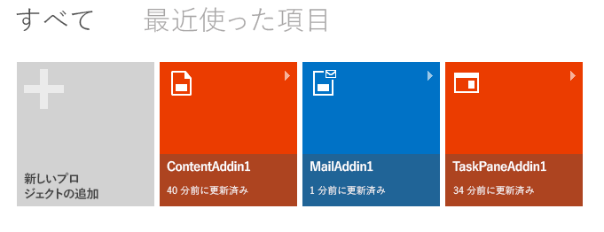

# Napa Office 365 開発ツールを使用して作業ウィンドウ アドインを作成する
Napa Office 365 開発ツール を使用して、イメージの一覧を示す作業ウィンドウ Office アドインを作成します。開いているドキュメントでユーザーがテキストを選択すると、選択されたテキストのタグが付けられたイメージの一覧が Flickr から取得され、作業ウィンドウに表示されます。

 _ **適用対象:** apps for Office?| Excel?| Office Add-ins?| PowerPoint?| Project?| Word_


また、 [Visual Studio](http://msdn.microsoft.com/ja-jp/library/a23c5ce8-6de3-40f6-a86a-85d3592bef3e%28Office.15%29.aspx) や [テキスト エディター](http://msdn.microsoft.com/ja-jp/library/d5411d35-9ef6-4e21-ba2b-4d2b1ee81359%28Office.15%29.aspx) を使用して作業ウィンドウ アドインを作成することもできます。どのツールを使用するか分からない場合は、「 [開発の基本事項](privacy-and-security.md#StartBuildingApps_DevelopmentBasics)」を参照してください。


## 前提条件


- [Microsoft アカウント](http://www.microsoft.com/ja-jp/account/default.aspx)
    
- [Napa Office 365 開発ツール](https://www.napacloudapp.com/) Web アプリの URL
    

## 基本 Office アドインの作成


1. ブラウザーで [Napa Office 365 開発ツール](https://www.napacloudapp.com/) Web アプリを開き、Microsoft アカウントの資格情報を使用してサインインします。
    
2.  **[新しいプロジェクトの追加]** タイルをクリックします。
    
    [ **新しいプロジェクトの追加**] タイルは、他のプロジェクトを既に作成している場合にのみ表示されます。これが最初のプロジェクトの場合は、次の手順に進んでください。
    

    **[新しいプロジェクト] タイル**

    

3.  **[Office 用作業ウィンドウ アドイン]** タイルをクリックします。プロジェクトにMyFirstTaskPaneAddin という名前を付けてから、 **[作成]** ボタンを選択します。
    
    **[作業ウィンドウ アドイン] タイル**

    ![NAPA での [新しいプロジェクト] ダイアログ ボックス](../../images/Apps_NAPA_Excelapptile.png)
    コード エディターが開き、既定の Web ページが表示されます。このページには、何も作業しなくても実行できるサンプル コードが既に含まれています。
    

### サンプル Office アドインの実行


1. ページの脇にある [ **実行**] ボタン (
![[実行] ボタン](../../images/Apps_NAPA_Run_Button.png)) を選択して、アプリを発行します。
    
    Excel Online が開き、サンプル Office アドインが作業ウィンドウに表示されます。 **[ブックの編集] > [Excel Online で編集]** をクリックして、アプリの各機能を確認してください。
    
2. 操作を確認できたら、Excel Online を終了します。
    

## アドインのプロパティを変更する


1. ページの脇にある [ **プロパティ**] ボタン (
![[プロパティ] ボタン](../../images/Apps_Napa_Properties_Button.png)) を選択して、Office アドインのプロパティを表示します。
    
2.  **[名前]** プロパティを「最初の作業ウィンドウ アドイン」、 **[説明]** プロパティを「このアプリは、ドキュメントで選択されているテキストに関連するイメージを表示します」に指定します。
    
    [ **名前**] プロパティと [ **説明**] プロパティは、Office アプリケーションで利用できるアドインの一覧にアドインが表示されたときに、ユーザーがアドインの用途を理解するのに役立ちます。 [ **スタート ページ**] プロパティは、プロジェクトを起動したときに Office アドインに表示されるページを指します。このチュートリアルでは、プロジェクトに付属する既定のページを使用しますが、プロジェクトに新しいページを追加して、[ **スタート ページ**] プロパティをそれらのいずれかのページに設定することができます。使用例については、「[Napa Office 365 開発ツールを使用して Excel 用コンテンツ アドインを作成する](create-a-content-add-in-with-napa.md)」を参照してください。
    
3. [ **プロパティ**] ページの下部にある [ **適用**] ボタンを選択して、資産価値を保存します。
    
     **プロパティ** エディターには、Office アドインの一般的な設定が表示されます。Office アドインで使用可能なすべての設定が表示されるわけではありません。 **プロパティ** エディターに表示されない設定を変更する必要があるときは、プロジェクトを Visual Studio で開き、マニフェスト ファイルを直接編集します。
    
4. [ **エクスプローラー**] ボタン (
![[探索] ボタン](../../images/Apps_Napa_Explore_Button.png)) を選択して、プロジェクト ビューに戻ります。
    

## ユーザーがドキュメント内で選択したテキストの取得


1. Napa で、[ **Home.html**] を選択します。
    
    既定の Web ページがコード エディターに表示されます。
    
2.  `get-data-from-selection` ボタンのラベルを「Search Flickr」に変更し、 `content-main` セクションに `Images` という名前の `div` を追加します。コードは次のとおりです。
    
  ```HTML
  <body>
    <!-- Page content -->
    <div id="content-header">
        <div class="padding">
            <h1>Welcome</h1>
        </div>
    </div>
    <div id="content-main">
        <div class="padding">
            <p><strong>Add home screen content here.</strong></p>
            <p>For example:</p>
            <button id="get-data-from-selection">Search Flickr</button>
            
            <p style="margin-top: 50px;">
                <a target="_blank" href="http://go.microsoft.com/fwlink/?LinkId=276812">
                    Find more samples online...
                </a>
            </p>
        </div>

        <!--This section renders the images-->
        <div>
            <div id="Images" style="height:800px; overflow:scroll"></div>
        </div>
    </div>
</body>


  ```

3. [ **Home.js**] を選択します。
    
    Home.js ファイルがコード エディターに表示されます。
    
     >**メモ**   `Office.initialize` メソッドを使用して、アドインの起動時に実行される他のアクションを定義できます。コードから Office オブジェクト モデルにアクセスする必要がある場合、この関数はそのためのコードを指定するには最適な場所です。このコードを既定の HTML ファイルの `Onload` イベントに追加した場合は、Office オブジェクト モデルが初期化される前にこのイベントが発生して、エラーになる可能性があります。
4. Home.js ファイルで、コード行 ( `showImages(result.value);`) を追加して  `getDataFromSelection` 関数を変更します。
    
    コードを追加した後 関数がどのようになるかを次に示します。
    


  ```
  function getDataFromSelection() {
        Office.context.document.getSelectedDataAsync(Office.CoercionType.Text,
            function (result) {
                if (result.status === Office.AsyncResultStatus.Succeeded) {
                    showImages(result.value);
               } else {
                    app.showNotification('Error:', result.error.message);
                }
            }
        );
    }
  ```


    このコードは、ユーザーが選択したテキストの値を取得し、メソッドを呼び出して選択されたテキストのイメージを表示します。使用するメソッドは、次の手順で定義します。
    
     >**メモ**  JavaScript API for Office の他のメソッドと同様に、このメソッドも非同期であり、このメソッドが実行している間も、アドインは他の操作を実行することができます。

     `getSelectedDataAsync` の呼び出し時に匿名関数にコールバック引数として `result` という名前のパラメーターを渡します。コールバック関数は、実行されると `result` パラメーターを使用して `AsyncResult` オブジェクトの value プロパティにアクセスし、ユーザーが選択したセル内のデータを表示します。
    

## Flickr API を使用した作業ウィンドウ アドインでのイメージの表示


- Home.js ファイルに、次のコードを追加します。このコードは、選択されたテキストに対応するイメージを表示する関数を追加します。
    
  ```
  function showImages(selectedText) {
    
    $('#Images').empty();

    var parameters = {
        tags: selectedText,
        tagsmode: "any",
        format: "json"
    };

    $.getJSON("https://secure.flickr.com/services/feeds/photos_public.gne?jsoncallback=?",
                    parameters,
                    function (results) {
                        $.each(results.items, function (index, item) {
                            $('#Images').append($("").attr("src", item.media.m));
                        });
                    }
    );
}
  ```


### 実行する


1. ページの脇にある [ **実行**] ボタン (
![[実行] ボタン](../../images/Apps_NAPA_Run_Button.png)) をクリックします。
    
2. Excel Online が開き、サンプル Office アドインが作業ウィンドウに表示されます。 **[ブックの編集] > [Excel Online で編集]** をクリックします。
    
3. セルを選択し、画像を検索するためのキーワードを入力します。
    
4. 作業ウィンドウで、[ **Search Flickr**] ボタンをクリックします。
    
    選択した単語がタグとして設定されている画像が Flickr 内で検索され、作業ウィンドウに表示されます。
    
5. Excel Online を閉じます。
    

## Internet Explorer でアドインをデバッグする


Excel Online で作業ウィンドウ アドインを起動し、Internet Explorer (IE) を使用している場合は、F12 開発者ツールを使用して、アドインの JavaScript、HTML、およびカスケード スタイル シート (CSS) をデバッグできます。 

ここでは、F12 ツールを開いてデバッガーを起動し、Home.js ファイルのコード行で実行を強制的に停止する方法を示します。


1. ページの脇にある [ **実行**] ボタン (
![[実行] ボタン](../../images/Apps_NAPA_Run_Button.png)) を選択します。
    
    Excel Online が開き、Office アドインが表示されます。 **[ブックの編集] > [Excel Online で編集]** をクリックします。
    
2. キーボードの F12 キーを押します。
    
    F12 ツールが別ウィンドウに表示されます。
    
3. F12 ツール ウィンドウで、 [ **デバッガー**] タブをクリックします。
    
4. Ctrl + O キーボード ショートカットを使用してドキュメントを開き、フィルターのテキスト ボックスに Home.js と入力します。
    
    Home.js ファイルの内容が、ウィンドウに表示されます。
    
5.  `getDataFromSelection` メソッドにブレークポイントを設定します。
    
    F12 ツール ウィンドウでブレークポイントを設定する方法の詳細については、「[コード実行の中断](http://go.microsoft.com/fwlink/?LinkID=267272)」を参照してください。
    
6. アドインで、セルに単語を入力して、 [ **Flickr の検索**] ボタンをクリックします。
    
    F12 ツール ウィンドウで、 `getDataFromSelection` メソッドの場所で実行が停止します。
    
    詳細については、「 [F12 開発者ツールの使用](http://msdn.microsoft.com/library/ie/bg182326%28v=vs.85%29)」を参照してください。
    
    Internet Explorer 以外のブラウザーを使用する場合は、ブラウザーのマニュアルを検索してください。
    

## 次の手順


これで、基本的な作業ウィンドウ アドインを作成できたので、以下の操作を実行できます。


- プロジェクトを共有するには、 **[プロジェクトの共有]** ボタン (
![[プロジェクトの共有] ボタン](../../images/NAPA_Apps_Share.png)) を選択します。Napa により、プロジェクトのコピーが作成され、公開リンクが表示されます。そのリンクを他のユーザーと共有できます。
    
- アドインを発行するには、 **[発行]** ボタン (
![[発行] ボタン](../../images/Apps_NAPA_Publish.png)) を選択します。
    
    「 [発行のための準備として Napa または Visual Studio を使用してアドインをパッケージ化する](../publish/package-your-add-in-using-napa-or-visual-studio.md)」をご覧ください。
    
- Napaを使用して Excel 用コンテンツ アドインを作成します。ワークシートから情報を取得する方法、ワークシート内の選択したセルに情報を格納する方法、およびワークシート内のセルにバインドする方法を習得します。「 [Napa Office 365 開発ツールを使用して Excel 用コンテンツ アドインを作成する](create-a-content-add-in-with-napa.md)」を参照してください。 
    
- プロジェクトを Visual Studio で開くには、 **[Visual Studio で開く]** ボタン (
![[Visual Studio で開く] ボタン](../../images/Apps_Napa_OpenInVS.png)) を選択します。Napa は必要なツールを自動的にインストールし、プロジェクトを Visual Studio で開きます。
    
- Visual Studio を使用して、Excel 用または Word 用の作業ウィンドウ アドインを作成します。「 [Visual Studio を使用して作業ウィンドウ アドインまたはコンテンツ アドインを作成する](create-a-task-pane-or-content-add-in-with-visual-studio.md)」を参照してください。
    
- Office アドインについてさらに学習するために、「 [Office アドイン プラットフォームの概要](../../docs/develop/privacy-and-security.md)」を参照します。
    

## その他の技術情報


- [JavaScript API for Office について](../develop/understanding-the-javascript-api-for-office.md)
    
- [Office アドインの XML マニフェスト](../../docs/overview/add-in-manifests.md)
    
