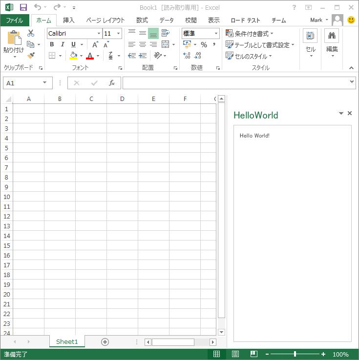
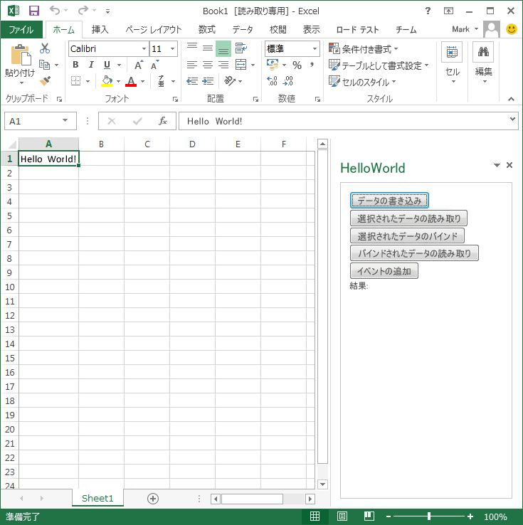
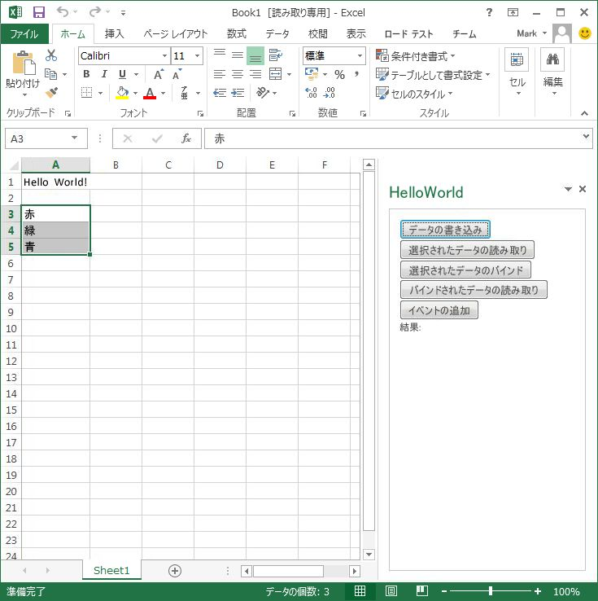
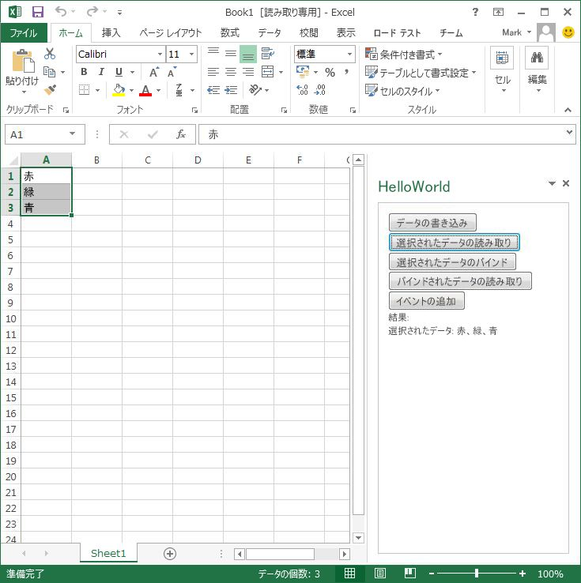
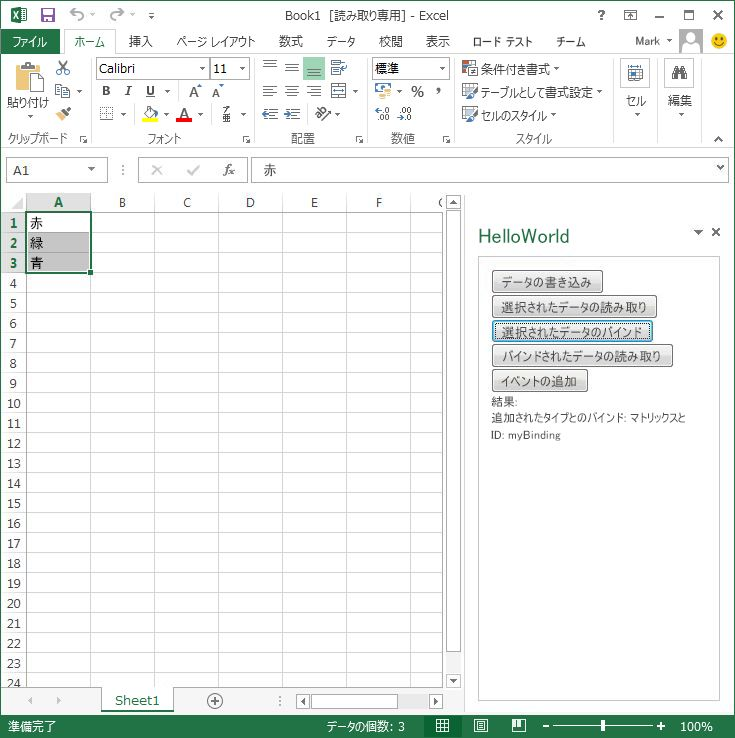
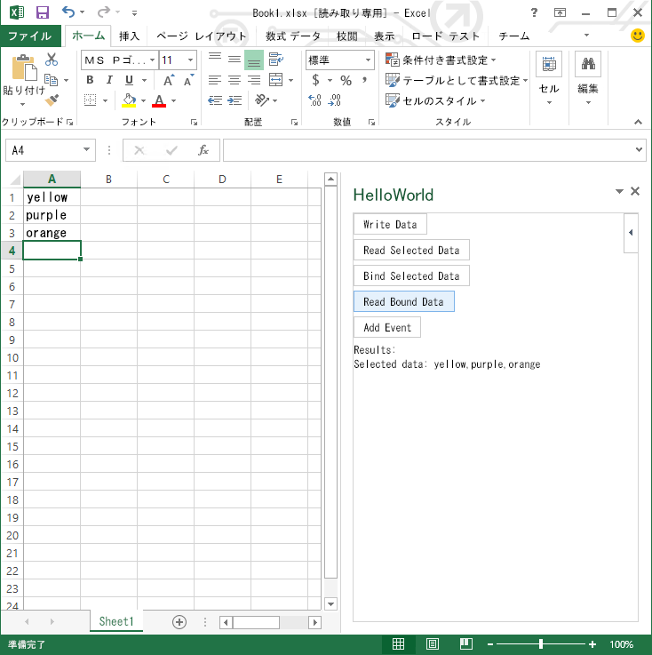
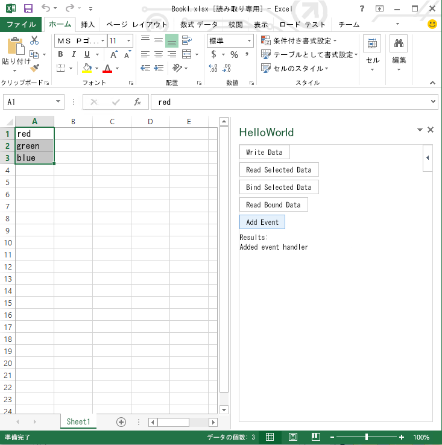
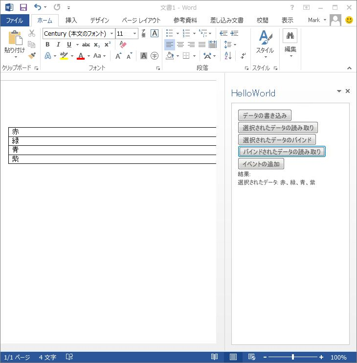
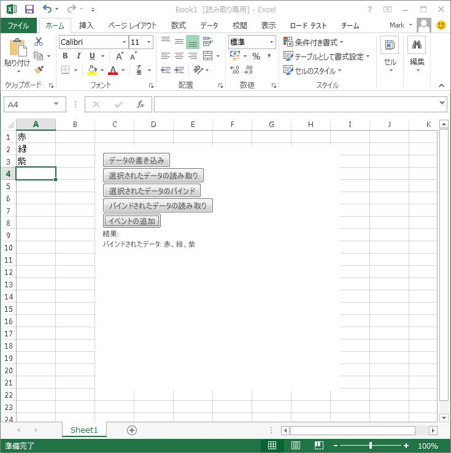

# Visual Studio を使用して作業ウィンドウ アドインまたはコンテンツ アドインを作成する
この記事では、Visual Studio を使用して Office アドインの Hello World を作成した後、ドキュメントの読み取り、書き込み、およびバインドを行うようにそのアプリを拡張する方法について説明します。

 _ **適用対象:** Access apps for SharePoint?| apps for Office?| Excel?| Office Add-ins?| PowerPoint?| Project?| Word_

この記事の手順では、Excel で簡単な  _Hello World_ 作業ウィンドウ アドインを作成して実行する方法を説明します。その後、次のタスクを実行するようにアドインを拡張します。

- ワークシート内の現在の選択範囲にデータを書き込む。
    
- ワークシート内の現在の選択範囲からデータを読み取ってアドインの UI に表示する。
    
- ワークシート内の現在選択範囲へのバインドを作成する。
    
- バインドのデータを読み取ってアドインの UI に表示する。
    
- バインドのデータが変更されるたびにデータを読み取って表示するイベント ハンドラーを追加する。
    
最後に、次の操作を行うように一部のプロジェクト設定とマニフェストを変更します。

- 作業ウィンドウ アドインを Word で実行する。
    
- アドインをコンテンツ アドインとして Excel で実行する。
    

## 前提条件


始める前に、次のコンポーネントをインストールします。


- [Visual Studio 2015 と最新の Microsoft Office Developer Tools ](https://www.visualstudio.com/features/office-tools-vs)。
    
- Excel 2013 以降。
    
- Word 2013 以降。
    

## アドイン用プロジェクトを作成する


最初に、Visual Studio で Office アドイン プロジェクトを作成します。


### Visual Studio でプロジェクトを作成するには


1. Visual Studio のメニュー バーで、[ **ファイル**]、[ **新規作成**]、[ **プロジェクト**] の順に選択します。
    
    [ **新しいプロジェクト**] ダイアログ ボックスが表示されます。
    
2. プロジェクトの種類の一覧で、 **[Visual C#]** または **[Visual Basic]** の下にある **[Office/SharePoint]** を展開し、 **[Office アドイン]**、 **[Office アドイン]** の順にクリックします。
    
3. プロジェクトに「HelloWorld」という名前を付けて、[ **OK**] を選択します。
    
     **[Office 用アドインの作成]** ダイアログ ボックスが開きます。Visual Studio では、オプション **[作業ウィンドウ アドイン]** が選択されています。 **[次へ]** ボタンを選択し、 **[Excel]**、 **[Word]**、 **[PowerPoint]**、および  **[Project]** のチェックボックスが選択されたままの状態で、 **[完了]** をクリックします。
    
    プロジェクトが作成されて、ファイルが **ソリューション エクスプローラー**に表示されます。 既定の Home.html ページが Visual Studio で開かれます。
    

## アドインを開発する


アドインの外観をデザインするには、HTML をプロジェクトの既定のページに追加します。アドインの機能とプログラミング ロジックを設計するには、JavaScript コードを HTML ページに直接追加することができますが、この例ではコードを既定の JavaScript ファイル (Home.js) に追加します。


### Hello World アドインを作成するには


1. Home.html ファイルで、開始と終了の  `<body>` タグの間のすべてのタブを削除し、開始と終了の **body** タグの内側に<div>Hello World!</div> と入力します。 完成した HTML は次のようになります。
    
  ```HTML
  <!DOCTYPE html> 
<html> 
   <head> 
      <meta charset="UTF-8" /> 
      <meta http-equiv="X-UA-Compatible" content="IE=Edge" /> 
      <title></title>
 
      <script src="../../Scripts/jquery-1.9.1.js" type="text/javascript"></script> 
      <link href="../../Content/Office.css" rel="stylesheet" type="text/css" /> 
      <script src="https://appsforoffice.microsoft.com/lib/1/hosted/Office.js" type="text/javascript"></script>
 
      <!-- To enable offline debugging using a local reference to Office.js, use: --> 
      <!-- <script src="../../Scripts/Office/MicrosoftAjax.js" type="text/javascript"></script> --> 
      <!-- <script src="../../Scripts/Office/1.1/office.js" type="text/javascript"></script> -->
 
      <link href="../App.css" rel="stylesheet" type="text/css" /> 
      <script src="../App.js" type="text/javascript"></script> 
      <link href="Home.css" rel="stylesheet" type="text/css" /> 
      <script src="Home.js" type="text/javascript"></script> 
   </head>
 
   <body> 
      <div>Hello World!</div> 
   </body>
 
</html>
  ```

2. IIS Express に展開し、ローカルにインストールされた Excel でデバッグできる状態にするには、次の **開始動作**プロパティの構成を確認します。
    
      1. [ソリューション エクスプ ローラー] で、HelloWorld アドインを選択します。
    
  2.  **[プロパティ]** ウィンドウで、 **開始操作**プロパティが  **[Office デスクトップ クライアント]** に設定されていることを確認します。
    
  3.  **開始ドキュメント** プロパティが **[新しい Excel ブック]** に設定されていることを確認します。
    
     >**メモ**   **[Internet Explorer]** または **[Google Chrome]** を **開始操作**プロパティに対して選択してから、 **[新しい Excel ブック]** を **[開始ドキュメント]** プロパティに対して設定すると、アドインの実行時に Excel Online がブラウザーで起動します。
3. [ **デバッグ**] メニューの [ **デバッグの開始**] を選択するか、または F5 キーを押します。
    
     >**メモ**  (Visual Studio によってインストールされた) IIS Express で初めてデバッグを起動する場合は、IIS Express で使用する自己署名 Localhost 証明書を信頼してインストールするよう求めるメッセージが表示されます。いずれのメッセージも  **[はい]** を選択して続行します。

    Excel に空のブックが開いて、作業ウィンドウにアドインが表示されます。
    

    **図 1. Hello World 作業ウィンドウ アドイン**

    

4. ブック ファイルを閉じます。
    
    デバッグが停止して、フォーカスが Visual Studio に戻ります。
    
以下の手順では、ワークシート内のデータにアクセスするように Hello World アドインを拡張します。


### データをワークシートに書き込むには


1. HelloWorld.html ページの開始と終了の  `<body>` タグの内部にある `<div>Hello World!</div>` を次の HTML に置き換えます。
    
  ```HTML
  <button id="writeDataBtn"> Write Data </button> 
<button id="readDataBtn"> Read Selected Data </button> 
<button id="bindDataBtn"> Bind Selected Data </button> 
<button id="readBoundDataBtn"> Read Bound Data </button>
<button id="addEventBtn"> Add Event </button>

<span>Results: </span>
<div id="results"></div>
  ```


    この操作によって、データ アクセス操作を実行するいくつかのボタンと、結果をアドインの HTML ページに表示する  `div` が追加されます。次に、現在の選択範囲にサンプル テキストを書き込む `writeData()` 関数を呼び出します。
    
2. アドインの既定の JavaScript ファイルを表示するには、Home.js ファイルを開きます。まだ開いていない場合、このファイルは **[ソリューション エクスプローラー]**の  **[アドイン]**、 **[ホーム]** にあります。
    
3. イベント ハンドラー  `$("#writeDataBtn").click` を `$(document).ready` コードに追加して、ユーザーが [ **データの書き込み**] ボタンをクリックしたときに応答するようにします。コードは、次のようにする必要があります。
    
  ```
  // The initialize function must be run each time a new page is loaded 
Office.initialize = function (reason) { 
   $(document).ready(function () { app.initialize();
 
       
      $("#writeDataBtn").click(function (event) { writeData(); 
      });
 
   }); 
};
  ```

4. Home.js ファイルに次の関数を追加します。
    
  ```
  function writeData() { 
    Office.context.document.setSelectedDataAsync("Hello World!", function (asyncResult) { 
        if (asyncResult.status === "failed") { 
            writeToPage('Error: ' + asyncResult.error.message); 
        } 
    }); 
} 

function writeToPage(text) { 
    document.getElementById('results').innerText = text; 
}
  ```


     >**メモ**   `Office.initialize` イベント ハンドラー関数を削除または上書きしないでください (コードを置き換えることはできます)。実行時にアドインを正しく初期化するには、 `Office.initialize` イベント ハンドラーが適切に配置されている必要があります。

     `writeData()` 関数のコードでは、 [ **データの書き込み**] ボタンが選択されたら、[Document.setSelectedDataAsync](http://msdn.microsoft.com/ja-jp/library/fp142145.aspx) メソッドを呼び出して現在のセルに "Hello World!" と書き込みます。このチュートリアルで使用されるほとんどのメソッドは非同期 (このため、名前の最後に "Async" が付いています) で、"Hello World!" の後の引数として渡される匿名関数のようなコールバック関数が使用されています。"Async" メソッドの使用方法の詳細については、「 [Office アドインにおける非同期プログラミング](../../docs/develop/asynchronous-programming-in-office-add-ins.md)」を参照してください。
    
     `writeToPage(text)` 関数は、アドイン HTML ページの結果 `div` にテキストを書き戻すヘルパー関数です。 また、以下の手順のコード例では、 `writeToPage(text)` 関数がデータとメッセージを表示するためにも使用されています。
    
5. [ **デバッグ**] メニューの [ **デバッグの開始**] を選択するか、または F5 キーを押します。
    
6. [ **データの書き込み**] ボタンを選択して、 `"Hello World!"` を現在のセルに書き込みます。この時点では、まだブックを閉じないでください。デバッグも停止しないでください。
    
    **図 2. テキストの書き込み**

    

7. 元のコード エディターに切り替えて、 **setSelectedDataAsync** メソッドへの呼び出しの中の `"Hello World!"` を次のように `[["red"],["green"],["blue"]]` に置換します。
    
  ```
  function writeData() { 
    Office.context.document.setSelectedDataAsync([["red"],["green"],["blue"]], function (asyncResult) { 
        if (asyncResult.status === "failed") { 
            writeToPage('Error: ' + asyncResult.error.message); 
        } 
    }); 
}
  ```


     `[["red"],["green"],["blue"]]` などの配列の配列を書き込むと、マトリックスというデータ構造が作成されます。この例では、3 つのセル (行) から成る 1 つの列を作成しています。 次のように、3 つの行と 2 つの列から成るマトリックスを作成することもできます。
    
     ` [["red", "rojo"],["green", "verde"],["blue", "azul"]]`
    
    次の例では、3 つのセルから成る 1 つの行を作成します。
    
     `[["red","green","blue"]]`
    
8. Ctrl + S キーを選択して、このコードの変更を保存します。
    
9. ここでブックに切り替え、アドインの作業ウィンドウを右クリックしてから、[ **再読み込み**] をクリックします。
    
    JavaScript コードが更新された HTML ページが再読み込みされます。
    
10. 選択を新しいセルに移動して、[ **データの書き込み**] ボタンを選択します。
    
     `red`、 `green`、および  `blue` を含む配列が、3 つのセルから成る 1 つの列に書き込まれます。
    

    **図 3. マトリックスの書き込み**

    

11. ブックを閉じてデバッグを停止します。
    

### データをワークシートから読み取るには


1.  **ソリューション エクスプローラー**で、Home.js ファイルを開きます。
    
2. イベント ハンドラー  `$("#readDataBtn").click` を `$(document).ready` コードに追加して、ユーザーが [ **選択したデータの読み取り**] ボタンをクリックしたときに応答するようにします。コードは、次のようにする必要があります。
    
  ```
  // The initialize function must be run each time a new page is loaded 
Office.initialize = function (reason) { 
    $(document).ready(function () { 
        app.initialize(); 
      
        $("#writeDataBtn").click(function (event) { 
            writeData(); 
        }); 
        $("#readDataBtn").click(function (event) { 
            readData(); 
        }); 
    }); 
};
  ```

3. Home.js ファイルに次のコードを追加します。追加する位置は、前の手順で追加した関数の下です。
    
  ```
  
function readData() { 
    Office.context.document.getSelectedDataAsync("matrix", function (asyncResult) { 
        if (asyncResult.status === "failed") { 
            writeToPage('Error: ' + asyncResult.error.message); 
        } 
        else{ 
            writeToPage('Selected data: ' + asyncResult.value); 
        } 
    }); 
}
  ```


     `readData()` 関数は、 [Document.getSelectedDataAsync](http://msdn.microsoft.com/ja-jp/library/f85ad02c-64f0-4b73-87f6-7f521b3afd69%28Office.1501401%29) メソッドを使用して、ユーザーが現在選択しているデータを "matrix" _coercionType_ (2 次元配列) として読み取ります。Excel の場合、この関数は 1 つ以上の連続するセルで形成される範囲を読み取ります。
    
4. [ **デバッグ**] メニューの [ **デバッグの開始**] を選択するか、または F5 キーを押します。
    
5. [ **データの書き込み**] ボタンを選択し、 `red`、 `green`、および  `blue` を含む 3 つのセルを選択した状態で [ **選択したデータの読み取り**] ボタンを選択します。
    
    3 つのセルからデータがマトリックス データ構造として読み取られ、それらの値がアドインのページに書き込まれます。
    

    **図 4. マトリックスの読み取り**

    

6. ブックを閉じてデバッグを停止します。
    

### 選択されているデータのバインドを作成し、バインドされたデータを読み取るには


1.  **ソリューション エクスプローラー**で、Home.js ファイルを開きます。
    
2. イベント ハンドラー  `$("#bindDataBtn").click` および `$("#readBoundDataBtn").click` を `$(document).ready` コードに追加して、ユーザーが [ **Bind Selected Data**] および [ **Read Bound Data**] ボタンをクリックしたときに応答するようにします。コードは、次のようにする必要があります。
    
  ```
  // The initialize function must be run each time a new page is loaded 
Office.initialize = function (reason) { 
    $(document).ready(function () { 
        app.initialize(); 
   
        $("#writeDataBtn").click(function (event) { 
            writeData(); 
        }); 
        $("#readDataBtn").click(function (event) { 
            readData(); 
        }); 
        $("#bindDataBtn").click(function (event) { 
            bindData(); 
        }); 
        $("#readBoundDataBtn").click(function (event) { 
            readBoundData(); 
        }); 
    }); 
};
  ```

3. Home.js ファイルに次のコードを追加します。追加する位置は、前の手順で追加した関数の下です。
    
  ```
  function bindData() { 
    Office.context.document.bindings.addFromSelectionAsync("matrix", { id: 'myBinding' }, function (asyncResult) { 
        if (asyncResult.status === "failed") { 
            writeToPage('Error: ' + asyncResult.error.message); 
        } 
        else { 
            writeToPage('Added binding with type: ' + asyncResult.value.type + ' and id: ' + asyncResult.value.id); 
        } 
    }); 
}
  ```


     `bindData()` 関数は [Bindings.addFromSelectionAsync](http://msdn.microsoft.com/ja-jp/library/edc99214-e63e-43f2-9392-97ead42fc155%28Office.1501401%29) メソッドを呼び出して、ユーザーが選択したセルに関連する `myBinding` の [id](http://msdn.microsoft.com/ja-jp/library/94a0814d-70a0-4258-a837-2be04f68f068%28Office.1501401%29) とのマトリックス バインディングを作成します。 _bindingType_ を `"text"` として指定すると、Excel の 1 つのセルまたは Word 文書内の一連の文字 (文字列) へのバインドを作成できます。 バインドの詳細については、「 [ドキュメントまたはスプレッドシート内の領域へのバインド](../../docs/develop/bind-to-regions-in-a-document-or-spreadsheet.md)」を参照してください。
    
4. Home.js ファイルの  `bindData ()` 関数の下に次のコードを追加します。
    
  ```
  function readBoundData() { 
    Office.select("bindings#myBinding").getDataAsync({ coercionType: "matrix" }, function (asyncResult) { 
        if (asyncResult.status === "failed") { 
            writeToPage('Error: ' + asyncResult.error.message); 
        } 
        else { 
            writeToPage('Selected data: ' + asyncResult.value); 
        } 
    }); 
}
  ```


     `readBoundData()` 関数は [Office.select](http://msdn.microsoft.com/ja-jp/library/23aeb136-da1f-4127-a798-99dc27bc4dae%28Office.1501401%29) メソッドを呼び出して、 `bindData()` 関数によって作成されたバインドを取得します。このバインドの **id** は `myBinding` です。(または、 [Bindings.getByIdAsync](http://msdn.microsoft.com/ja-jp/library/2727c891-bc05-465c-9324-113fbfeb3fbb%28Office.1501401%29) メソッドを使用して、その **id** を指定してバインドにアクセスすることもできます。) その後、 [Binding.getDataAsync](http://msdn.microsoft.com/ja-jp/library/5372ffd8-579d-4fcb-9e5b-e9a2128f3201%28Office.1501401%29) メソッドが呼び出されて、バインドからデータを読み取ります。バインドはマトリックス バインドなので、呼び出しを正常に動作させるには、 _coersionType_ を `"matrix"` として指定することが必要です。
    
5. [ **デバッグ**] メニューの [ **デバッグの開始**] を選択するか、または F5 キーを押します。
    
6. [ **データの書き込み**] ボタンを選択し、 `red`、 `green`、および  `blue` を含む 3 つのセルを選択した状態で [ **Bind Selected Data**] ボタンを選択します。
    
     **id**?が  `myBinding` である 3 つの選択されたセルと関連付けられたマトリックス バインドが作成されます。
    

    **図 5. バインドの作成**

    

7. 3 つのセルの選択を解除し、 [ **Read Bound Data**] ボタンを選択します。
    
    前の手順で作成されたバインドからデータが読み取られ、それらの値がアドインのページに書き込まれます。値を変更していない場合は、 `red`、 `green`、および  `blue` がアドインに表示されます。
    
8. 3 つのセルに含まれる 1 つ以上の値を変更します。その際、変更するたびに Enter キーを押してください。変更が終了したら、[ **Read Bound Data**] を再度選択します。
    
    変更後のデータが読み取られてアドインに表示されます。
    

    **図 6. バインドからの読み取り**

    

9. ブックを閉じてデバッグを停止します。
    
次に、バインドのデータが変更されるたびにデータを読み取って表示するイベント ハンドラーを追加します。


### イベント ハンドラーを追加するには


1. イベント ハンドラー  `$("#addEventBtn").click` を `$(document).ready` コードに追加して、ユーザーが [ **イベントの追加**] ボタンをクリックしたときに応答するようにします。コードは、次のようにする必要があります。
    
  ```
  // The initialize function must be run each time a new page is loaded 
Office.initialize = function (reason) { 
    $(document).ready(function () { 
        app.initialize(); 
     
        $("#writeDataBtn").click(function (event) { 
            writeData(); 
        }); 
        $("#readDataBtn").click(function (event) { 
            readData(); 
        }); 
        $("#bindDataBtn").click(function (event) { 
            bindData(); 
        }); 
        $("#readBoundDataBtn").click(function (event) { 
            readBoundData(); 
        }); 
        $("#addEventBtn").click(function (event) { 
            addEvent(); 
        }); 
    }); 
};
  ```

2. Home.js ファイルに次のコードを追加します。追加する位置は、前の手順で追加した関数の下です。
    
  ```
  
function addEvent() { 
    Office.select("bindings#myBinding").addHandlerAsync("bindingDataChanged", myHandler, function (asyncResult) { 
        if (asyncResult.status === "failed") { 
            writeToPage('Error: ' + asyncResult.error.message); 
        } 
        else { 
            writeToPage('Added event handler'); 
        } 
    }); 
}
 
function myHandler(eventArgs) { 
    eventArgs.binding.getDataAsync({ coerciontype: "matrix" }, function (asyncResult) { 
        if (asyncResult.status === "failed") { 
            writeToPage('Error: ' + asyncResult.error.message); 
        } 
        else { 
            writeToPage('Bound data: ' + asyncResult.value); 
        } 
    }); 
}
  ```


     `addEvent()` 関数は **Office.select** メソッドを呼び出して `myBinding` バインド オブジェクトを取得してから、 [Binding.addHandlerAsync](http://msdn.microsoft.com/ja-jp/library/b9c2f4ea-726c-4b48-a3fb-89beda337a17%28Office.1501401%29) メソッドを呼び出して [Binding.bindingDataChanged](http://msdn.microsoft.com/ja-jp/library/7b9ed4bf-3ce5-44eb-8548-2b081afd868d%28Office.1501401%29) イベントのイベント ハンドラーを追加します。 `myHandler` 関数は、 [BindingDataChangedEventArgs](http://msdn.microsoft.com/ja-jp/library/d08e5556-20a6-469a-9c51-b0b95c8213ac%28Office.1501401%29) オブジェクトの [binding](http://msdn.microsoft.com/ja-jp/library/3f5adb74-0da6-46c6-a95e-0890bd935379%28Office.15%29.aspx) プロパティを使用してイベントを発生させたバインドにアクセスしてから、 **Binding.getDataAsync** メソッドを呼び出してイベント発生時のデータを読み取って表示します。
    
3.  **[デバッグ]** メニューの **[デバッグの開始]** を選択するか、F5 キーを押します。
    
4. [ **データの書き込み**] ボタンを選択し、 `red`、 `green`、および  `blue` を含む 3 つのセルを選択した状態で [ **Bind Selected Data**] ボタンを選択します。
    
5. [ **イベントの追加**] ボタンを選択します。
    
     **id** が `myBinding` であるバインドの取得が行われて、 `myHandler` 関数は **DataChanged** イベントのハンドラーとして追加されます。
    

    **図 7. DataChanged イベントの処理**

    

6. 3 つのバインドされたセルに含まれる 1 つ以上の値を変更します。その際、変更するたびに Enter キーを押してください。
    
    変更されたデータが読み取られて、アドイン作業ウィンドウに表示されます。
    
7. Excel を閉じてデバッグを停止します。
    
次のセクションでは、アドインを Word で実行してテストできるようにアドインのプロジェクトを変更します。


## アドインを Word で実行するように変更する


以下の手順を実行すると、アドインを Word 2013 で実行してデバッグするようにアドインのプロジェクトを変更できます。


- デバッグ時に Word を起動するようにプロジェクトの [ **開始ドキュメント**] プロパティを変更します。
    
- Word を実行してデバッグします。
    

### プロジェクトの [デバッグ] プロパティ ページで [開始ドキュメント] プロパティを変更するには


1.  **ソリューション エクスプローラー**で、プロジェクト名 (HelloWorld) を選択します。
    
     **ソリューション エクスプローラー**の下のウィンドウに、プロジェクトの [ **プロジェクトのプロパティ**] プロパティ ページが表示されます。
    
2.  **[アドイン]** の下の **[開始ドキュメント]** リストで、 **[新しい Word 文書]** を選択します。
    
    [ **開始動作**] プロパティはすでに [ **Office デスクトップ クライアント**] に設定されているので、あとはターゲット ドキュメントを変更するだけで十分です。
    

    **図 8. 開始ドキュメントの設定**

    


### Word でアドインをデバッグするには


1. メニューバーで、 [ **デバッグ**] > [ **デバッグ開始**] の順に選択します。
    
    作業ウィンドウで、Word 2013 が  **HelloWorld** アドインと共に開きます。
    
2. [ **Write Data**]、[ **Read Selected Data**]、[ **Bind Selected Data**]、[ **Read Bound Data**]、[ **Add Event**] の各ボタンを選択して、Excel で行った操作と同じ操作を行います。
    
     >**メモ**  Word では、[ **Write Data**] ボタンによって挿入された表の外側にカーソルが移動するまで、イベント ハンドラーはバインドされたデータを表示しません。

    **図 9. Word でのデバッグ**

    


## コンテンツ アドインとして実行するアドインを変更する


以下の手順を実行すると、このアドインが Excel でコンテンツ アドインとして実行するように、アドインのプロジェクトを変更できます。


- マニフェスト ファイルを変更し、 [OfficeApp](http://msdn.microsoft.com/ja-jp/library/68f1cada-66f8-4341-45f5-14e0634c24fb%28Office.1501401%29) 要素の **xsi:type** 属性を `"ContentApp"` に設定します。
    
- マニフェスト ファイルを変更し、 [RequestedWidth](http://msdn.microsoft.com/ja-jp/library/29032529-6661-fb99-1ff3-c02cc474017f) および [RequestedHeight](http://msdn.microsoft.com/ja-jp/library/f573269b-7615-af82-2e0d-7e5661b66a20) 要素の値を設定します。
    
-  `"Presentation"`、 `"Project"`、および  `"Document"` **Host** の各要素を **Hosts** 要素から削除するようにマニフェスト ファイルを変更します。
    
- プロジェクトの [ **開始ドキュメント**] プロパティを Excel で起動するように変更します。
    

### マニフェスト ファイルを変更するには


1.  **ソリューション エクスプローラー**で、 `HelloWorld.xml` ファイルを開きます。
    
2. 開始の  `OfficeApp` タグの `xsi:type` 属性の値を `"ContentApp"` に変更します。
    
  ```XML
  <OfficeApp xmlns="http://schemas.microsoft.com/office/appforoffice/1.1" 
          xmlns:xsi="http://www.w3.org/2001/XMLSchema-instance" 
          xsi:type="ContentApp">
  ```


     **xsi:type** 属性は Office アドインの種類を指定します。この指定によって、ユーザーによってドキュメントやブックにアドインが挿入されたときに、アドインがどのように実行されるかが決まります。これまでの値 `"TaskPaneApp"` は、アドインが作業ウィンドウで実行されることを指定します。 **xsi:type** を `"ContentApp"` に変更すると、アドインはブック コンテンツと連携してコンテンツ アドインとして実行されることを指定します。
    
     >**メモ**  このリリースの Office では、コンテンツ アドインは、 [コンテンツ アドインをサポートするクライアント アプリケーション](privacy-and-security.md#StartBuildingApps_SupportedApplications)のみで動作します。マニフェストで  **xsi:type** を `"ContentApp"` に変更すると、このアドインは Access Web アプリ、Excel、または PowerPoint でのみ実行します。
3. 以下の  **RequestedWidth** および **RequestedHeight** 要素をマニフェストの `<DefaultSettings>` タグ内に追加します。
    
  ```XML
  <DefaultSettings> 
    <SourceLocation DefaultValue="~remoteAppUrl/App/Home/Home.html" /> 
    <RequestedWidth>200</RequestedWidth> 
    <RequestedHeight>200</RequestedHeight> 
</DefaultSettings>
  ```

4.  **Hosts** 要素から `"Presentation"`、 `"Project"`、および  `"Document"` **Host** 要素を削除して、 `"Workbook"` **Host** 要素のみを残します。
    
  ```XML
  <Hosts> 
    <Host Name="Workbook" /> 
</Hosts>
  ```

5. これらの変更を HelloWorld.xml ファイルに保存します。
    

### プロジェクトのプロパティ ページで [開始ドキュメント] プロパティを変更するには


1.  **ソリューション エクスプローラー**で、プロジェクト名 (HelloWorld) を選択します。
    
     **[プロパティ]** ウィンドウ ( **[ソリューション エクスプローラー]** ウィンドウの下) に、プロジェクトのプロパティ ページが表示されます。
    
2.  **[アドイン]** で、 **[開始ドキュメント]** を **[新しい Excel ブック]** に設定します。
    

### Excel でアドインをデバッグするには


1. メニューバーで、 [ **デバッグ**] > [ **デバッグ開始**] の順に選択します。
    
    Excel 2013 が  **HelloWorld** アドインをコンテンツ アドインとしてワークシートで実行した状態で開きます。
    
2. [ **Write Data**]、[ **Read Selected Data**]、[ **Bind Selected Data**]、[ **Read Bound Data**]、[ **Add Event**] の各ボタンを選択して、以前と同じ操作を行います。
    
    **図 10. コンテンツ アドインとしてのデバッグ**

    


## 次の手順


Office アドインの開発について理解を深めるには、以下を参照してください。


- [Office アドインの設計ガイドライン](../add-in-design.md)
    
- [Office アドインの開発ライフ サイクル](../../docs/design/add-in-development-lifecycle.md)
    
- [Office アドインを発行する](../publish/publish.md)
    
- [発行のための準備として Napa または Visual Studio を使用してアドインをパッケージ化する](../publish/package-your-add-in-using-napa-or-visual-studio.md)
    

 >**ヒント**  Visual Studio からアドインを展開および発行するには、「 [発行のための準備として Napa または Visual Studio を使用してアドインをパッケージ化する](../publish/package-your-add-in-using-napa-or-visual-studio.md)」を参照してください。Visual Studio を使用せずにアドインを発行するには、アドインの HTML ページと .js ファイルを Web サーバーで展開し、アドインのマニフェスト ファイルを [ネットワーク共有カタログ](../publish/create-a-network-shared-folder-catalog-for-task-pane-and-content-add-ins.md)または [SharePoint のアドイン カタログ](../publish/publish-task-pane-and-content-add-ins-to-an-add-in-catalog.md)にアップロードできます。マニフェスト ファイルをアップロードする前に、 `SourceLocation` タグの `DefaultValue` 属性の `~remoteAppUrl` トークンを置換し、ホストされる Web サーバーでのアドインの既定 HTML ページの完全 URL を指定します。


## その他の技術資料


- [作業ウィンドウ アドインとコンテンツ アドインの概要](task-pane-and-content-add-ins.md)
    
- [JavaScript API for Office について](../develop/understanding-the-javascript-api-for-office.md)
    
- [Office アドインの XML マニフェスト](../../docs/overview/add-in-manifests.md)
    
