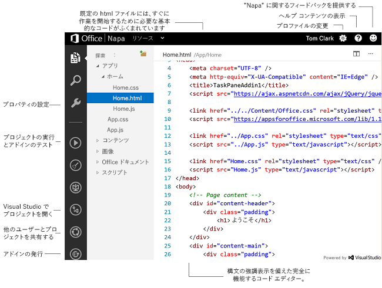

# Office 365 開発者向けサイトでの Napa を使用した Office アドインの作成
Office 365 開発者向けサイト で Napa Office 365 開発ツールを使用して、Office アドインと SharePoint アドインを作成します。

 _ **適用対象:** apps for Office?| Office 365?| Office Add-ins_

Napa は、ブラウザー ウィンドウで Office アドインを適切にビルドするための有効な手段です。Visual Studio などのツールをインストールする必要はありません。必要なものは、Office 365 のアカウントとサポートされているブラウザーだけです。開始するには、Office 365 開発者向けサイトにサインアップします。次に、Napa を開発者向けサイトにインストールすると、Office アドインの作成準備が整います。「 [Office 365 で SharePoint アドインの開発環境をセットアップする](http://msdn.microsoft.com/library/b22ce52a-ae9e-4831-9b68-c9210af6dc54%28Office.15%29.aspx)」をご覧ください。Visual Studio の高度な機能を使用する準備ができたとき、Napa を使用すると、容易にプロジェクトをダウンロードして Office アドインの開発を続行できます。

 >**メモ**  Office 365 開発者向けサイトを使用または必要としない代替バージョンの Napa があります。このバージョンは、個人用の [Microsoft アカウント](http://www.microsoft.com/ja-JP/account/default.aspx)を使用した Office アドインの作成のみをサポートしています。

## プロジェクトの作成と管理

Napa には、プロジェクトの管理を行うページがあります。このページを使用して、メール アドイン、コンテンツ アドイン、作業ウィンドウ アドイン プロジェクトの作成、またはプロジェクトの名前変更や削除を行うことができます。また、高度なデバッグを行ったり、Office アドイン の一部として Web プロジェクトを使用したりするなどの機能を利用する場合、?Visual Studio で任意のプロジェクトを開くこともできます。最近変更したプロジェクトや特定の種類のプロジェクトを参照するには、フィルターを選択します。既存のプロジェクトを開く場合は、プロジェクト タイルを選択します。

## アドインの開発

プロジェクトを開くと、コード エディターに既定の HTML ファイルが表示されます。このファイルには、すぐに始めるのに必要なすべてのファイル参照が含まれています。構文の強調表示、コード入力時の候補表示など、エディターの生産性向上機能を活用してください。こうした機能のほとんどは、ショートカット キーの組み合わせを使って、利用できます。ショートカットキーの組み合わせの一覧を参照するには、Ctrl キーとピリオド (.) キーを同時に押します。プロジェクトのファイルは、エディターの横の階層ビューに表示されます。このビューのファイルおよびフォルダーのコンテキスト メニューを使用して、ファイル (たとえば、HTML、JavaScript、スタイル シートなど) の追加、名前変更、またはアップロードを行います。ページの下にあるオプションで、プロジェクトを実行したり、アドインのプロパティを変更したり、Visual Studio でプロジェクトを開いたりすることができます。

**コード エディター**

## アドインの共有と発行

アドインを開発しているときに、開発中のコードやページを人に見せるなど、アドインを共有する必要がある場合には、プロジェクト共有機能を使用できます。アドイン プロジェクトを共有するには、プロジェクトを Napa にロードし、ページの横の [ **プロジェクトの共有**] ボタンを選択します。プロジェクト共有機能によって、アドイン プロジェクトのコピーが作成され、発行リンクが提供されます。このリンクを他のユーザーに渡せば、他のユーザーがアドイン プロジェクトのコピーを見ることができます。アドイン プロジェクトが完成した後、配布するには、アドインを発行できます。「 [SharePoint アドインの発行](http://msdn.microsoft.com/library/f5a92b98-5520-4bba-9131-b56d2a21a321%28Office.15%29.aspx)」または「 [発行のための準備として Napa または Visual Studio を使用してアドインをパッケージ化する](../publish/package-your-add-in-using-napa-or-visual-studio.md)」を参照してください。

## 次の手順

初めて Office アドインを作成する場合には、以下を参照してください。

- [Napa Office 365 開発ツールを使用して Outlook 用メール アドインを作成する](aca047c7-5afa-4511-9cac-e22ce9c3bcd7.md)
    
- [Napa Office 365 開発ツールを使用して Excel 用コンテンツ アドインを作成する](create-a-content-add-in-with-napa.md)
    
- [How to: Create your first task pane add-in by using "Napa" Office 365 Development Tools](https://dev.outlook.com/MailAppsGettingStarted/GetStarted.aspx)
    
