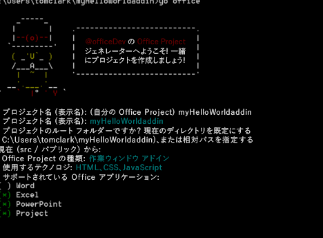

# 任意のエディターを使用して Office アドインを作成する
テキスト エディターと Yeoman ジェネレーターを使用して、Office アドインを作成します。

 _ **適用対象:** apps for Office_

Office アドインは、Office アプリケーションでホストされている Web アプリです。このトピックでは、Yeoman ジェネレーターがプロジェクトのスキャフォールディングとビルド管理を提供し、 `manifest.xml` ファイルがアドインがある場所と表示方法を Office アプリケーションに通知します。Office アプリケーションは、Office 内でのホストを管理します。

 >**メモ**  指示には、Windows コマンド プロンプトを使用しますが、その他のシェル環境でも同様に適用可能です。


## Yeoman ジェネレーターのための前提条件

Yeoman Office ジェネレーターを実行するには、以下が必要です。


- [Git](https://git-scm.com/downloads)
    
- [npm](https://www.nodejs.org/en/download)
    
- [Bower](http://bower.io/)
    
- [Yeoman Office ジェネレーター](https://www.npmjs.com/package/generator-office)
    
- [Gulp](http://gulpjs.com/)
    
- [TSD](http://definitelytyped.org/tsd/)
    
Git と npm のみ、別途インストールが必要です。その他は npm を使用してインストールできます。

Git をインストールする場合は、次のオプションを選択する以外、既定の設定を使用します。


- Windows コマンド プロンプトから Git を使用する
    
- Windows の既定のコンソール ウィンドウを使用する
    
既定値を使用して npm をインストールします。次に、管理者としてコマンド プロンプトを開き、その他のソフトウェアをグローバルにインストールします。次のように行います。


```
npm install ?g bower yo generator-office gulp tsd
```


## アドインの既定のファイルを作成する

Office アドインを開発する前に、最初にプロジェクトのフォルダーを作成して、そこからジェネレーターを実行します。Yeoman ジェネレーターは、プロジェクトをスキャフォールディングするディレクトリで実行します。

コマンド プロンプトで、プロジェクトを作成する親フォルダーに移動します。次のコマンドを使用して、 _myHelloWorldaddin_ という名前の新しいフォルダーを作成し、そこを現在のディレクトリにします。


```
mkdir myHelloWorldaddin
cd myHelloWorldaddin
```

Yeoman ジェネレーターを使用して、選択した Office アドイン (Outlook、コンテンツ、または作業ウィンドウ) を作成します。このトピックでは、作業ウィンドウのアドインを作成します。ジェネレーターを実行するには、次の命令を入力します。


```
yo office
```

ジェネレーターは、次の確認を求めるメッセージを表示します。


- アドインの名前 --  _myHelloWorldaddin_ を使用します
    
- プロジェクトのルート フォルダー -  _現在のフォルダー_ を使用します
    
- アドインの種類 -  _作業ウィンドウ_ を使用します
    
- アドインを作成するテクノロジ -  _HTML、CSS、JavaScript_ を使用します
    
- サポートされている Office アプリケーション - 任意のアプリケーションを選択できます
    

**アドイン用の Yeoman ジェネレーターの入力**

これは、アドインの構造および基本的なファイルを作成します。


## Office アドインのホスト

Office アドインは、HTTPS を経由する必要があります。Office アプリケーションは、HTTP である場合に Web アプリをアドインとして読み込みません。アドインをローカルで開発、デバッグ、ホストするには、HTTPS を使用して、Web アプリをローカルに作成して動かす方法が必要です。gulp (次のセクションで説明) により自己ホスト型の HTTPS サイトを作成することも、Azure を使用することもできます。


### 自己ホスト型の HTTPS サイトの使用

gulp-webserver プラグインは、自己ホスト型の HTTPS サイトを作成します。Office ジェネレーターは、生成されるプロジェクトの serve-static という名前のタスクとして gulpfile.js にこのサイトを追加します。次のステートメントを使用して、自己ホスト型 Web サーバーを開始します。


```
gulp serve-static
```

これは、https://localhost:8443 にある HTTPS サーバーを開始します。


## Office アドインの開発

任意のテキスト エディターを使用して、カスタム Office アドインのファイルを開発できます。


### JavaScript のプロジェクトのサポート

Office ジェネレーターは、プロジェクトを作成するときに jsconfig.json ファイルを作成します。このファイルを使用すると、プロジェクト内のすべての JavaScript ファイルを推論し、反復的な /// <参照パス="../App.js" /> コード ブロックを含める必要がなくなります。

[JavaScript 言語](https://code.visualstudio.com/docs/languages/javascript#_javascript-projects-jsconfigjson) ページの jsconfig.json ファイルについて説明します。


### JavaScript の intellisense サポート

また、プレーンな JavaScript を作成している場合でも、TypeScript 型定義ファイル ( `*.d.ts`) を使用して、追加の IntelliSense のサポートを提供することができます。Office ジェネレーターは、選択したプロジェクト型によって使用されるすべてのサード パーティのライブラリへの参照を持つ作成済みファイルに、 `tsd.json` ファイルを追加します。

Yeoman Office ジェネレーターを使用してプロジェクトを作成した後でする必要があるのは、次のコマンドを実行して、参照される型定義ファイルをダウンロードすることです。


```
tsd install
```


### Hello World Office アドイン の作成


この例では、Hello World アドインを作成します。このアドインの UI は、必要に応じて JavaScript プログラミング ロジックを記述できる HTML ファイルによって提供されます。


### Hello World アドインのファイルを作成するには


1. プロジェクト フォルダーで、 _[project folder]/app/home_ (この例では myHelloWorldaddin/app/home)、home.html を開き、既存のコードを次のコードで置き換えます。
    
  ```HTML
  <!DOCTYPE html>  
<html> 
  <head> 
     <meta charset="UTF-8" /> 
     <meta http-equiv="X-UA-Compatible" content="IE=Edge"/> 
     <link rel="stylesheet" type="text/css" href="program.css" />
   </head> 

  <body> 
     <p>Hello World!</p> 
  </body> 

 </html> 
  ```


    このファイルは、アドインの UI を表示する HTML タグの最小セットを提供します。
    
2. 同じフォルダーで、home.css ファイルを開いて、次の CSS コードを追加します。
    
  ```
  body 
{ 
     position:relative; 
} 
li :hover 
{ 
     text-decoration: underline; 
     cursor:pointer; 
} 
h1,h3,h4,p,a,li 
{ 
     font-family: "Segoe UI Light","Segoe UI",Tahoma,sans-serif; 
     text-decoration-color:#4ec724; 
} 
  ```


    このファイルは、アドインのスタイル シートを提供します。
    
3. 親プロジェクト フォルダーに戻り、manifest-myHelloWorldaddin.xml という名前の XML ファイルに次の XML コードが含まれているか確認します。
    
     >**重要**   `<id>` タグの値は、プロジェクトを作成するときに Yeoman ジェネレーターが作成する GUID です。アドイン用に Yeoman ジェネレーターが作成した GUID は変更しないでください。ホストが Azure の場合、 `SourceLocation` の値は、 _https:// [name-of-your-web-app].azurewebsites.net/[path-to-add-in]_ のような URL になります。この例のように、自己ホスト型のオプションを使用する場合、 _https://localhost:8443/[path-to-add-in]_ になります。

  ```XML
  <?xml version="1.0" encoding="utf-8"?> 
<OfficeApp xmlns="http://schemas.microsoft.com/office/appforoffice/1.1" 
           xmlns:xsi="http://www.w3.org/2001/XMLSchema-instance" 
           xsi:type="TaskPaneApp"> 
<Id>[GUID-for-your-add-in]</Id> 
<Version>1.0</Version> 
<ProviderName>Microsoft</ProviderName> 
<DefaultLocale>EN-US</DefaultLocale> 
<DisplayName DefaultValue="myHelloWorldaddin"/> 
<Description DefaultValue="My first app."/> 
 
<Hosts> 
  <Host Name="Document"/> 
  <Host Name="Workbook"/> 
</Hosts>
 
<DefaultSettings> 
  <SourceLocation DefaultValue="https://localhost:8443/app/home/home.html"/> 
</DefaultSettings> 

<Permissions>ReadWriteDocument</Permissions>
 
</OfficeApp> 
  ```


### アドインをローカルで実行する


アドインをローカルにテストするには、ブラウザーを開き、home.html ファイルの URL を入力します。これは、Web サーバーまたは自己ホスト型の HTTPS サイトのいずれかです。ローカルにホストした場合は、URL をブラウザーに入力します。この例では、 `https://localhost:8443/app/home/home.html` です。

「このWeb サイトのセキュリティ証明書には問題があります」のようなエラーが表示されます。「この Web サイトの閲覧を続行する...」を選択すると、"Hello World!" というテキストが表示されます。


 >**メモ**  生成されたアドインには、自己署名証明書とキーが付属します。これらを証明書の信頼できる証明機関リストに追加して、ブラウザーが証明書に関する警告を発行しないようにします。独自の自己署名証明書を使用する場合は、[gulp-webserver](https://www.npmjs.com/package/gulp-webserver)のドキュメントを参照してください。OS X Yosemite で証明書を信頼する方法の手順は、 [この KB 記事#PH18677](https://support.apple.com/kb/PH18677?locale=ja_JP) を参照してください。


## テスト用にアドインをインストールする

サイドロードを使用して、テストのためにアドインをインストールできます。


- [テストのために Office アドインをサイドロードする]()
    
- [テストのために Outlook アドインをサイドロードする]()
    
あるいは、アドインをカタログまたはネットワーク共有に発行し、それをエンドユーザーが行う方法でインストールすることもできます。詳細については、「 [作業ウィンドウ アドインとコンテンツ アドインを SharePoint のアドイン カタログに発行する](https://msdn.microsoft.com/ja-jp/library/office/fp123517.aspx.aspx)」および「 [作業ウィンドウ アドインとコンテンツ アドインのネットワーク共有フォルダー カタログを作成する](https://msdn.microsoft.com/ja-jp/library/office/fp123503.aspx.aspx)」をご参照ください。


## Office アドインのデバッグ

アドインをデバッグする方法はいくつかあります。


- Office Web クライアントを使用して、ブラウザーの開発者ツールを開き、ほかのクライアント側 JavaScript アプリケーションと同様にアドインをデバッグします。
    
- Windows 10 でデスクトップの Office を使用している場合、 [Windows 10 で F12 開発者ツールを使用してアドインをデバッグする](../testing/debug-add-ins-using-f12-developer-tools-on-windows-10.md)が可能です。
    


## その他の技術情報


- [Visual Studio での Office アドインの作成とデバッグ](../../docs/get-started/create-and-debug-office-add-ins-in-visual-studio.md)
    
