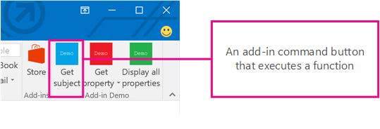
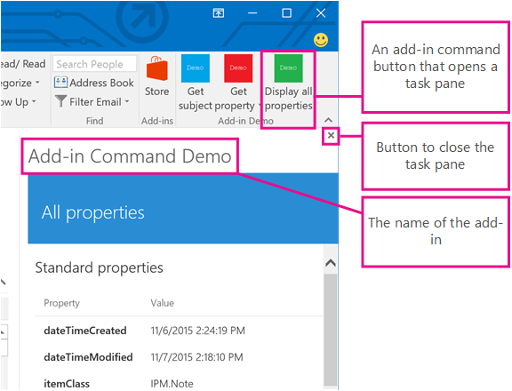
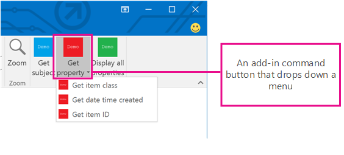

# Outlook のアドイン コマンド
アドイン コマンドを使用して、Outlook アドインを Outlook UI と統合します。 

 _ **適用対象:** apps for Office?| Office Add-ins?| Outlook_

Outlook アドイン コマンドを作成して、ボタンまたはドロップダウン メニューとしてリボンに追加すると、リボンから特定のアドイン操作を開始できるようになり、ユーザーが簡単、直観的、かつ自然にアドインにアクセスできるようになります。アドイン コマンドを採用すれば、シームレスに機能性が向上するので、より魅力的なソリューションを作成することができます。

アドイン コマンドは、アクティブにするアイテムの種類を制限するために、 [ItemHasAttachment](https://msdn.microsoft.com/en-us/library/fp123567.aspx%28Office.15%29.aspx)、 [ItemHasKnownEntity](https://msdn.microsoft.com/en-us/library/fp161166.aspx%28Office.15%29.aspx)、または [ItemHasRegularExpressionMatch](https://msdn.microsoft.com/en-us/library/fp142215.aspx%28Office.15%29.aspx) ルールを使用しないアドインに対してのみ使用できます。ただし、アドインが提供できるコマンドは、ユーザーが現在メッセージと予定表のどちらを選択しているかに応じて異なり、閲覧シナリオまたは新規作成シナリオのいずれかで表示するように選択できます。可能な場合はアドイン コマンドを使用するというのが [ベスト プラクティス](../../docs/design/add-in-development-best-practices.md)です。

## アドイン コマンドの作成

アドイン コマンドは、 **VersionOverrides** 要素のアドイン マニフェストで宣言されます。この要素はマニフェスト スキーマ v1.1 に追加されたもので、下位互換性が保証されています。 **VersionOverrides** をサポートしていないクライアントでも、既存のアドインは引き続きアドイン コマンドのないときと変わらずに機能します。

 **VersionOverrides** マニフェスト エントリは、アドイン コマンドについての多くの事柄 (ホスト、リボンに追加されるコントロールの種類、テキスト、アイコン、関連する機能など) を指定します。詳細については、「 [Outlook アドイン マニフェストでアドイン コマンドを定義する](../outlook/manifests/define-add-in-commands.md)」をご覧ください。 

アドインから進捗状況の更新 (進行状況インジケータやエラー メッセージなど) を提供する必要がある場合は、 [通知 API](http://dev.outlook.com/reference/add-ins/NotificationMessages.html%28Office.15%29.md) を介して行う必要があります。さらに通知の処理が、マニフェストの **FunctionFile** ノードで指定された別個の HTML ファイルで定義されている必要があります。

アドイン コマンドがリボンに沿って適正に配置されるように、開発者は必要なすべてのサイズのアイコンを定義する必要があります。アイコンのサイズは、80 x 80 ピクセル、32 x 32 ピクセル、および 16 x 16 ピクセルです。

## アドイン コマンドが表示される方法

アドイン コマンドは、リボン上にボタンとして表示されます。ユーザーがアドインをインストールすると、アドインのコマンドはアドイン名のラベルが付いたボタン グループとして UI に表示されます。これは、リボンの既定のタブまたはカスタム タブのいずれかに表示されます。メッセージの場合の既定のタブは **[ホーム]** タブまたは **[メッセージ]**タブのいずれかです。予定表の場合の既定のタブは  **[会議]** タブ、 **[個別の会議]** タブ、 **[定期的な会議]** タブ、または **[予定]** タブです。既定タブでは、それぞれのアドインは 1 つのリボン グループを持つことができ、1 つのリボン グループに含まれるコマンドの数は 6 個までです。カスタム タブには、アドインのグループを 10 個まで含めることができ、1 つのグループにコマンドが 6 個まで表示されます。アドインに使用できるカスタム タブは 1 つのみに制限されています。

リボン内が密集してくると、アドイン コマンドは適正な方法で調整されます (折りたたまれます)。どのような場合でも 1 つのアドインのアドイン コマンドはグループにまとめられます。

アドイン コマンドをアドインに追加すると、アドインに [カスタム ウィンドウの Outlook アドイン](../outlook/custom-pane-outlook-add-ins.md)も含まれていない限り、そのアドイン名がアプリ バーから削除されます。リボンに表示されるのは、アドイン コマンド ボタンだけです。

## アドイン コマンド用の UX シェイプ

アドイン コマンドの UX シェイプは、さまざまな機能を実行できるボタンを含むホスト アプリケーション内のリボン タブで構成されています。現在、次の 3 つのシェイプがサポートされています。

- JavaScript 関数を実行するボタン
    
- 作業ウィンドウを起動するボタン
    
- 他の 2 種類のボタンが 1 つ以上含まれるドロップダウン メニューを示すボタン
    

### JavaScript 関数の実行

JavaScript 関数を実行するアドイン コマンド ボタンは、アクションを開始するためにユーザーが追加の選択をする必要のないシナリオで使用します。追跡、通知、印刷などの操作がこれに該当します。ユーザーがサービスからより詳細な情報を取得するためにも使用されることがあります。 

### 作業ウィンドウの起動

作業ウィンドウを起動するアドイン コマンド ボタンは、ユーザーが長時間アドインと対話する必要があるシナリオで使用します。たとえば、アドインのために、設定を変更したり多数のフィールドに入力したりすることが必要となる場合があります。 

垂直作業ウィンドウの既定の幅は 300 px です。垂直作業ウィンドウのサイズは、Outlook エクスプローラーとインスペクターの両方で変更できます。このウィンドウのサイズは、To Do ウィンドウやリスト ビューのサイズを変更するときと同じ方法で変更することができます。

上記のスクリーンショットは、垂直作業ウィンドウの例を示しています。このウィンドウには、アドイン コマンドの名前が左上隅に表示されます。ウィンドウの右上隅には  **[X]** ボタンがあり、使い終わったらこれでアドインを閉じることができます。このウィンドウは、メッセージをまたいで保持されません。作業ウィンドウに表示される、アドイン名と閉じるボタン以外のすべての UI 要素は、アドインによって提供されます。

ユーザーが作業ウィンドウを開く別のアドイン コマンドをクリックすると、作業ウィンドウは直近にクリックされたそのコマンドによって置き換えられます。作業ウィンドウが開いている間にユーザーが、関数を実行するアドイン コマンド ボタンまたはドロップダウン メニューをクリックすると、操作が完了して、作業ウィンドウは開いたままになります。

### ドロップダウン メニュー

ドロップダウン メニュー アドイン コマンドは、ドロップダウン内に表示されるボタンの静的リストを定義します。メニューには、機能を実行するボタンや作業ウィンドウを開くボタンを自由に組み合わせて含めることができます。サブメニューはサポートされません。

## UI でアドイン コマンドが表示される場所

アドイン コマンドは次の 4 つのシナリオでサポートされています。

### メッセージの閲覧

ユーザーがメッセージを閲覧している間は、既定のタブに追加されたアドイン コマンドは、 **[ホーム]** タブ (閲覧ウィンドウでメッセージを表示している場合) とポップアウト閲覧フォームの **[メッセージ]** タブに表示されます。

### メッセージの作成

ユーザーがメッセージを作成している間は、既定のタブに追加されたアドイン コマンドが  **[メッセージ]** タブに表示されます。

### 開催者として予定または会議を作成または表示する

開催者として予定または会議を作成または表示する場合、既定のタブに追加されたアドイン コマンドは、ポップアウト フォームの  **[会議]**、 **[個別の会議]**、 **[定期的な会議]**、または  **[予定]** のタブに表示されます。ただし、ユーザーが予定表のアイテムを選択してもポップ アウトを開かなければ、そのアドインのリボン グループはリボンに表示されません。

### 出席者として会議を表示する

出席者として会議を表示する場合、既定のタブに追加されたアドイン コマンドは、ポップアウト フォームの  **[会議]**、 **[個別の会議]**、または  **[定期的な会議]** のタブに表示されます。ただし、ユーザーが予定表のアイテムを選択してもポップ アウトを開かなければ、そのアドインのリボン グループはリボンに表示されません。

## その他の技術情報

- [Get Started with Outlook add-ins for Office 365](https://dev.outlook.com/MailAppsGettingStarted/GetStarted.aspx)
    
- [Outlook アドイン マニフェストでアドイン コマンドを定義する](../outlook/manifests/define-add-in-commands.md)
    
- [Add-in Command Demo Outlook Add-in](https://github.com/jasonjoh/command-demo.aspx)
    
