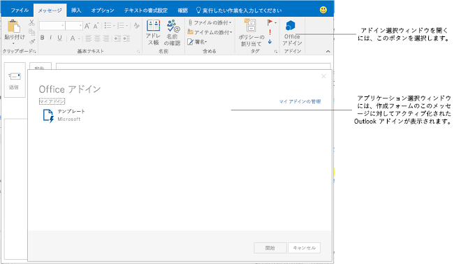

# 新規作成フォーム用の Outlook アドインを作成する
閲覧シナリオ用の Outlook アドインの作成方法と、使用可能な API 機能について説明します。

 _ **適用対象:** apps for Office?| Office Add-ins?| Outlook_

## 新規作成フォーム用の Outlook アドインのセットアップ

Office アドイン マニフェストのスキーマのバージョン 1.1 と office.js の v1.1 から、新規作成フォームでアクティブ化される Outlook アドインである、新規作成アドインを作成できるようになりました。閲覧アドイン (ユーザーがメッセージや予定を表示するとき閲覧モードでアクティブ化される Outlook アドイン) とは対照的に、新規作成アドインは以下のユーザー シナリオで使用できます。

- 新しいメッセージ、会議出席依頼または予定を新規作成フォームで作成している。
    
- 既存の予定またはユーザーが開催者になっている会議アイテムを表示または編集している。
    
     >**メモ**  Outlook 2013 および Exchange 2013 の RTM リリースでユーザーが自分で組織した会議アイテムを表示している場合、閲覧アドインが使用可能です。Office 2013 SP1 リリース以降では変更が加えられ、同様のシナリオでアクティブ化して使用可能なのは新規作成アドインのみになりました。
- インライン応答メッセージを作成しているか、別の新規作成フォームでメッセージに返信している。
    
- 会議出席依頼または会議アイテムに対する応答 ([ **承諾**]、[ **仮承諾**]、または [ **拒否**]) を編集している。
    
- 会議アイテム用に新しい時間を提案している。
    
- 会議出席依頼や会議アイテムを転送するか、それらに返信している。
    
これらの新規作成シナリオのそれぞれで、アドインによって定義されているアドイン コマンド ボタンが表示されます。アドイン コマンドが実装されていない古いアドインの場合は、ユーザーはリボンの  **[Office アドイン]** を選択してアドイン選択ウィンドウを開いてから、新規作成アドインを選択して開始することができます。図 1 は、新規作成フォームのアドイン コマンドを示しています。

**図 1. アドイン コマンドが表示されている Outlook メッセージ新規作成フォーム**

図 2 は、ユーザーが Outlook でインライン応答を作成するときにアクティブ化される、アドイン コマンドが実装されていない 2 つの新規作成アドインが含まれたアドイン選択ウィンドウを示しています。

**図 2. 作成中のメッセージ用に使用可能な Outlook アドインが表示されているアドイン選択ウィンドウ**

## 新規作成モードで使用できるアドインの種類

新規作成アドインは [Outlook のアドイン コマンド](../outlook/add-in-commands-for-outlook.md)として実装されます。

## 新規作成アドインに使用できる API の機能

- 新規作成フォームでアドインをアクティブ化する場合: 「 [マニフェストでのアクティブ化ルールの指定](../outlook/manifests/activation-rules.md#specify-activation-rules-in-a-manifest)」の表 1 を参照してください。
    
- [Outlook で新規作成フォームのアイテムに添付ファイルを追加および削除する](../outlook/add-and-remove-attachments-to-an-item-in-a-compose-form.md)
    
- [Outlook で新規作成フォームのアイテム データを取得および設定する](../outlook/get-and-set-item-data-in-a-compose-form.md)
    
- [Outlook の予定またはメッセージを作成するときに受信者を取得、設定、または追加する](../outlook/get-set-or-add-recipients.md)
    
- [Outlook で予定またはメッセージを作成するときに件名を取得または設定する](../outlook/get-or-set-the-subject.md)
    
- [Outlook で予定またはメッセージを作成するときに本文にデータを挿入する](../outlook/insert-data-in-the-body.md)
    
- [Outlook で予定を作成するときに場所を取得または設定する](../outlook/get-or-set-the-location-of-an-appointment.md)
    
- [Outlook で予定を作成するときに時刻を取得または設定する](../outlook/get-or-set-the-time-of-an-appointment.md)
    
- [Outlook-Power-Hour_Code-Samples](https://github.com/OfficeDev/Outlook-Power-Hour-Code-Samples):  `ComposeAppDemo`
    

## その他の技術情報

- [Get Started with Outlook add-ins for Office 365](https://dev.outlook.com/MailAppsGettingStarted/GetStarted.aspx)
    
- [Outlook アドイン](../outlook/outlook-add-ins.md)
    
