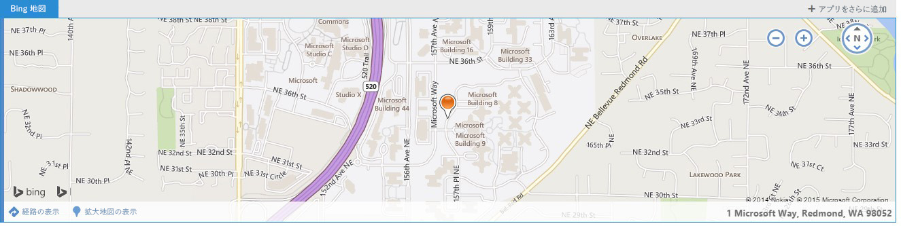

# コンテキスト Outlook アドイン
メッセージに指定されたテキストまたは予定に基づいて Outlook アドインをアクティブ化する方法について説明します。

 _ **適用対象:** apps for Office?| Office Add-ins?| Outlook_

コンテキスト アドインは、メッセージ内のテキストまたは予定に基づいてアクティブになる Outlook アドインです。コンテキスト アドインを使用すると、ユーザーはメッセージ自体から移動しなくてもそのメッセージに関連したタスクを開始できます。それにより、操作が簡単になると同時にユーザー エクスペリエンスが豊かになります。

コンテキスト アドインは、添付ファイルが関係するアドインや、特定のメッセージの種類に特有のアドインとは異なります。コンテキスト アドインの例を以下に示します。


- 住所を選択すると、その場所の地図が開きます。
    
- 文字列をクリックすると、会議提案アドインが開きます。
    
- 電話番号を選択すると、連絡先に追加されます。
    
現在、コンテキスト アドインを使用できるのは Outlook Web App のみです。

## コンテキスト アドインの作成方法

コンテキスト アドインを作成するには、アドインをアクティブにできるエンティティまたは正規表現をアドイン マニフェストで指定する必要があります。エンティティとしては、 [Entities](../reference/outlook/simple-types.md%28Office.15%29.md) オブジェクト内の任意のプロパティが可能です。そのため、アドイン マニフェストには **ItemHasKnownEntity** 型または **ItemHasRegularExpressionMatch** 型のルールを含める必要があります。以下の例は、電話番号であるエンティティを指定する方法を示しています。


```XML
<Rule xsi:type="ItemHasKnownEntity" EntityType="PhoneNumber"/>

```

コンテキスト アドインをアカウントに関連付けると、ユーザーが強調表示されたエンティティや正規表現をクリックしたときにコンテキスト アドインが自動的に開始します。Outlook アドインの正規表現の詳細については、「 [正規表現アクティブ化ルールを使用して Outlook アドインを表示する](../outlook/use-regular-expressions-to-show-an-outlook-add-in.md)」を参照してください。

コンテキスト アドインには、次のいくつかの制限があります。


- コンテキスト アドインを含めることができるのは読み取りアドインのみです (作成アドインは不可)。
    
- 開発者は、強調表示されたエンティティの色を指定できません。
    
- 強調表示されていないエンティティは、カード内でコンテキスト アドインを起動することはありません。
    
- カードのサイズは高さが 140 ～ 450 ピクセル (300 ピクセルに制限することを推奨) で、幅が 570 ピクセルです。
    
- 開発者は、カードまたはアドイン バーにアドインを表示するかどうかを指定できません。
    

## コンテキスト アドインの起動方法

ユーザーは、テキスト (既知のエンティティまたは開発者の正規表現) あるいはアドイン バーを使用してコンテキスト アドインを起動します。通常、エンティティが強調表示されるためユーザーはコンテキスト アドインを識別できます。以下の例は、メッセージ内で強調表示がどのように見えるかを示しています。この場合、エンティティ (住所) は青色になり、青い点線で下線表示されています。ユーザーは、強調表示されているエンティティをクリックしてコンテキスト アドインを起動します。 


**強調表示されているエンティティ (住所) が含まれるテキストの例**

コンテキスト アドインを示す最適な方法は強調表示ですが、コンテキスト アドインをアドイン バーに表示する場合もあります。


- エンティティが URL または電子メール アドレスの場合
    
- アドイン マニフェストに type=”ItemHasRegularExpressionMatch”、および PropertyName=”BodyAsHTML” または PropertyName=”SenderSMTPAddress” というルールが含まれる場合
    
- アドイン マニフェストに、最初のルールが type="ItemIs" および itemType="Appointment" (または "Message")、かつ 2 番目のルールが type="ItemHasKnownEntity" (または "ItemHasRegularExpressionMatch") の OR RuleCollection を使用するアクティベーション ルールが含まれている場合
    
- メール本文の複雑さがメール クライアントに影響を与える場合
    
1 つのメッセージ内に複数のエンティティまたはコンテキスト アドインが存在する場合、ユーザー操作の規則がいくつかあります。


- エンティティが複数ある場合、ユーザーは対象のアドインを起動するために異なるエンティティをクリックする必要があります。
    
- 1 つのエンティティが複数のアドインをアクティブにする場合、各アドインが新しいタブに表示されます。ユーザーはアドイン バーのようにタブを切り替えることによって、アドインを変更します。たとえば、名前と住所によって、電話アドインと地図が起動します。
    
- 1 つの文字列に複数のアドインをアクティブにする複数のエンティティが含まれる場合、文字列全体が強調表示され、その文字列をクリックすると、その文字列に関連付けられているすべてのアドインが別々のタブに表示されます。たとえば、レストランで会議を行う提案を説明する文字列によって、会議提案アドインとレストラン評価アドインをアクティブにできます。
    

## コンテキスト アドインの表示方法

アクティブにされたコンテキスト アドインは次の 2 つの場所のいずれかに表示されます。


- カード。エンティティの近くの別ウィンドウに表示されます
    
- アドイン バー。メッセージの送信者と本文の間の行です。
    
通常、カードはエンティティの下に表示され、可能な限りエンティティを中心とした位置となるように示されます。エンティティの下に十分なスペースがない場合、カードは上に配置されます。次のスクリーンショットは強調表示されたエンティティと、その下のカード内にアクティブにされたアドイン (Bing 地図) を示しています。


**カードに表示されるアドインの例**

以下の点に注意してください。


- [Bing 地図] タブは、青い背景色の白いテキストで表示されます。新しいアドインが選択されると、タブは白い背景色の青いテキストに変わります。
    
- さらにアドインのタブがある場合は、[Bing 地図] の右のタブに、白い背景色に青いテキストで表示されます。いずれかのタブをクリックすると、タブは青い背景色に白いテキストに変わり、新しいアドインが読み込まれます。
    
- [+ その他のアドインを取得] ボタンをクリックすると、Office ストアが開きます。
    
- 利用できるスペースに対してアドイン名が長すぎる場合、[ + その他のアドインを取得] の左側に "…" と表示されます。クリックすると、バーに収まりきらないアドインがドロップダウン リストとして表示されます。
    
- カードを閉じてアドインを終了するには、カード外の任意の場所をクリックします。
    
以下のスクリーンショットは、テキストを強調表示できない場合 (たとえば、ハイパーリングに含まれているときなど) に、同じアドイン (この場合には Bing 地図) がバーで表示される方法を示しています。


**アドイン バーと、iframe 内のアドインの例**

以下の点に注意してください。


- このスクリーンショットでは、iframe の上のアドイン バーには起動したアドインの名前と [+ その他のアドインを取得] が表示されます。アドイン バーから起動したその他のアドイン (コンテキスト アドイン、またはそれ以外) がある場合、それらも表示されます。
    
- iframe にはアドインが表示されます。開発者は iframe の高さを設定できますが、幅の値は固定されます。アドイン バー アドインに関してはカードと同じ高さが使用されるので、開発者はそれぞれの高さを指定する必要はありません。
    

## 各種デバイスでのコンテキスト アドインの表示方法

デスクトップ コンピューターでは、通常コンテキスト アドインはカードに表示されます。複数のアドインがある場合、別々のタブに表示されます。タブレットの場合、同じアドインはページの片側に表示され、複数のアドインがある場合にはそれぞれタブに表示されます。電話では、アドインはイマーシブ型として表示されます。エンティティで複数のアドインがアクティブにされている場合、右上に "…" が表示され、ユーザーは特定のエンティティの異なるアドイン間を移動できます。


## 現在のコンテキスト アドイン

以下のコンテキスト アドインが、Outlook アドインと一緒に既定でインストールされます。


- Bing 地図 
    
- Suggested Meetings
    
また、 [Package Tracker](https://store.office.com/package-tracker-WA104162083.aspx?assetid=WA104162083.aspx) コンテキスト アドインも Office ストアから利用できます。


## その他の技術情報


- [Get Started with Outlook add-ins for Office 365](https://dev.outlook.com/MailAppsGettingStarted/GetStarted.aspx)
    
- [正規表現アクティブ化ルールを使用して Outlook アドインを表示する](../outlook/use-regular-expressions-to-show-an-outlook-add-in.md)
    
- [Understanding the Office Add-ins XML manifest](https://msdn.microsoft.com/en-us/library/office/fp161044%28v=office.15%29.aspx .aspx)
    
- [Entities オブジェクト](https://dev.outlook.com/reference/add-ins/simple-types.mdl.aspx#Entities)
    
