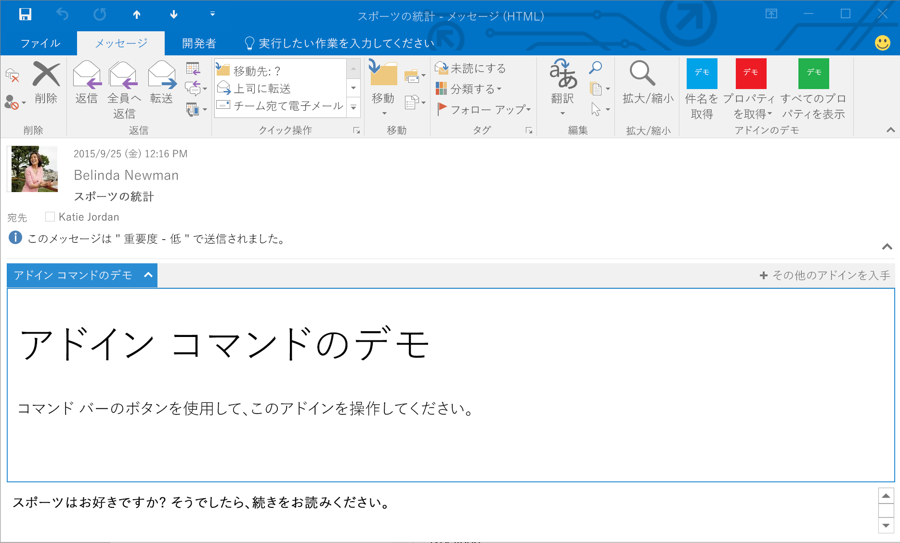

# カスタム ウィンドウの Outlook アドイン
特定のルールに基づいてアクティブ化する Outlook アドインを定義する方法を説明します。

 _ **適用対象:** apps for Office_

カスタム ウィンドウは、現在選択している項目で特定の条件を満たすときにアクティブ化するアドインの拡張点です。 **VersionOverrides** 要素のアドイン マニフェスト、およびアドインが実装するアドイン コマンドで定義されます。詳しくは、「 [Outlook アドイン マニフェストでアドイン コマンドを定義する](../outlook/manifests/define-add-in-commands.md)」をご覧ください。
カスタム ウィンドウは、メッセージの読み取られたメッセージまたは予定出席者のビューでのみ表示されます。アドイン バーにエントリが表示されます。ユーザーがエントリをクリックすると、項目の本文の上に水平方向にカスタム ウィンドウが表示されます。外観と動作は、アドイン コマンドを実装していない閲覧モードのアドインと同じです。

**閲覧モードのカスタム ウィンドウのあるアドイン**

次の例では、メッセージであるアイテム、添付ファイルがあるアイテム、またはアドレスが含まれたアイテム用のカスタム ウィンドウを定義しています。 


```
<ExtensionPoint xsi:type="CustomPane">
  <RequestedHeight>100< /RequestedHeight> 
  <SourceLocation resid="residReadTaskpaneUrl"/>
  <Rule xsi:type="RuleCollection" Mode="Or">
    <Rule xsi:type="ItemIs" ItemType="Message"/>
    <Rule xsi:type="ItemHasAttachment"/>
    <Rule xsi:type="ItemHasKnownEntity" EntityType="Address"/>
  </Rule>
</ExtensionPoint>
```


-  **RequestedHeight** は、デスクトップ コンピューターで実行するときのこのメール アドインの希望する高さをピクセル単位で指定します。それ以外の場合は無視されます。値は 32 から 450 の間にすることができます。設定されていない場合、既定値は 350 px です。省略可能。
    
-  **SourceLocation** は、カスタム ウィンドウの UI を提供する HTML ページを指定します。 **resid** 属性は、 **Resources** 要素の **Url** 要素 の **id** 属性の値に設定されます。必須。
    
-  **Rule** は、アドインがアクティブ化されるときを指定するルールまたはルールのコレクションを指定します。 [Outlook アドインのマニフェスト](../outlook/manifests/manifests.md) の定義と同じですが、 [ItemIs](http://msdn.microsoft.com/en-us/library/f7dac4a3-1574-9671-1eda-47f092390669%28Office.15%29.aspx) ルールに次の変更点があります。 **ItemType** は "Message" または "AppointmentAttendee" のいずれかで、 **FormType** 属性がありません。詳しくは、「 [Outlook アドインのアクティブ化ルール](../outlook/manifests/activation-rules.md)」をご覧ください。
    

## その他の技術情報


- [Get Started with Outlook add-ins for Office 365](https://dev.outlook.com/MailAppsGettingStarted/GetStarted.aspx)
    
- [Outlook アドインのアクティブ化ルール](../outlook/manifests/activation-rules.md)
    
- [Outlook アドインのマニフェスト](../outlook/manifests/manifests.md)
    
- [Outlook アドイン マニフェストでアドイン コマンドを定義する](../outlook/manifests/define-add-in-commands.md)
    
