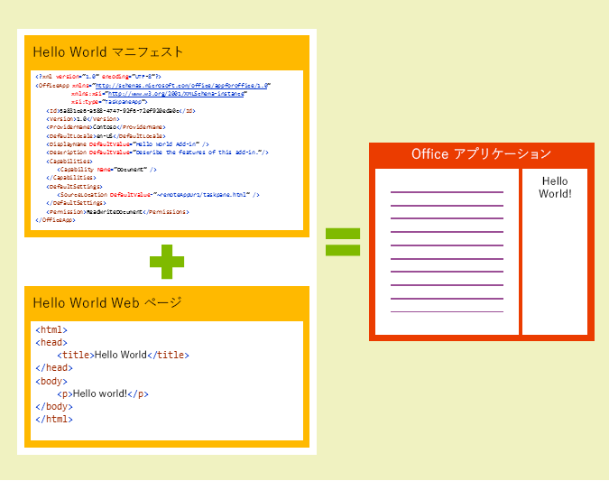
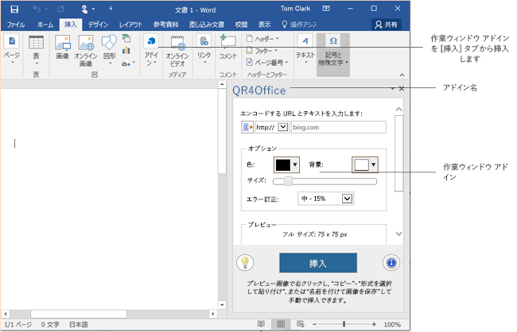
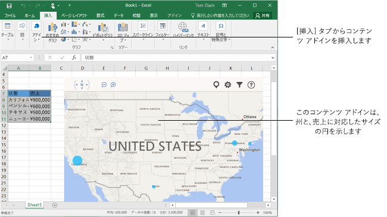
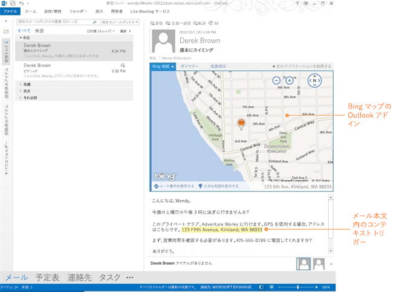

# Office アドイン プラットフォームの概要
Office アドイン プラットフォームを使用して、Office クライアント アプリケーション内でコンシューマーおよびエンタープライズ向けの魅力的で新しいエクスペリエンスを生み出します。Web と標準的な Web テクノロジ (HTML5、XML、CSS3、JavaScript、REST API など) の機能を利用して、Office ドキュメント、電子メール メッセージ、会議出席依頼、予定を操作するアドインを作成できます。

 _ **適用対象:** Access apps for SharePoint?| apps for Office?| Excel?| Office Add-ins?| Outlook?| PowerPoint?| Project?| Word_

この記事では、Office アドイン プラットフォームの概要と、アドインが Office アプリケーションと連携するしくみについて説明します。アドインの開発をすぐに始める方法については、「 [開発の基本事項](#開発の基本事項)」を参照してください。

Office アドインは、Office ホスト アプリケーションのコンテキストで実行され、Web ブラウザ コントロールや iframe でホストされる Web アプリケーションです。ユーザーのドキュメントやメール アイテムの操作が可能です。Office アドインを使用して、次のデータの拡張と操作が可能です。

-  **ドキュメントまたはデータ -** Word ドキュメント、Excel スプレッドシート、 PowerPoint プレゼンテーション、Access のブラウザベースのデータベース、および Project のスケジュールとビュー。
    
-  **Outlook メールボックス アイテム -** 電子メール メッセージ、会議出席依頼、または予定。
    
アドインは、複数の環境で実行できます。たとえば、Office デスクトップ アプリケーション、デスクトップ ブラウザーとモバイル ブラウザーの両方の Office Online、増え続ける Office タブレットとフォン アプリなどがあります。Office ストア またはオンプレミス アドイン カタログへのアドインの公開が完了すると、コンシューマーはそれらのアドインを各自の Office アプリケーションから入手できます。
いくつかのアドインを試すには、Office ストアから以下のアドインをインストールします。

|**Office 製品**|**アドイン**|
|:-----|:-----|
|Excel|[Bing Maps](https://store.office.com/bing-maps-WA102957661.aspx?assetid=WA102957661&amp;homapppos=0&amp;homappcat=Data Visualization + BI&amp;homchv=0)|
|Outlook|[Package Tracker](https://store.office.com/package-tracker-WA104162083.aspx?assetid=WA104162083)|
|PowerPoint|[Khan Content from Microsoft](https://store.office.com/khan-content-from-microsoft-WA104320031.aspx?assetid=WA104320031)|
|Word|[Translator](https://store.office.com/translator-WA104124372.aspx?assetid=WA104124372)|
コードの一部を確認するには、Visual Studio 向けの [Office アドイン サンプル パック](http://code.msdn.microsoft.com/Apps-for-Office-code-d04762b7) をダウンロードします。

## Office アドインの構造

Office アドインの基本コンポーネントは、XML マニフェスト ファイルとアドインの既定の Web ページです。マニフェストは、アドインの UI とカスタム ロジックを実装する Web ページの URL を含む各種の設定を定義します。アドインの準備が整って顧客が利用できる状態になったなら、アドインのマニフェストをオンプレミスのアドイン カタログにアップロードするか、または Office ストアに送信します。Web ページ (すべての .js ファイルまたは実装に必要な他のすべてのファイル) は Web サーバーまたは Web ホスティング サーバー ([Microsoft Azure](../publish/host-an-office-add-in-on-microsoft-azure.md) など) でホスティングする必要があります。

**Office アドインはマニフェストと Web ページによって構成されます。**

マニフェストには、次のようなアドインの設定や機能を指定します。

- アドインの UI とプログラミング ロジックを実装する Web ページの URL。
    
- アドインの表示名、説明、ID、バージョン、および既定のロケール。
    
- アドインをアクティブ化および表示する方法:
    
      - ドキュメントを操作するアドインの場合: 作業ウィンドウとして、またはドキュメントのコンテンツに沿って表示する。
    
  - メール アイテム (メッセージまたは予定) を操作するアドインの場合: アイテムの読み取り時、またはアイテムの作成時。
    
- アドインのアクセス許可レベルとデータ アクセスの要件。
    
詳細については、「 [Office アドインの XML マニフェスト](../../docs/overview/add-in-manifests.md)」を参照してください。

## 開発の基本事項

Office アドインを作成するには、ファイルをテキストとして保存できるアプリケーションを使用できます。ただし、Napa Office 365 開発ツールの Web ベースの開発環境、または Visual Studio 2015 でプロジェクト テンプレート、開発環境、デバッグ ツールを使用すれば、より簡単に Office アドインを作成できます。

### Office アドインの基本コンポーネント

Office アドインを作成するには、少なくとも、開発者が HTML Web ページとマニフェスト ファイルを作成する必要があります。HTML ページは任意の Web サーバー、または [Microsoft Azure](../publish/host-an-office-add-in-on-microsoft-azure.md) などの Web ホスティング サービスに公開できます。マニフェスト ファイルは Web ページの場所を参照し、パブリック Office ストア、内部の SharePoint リスト、または共有ネットワークの場所のいずれかに公開されている必要があります。

最も基本的な Office アドインは、Office アプリケーション内でホストされる静的な HTML ページで構成されますが、Office ドキュメントやその他のどんなインターネット リソースとの対話も実行しません。

**Office アドイン Hello World のコンポーネント**

### Napa Office 365 開発ツールを使用して Office アドインを作成する

一般に、Office アドインを最もすばやく作成するには、ブラウザーから直接作成するのが最適です。Office アドインをブラウザーから直接作成するには、Napaを使用します。Napaは Web ベースの開発環境で、プロジェクトの作成、コードの記述、およびアドインの実行をすべてブラウザー内で行うことができます。Visual Studio などの他のツールをインストールする必要はありません。詳細については、「 [Office 365 開発者向けサイトでの Napa を使用した Office アドインの作成](create-office-add-ins-with-napa-with-a-developer-site.md)」を参照してください。すぐに開発を始めるには、以下のトピックを参照してください。

- [Napa Office 365 開発ツールを使用して作業ウィンドウ アドインを作成する](create-a-task-pane-add-in-with-napa.md)
    
- [Napa Office 365 開発ツールを使用して Excel 用コンテンツ アドインを作成する](create-a-content-add-in-with-napa.md)
    
- [Get Started with Mail add-ins for Office 365](https://dev.outlook.com/MailAppsGettingStarted/GetStarted.aspx)
    
Napaを使用して Office アドインの開発を開始する場合は、それらのプロジェクトを Visual Studio で開くことによって、高度なデバッグや Web プロジェクトをアドインの一部として使用するなどのより強力な機能を利用することができます。

### Visual Studio を使用して Office アドインを作成する

Office アドインを作成する最も強力な方法は、Visual Studio の  **Office 用アドイン**プロジェクト テンプレートを使用することです。Visual Studio は、Office でアドインのテストをすぐに開始するために必要なファイルをすべて含む完全なソリューションを作成します。Visual Studio には、Office アドインの開発およびテストを容易にする多種多様な機能が揃っています。詳細については、「 [Visual Studio での Office アドインの作成とデバッグ](../../docs/get-started/create-and-debug-office-add-ins-in-visual-studio.md)」を参照してください。すぐに開発を開始するには、このトピックをご覧ください。

- [Visual Studio を使用して作業ウィンドウ アドインまたはコンテンツ アドインを作成する](create-a-task-pane-or-content-add-in-with-visual-studio.md)
    

### テキスト エディターを使用して Office アドインを作成する

お気に入りのテキスト エディターを使用して Office アドインを作成することを望む場合は、これらを開始する方法についての以下のトピックを参照してください。

- [テキスト エディターを使用して Word 用や Excel 用の作業ウィンドウ アドインやコンテンツ アドインを作成する](create-a-task-pane-or-content-add-in-for-word-or-excel-by-using-a-text-editor.md)
    
- [Get Started with Mail add-ins for Outlook.com (Preview)](https://dev.outlook.com/MailAppsGettingStarted/GetStarted/outlook-dot-com.aspx)
    

### JavaScript API for Office

JavaScript API for Office には、アドインを作成したり、Office コンテンツおよび Web サービスと対話したりするためのオブジェクトとメンバーが含まれています。

JavaScript API for Office の詳細については

- 「 [JavaScript API for Office について](../develop/understanding-the-javascript-api-for-office.md)」および「 [JavaScript API for Office](http://msdn.microsoft.com/library/b27e70c3-d87d-4d27-85e0-103996273298%28Office.15%29.aspx)」のリファレンスを参照してください。
    
- 「 [対話式 Office アドイン API チュートリアル](http://msdn.microsoft.com/ja-jp/office/dn449240.aspx)」を使用して、Excel Online で JavaScript API for Office コードの実行と編集を行います。
    
Word と Excel の JavaScript API には、Office アドインで使用できるホスト固有のオブジェクト モデルが備わっています。それらを使って、Word や Excel の Office アドインを簡単に作成できるようにする、段落およびブックなどのよく知られたオブジェクトにアクセスします。これらの API について詳しくは、「 [word-add-ins](../word/word-add-ins.md)」および「 [Excel アドイン](https://msdn.microsoft.com/ja-JP/library/office/mt616485.aspx)」の概要トピックをご覧ください。

## Office アドインの種類

このセクションでは、3 種類の Office アドイン (作業ウィンドウ、コンテンツ、および Outlook) について説明します。

### 作業ウィンドウ アドイン

作業ウィンドウ アドインは、Office ドキュメントと並行して実行され、ドキュメントの表示や作成のエクスペリエンスを高めるコンテキスト情報や機能を提供します。たとえば、作業ウィンドウ アドインでは、ドキュメント内で選択する製品名や部品番号に基づいて製品情報を検索したり、Web サービスから取得したりできます。

**作業ウィンドウ アドイン**

作業ウィンドウ アドインを Excel 2013、Excel Online、または Word 2013 で試用するには、 [Wikipedia](https://store.office.com/wikipedia-WA104099688.aspx?assetid=WA104099688) アドインをインストールします。

### コンテンツ アドイン

コンテンツ アドインは、ドキュメントの本文に沿って表示するコンテンツとして Web ベースの機能を統合します。コンテンツ アドインでは、豊富な Web ベースのデータ視覚化、埋め込みメディア (YouTube ビデオ プレーヤー、画像ギャラリーなど)、その他の外部コンテンツを統合できます。

**コンテンツ アドイン**

コンテンツ アドインを Excel 2013 または Excel Online で試用するには、 [Bing マップ](https://store.office.com/bing-maps-WA102957661.aspx?assetid=WA102957661) アドインをインストールします。

### Outlook アドイン

Outlook アドインは、現在表示中または作成中の Outlook アイテムの横に表示されます。Outlook アドインは、読み取りシナリオ (ユーザーが受信したアイテムを表示する) または作成シナリオ (ユーザーが返信するかまたは新しいアイテムを作成する) で、電子メール メッセージ、会議出席依頼、会議出席依頼の返信、会議の取り消し、予定と連携して動作できます。Outlook アドインは、アイテムのコンテキスト情報 (アドレスやトラッキング ID など) にアクセスでき、そのデータを使用してサーバー上や Web サービスの追加情報にアクセスして、魅力的なユーザー エクスペリエンスを生み出します。Outlook アドインは、ほとんどの場合、Outlook、Outlook for Mac、Outlook Web App、および デバイス用 OWA などの各種サポート対象ホスト アプリケーション上で変更なしに実行され、デスクトップ、Web、タブレット デバイス、およびモバイル デバイスでシームレスなエクスペリエンスを提供します。

 >**メモ**  Outlook アドインには、ユーザーのメールボックスをホストするために最小バージョンの Exchange 2013 または Exchange Online が必要です。POP および IMAP の電子メール アカウントはサポートされません。

**読み取りシナリオでの Outlook アドイン**

Outlook、Outlook for Mac、または Outlook Web App で Outlook アドインを試用するには、 [Package Tracker](https://store.office.com/package-tracker-WA104162083.aspx?assetid=WA104162083) アドインをインストールします。

## Office アドインをサポートする Office アプリケーション

Office アドインは、デスクトップ、タブレット、モバイル デバイス上で実行されるますます多くの Office ホスト アプリケーション、およびブラウザー内の Office Online でサポートされています。したがって、多くの場合、異なるオペレーティング システムおよび Office ホスト アプリケーションで動作する 1 つのアドインを開発できます。そのようにして、デスクトップ、モバイル デバイス、Web ブラウザーすべてでそのアドインを使用する顧客のエクスペリエンスは一貫したものになります。

つまり、作業ウィンドウ アドインの場合、Windows デスクトップ上の Excel、PowerPoint、および Word 上で、または Web ブラウザー内で実行する Excel Online、PowerPoint Online、Word Online で動作する 1 つのアドインを開発できます。また、Outlook アドインの場合は、デスクトップ上の Outlook と Outlook for Mac、タブレットやモバイル デバイス上の デバイス用 OWA、または Web ブラウザー上の Outlook Web App で動作する 1 つのアドインを開発できます。

次の表に、Office アドインを実行できる Office ホスト アプリケーション (デスクトップ、タブレット、モバイル、および Web クライアントを含む) と、各ホストがサポートするアドインの種類を示します。

**サポートされるアドインの種類**

|**Office アプリケーション**|**コンテンツ アドイン**|**Outlook アドイン**|**作業ウィンドウ アドイン**|
|:-----|:-----|:-----|:-----|
|Access Web アプリ|

|||
|Excel 2013 以降|

||

|
|Excel Online|

||

|
|Outlook 2013 以降||

||
|Outlook for Mac||

||
|Outlook Web App||

||
|デバイス用 OWA||

||
|PowerPoint 2013 以降|

||

|
|PowerPoint Online|

||

|
|Project 2013 以降|||

|
|Word 2013 以降|||

|
|Word Online|||

|
詳細については、「 [Office アドインを実行するための要件](../../docs/overview/requirements-for-running-office-add-ins.md)」を参照してください。

## Office アドインでできること

Office アドインでは、Web ページがブラウザー内で実行できることであれば、次のようにほとんどあらゆることが行えます。

- JavaScript による対話型 UI およびカスタム ロジックの提供。
    
- JavaScript フレームワークの使用 (jQuery など)。
    
- HTTP および AJAX による REST エンドポイントや Web サービスへの接続。
    
- サーバー側のコードまたはロジックの実行 (ASP、PHP など、サーバー側のスクリプト言語を使用してページが実装されている場合)。
    
また、Web ページの場合と同様に、Office アドインは、ドメイン分離のための同一生成元ポリシー、セキュリティ ゾーンなど、ブラウザーによって課せられる制限と同じ制限を受けます。

Web ページの通常の機能に加え、Office アドインは、Office アドインのインフラストラクチャによって提供される JavaScript ライブラリを介して Office アプリケーションやアドイン ユーザーのコンテンツと対話できます。アドインが Officeやコンテンツを操作する方法は、以下に示すように、アドインの種類に依存します。

- 作業ウィンドウおよびコンテンツ アドインの場合は、API によってドキュメントの読み取りと書き込みや、重要なアプリケーションおよびユーザー イベント (アクティブな選択内容の変更など) の処理がアドインで可能になります。作業ウィンドウおよびコンテンツ アドインで使用可能な機能の概要については、「 [作業ウィンドウ アドインとコンテンツ アドインの概要](task-pane-and-content-add-ins.md)」を参照してください。
    
- Outlook アドインの場合は、API により、電子メール メッセージ、会議出席依頼、および予定アイテムのプロパティやユーザー プロファイル情報へのアクセスがアドインで可能になります。また、この API はいくつかの Exchange Web Services 操作へのアクセスも可能にします。Outlook アドインについて詳しくは、「 [Outlook アドイン](../outlook/outlook-add-ins.md)」を参照してください。Outlook アドインの主な機能の概要については、「 [Outlook アドインのアーキテクチャと機能の概要](../outlook/overview.md)」を参照してください。
    

## ランタイムについて

Office アドインは、アドインのランタイム環境、複数層のアクセス許可モデル、およびパフォーマンス ガバナーによって保護されます。このフレームワークは、以下の方法でユーザーのエクスペリエンスを保護します。

- ホスト アプリケーションの UI フレームへのアクセスが管理されます。
    
- ホスト アプリケーションの UI スレッドに対しては間接的なアクセスのみが許可されます。
    
- モーダルな操作は許可されていません。たとえば、JavaScript アラートは許可されていません。
    
さらに、ランタイム フレームワークには、Office アドインによるアドイン ユーザーの環境の破壊を防止するうえで以下の利点があります。

- アドインが実行されるプロセスを分離します。
    
- .dll や .exe の置き換えも、ActiveX コンポーネントも必要ありません。
    
- アドインのインストールとアンインストールが容易になります。
    
また、Office アドインによるメモリ、CPU、およびネットワーク リソースの使用をランタイム フレームワークが管理することで、良好なパフォーマンスと信頼性が確保されます。

Office アドインのプライバシーおよびセキュリティ モデルの詳細については、「 [Office アドインのプライバシーとセキュリティ](87c59a88-10e2-4c88-b6a8-736bd356e5f8.md)」を参照してください。

## 公開の基本事項

Office アドインは、以下の 4 つの配布エンドポイントに公開できます。

-  **Office ストア** - これはマイクロソフトが Office.com 上でホストおよび統制するパブリック マーケットプレースです。Office ストアでは、世界中の開発者が各自のカスタム Office ソリューションを公開および販売でき、エンド ユーザーや IT プロフェッショナルはそれらをダウンロードして個人または企業で使用できます。
    
    開発者がアドインを Office ストアにアップロードすると、マイクロソフトはそのコードを検証します。たとえば、アドイン マニフェストのマークアップが有効で完全なことを検証します。コードが有効な場合、マイクロソフトはそのアドイン パッケージにデジタル署名を行います。その後は、Office ストアが、検索から購入、アップグレード、更新に至るまでのコンシューマーによるダウンロードのエクスペリエンスを管理します。
    
-  **SharePoint の Office アドイン カタログ** - 作業ウィンドウ アドインとコンテンツ アドインの場合、IT 部門でプライベート アドイン カタログを展開して、Office ストアと同様の方法によってアドインを取得できるしくみを構築できます。この新しいカタログと展開プラットフォームにより、IT 部門では効率化された方法を使用して、マネージ ユーザーに一元的な場所から Office アドインと SharePoint アドインを配布できます。
    
    アドイン カタログは、すべての SharePoint 2013 カスタマー (Office 365 やオンプレミスの SharePoint を含む) が利用できます。アドイン カタログでは、内部で作成されたアドインと、Office ストアで入手可能かつ企業用にライセンスされたアドインの両方を公開および管理できます。
    
-  **Exchange カタログ** - Outlook アドイン用のプライベート カタログであり、そのカタログが存在する Exchange サーバーのユーザーが利用できます。このカタログにより、企業の Outlook アドイン (内部で作成されたアドインや、Office ストアで入手可能かつ企業用にライセンスされたアドインを含みます) の公開と管理が可能になります。
    
-  **ネットワーク共有フォルダーのアドイン カタログ** - IT 部門と開発者は、作業ウィンドウ アドインやコンテンツ アドインを中央のネットワーク共有フォルダーに展開することもできます。この場合、マニフェスト ファイルの保存と管理はそのネットワーク共有フォルダーで行われます。ユーザーは、この共有フォルダーを信頼できるカタログとして指定することでアドインを取得できます。また、IT 部門では、レジストリ設定を使用してこの共有フォルダーを信頼できるカタログとして構成することもできます。
    
詳細については、「 [Office アドインを発行する](../publish/publish.md)」を参照してください。

## シナリオ

次のシナリオでは、長時間を要する複雑な問題を解決するためのクイックヒット アドインとして Office アドインが最適であることを示します。

これらのシナリオでは、さまざまな方法を提案します。たとえば、使い慣れた Office UI を複数のデバイスで使用して基幹業務データのサーフェス化とビジネス プロジェクトの構造化の促進を行う方法を提案します。また、Office、SharePoint、および SAP に接続する支出管理アドインの使用方法や、販売データと Bing Maps Web サービスのマップを組み合わせてより効果的な販売レポートを作成するアドインの開発方法も提案します。これらのシナリオでは、既存の投資 (エンタープライズ リソース プランニング (ERP)、顧客関係管理 (CRM) など) から得られる収益を明らかにするために、Office クライアントとこれらのアプリケーションの間で行うナビゲーションにかかる時間をできるだけ短縮する方法について説明します。

次のようなシナリオがあります。

-  **翻訳ウィザード** ? 選択されているテキストを文書で使用されている言語からドロップダウン リストで選択された別の言語に自動的に翻訳する Word 作業ウィンドウ アドイン。
    
-  **グラフ作成** ? 選択されたデータからグラフを自動的に作成する Excel コンテンツ アドイン。
    
-  **サードパーティ サービスの統合** ? 選択されているテキストに対応する Wikipedia ページを自動的に表示する Word または Excel の作業ウィンドウ アドイン。
    
-  **リッチ マッシュアップ** ? 石油会社の油田採掘装置や資源の場所をプロットする (会社のリソース管理システムからリアルタイムに情報を入手する処理を含む) Excel の Bing マップ コンテンツ アドイン。
    
-  **仕様検証** ? ビジネス システムと通信して航空機部品の現在の設計仕様書と最新の仕様書を比較検証し、現在の仕様書に古い箇所がある場合は該当するセクションや段落にマークを付ける Word 作業ウィンドウ アドイン。
    
-  **ワークフローの開始** - Outlook アドインは、テンプレートに基づくメッセージや議出席依頼の作成、会議場所の詳細やユーザー選択による署名の挿入、関連ドキュメントの添付を支援することができます。
    
-  **コンテキストでサーフェス化される注文詳細** - 電子メール メッセージに埋め込まれた購入注文番号または顧客番号を検出して、注文または顧客の詳細をメッセージに示す Outlook アドイン。この Outlook アドインには承認などの操作を含めることができます。
    

## その他の技術情報

- [Office アドイン](../../docs/overview/office-add-ins.md)
    
- [Office アドインの設計ガイドライン](../add-in-design.md)
    
- [作業ウィンドウ アドインとコンテンツ アドインの概要](task-pane-and-content-add-ins.md)
    
- [Outlook アドイン](../outlook/outlook-add-ins.md)
    
- [Outlook アドインのアーキテクチャと機能の概要](../outlook/overview.md)
    
- [Office アドインを発行する](../publish/publish.md)
    
- [Office アドインの API とスキーマ参照](../../reference/reference.md)
    
