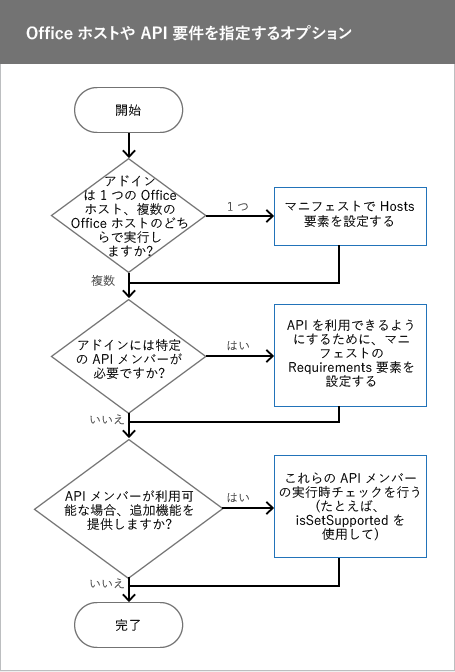

# Office のホストと API の要件を指定する
アドインに必要な Office ホスト、要件セット、または API メンバーを指定します。アドインが実行されている Office ホストで API メンバーがサポートされている場合は、 **isSetSupported** またはその他のランタイム チェックを使用して追加の機能を提供します。

 _ **適用対象:** Access apps for SharePoint?| apps for Office?| Excel?| Office Add-ins?| Outlook?| PowerPoint?| Project?| Word_

期待どおりの動作をするうえで、Officeアドイン は特定の Office ホスト、要件セット、API メンバー、または API のバージョンに依存することがあります。たとえば、アドイン には、

- 1 つの Office アプリケーション (たとえば、Word または Excel のみ) で機能するものと、複数の Office アプリケーションで機能するものがあります。
    
- Office の一部のバージョンでのみ利用できる JavaScript API を使用している場合があります。たとえば、Excel 2016 で実行する アドイン では、Excel の新しい JavaScript API が使用されている可能性があります。
    
- アドインが使用する API メンバーをサポートするバージョンの Office でのみ実行するものがあります。
    
この記事は、アドインが期待どおりに機能し、できるだけ多くのユーザーが利用できるようにするために選択する必要のあるオプションについて理解するのに役立ちます。
この記事全体で説明する中心的な概念を次の表に示します。


|**概念**|**説明**|
|:-----|:-----|
|Office アプリケーション、Office ホスト アプリケーション、Office ホスト、またはホスト|アドインの実行に使用する Office アプリケーション。たとえば、Word、Word Online、Excel などです。|
|プラットフォーム|Office Online や Office for iPad などの Office ホストが実行される場所。|
|要件セット|関係する API メンバーの名前付きグループ。アドインは要件セットを使用して、Office ホストがアドインで使用される API メンバーをサポートしているかどうかを判断します。個々の API メンバーのサポートをテストするより、要件セットのサポートをテストする方が簡単です。要件セットのサポートは、Office ホスト、および Office ホストのバージョンによって異なります。要件セットは次の場所で指定します。
<ul xmlns:xlink="http://www.w3.org/1999/xlink" xmlns:mtps="http://msdn2.microsoft.com/mtps" xmlns:mshelp="http://msdn.microsoft.com/mshelp" xmlns:ddue="http://ddue.schemas.microsoft.com/authoring/2003/5" xmlns:msxsl="urn:schemas-microsoft-com:xslt"><li><p>マニフェスト ファイル内。マニフェストで要件セットを指定する場合は、アドインを実行するために Office ホストが提供する必要がある最小レベルの API サポートを設定します。マニフェストで指定された要件セットをサポートしない Office ホストは、アドインを実行できず、アドインは <span class="ui"> [個人用アドイン]</span> に表示されません。これにより、アドインが利用できる場所が制限されます。</p></li><li><p>ランタイム チェックを使用するコード内。</p></li></ul>要件セットの完全な一覧については、「[Office アドインの要件セット](http://msdn.microsoft.com/library/68e346bc-b63a-4e73-ae2f-b03d1b27b98f%28Office.15%29.aspx)」を参照してください。|
|ランタイム チェック|ランタイム時に実行されるテストでは、アドインを実行する Office ホストが アドインで使用される要件セットやメソッドをサポートしているかどうかを判断します。ランタイム チェックを実行するには、 **if** ステートメントを **isSetSupported** メソッド、要件セット、要件セットの一部でないメソッド名を指定して使用します。ランタイム チェックを使用すると、アドインを、最も多くのお客様が利用できるものにできます。要件セットとは異なり、ランタイム チェックでは Office ホストがアドインの実行のために提供する必要がある最小レベルの API のサポートは指定しません。代わりに、 **if** ステートメントを使用して、API メンバーがサポートされているかどうかを確認します。サポートされていれば、アドインで追加の機能を提供できます。ランタイム チェックを使用する場合、アドインは常に **[個人用アドイン]** に表示されます。|

## 始める前に ? 最新の アドイン マニフェスト スキーマと JavaScript API for Office ライブラリを指定する

アドインで最新バージョンの アドイン マニフェスト スキーマを使用する必要があります。アドインでランタイム チェックを使用する場合は、最新の JavaScript API for Office (office.js) ライブラリを使用する必要があります。


### 最新のアドイン マニフェスト スキーマを指定する

アドインのマニフェストが アドイン マニフェスト スキーマ バージョン 1.1 を使用している必要があります。そのようにするためには、アドインのマニフェストの  **OfficeApp** 要素を次のように設定します。


```XML
<OfficeApp xmlns="http://schemas.microsoft.com/office/appforoffice/1.1" xmlns:xsi="http://www.w3.org/2001/XMLSchema-instance" xsi:type="TaskPaneApp">
```


### 最新の JavaScript API for Office ライブラリを指定する


ランタイム チェックを使用する場合は、コンテンツ配信ネットワーク (CDN) にある JavaScript API for Office ライブラリの最新バージョンを参照します。そのためには、次の  `script` タグを HTML に追加します。CDN の URL で `/1/` を使用すれば、必ず最新バージョンの Office.js が参照されます。


```HTML
<script src="https://appsforoffice.microsoft.com/lib/1/hosted/Office.js" type="text/javascript"></script>
```


## Office のホストや API の要件を指定するオプション

Office ホストまたは API の要件を指定する場合、アドインに適した手法を選択するために検討すべき決定事項がいくつかあります。次の図に、アドインで使用すべき手法の判別方法を示します。


この図について、以下で解説します。


- アドインが 1 つの Office ホストで機能する場合は、マニフェストで  **Hosts** 要素を設定します。詳しくは、「 [Hosts 要素を設定する](#hosts-要素を設定する)」をご覧ください。
    
- Office ホストがアドインを実行するためにサポートする必要がある最小要件セットまたは API メンバーを設定するには、マニフェストで  **Requirements** 要素を設定します。詳細については、「 [マニフェストで Requirements 要素を設定する](#マニフェストで-requirements-要素を設定する)」を参照してください。
    
- Office ホストで特定の要件セットまたは API メンバーが利用可能である場合に追加の機能を提供する場合は、アドイン の JavaScript コードでランタイム チェックを実行します。たとえば、アドイン が Excel 2016 で機能する場合は、新しい JavaScript API for Excel の API メンバーを使用して追加の機能を提供できます。詳細については、「 [JavaScript コードでランタイム チェックを使用する](#javascript-コードでランタイム-チェックを使用する)」を参照してください。
    

## Hosts 要素を設定する


アドインが 1 つの Office ホスト アプリケーションで実行するようにするには、マニフェストで  **Hosts** 要素と **Host** 要素を使用します。 **Hosts** 要素がマニフェストで指定されていない場合、アドイン はすべてのホストで実行します。

たとえば、次の  **Hosts** と **Host** 宣言は、Windows 上の Excel、Excel Online、および iPad 上の Excel を含む、Excel のすべてのリリースで アドイン が機能するように指定します。


```XML
  <Hosts>
    <Host Name="Workbook" />
  </Hosts>
```

 **Hosts** 要素には 1 つ以上の **Host** 要素を含めることができます。 **Host** 要素は、アドインが必要とする Office ホストを指定します。 **Name** 属性は必須で、次のいずれかの値に設定できます。


|**名前**|**Office ホスト アプリケーション**|
|:-----|:-----|
| `"Database"`|Access Web アプリ|
| `"Document"`|Word、Word Online|
| `"Mailbox"`|Outlook、Outlook Web App、デバイス用 OWA|
| `"Presentation"`|PowerPoint、PowerPoint Online|
| `"Project"`|Project|
| `"Workbook"`|Excel、Excel Online、Excel (iPad 上)|

 >**メモ**   **Name** 属性は、アドイン を実行できる Office ホスト アプリケーションを指定します。Office ホストは、デスクトップ、Web ブラウザー、タブレット、およびスマートフォン デバイスで実行される様々なプラットフォームでサポートされています。アドイン を実行するのにどのプラットフォームを使用できるか指定することはできません。たとえば、 `"Mailbox"` を指定すると、Outlook と Outlook Web App の両方が アドイン の実行に使用できます。Microsoft が Office for iOS などの新しいプラットフォームのサポートを追加すれば、そのプラットフォームでも アドイン が利用できるようになります。


## マニフェストで Requirements 要素を設定する


 **Requirements** 要素は、アドインを実行するために Office ホストによってサポートされている必要がある最小要件セットまたは API メンバーを指定します。 **Requirements** 要素は、アドインで使用される要件セットと個々のメソッドの両方を指定できます。アドイン マニフェスト スキーマのバージョン 1.1 では、 **Requirements** 要素は Outlookアドイン以外のすべてのアドインで省略可能です。


 >**注意**   **Requirements** 要素は、アドインが使用する必要のある重要な要件セットまたは API メンバーを指定する場合にのみ使用します。Office ホストまたはプラットフォームが **Requirements** 要素で指定された要件セットや API メンバーをサポートしていない場合、アドイン はそのホストまたはプラットフォームでは実行されず、 **[個人用アドイン]** に表示されません。むしろ、アドイン を Windows 上の Excel、Excel Online、iPad 上の Excel などの Office ホストのすべてのプラットフォームで利用できるようにすることをお勧めします。 _すべての_ Office ホストとプラットフォームで アドイン を利用できるようにするには、 **Requirements** 要素ではなくランタイム チェックを使用します。

以下は、次のものをサポートするすべての Office ホスト アプリケーションで読み込まれる アドイン のコード例です。


-  **TableBindings** 要件セット 。最小バージョンは 1.1。
    
-  **OOXML** 要件セット。最小バージョンは 1.1。
    
-  **Document.getSelectedDataAsync** メソッド。
    


```XML
<Requirements>
   <Sets DefaultMinVersion="1.1">
      <Set Name="TableBindings" MinVersion="1.1"/>
      <Set Name="OOXML" MinVersion="1.1"/>
   </Sets>
   <Methods>
      <Method Name="Document.getSelectedDataAsync"/>
   </Methods>
</Requirements>
```

上記の例について、以下で解説します。


-  **Requirements** 要素には **Sets** 子要素と **Methods** 子要素が含まれます。
    
-  **Sets** 要素には 1 つ以上の **Set** 要素を含めることができます。 **DefaultMinVersion** は、すべての **Set** 子要素の **MinVersion** の既定値を指定します。
    
-  **Set** 要素は、アドイン を実行するために Office ホストがサポートする必要がある要件セットを指定します。 **Name** 属性は、要件セットの名前を指定します。 **MinVersion** は、要件セットの最小バージョンを指定します。 **MinVersion** は、 **DefaultMinVersion** の値を上書きします。要件セットと API メンバーが属する要件セットのバージョンの詳細については、「 [Office アドインの要件セット](http://msdn.microsoft.com/library/68e346bc-b63a-4e73-ae2f-b03d1b27b98f%28Office.15%29.aspx) 」をご覧ください。
    
-  **Methods** 要素には 1 つ以上の **Method** 要素を含めることができます。 **Methods** 要素は Outlookアドインでは使用できません。
    
-  **Method** 要素は、アドインが実行される Office ホストでサポートされている必要がある個々のメソッドを指定します。 **Name** 属性は必須であり、親オブジェクトで修飾されたメソッドの名前を指定します。
    

## JavaScript コードでランタイム チェックを使用する


Office ホストで特定の要件セットがサポートされている場合にアドインで追加の機能を提供することができます。たとえば、アドインが Word 2016 で実行されているときに、既存のアドインで Word 用の新しい JavaScript API を使用することができます。そのためには、要件セットの名前を指定して  **isSetSupported** メソッドを使用します。 **isSetSupported** は、アドインを実行する Office ホストが要件セットをサポートしているかどうかを実行時に判断します。要件セットがサポートされている場合、 **isSetSupported** は **true**を返し、その要件セットの API メンバーを使用する追加のコードを実行します。Office ホストが要件セットをサポートしない場合、 **isSetSupported** は **false** を返し、追加のコードは実行されません。次のコードは、 **isSetSupported** で使用する構文を示します。


```
if (Office.context.requirements.isSetSupported(RequirementSetName , VersionNumber )
{
   // Code that uses API members from RequirementSetName .
}

```

上記のコードについて:


-  _RequirementSetName_ (必須) は要件セットの名前を表す文字列です。使用可能な要件セットの詳細については、「 [Office アドインの要件セット](http://msdn.microsoft.com/library/68e346bc-b63a-4e73-ae2f-b03d1b27b98f%28Office.15%29.aspx)」をご覧ください。
    
-  _VersionNumber_ (省略可能) は要件セットのバージョンです。
    
Excel 2016 や Word 2016 では、 **ExcelAPI** または **WordAPI** の要件セットと共に **isSetSupported** を使用します。 **isSetSupported** メソッド、および **ExcelAPI** と **WordAPI** の各要件セットは、CDN で提供されている最新の Office.js ファイルで使用できます。CDN の Office.js を使用していない場合は、 **isSetSupported** が定義されないために、アドイン で例外が発生することがあります。詳細については、「 [最新の JavaScript API for Office ライブラリを指定する](#最新の-javascript-api-for-office-ライブラリを指定する)」を参照してください。


 >**メモ**   **isSetSupported** は Outlook や Outlook Web App では機能しません。Outlook や Outlook Web App でランタイム チェックを実行するには、「 [要件セットにないメソッドを使用したランタイム チェック](#要件セットにないメソッドを使用したランタイム-チェック)」で説明する手法を使用してください。

次のコードの例は、さまざまな要件セットや API メンバーをサポートする様々な Office ホストにおいて、アドインで各種の機能を提供する方法を示しています。


```
if (Office.context.requirements.isSetSupported(‘WordApi’, 1.1)
{
   	// Run code that provides additional functionality using the JavaScript API for Word when the add-in runs in Word 2016.
}
else if (Office.context.requirements.isSetSupported(‘CustomXmlParts’)
{
	  // Run code that uses API members from the CustomXmlParts requirement set.
}
else 
{
    // Run additional code when the Office host is not Word 2016, and when the Office host does not support the CustomXmlParts requirement set.
}

```


## 要件セットにないメソッドを使用したランタイム チェック


いくつかの API メンバーは要件セットに属していません。これは [JavaScript API for Office](http://msdn.microsoft.com/library/b27e70c3-d87d-4d27-85e0-103996273298%28Office.15%29.aspx) 名前空間 (Office.* の下にあるものすべて) の一部である API メンバーに適用され、 [Word アドインの JavaScript リファレンス](https://msdn.microsoft.com/library/office/mt616493.aspx) (Word.* のすべて) の名前空間や、 [Excel アドインの JavaScript API リファレンス](https://msdn.microsoft.com/library/office/mt616490.aspx) (Excel.* のすべて) の名前空間に属する API メンバーには適用されません。アドインが要件セットの一部でないメソッドに依存する場合は、以下のコード例に示すように、ランタイム チェックを実行して、Office ホストでそのメソッドがサポートされているかどうかを判別できます。要件セットに属さないメソッドの完全なリストは、「 [Office アドインの要件セット](http://msdn.microsoft.com/library/68e346bc-b63a-4e73-ae2f-b03d1b27b98f%28Office.15%29.aspx)」をご覧ください。


 >**メモ**  アドイン コードでのこの種のランタイム チェックの使用は制限することをお勧めします。

次のコードの例は、ホストが  **document.setSelectedDataAsync** をサポートしているかどうかをチェックします。


```
if (Office.context.document.setSelectedDataAsync)
{
    // Run code that uses document.setSelectedDataAsync.
}
```


## その他の技術情報


- [Office アドインの XML マニフェスト](../../docs/overview/add-in-manifests.md)
    
- [Office アドインの要件セット](http://msdn.microsoft.com/library/68e346bc-b63a-4e73-ae2f-b03d1b27b98f%28Office.15%29.aspx)
    
- [Word-Add-in-Get-Set-EditOpen-XML ](https://github.com/OfficeDev/Word-Add-in-Get-Set-EditOpen-XML)
    
