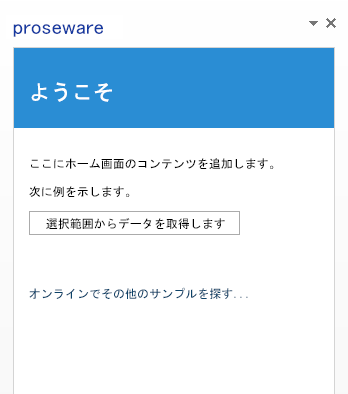

# Microsoft Azure で Office アドインをホストする
Visual Studio 2015 と Microsoft Office Developer Tools を使用して、Microsoft Azure に Office アドインを発行し、ホストします。 

 _ **適用対象:** Access apps for SharePoint?| apps for Office?| Excel?| Office Add-ins?| Outlook?| PowerPoint?| Project?| Word_

最も簡単な Office アドインは XML マニフェスト ファイルと HTML ページからできています。XML マニフェスト ファイルは、アドイン名、どの Office クライアント アプリケーションでアドインが実行できるか、アドインの HTML ページの URL など、アドインの特性を説明しています。HTML ページは Office アドイン Web サイトに含まれており、ユーザーはアドインのインストールおよび実行時にこれを確認し、操作します。Office アドインの概要に関しては、「 [Office アドイン プラットフォームの概要](../../docs/develop/privacy-and-security.md)」をご覧ください。

Office アドインの Web サイトは、Azure など多くの Web ホスティング プラットフォームでホストできます。Office アドインを Azure にホストするには、Office アドインを Azure Web サイトに発行します。 

このトピックは、ユーザーが初めて Azure を体験することを想定しています。終了すると、簡単な Office アドインが完成し、その Web サイトが Azure にホストされます。
内容は以下のとおりです。

- 信頼できるアドイン カタログを Office 2013 に追加する方法 
    
- Visual Studio 2015 または Azure 管理ポータルを使用して Azure に Web サイトを作成する方法
    
- Office アドインを Azure Web サイトに発行し、ホストする方法
    

**Azure にホストされた Office アドイン Web サイトのサンプル**

## .NET 用 Azure SDK、Azure サブスクリプション、Office 2013 を使用した開発コンピュータのセットアップ

1. .NET 用 Azure SDK を [「Azure ダウンロード ページ」(](http://azure.microsoft.com/ja-jp/downloads/)) からインストールします。Visual Studio がインストールされていない場合は、SDK により Visual Studio Express for Web がインストールされます。
    
      1. [ **言語**] から [ **.NET**] を選びます。
    
  2. 既に Visual Studio がインストールされている場合、Visual Studio のバージョンと一致する Azure .NET SDK のバージョンを選択します。
    
  3. インストールの実行可能ファイルを実行または保存するかどうかを尋ねるメッセージが表示されたら、 [  **実行**] を選択します。
    
  4. [Web プラットフォーム インストーラー] ウィンドウで、[ **インストール**] を選びます。
    
2. まだインストールされていない場合は Office 2013 をインストールします。 
    
     >**メモ**  [1 か月間有効の試用版は ](http://office.microsoft.com/ja-jp/try/?WT%2Eintid1=ODC%5FENUS%5FFX101785584%5FXT104056786) から入手できます。
3. Azure のアカウントを取得します。
    
     >**メモ**  Microsoft Developer Network (MSDN) (MSDN) に登録している場合は、 [MSDN サブスクリプションの一環として Azure サブスクリプション (](http://azure.microsoft.com/ja-jp/pricing/member-offers/msdn-benefits/)) を取得できます。MSDN に登録していない場合も、 [Windows Azure Web サイト (](https://azure.microsoft.com/ja-jp/pricing/free-trial/)) から Azure の無料の試用版を取得できます。 
チュートリアルを複雑にせずに Azure で Office アドインを使用することに焦点を当てるために、信頼できるカタログとしてローカル ファイル共有を使用します。信頼できるカタログは、アドインの XML マニフェスト ファイルを保存するところです。1 つまたは複数のビジネスで使うことを目的とするアドインでは、アドインのマニフェスト ファイルを SharePoint に保管するか、アドインを Office ストアに発行します。「 [Office アドイン プラットフォームの概要](../../docs/develop/privacy-and-security.md)」の「発行の基礎」を参照してください。

## 手順 1: アドインのマニフェスト ファイルをホストするネットワーク ファイル共有を作成する

1. 開発者用コンピューターで、ファイル エクスプローラー (Windows 7 以前の Windows を使用している場合は Windows エクスプローラー) を開きます。
    
2. C:\ ドライブを右クリックしてから、[ **新規** ] > [ ** フォルダー**] を選択します。
    
3. 新規フォルダーの名前を「AddinManifests」とします。
    
4. AddinManifests フォルダーを右クリックしてから、 **[共有相手]** > **[特定の人]** を選択します。
    
5. [ **ファイル共有**] で、ドロップダウンの矢印をクリックしてから、[ **すべてのユーザー**] > [ **追加**] > [ **共有**] の順に選択します。
    

## 手順 2: Office クライアント アプリケーションが Office アドイン のインストール先の場所を信頼するよう、ファイル共有を信頼できるアドイン カタログに追加する

1. Word 2013 を起動して、ドキュメントを作成します。(この例では Word 2013 を使用していますが、Office アドイン をサポートするすべての Office アプリケーション (Excel、Outlook、PowerPoint、またはProject 2013 など) を使用できます。)
    
2.  [ **ファイル**] > [ **オプション**] を選択します。
    
3.  **[Word のオプション]** で **[セキュリティ センター]** を選んでから、 **[セキュリティ センター設定]** を選択します。
    
4.  [ **セキュリティ センター**] で、[ **信頼できるアドイン カタログ**] をクリックします。先に **カタログ URL** として作成したファイル共有の汎用名前付け規則 (UNC) のパスを入力します (例: \\YourMachineName\AddinManifests)。続いて **[カタログの追加]** を選択します。
    
5.  **[メニューに表示する]** のチェックボックスを選択します。信頼できるアドイン カタログである共有にアドインの XML マニフェスト ファイルを保存すると、アドインが **[Office アドイン]** ダイアログボックスの **[共有フォルダー]** に表示されます。
    

## 手順 3: Azure に Web サイトを作成する

空の Azure Web サイトを作成するには、いくつかの方法があります。Visual Studio 2015 をお使いの場合は、「 [Visual Studio 2015 を使用する ](#visual-studio-2015-を使用する)」の手順に従って Visual Studio IDE 内から Azure Web サイトを作成します。また、「 [Azure 管理ポータルを使用する](#azure-管理ポータルを使用する)」の手順に従って Azure Web サイトを作成することもできます。

### Visual Studio 2015 を使用する

1. Visual Studio の  **[表示]** メニューで、 **サーバー エクスプローラー**を選択します。 **[Azure]** を右クリックして、 **[Microsoft Azure サブスクリプションへの接続]** を選択します。Azure サブスクリプションに接続するための指示に従います。
    
2. [Visual Studio] の  **[サーバー エクスプローラー]** で **[Azure]** を展開し、 **[App Service]** を右クリックしてから、 **[新しい Web アプリの作成]** を選択します。
    
3.  **[Windows Azure で Web アプリを作成]** ダイアログ ボックスで、この情報を入力します。
    
      - サイトの一意の  **[Web アプリの名前]** を入力します。Azure は、サイト名が azurewebsites.net ドメイン全体で一意であることを確認します。
    
  - この Web サイトの作成を承認するために使用する  **アプリのサービス プラン** を選択します。新しいプランを作成する場合は、名前を付ける必要もあります。
    
  - サイトの  **[リソース グループ]** を選択します。新しいグループを作成する場合は、名前をつける必要もあります。
    
  - 適切な地理的 [  **地域**] を選びます。
    
  - [ **データベース サーバー:**] で既定の [ **データベースなし**] を指定し、 [ **作成**] を選択します。
    

    新しい Web サイトが [  **サーバー エクスプローラー**] の [ **Azure**] 内の [ **App Service**] に表示されます。
    
4. 新しい Web サイトを右クリックしてから、[ **ブラウザーで表示**] を選択します。お使いのブラウザーが開き、「Web サイトが正常に作成されました」というメッセージとともに Web ページが表示されます。
    
5. ブラウザーのアドレス バーで、HTTPS を使用するように Web サイトの URL を変更し、 **Enter** キーを押して HTTPS プロトコルが有効であることを確認します。Office アドイン モデルでは、アドインは HTTPS プロトコルを使用する必要があります。
    
6. Visual Studio 2015 で、 **サーバー エクスプローラー** にある新しい Web サイトを右クリックし、 **[発行プロファイルのダウンロード]** を選択してから、お使いのコンピューターにプロファイルを保存します。発行プロファイルには資格情報が含まれるため、[手順 5: Office アドインを Azure Web サイトに発行する](#手順-5-office-アドインを-azure-web-サイトに発行する)できるようになります。
    

### Azure 管理ポータルを使用する

1. Azure アカウントを使用して [Azure 管理ポータル (](https://manage.windowsazure.com/)) にログインします。
    
2. [ **新規**] > [ **計算**] > [ **WEB アプリ**] > [ **クイック作成**] の順に選択します。 
    
3. [ **URL**] に、一意のサイト名を入力して Web サイト の URL を完全にします。管理ポータルは、サイト名が azurewebsites.net ドメイン全体で一意であることを確認します。
    
4. サイトに適した地理的な[ **地域**] を選択します。 
    
5. [ **WEB アプリの作成**] をクリックします。Azure 管理ポータルは、Web サイトを作成し、[ **Web サイト**] のページにリダイレクトします。ここでは Web サイトのステータスを確認できます。
    
    Web サイトのステータスが  **[実行中]** の場合、 **[名前]** 欄で Web サイトの URL を選びます。するとブラウザーが開き、「 **Web アプリが作成されました**」というメッセージとともに Web ページが表示されます。 
    
    ブラウザーのアドレス バーで、HTTPS を使用するように Web サイトの URL を変更し、 **Enter** キーを押して HTTPS プロトコルが有効であることを確認します。Office アドイン モデルでは、アドインは HTTPS プロトコルを使用する必要があります。
    
6. [ **Web アプリ**] ページで、新しい Web サイトを選択します。
    
7.  **[アプリの発行]** で、 **[発行プロファイルのダウンロード]** を選び、お使いのコンピューターに発行プロファイルを保存します。後で必要になるため、ファイル名と場所を覚えておきます。
    
    発行プロファイルには資格情報が含まれているため、セキュリティ保護された状態で Azure に発行することができます。 
    

## 手順 4: Visual Studio で Office アドインを作成する

1. 管理者として Visual Studio を起動します。
    
2. [  **ファイル**] > [ **新規**] > [ **プロジェクト**] の順に選択します。
    
3. [ **テンプレート**] の [ **Visual C#** (または **Visual Basic**)] を展開し、[ **Office/SharePoint**] を展開してから、[ ** Office アドイン**] を選択します。
    
4. [ **Office アドイン**] を選び、[ **OK**] をクリックして既定の設定を受け入れます。 
    
5. 
    
6. [ **Office アドインの作成**] が表示されたら、作業ウィンドウ アドインの既定の選択のまま [ **次へ**] を選択します。
    
7. 次のページで、Word 以外のチェック ボックスをすべてクリアして、 **[終了]** を選択します。
    
基本の Office アドイン が作成され、Azure に発行できる状態になります。
Azure への発行方法を示すことに焦点を当てているため、Visual Studio で標準の Office アドイン テンプレートを使って作成したサンプルのアドインを変更しないでください。

## 手順 5: Office アドインを Azure Web サイトに発行する

1. Visual Studio でサンプルのアドインを開き、 **ソリューション エクスプローラー**でソリューション ノードを展開して、ソリューションの両方のプロジェクトを表示できるようにします。 
    
2. Web プロジェクトを右クリックしてから  **[発行]** をクリックします。
    
    Web プロジェクトには Office アドイン Web サイト ファイルが含まれているため、これが Azure に発行するプロジェクトになります。
    
3. [ **Web の発行**] で [ **インポート**] を選択します。 
    
4. [ **発行の設定のインポート**] で、[ **参照**] を選択してから、このトピックで以前に発行プロファイルを保存した場所を参照します。[ **OK**] をクリックしてプロファイルをインポートします。
    
5.  **[接続]** タブの **[Web の発行]** で、既定の設定を承諾して **[次へ]** をクリックします。
    
    再度 [ **次へ >**] をクリックして既定の設定を承諾します。
    
6. [ **プレビュー**] タブで、[ **プレビューの開始**] をクリックします。Azure Web サイトに発行される Web プロジェクトのファイルがすべてプレビュー表示されます。
    
7. [ **発行**] を選択します。 Visual Studio は、Office アドイン の Web プロジェクトを Azure Web サイト に発行します。 
    
8. Visual Studio が Web プロジェクトの発行を終了する際、お使いのブラウザーが開き、「Web アプリは正常に作成されました」と記載された Web ページが表示されます。現在の所、これが Web サイトの既定のページです。
    
    アドインの Web ページを表示するには、URL を https: に変更し、続けてアドインの既定 HTML ページのパスを入力します (例として、変更後の URL は https://YourDomain.azurewebsites.net/App/Home/Home.htmlのようになります)。これにより、アドインの Web サイトが Azure にホストされるようになったことを確認できます。この URL は、このトピックの後の部分でアドインのマニフェスト ファイルを編集する際に必要になるためコピーしておいてください。
    

## 手順 6: アドインのマニフェスト ファイルを編集して Azure の Office アドインを指定する

1.  **ソリューション エクスプローラー** で Visual Studio およびサンプルの Office アドイン が開いた状態で、両方のプロジェクトが表示されるようにソリューションを展開します。
    
2. Office アドイン プロジェクトを展開します (例:  **OfficeAdd-in1**)。マニフェスト フォルダーを右クリックしてから、[ **開く**] をクリックします。アドインのマニフェストのプロパティ ページが表示されます。
    
3. [ **ソースの場所:**] で、アドインの発行後に前の手順でコピーしたアドインのメイン HTML ページの URL を入力します (例: https://YourDomain.azurewebsites.net/App/Home/Home.html)。 
    
4. [ **ファイル**]、[ **すべて保存**] の順にクリックします。アドインのマニフェストのプロパティ ページを閉じます。
    
5. [ **ソリューション エクスプローラー**] に戻り、マニフェスト フォルダーを右クリックし、[ **ファイル エクスプローラーでフォルダーを開く**] を選択します。
    
6. アドインのマニフェスト ファイル (例: OfficeAdd-in1.xml) をコピーします。 
    
7. このトピックで前に作成したネットワーク ファイル共有を参照し、マニフェスト ファイルをフォルダーに貼り付けます。
    

## 手順 7: Office クライアント アプリケーションにアプリを挿入し、実行する

1. Word を起動して新規ドキュメントを開きます。
    
2. リボンで、 **[挿入]** > **[マイ アプリ]** の順に選択し、 **[すべて表示]** を選びます。
    
3. [ **Office 用アプリ**] ダイアログボックスで、 [ **共有フォルダー**] を選択します。Office アドイン モデルで機能する Office クライアント アプリケーションは、信頼できるアドイン カタログとして一覧表示されたフォルダーをスキャンし、アドイン をダイアログに表示します。サンプル アドインのアイコンが表示されます。
    
4. アドインのアイコンを選択してから、[ **挿入**] をクリックします。アドインがクライアント アプリケーション側に挿入されます。
    
5. ドキュメントでテキストを作成してからそれを選択し、[ **選択対象からデータを取得**] をクリックして、アドインが動作しているかどうかをテストします。
    

## その他の技術情報

- [Office アドインを発行する](../publish/publish.md)
    
- [発行のための準備として Napa または Visual Studio を使用してアドインをパッケージ化する](../publish/package-your-add-in-using-napa-or-visual-studio.md)
    
