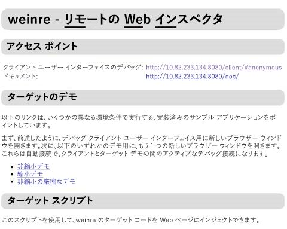
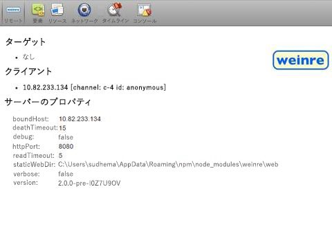
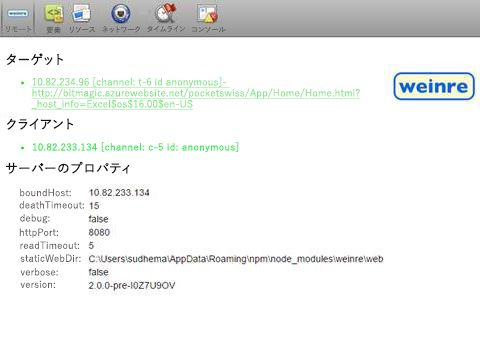
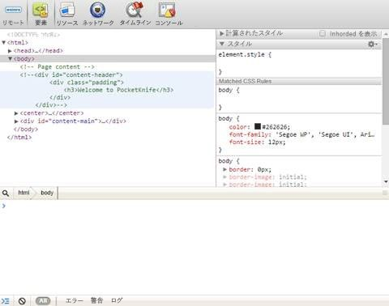

# iPad と Mac で Office アドインをデバッグする
Weinre リモート Web 検査を使用して iPad または Mac で実行する Office アドインをデバッグする

 _ **適用対象:** apps for Office?| Excel?| Office Add-ins?| Office for iPad?| Office for Mac?| PowerPoint?| Word_

Windows でのアドインの開発とデバッグには Visual Studio を使用できますが、iPad と Mac で使用して アドインをデバッグすることはできません。アドインは HTML と Javascript を使用して開発されているため、さまざまなプラットフォームで機能するように設計されていますが、さまざまなブラウザーで HTML の表示方法に微妙な違いがあります。この記事では、iPad または Mac で動作するアドインをデバッグする方法を説明します。

 >**メモ**  Windows では引き続き Visual Studio を使用してアドインをデバッグすることをお勧めします。


## Weinre を使用したデバッグ

Weinre は、リモートで動作しモバイル デバイスで Web ページをデバッグできる、F12 ツールに似た Web ページ用のデバッガーです。詳しくは、 [Weinre の Web サイト](http://people.apache.org/~pmuellr/weinre-docs/latest/)をご覧ください。


 >**メモ**  iPad または Mac でリモート デバッグを使用することができます。


### Weinre を使用して、アドインをデバッグするには


1. 最新バージョンの Node.js を、 [https://nodejs.org/](https://nodejs.org/) から Windows または Mac コンピューターにインストールします。Weinre は Node.js 上に構築されているため、最初に Node.js をインストールする必要があります。
    
2. 次の npm コマンドを使用して Weinre をインストールします:  `npm -g install weinre`
    
    Mac にインストールする場合は、次のコマンドを使用する必要がある場合があります:  `sudo npm -g install weinre`
    
    上記のコマンドが失敗する場合は、URL ( `npm -g install http://people.apache.org/~pmuellr/weinre/builds/2.0.0-pre-I0Z7U9OV/apache-cordova-weinre-2.0.0-pre-I0Z7U9OV-bin.tar.gz`) から直接インストールします。
    
3. IIS、Apache、または選択した Web サーバーがコンピューター上で実行することを確認するには、 `http://localhost` が正しいページを返すことを確認してください。
    
4. Weinre を起動します:  `weinre --httpPort 8080 --boundHost <ipaddr>` (ここで、 _ _<ipaddr>__ はご使用の PC または Mac の IP アドレスです)。
    
      1.  `http://<ipaddr>:8080` へ移動して、Weinre サーバーのホーム ページにアクセスします。
    
    



    
  2.  `http://<ipaddr>:8080/client` へ移動して、このサーバーに接続されているクライアントの一覧を取得します。
    
    



    
5. デバッグを開始するには、アドインの Web ページの  `<head>` タグに以下を含めて、Weinre のターゲット コードを参照します。
    
  ```HTML
  <script src="http://<ipaddr>:8080/target/target-script-min.js#anonymous"></script>
  ```


    iPad または Mac 上でアドインを起動します。
    
    



    
6. お気に入りのブラウザーの F12 開発者用ツールを使用してアドインをデバッグします。
    
    



    

## その他の技術情報


- [iPad で Office アドインを使用できるようにする](8ddc78f6-5746-412e-9921-182fc159e5e2.md)
    
- [iPad または Mac で Office アドインをサイドロードする](../testing/sideload-an-office-add-in-on-ipad-and-mac.md)
    
