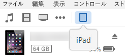
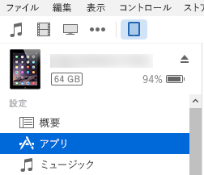
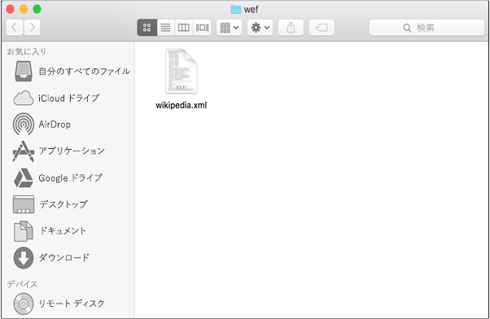
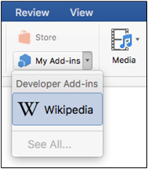
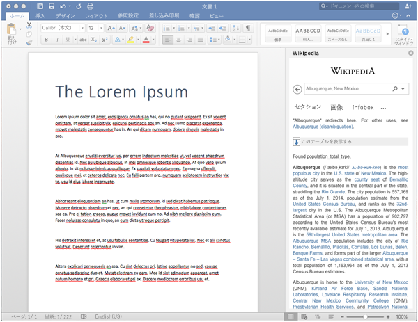

# iPad または Mac で Office アドインをサイドロードする
Office アドイン を iPad または Mac にサイドロードして、Office for iOS または Office for Mac でどのように実行されるかをテストします。

 _ **適用対象:** apps for Office?| Excel?| Office Add-ins?| Office for iPad?| Office for Mac?| PowerPoint?| Word_

アドインが Office for iOS アプリでどのように実行するかを確認するには、iTunes を使用して iPad に アドイン のマニフェストをサイドロードします。または、アドインのマニフェストを Office for Mac に直接サイドロードします。この操作では、ブレークポイントを設定してアドインを実行しながらそのコードをデバッグすることはできませんが、その動作方法や、UI が使用できて適切に表示されるかを確認することはできます。

## Office for iOS の前提条件

- [iTunes](http://www.apple.com/itunes/download/) がインストールされた Windows または Mac コンピューター。
    
- [iPad 用 Excel](https://itunes.apple.com/jp/app/microsoft-excel/id586683407?mt=8) がインストールされた iOS 8.2 以上の iPad と同期ケーブル。
    
- テスト対象アドインのマニフェスト .xml ファイル。
    

## Office for Mac の前提条件

- OS X v10.10 "Yosemite" 以降が動作し、 [Office for Mac](https://products.office.com/ja-jp/buy/compare-microsoft-office-products?tab=omac) がインストールされている Mac。
    
- Word for Mac バージョン 15.18 (160109)。
    
- Excel for Mac バージョン 15.19 (160206)。
    
- テスト対象アドインのマニフェスト .xml ファイル。
    

## iPad 用 Excel または Word のアドインをサイドロードする

1. 同期ケーブルを使用して iPad をコンピューターに接続します。iPad をコンピューターに初めて接続する場合、 **[このコンピューターを信頼しますか?]** のようなメッセージが表示されます。 **[信頼する]** を選択して続行します。
    
2. iTunes で、メニュー バーの下にある  **[iPad]** のアイコンをクリックします。
    
    

3. iTunes の左側の  **[設定]** で、 **[App]** をクリックします。
    
    

4. iTunes の右側で、 **[ファイル共有]** までスクロールしてから、 **[アドイン]** 列で **[Excel]** または **[Word]** をクリックします。
    
    

5.  **[Excel]** 列または **[Word ドキュメント]** 列の下部で、 **[ファイルの追加]** をクリックしてから、サイドロードするアドインのマニフェスト .xml ファイルを選択します。
    
6. iPad で Excel または Word アプリを開きます。Excel または Word アプリがすでに実行されている場合は、 **[ホーム]** ボタンを選択して、アプリを閉じて再起動します。
    
7. ドキュメントを開きます。
    
8.  **[挿入]** タブで **[アドイン]** をクリックします。 **[アドイン]** UI の **[開発者]** という見出しの下に、サイドロードしたアドインが表示され、挿入のために選択できるようになっています。
    
    

## Office for Mac でアドインをサイドロードする

1.  **ターミナル**を開き、アドイン のマニフェスト ファイルの保存先となる次のフォルダーのいずれかに移動します。 `wef` フォルダーがコンピューター上に存在しない場合は、作成します。
    
      - Word の場合:  `/Users/<username>/Library/Containers/com.microsoft.Word/Data/documents/wef`
    
  - Excel の場合:  `/Users/<username>/Library/Containers/com.microsoft.Excel/Data/documents/wef`
    
2.  **Finder** で `open .` コマンドを使用してフォルダーを開きます (ピリオドまたはドットを含みます)。アドインのマニフェスト ファイルをこのフォルダーにコピーします。
    
    

3. Word を開いてから、ドキュメントを開きます。Word が既に実行中の場合は再起動します。
    
4. Word で、 **[挿入]** > **[アドイン]** > **[個人用アドイン]** を選択し、アドインを選択します。
    
    
    
     >**メモ**   **[保存する]** と **[すべて表示]** のオプションは、Office for Mac (プレビュー) ではまだ利用できません。
5. アドインが Word に表示されることを確認します。
    
    

## Office for Mac の既知の問題

-  **getFileAsync** が呼び出されると Word はクラッシュします。
    
- ポップアップが表示されている間は アドイン は JavaScript API for Office への呼び出しを行うことはできません。アドインが JavaScript API for Office への呼び出しを継続して実行できるようにするには、ポップアップを閉じる必要があります。
    

## その他の技術情報

- [iPad で Office アドインを使用できるようにする](8ddc78f6-5746-412e-9921-182fc159e5e2.md)
    
- [iPad と Mac で Office アドインをデバッグする](../../docs/testing/debug-office-add-ins-on-ipad-and-mac.md)
    
