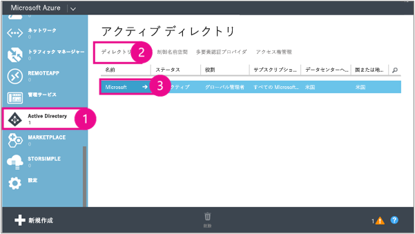
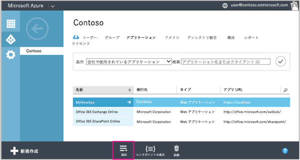
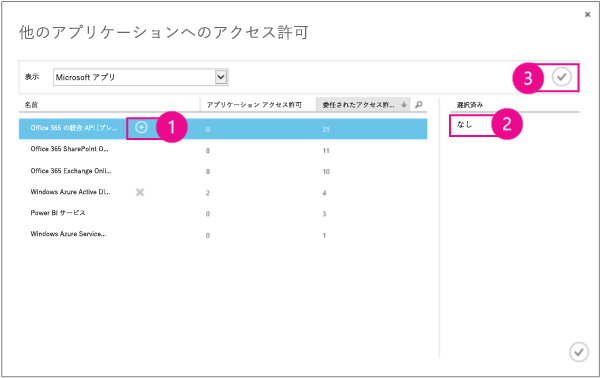
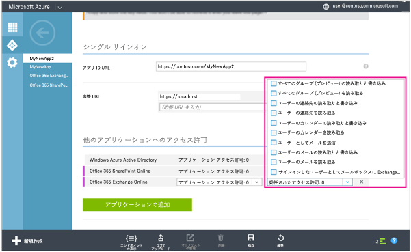
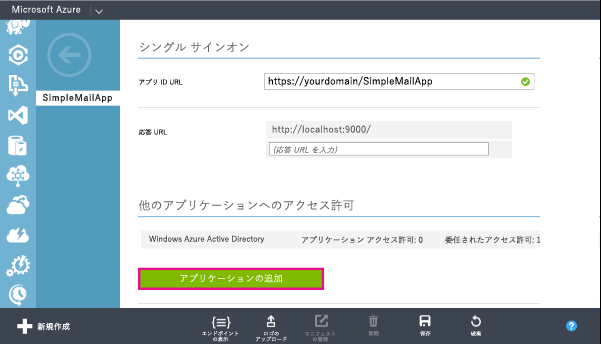
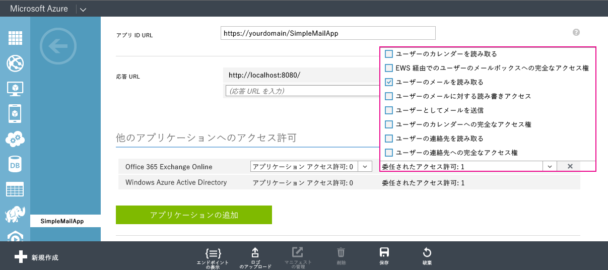

<script src="https://cdn.optimizely.com/js/3043860527.js"></script> 

[!INCLUDE [Add the O365API repo styles](../includes/controls/addo365apistyles.xml)]

[!INCLUDE [Add the Platform filter bar](../includes/controls/addplatformsfilter.xml)]

# Office 365 API でアプリを作成する

_**適用対象:** Office 365_

[!INCLUDE [Use Microsoft Graph](../includes/use-msgraph-note.txt)]

Office 365 API は、Exchange Online からメール、予定表、連絡先など、SharePoint Online および OneDrive for Business からファイルやフォルダーなど、Azure Active Directory からユーザーやグループなどの Office 365 データにアクセスできるようにする REST サービスです。


[!INCLUDE [BEGIN iOS section](../includes/controls/iossection.xml)]


**Not developing iOS apps?** Android アプリを開発するのではない場合 このページの右上隅にあるコントロールを使用して、開発するアプリの種類を選択してください。


<p class="previewnote">This documentation covers features that are currently in preview.</p>

####Office 365 API で iOS アプリを作成する


Office 365 API と統合する iOS アプリを作成できます。iOS アプリを作成する場合、[REST API](..\API\API-Catalog.md) に対して、Office 365 とやり取りするように直接プログラミングしたり、REST API に基づいて構築されたオブジェクト モデルである [Office 365 iOS SDK](https://github.com/OfficeDev/Office-365-SDK-for-iOS) を使用して、アプリを作成したりすることができます。このトピックでは、Office 365 iOS SDK を使用して、ユーザーの電子メールを取得し、ユーザーのデバイス上にそれを表示する基本的な iOS アプリを作成する手順を説明します。このチュートリアルは、Office 365 Connect のサンプルに基づいています。

Office 365 iOS コード サンプルについては、次を参照してください。

- [iOS# 版 Office 365 Connect アプリ](https://github.com/OfficeDev/O365-iOS-Connect#office-365-connect-app-for-ios)

- [iOS 用 Office 365 コード スニペット](https://github.com/OfficeDev/O365-iOS-Snippets)

- [Email Peek - Office 365 を使用して構築された iOS アプリ](https://github.com/OfficeDev/O365-iOS-EmailPeek/)

**注** これらのコード サンプルでは、[iOS 用 Office 365 SDK](https://github.com/OfficeDev/Office-365-SDK-for-iOS) を使用して、Office 365 に接続しています。

####始める前に

Office 365 API にアクセスするアプリケーションを作成する前に、開発者環境を設定する必要があります。これは、ツールと環境が正常であることを確認する 3 つの 1 回限りのタスクから構成されます。

1. アプリの作成に使用する iOS アプリ開発環境を設定します。これには、[CocoaPods](http://cocoapods.org) 環境のインストールとセットアップが含まれます。

2. Office 365 API にアクセスするために、ビジネス向け Office 365 サブスクリプションを取得します。

3. アプリを作成して管理できるように、Office 365 サブスクリプションを Azure Active Directory と関連付けます。

まだこれらの手順のいずれかを実行する必要がある場合、セットアップの詳細については、「[Office 365 開発環境のセットアップ](..\howto\setup-development-environment.md)」を参照してください。

####アプリの作成と依存関係の追加
ここでは、iOS プロジェクトを作成し、CocoaPods を使用して、iOS 用 Office 365 SDK と [iOS 用 Azure Active Directory 認証ライブラリ (ADAL)](https://github.com/AzureAD/azure-activedirectory-library-for-objc) への依存関係を追加します。

#####SimpleMailApp プロジェクトの作成
1.  Xcode を開きます。
2.  **[ファイル] > [新規] > [プロジェクト]** の順に選択します。
3.  [iOS] プロジェクト テンプレートの [*Applications] セクションで、[Single View Application] テンプレートを選択して、[Next] を選択します。
4.  **[Product Name]** に「**SimpleMailApp**」を指定し、**[Language]** に **[Objective-C]**、**[Devices]** に **[Universal]**、**[Organization Identifier]** に値を選択し、**[Next]** をクリックします。
5.  プロジェクトの場所を選択し、バージョン管理する必要があるかどうかを指定して、**[Create]** を選択します。
6.  プロジェクトが作成されたら、Xcode を閉じます。 
 
Cocoapods コマンドは、プロジェクト フォルダーのルートから実行する必要があるため、ターミナルから、プロジェクト ディレクトリに移動します。プロジェクトの作成時に、既定の場所を変更しなかった場合、プロジェクトは**デスクトップ**の **[SimpleMailApp]** ディレクトリに置かれます。

#####SimpleMailApp プロジェクトに対し Cocoapods を有効にする
1.  次のコマンドを実行して、プロジェクトの Podfile を初期化します。

    ```objective-c
        pod init
```

2.  次のコマンドを使用して、Podfile を開きます。

    ```objective-c
        Open podfile
```

3.  開いている Podfile に次の定義を追加して、iOS 用 Office 365 SDK および iOS 用 ADAL SDK の依存関係を宣言します。

    ```objective-c
    pod 'ADALiOS', '~> 1.2.0'
    pod 'Office365', '= 0.9.0'
```
    These definitions should between the target and end statements, so the result will look like the following.

    ```objective-c
    target 'SimpleMailApp' do
    pod 'ADALiOS', '~> 1.2.0'
    pod 'Office365', '= 0.9.0'
    end
    ```
     
4.  Podfile を閉じます。

**注** iOS 用 Office 365 SDK は現在開発者プレビュー段階にあります。つまり、完成前に変更されることがあり、SDK を使用して作成されたコードを破棄させるような変更が発生する可能性もあります。SDK では、互換性を 3 つの部分のバージョン番号 (major.minor.patch) を使用して指定する[セマンティック バージョニング](http://semver.org/)を使用しています。バージョン 1.0 に達するまで、最新およびその他の重要な変更に対して、マイナー バージョン番号が増分されます。

#####SimpleMailApp プロジェクトの依存関係の構成
これらの依存関係を構成し、それらと既存のプロジェクトを新しいワークスペースに追加するには、ターミナルから、次のコマンドを実行します。

    pod install

#####Azure Active Directory にアプリケーションを登録する
1.  Office 365 開発者向けサイト資格情報を使用して、[Azure 管理ポータル](https://manage.windowsazure.com/)にサインインします。

2.  左側のメニューで **[Active Directory]** をクリックしてから、Office 365 開発者向けサイトのディレクトリをクリックします。 
    

3.  上部のメニューで、**[アプリケーション]** をクリックします。

4.  下部のメニューから、**[追加]** をクリックします。  
    

5.  **[何を行いますか] ページ**で、**[所属組織が開発しているアプリケーションの追加]** をクリックします。

6.  **[アプリケーションについてお聞かせください]** ページで、アプリケーション名に「**SimpleMailApp**」と指定し、**[種類]** に **[ネイティブ クライアント アプリケーション]** を選択します。

7.  ページの右下隅にある矢印アイコンをクリックします。

8.  [アプリケーション情報] ページで、リダイレクト URI を指定します。この例では http://localhost/simplemailapp を指定してから、続いて、ページの右下隅にあるチェック ボックスをクリックします。 Make note of the URI, since you'll need this later when coding the SimpleMailApp project. Click the checkbox in the bottom right corner of the page.

9.  アプリケーションが正常に追加されたら、アプリケーションの [クイック スタート] ページに移動します。ここで、上部のメニューにある [構成] をクリックします。 From here, click **Configure** in the top menu.

10. **[他のアプリケーションに対するアクセス許可]** で、**[アプリケーションの追加]** をクリックします。

11. **[Office 365 Exchange Online]** をクリックし、チェック マーク アイコンをクリックします。
    

12. **[他のアプリケーションに対するアクセス許可]** で、**[Office 365 Exchange Online]** の **[デリゲートされたアクセス許可]** 列をクリックし、**[ユーザーとしてメールを送信]** を選択します。  
    

    These are the permissions that will be displayed to your app user when Azure prompts them to consent to your app's permission request. In general, request only the services your app actually requires, and specify the least level of permissions in each service that still enable your app to perform its functions.

13. **[クライアント ID]** に指定された値をコピーします。これは後で、SimpleMailApp プロジェクトをコーディングするときに必要になります。

14. 下部のメニューで、**[保存]** をクリックします。


#### アプリのコーディング 
Xcode で **SimpleMailApp** ワークスペースを開きます。 

#####Azure AD によって認証し、アクセス トークンを取得する
Office 365 API にアクセスするにはアクセス トークンが必要であるため、アクセス トークンを取得して管理するロジックをアプリケーションに実装する必要があります。[iOS および OSX 用 Azure Active Directory 認証ライブラリ (ADAL)](https://github.com/AzureAD/azure-activedirectory-library-for-objc) は、わずか数行のコードで、アプリケーションで認証を管理できるようになります。Azure Active Directory での認証の詳細については、Azure.com の「[Azure Active Directory とは](https://azure.microsoft.com/en-us/documentation/articles/active-directory-whatis/)」を参照してください。最初に、iOS および OSX 用 ADAL を使用して、アプリの認証を管理するヘッダー ファイルとクラス AuthenticationManager を作成します。

######AuthenticationManager クラスを作成するには
1. SimpleMailApp プロジェクト フォルダーを右クリックし、**[New File]** を選択して、**[iOS]** セクションの **[Cocoa Touch Class]** をクリックし、**[Next]** をクリックします。

2. **[Class]** として「**AuthenticationManager**」を指定し、**[Subclass of:]** に **[NSObject]** を指定して、**[Next]** をクリックします。

3. **[Create]** をクリックして、クラスおよびヘッダー ファイルを作成します。

######AuthenticationManager ヘッダー ファイルをコーディングするには

1. AuthenticationManager.h に次のコード ディレクティブを追加して、必要な Office 365 iOS SDK および ADAL SDK ヘッダー ファイルをインポートします。

    ```objective-c
#import <Foundation/Foundation.h>
#import <ADALiOS/ADAuthenticationContext.h>
#import <ADALiOS/ADAuthenticationSettings.h>
#import <ADALiOS/ADLogger.h>
#import <ADALiOS/ADInstanceDiscovery.h>
#import <office365_odata_base/office365_odata_base.h>
```

6. ADAL SDK から、依存関係の挿入を使用して、認証オブジェクトにアクセスする **ADALDependencyResolver** オブジェクトのプロパティを宣言します。

    ```objective-c
@property (readonly, nonatomic) ADALDependencyResolver *dependencyResolver;
```

7. **AuthenticationManager** クラスをシングルトンとして指定します。

    ```objective-c
+(AuthenticationManager *)sharedInstance;
```

8. アクセスおよび更新トークンを取得し、クリアするためのメソッドを宣言します。

    ```objective-c
//retrieve token
-(void)acquireAuthTokenWithResourceId:(NSString *)resourceId completionHandler:(void (^)(BOOL authenticated))completionBlock;
//clear token
-(void)clearCredentials;
```

######AuthenticationManager クラスをコーディングするには

1. **@implementation** 宣言の上で、リダイレクト URI、クライアント ID、および権限の静的変数を宣言します。

    ```objective-c
static NSString * const REDIRECT_URL_STRING = @"redirectUri";
static NSString * const CLIENT_ID           = @"clientID";
static NSString * const AUTHORITY           = @"https://login.microsoftonline.com/common";
```

    Replace the *redirectUri* with the value you copied from step 8 when registering your app with Azure AD, and the *clientID* with the value you specified in step 13 of the same procedure.

2. @implementation の上の *interface 宣言で、次のプロパティを宣言します。

    ```objective-c
@interface AuthenticationManager ()
@property (strong,    nonatomic) ADAuthenticationContext *authContext;
@property (readwrite, nonatomic) ADALDependencyResolver  *dependencyResolver;
@property (readonly, nonatomic) NSURL    *redirectURL;
@property (readonly, nonatomic) NSString *authority;
@property (readonly, nonatomic) NSString *clientId;
@end
```
3. コンストラクターのコードを実装に追加します。 

    ```objective-c
-(instancetype)init
{
    self = [super init];
    if (self) {
        // These are settings that you need to set based on your
        // client registration in Azure AD.
        _redirectURL = [NSURL URLWithString:REDIRECT_URL_STRING];
        _authority = AUTHORITY;
        _clientId = CLIENT_ID;
    }
    return self;
}
```

4. アプリケーションで単一の認証マネージャーを使用するために次のコードを追加します。

    ```objective-c
+(AuthenticationManager *)sharedInstance
{
    static AuthenticationManager *sharedInstance;
    static dispatch_once_t onceToken;
 
    // Initialize the AuthenticationManager only once.
    dispatch_once(&onceToken, ^{
        sharedInstance = [[AuthenticationManager alloc] init];
    });
 
    return sharedInstance;
}
```
5. Azure AD からユーザーのアクセスおよび更新トークンを取得します。

    ```objective-c
-(void)acquireAuthTokenWithResourceId:(NSString *)resourceId completionHandler:(void (^)(BOOL authenticated))completionBlock
{
        ADAuthenticationError *error;
    self.authContext = [ADAuthenticationContext authenticationContextWithAuthority:self.authority error:&error];
[self.authContext acquireTokenWithResource:resourceId
                                      clientId:self.clientId
                                   redirectUri:self.redirectURL
                               completionBlock:^(ADAuthenticationResult *result) {
                                   if (AD_SUCCEEDED != result.status) {
                                       completionBlock(NO);
                                   }
                                   else {
                                       NSUserDefaults *userDefaults = [NSUserDefaults standardUserDefaults];
                                       [userDefaults setObject:result.tokenCacheStoreItem.userInformation.userId
                                                        forKey:@"LogInUser"];
                                       [userDefaults synchronize];
                                       self.dependencyResolver = [[ADALDependencyResolver alloc] initWithContext:self.authContext
                                                                                                      resourceId:resourceId
                                                                                                        clientId:self.clientId
                                                                                                     redirectUri:self.redirectURL];
                                       completionBlock(YES);
                                   }
                               }];
}
```

    The first time the application runs, a request is sent to the URL specified for the AUTHORITY const (see step 1), which the redirects you to a login page where you can enter your credentials. If your login is successful, the response contains the access and refresh tokens. Subsequent times when the application runs, the authentication manager will use the access or refresh token for authenticating client requests, unless the token cache is cleared.

6. 最後に、トークン キャッシュをクリアし、アプリケーションの cookie を削除して、ユーザーをログアウトさせるコードを追加します。

    ```objective-c
-(void)clearCredentials{
    id<ADTokenCacheStoring> cache = [ADAuthenticationSettings sharedInstance].defaultTokenCacheStore;
    ADAuthenticationError *error;
 
       if ([[cache allItemsWithError:&error] count] > 0)
        [cache removeAllWithError:&error];
        NSHTTPCookieStorage *cookieStore = [NSHTTPCookieStorage sharedHTTPCookieStorage];
    for (NSHTTPCookie *cookie in cookieStore.cookies) {
        [cookieStore deleteCookie:cookie];
    }
}
```

#####Office 365 への接続
次に、Office 365 に接続し、探索サービスを使用して、Exchange サービス エンドポイントを取得するクラスをプロジェクトに追加する必要があります。

######Office365ClientFetcher クラスおよびヘッダー ファイルを作成するには
1. SimpleMailApp プロジェクト フォルダーを右クリックし、**[New File]** を選択して、**[iOS]** セクションの **[Cocoa Touch Class]** をクリックし、**[Next]** をクリックします。

2. **[Class]** として「**Office365ClientFetcher**」を指定し、**[Subclass of:]** に **[NSObject]** を指定して、**[Next]** をクリックします。

3. **[Create]** をクリックして、クラスおよびヘッダー ファイルを作成します。

######Office365ClientFetcher ヘッダー ファイルをコーディングするには
1. Office365ClientFetcher.h に次のコード ディレクティブを追加して、必要な Office 365 iOS SDK ヘッダー ファイルをインポートします。

    ```objective-c
#import <Foundation/Foundation.h>
#import <office365_odata_base/office365_odata_base.h>
#import <office365_exchange_sdk/office365_exchange_sdk.h>
#import "MSDiscoveryClient.h"
#import <MSOutlookServicesClient.h>
```

2. Outlook および探索サービス クライアントを取得するためのメソッドを宣言します。

    ```objective-c
-(void)fetchOutlookClient:(void (^)(MSOutlookServicesClient *outlookClient))callback;
-(void)fetchDiscoveryClient:(void (^)(MSDiscoveryClient *discoveryClient))callback;
```

######Office365ClientFetcher クラスをコーディングするには

1. Office365ClientFetcher および AuthenticationManager ヘッダー ファイルをインポートします。

    ```objective-c
#import "Office365ClientFetcher.h"
#import "AuthenticationManager.h"
```

5. Office365ClientFetcher クラスに実装コードを追加します。

    ```objective-c
-(void)fetchOutlookClient:(void (^)(MSOutlookServicesClient *outlookClient))callback
{
    // Get an instance of the authentication controller.
    AuthenticationManager *authenticationManager = [AuthenticationManager sharedInstance];
    [authenticationManager acquireAuthTokenWithResourceId:@"https://outlook.office365.com/"
                                           completionHandler:^(BOOL authenticated) {
        if(authenticated){
            NSUserDefaults *userDefaults = [NSUserDefaults standardUserDefaults];
            NSDictionary *serviceEndpoints = [userDefaults objectForKey:@"O365ServiceEndpoints"];
            // Gets the MSOutlookServicesClient with the URL for the Mail service.
            callback([[MSOutlookServicesClient alloc] initWithUrl:serviceEndpoints[@"Mail"]
                                       dependencyResolver:authenticationManager.dependencyResolver]);
        }
        else{
            //Display an alert in case of an error
            dispatch_async(dispatch_get_main_queue(), ^{
                NSLog(@"Error in the authentication");
                UIAlertView *alert = [[UIAlertView alloc] initWithTitle:@"Error"
                                                                message:@"Authentication failed. Check the log for errors."
                                                               delegate:self
                                                      cancelButtonTitle:@"OK"
                                                      otherButtonTitles:nil];
                [alert show];
            });
        }
    }];
}
-(void)fetchDiscoveryClient:(void (^)(MSDiscoveryClient *discoveryClient))callback
{
    AuthenticationManager *authenticationManager = [AuthenticationManager sharedInstance];
    [authenticationManager acquireAuthTokenWithResourceId:@"https://api.office.com/discovery/"
                                        completionHandler:^(BOOL authenticated) {
        if (authenticated) {
            callback([[MSDiscoveryClient alloc] initWithUrl:@"https://api.office.com/discovery/v1.0/me/"
                                         dependencyResolver:authenticationManager.dependencyResolver]);
        }
        else {
            dispatch_async(dispatch_get_main_queue(), ^{
                NSLog(@"Error in the authentication");
                UIAlertView *alert = [[UIAlertView alloc] initWithTitle:@"Error"
                                                                message:@"Authentication failed. This may be because the Internet connection is offline  or perhaps the credentials are incorrect. Check the log for errors and try again."
                                                               delegate:self
                                                      cancelButtonTitle:@"OK"
                                                      otherButtonTitles:nil];
                [alert show];
            });
        }
    }];
}
```

#####ビュー コントローラー
次に、Office 365 サービスに接続し、認証をトリガーしてから、結果を UI に表示するメソッドを呼び出す必要があります。ここで、Office 365 iOS Connect サンプルのビュー コントローラーおよび UI コントロールと同じ名前を使用して、UI コントロールを含むビュー コントローラー クラスを作成します。これにより、Connect サンプルからストーリー ボードをダウンロードして使用できるため、ストーリー ボードをビュー コントローラーに接続するために通常必要な手順をスキップできます。

######ビュー コントローラーを追加するには
1. SimpleMailApp プロジェクトを右クリックし、**[New File]** を選択し、**[iOS]** セクションの **[Cocoa Touch Class]** をクリックして、**[Next]** をクリックします。

2. **[Subclass of:]** に **[UIViewController]** を選択し、**[Class]** として 「**SendMailViewController**」を指定して、**[Next]** をクリックします。

3. **[Create]** をクリックして、クラスおよびヘッダー ファイルを作成します。 

######ビュー コントローラーをコーディングするには
初めに、SendMailViewController.m に次のコード ディレクティブを追加して、必要なヘッダー ファイルをインポートします。

```objective-c
#import "SendMailViewController.h"
#import "Office365ClientFetcher.h"
#import "AuthenticationManager.h"
#import "MSDiscoveryServiceInfoCollectionFetcher.h"
```

次に、**SendMailViewController** インターフェイスで次のプロパティとメソッドを宣言します。

```objective-c
@interface SendMailViewController ()

@property (weak, nonatomic) IBOutlet UILabel *headerLabel;
@property (weak, nonatomic) IBOutlet UITextView *mainContentTextView;
@property (weak, nonatomic) IBOutlet UITextView *statusTextView;
@property (weak, nonatomic) IBOutlet UITextField *emailTextField;
@property (weak, nonatomic) IBOutlet UIBarButtonItem *disconnectBarButtonItem;
@property (weak, nonatomic) IBOutlet UIButton *sendMailButton;
@property (weak, nonatomic) IBOutlet UIActivityIndicatorView *activityIndicator;

@property (strong, nonatomic) Office365ClientFetcher *baseController;
@property (strong, nonatomic) NSMutableDictionary *serviceEndpointLookup;

-(IBAction)sendMailTapped:(id)sender;
-(IBAction)disconnectTapped:(id)sender;

@end
```

**SendMailViewController** 実装に次のコードを追加します。

```objective-c
@implementation SendMailViewController

#pragma mark - Properties
-(Office365ClientFetcher *)baseController
{
    if (!_baseController) {
        _baseController = [[Office365ClientFetcher alloc] init];
    }

    return _baseController;
}

#pragma mark - Lifecycle Methods
- (void)viewDidLoad
{
    [super viewDidLoad];

    self.disconnectBarButtonItem.enabled = NO;
    self.sendMailButton.hidden = YES;
    self.emailTextField.hidden = YES;
    self.mainContentTextView.hidden = YES;
    self.headerLabel.hidden = YES;

    [self connectToOffice365];
}

#pragma mark - IBActions
//Send a mail message when the Send button is clicked
-(IBAction)sendMailTapped:(id)sender
{
    [self sendMailMessage];
}

// Clear the token cache and update the UI when the Disconnect button is tapped
-(IBAction)disconnectTapped:(id)sender
{
    self.disconnectBarButtonItem.enabled = NO;
    self.sendMailButton.hidden = YES;
    self.mainContentTextView.text = @"You're no longer connected to Office 365.";
    self.headerLabel.hidden = YES;
    self.emailTextField.hidden = YES;
    self.statusTextView.hidden = YES;

    // Clear the access and refresh tokens from the credential cache. You need to clear cookies
    // since ADAL uses information stored in the cookies to get a new access token.
    AuthenticationManager *authenticationManager = [AuthenticationManager sharedInstance];
    [authenticationManager clearCredentials];
}

#pragma mark - Helper Methods
-(void)connectToOffice365
{
    [self.baseController fetchDiscoveryClient:^(MSDiscoveryClient *discoveryClient) {
        MSDiscoveryServiceInfoCollectionFetcher *servicesInfoFetcher = [discoveryClient getservices];

        // Call the Discovery Service and get back an array of service endpoint information
        NSURLSessionTask *servicesTask = [servicesInfoFetcher readWithCallback:^(NSArray *serviceEndpoints, MSODataException *error) {
            if (serviceEndpoints) {

                self.serviceEndpointLookup = [[NSMutableDictionary alloc] init];

                for(MSDiscoveryServiceInfo *serviceEndpoint in serviceEndpoints) {
                    self.serviceEndpointLookup[serviceEndpoint.capability] = serviceEndpoint.serviceEndpointUri;
                }

                // Keep track of the service endpoints in the user defaults
                NSUserDefaults *userDefaults = [NSUserDefaults standardUserDefaults];

                [userDefaults setObject:self.serviceEndpointLookup
                                 forKey:@"O365ServiceEndpoints"];

                [userDefaults synchronize];

                dispatch_async(dispatch_get_main_queue(), ^{
                   
                    NSString *userEmail = [userDefaults stringForKey:@"LogInUser"];
                    NSArray *parts = [userEmail componentsSeparatedByString: @"@"];

                    self.headerLabel.text = [NSString stringWithFormat:@"Hi %@!", parts[0]];
                    self.headerLabel.hidden = NO;
                    self.mainContentTextView.hidden = NO;
                    self.emailTextField.text = userEmail;
                    self.statusTextView.text = @"";
                    self.disconnectBarButtonItem.enabled = YES;
                    self.sendMailButton.hidden = NO;
                    self.emailTextField.hidden = NO;
                });
            }
            else {
                dispatch_async(dispatch_get_main_queue(), ^{
                    NSLog(@"Error in the authentication: %@", error);

                    UIAlertView *alert = [[UIAlertView alloc] initWithTitle:@"Error"
                                                                    message:@"Authentication failed. This may be because the Internet connection is offline  or perhaps the credentials are incorrect. Check the log for errors and try again."
                                                                   delegate:nil
                                                          cancelButtonTitle:@"OK"
                                                          otherButtonTitles:nil];
                    [alert show];
                });
            }
        }];
        
        [servicesTask resume];
    }];
}

-(void)sendMailMessage
{
    MSOutlookServicesMessage *message = [self buildMessage];

    [self.baseController fetchOutlookClient:^(MSOutlookServicesClient *outlookClient) {
        dispatch_async(dispatch_get_main_queue(), ^{
            // Show the activity indicator
            [self.activityIndicator startAnimating];
        });

        MSOutlookServicesUserFetcher *userFetcher = [outlookClient getMe];
        MSOutlookServicesUserOperations *userOperations = [userFetcher operations];

        // Send the mail message. This results in a call to the service.
        NSURLSessionTask *task = [userOperations sendMailWithMessage:message
                                                     saveToSentItems:YES
                                                            callback:^(int returnValue, MSODataException *error) {
            NSString *statusText;

            if (error == nil) {
                statusText = @"Check your inbox, you have a new message. :)";
            }
            else {
                statusText = @"The email could not be sent. Check the log for errors.";
                NSLog(@"%@",[error localizedDescription]);
            }

            // Update the UI.
            dispatch_async(dispatch_get_main_queue(), ^{
                self.statusTextView.text = statusText;
                [self.activityIndicator stopAnimating];
            });
        }];

        [task resume];
    }];
}

//Compose the mail message
-(MSOutlookServicesMessage *)buildMessage
{
    // Create a new message. Set properties on the message.
    MSOutlookServicesMessage *message = [[MSOutlookServicesMessage alloc] init];
    message.Subject = @"Welcome to Office 365 development on iOS with the Office 365 Connect sample";

    // Get the recipient's email address.
    // See the helper method getRecipients to understand the usage.
    NSString *toEmail = self.emailTextField.text;

    MSOutlookServicesRecipient *recipient = [[MSOutlookServicesRecipient alloc] init];

    recipient.EmailAddress = [[MSOutlookServicesEmailAddress alloc] init];
    recipient.EmailAddress.Address = [toEmail stringByTrimmingCharactersInSet:[NSCharacterSet whitespaceCharacterSet]];

    message.ToRecipients = (NSMutableArray<MSOutlookServicesRecipient> *)[[NSMutableArray alloc] initWithObjects:recipient, nil];

    // Get the email text and put in the email body.
    NSString *filePath = [[NSBundle mainBundle] pathForResource:@"EmailBody" ofType:@"html" ];
    NSString *body = [NSString stringWithContentsOfFile:filePath encoding:NSUTF8StringEncoding error:nil];
    message.Body = [[MSOutlookServicesItemBody alloc] init];
    message.Body.ContentType = MSOutlookServices_BodyType_HTML;
    message.Body.Content = body;

    return message;
}

@end
```
######Main.storyboard
作成したビュー コントローラーの名前は、[Office 365 iOS Connect サンプル](https://github.com/OfficeDev/O365-iOS-Connect)の名前と同じであるため、サンプルと同じ名前を持つコントロールを指定するコードによって、サンプルのストーリーボードを使用できます。ストーリーボードを取得するには、サンプルを[ダウンロード](https://github.com/OfficeDev/O365-iOS-Connect/archive/master.zip)し、ダウンロードの O365-iOS-Connect-master\Sample\O365-iOS-Connect\Base.lproj フォルダー内の **Main.storyboard** ファイルを見つけます。

このファイルをプロジェクトの SimpleMailApp\SimpleMailApp\Base.lproj フォルダーにコピーし、その場所にある既存のバージョンのファイルを上書きします。

#####電子メール ソース
最後の手順は、サンプルで電子メールの本文を作成するために使用する HTML ファイルを作成することです。HTML ファイルをプロジェクトに追加し、それに EmailBody.html という名前を付けます。必要に応じてそれをカスタマイズしたり、基本テスト用に次のコードを使用したりできます。

```html
<html>
    <body>
        <p>Sent from SimpleMailApp iOS sample</p>
    </body>
</html>
```

####アプリのテスト
Xcode からアプリケーションを構築し、実行します。これにより、iOS シミュレータが起動して、**[Connect to Office 365]** リンクが表示されます。それをクリックすると、資格情報の入力を求められます。正常にログインしたら、ログインしたアカウントの電子メール アドレスを含むテキスト ボックスと **[Send]** リンクが表示されます。**[Send]** をクリックすると、テキスト ボックスで指定したアドレスに電子メール メッセージが送信されます。

#### 次の手順

メール API を使用するアプリケーションを構築したところで、アプリで使用できる他の Office 365 REST API を調査できます。

- [Office 365 API リファレンス](..\api\api-catalog.md)


#### その他の技術情報

- [Office 365 iOS SDK](https://github.com/OfficeDev/Office-365-SDK-for-iOS)
- [Office 365 開発環境のセットアップ](..\howto\setup-development-environment.md)
- [iOS# 版 Office 365 Connect アプリ](https://github.com/OfficeDev/O365-iOS-Connect)
- [iOS 用 Office 365 コード スニペット](https://github.com/OfficeDev/O365-iOS-Snippets)


[!INCLUDE [END iOS section](../includes/controls/iossection.xml)]

[!INCLUDE [BEGIN Android section](../includes/controls/androidsection.xml)]

**Not developing Android apps?** Android アプリを開発するのではない場合 このページの右上隅にあるコントロールを使用して、開発するアプリの種類を選択してください。

#### Office 365 API で Android アプリを作成する

Office 365 REST API でできることを少し体験するため、このトピックでは、Exchange Online サーバーから情報を取得する簡単なアプリケーションを作成する方法を示します。


最初の Office 365 アプリケーションに取り組む前に、注意する必要があるいくつかの 1 回限りのタスクがあり、さらにツールを用意していることを確認する必要があります。その後、最初のアプリに取り掛かることができます。


####始める前に

Office 365 API にアクセスするアプリケーションを作成する前に、開発者環境を設定する必要があります。これは、ツールと環境が正常であることを確認する 3 つの 1 回限りのタスクから構成されます。

1. アプリの作成に使用する Android アプリ開発環境を設定します。
1. Office 365 API にアクセスするために、ビジネス向け Office 365 サブスクリプションを取得します。
1. アプリを作成して管理できるように、Office 365 サブスクリプションを Azure AD と関連付けます。

まだこれらの手順のいずれかを実行する必要がある場合、セットアップの詳細については、「[Office 365 開発環境のセットアップ](..\howto\setup-development-environment.md)」を参照してください。


####アプリの作成と依存関係の追加
この手順では、アプリを作成し、Android 用 Office 365 SDK および Android 用 Azure Active Directory 認証ライブラリをプロジェクトに追加します。これらの両方のライブラリのソースは GitHub から入手でき、希望に応じて、Office 365 SDK のバイナリを [Bintray](https://bintray.com/msopentech/Maven/Office-365-SDK-for-Android/view) からダウンロードできます。

#####Android Studio の依存関係の追加

Gradle の Android Studio のビルトイン サポートを使用して、アプリケーションの依存関係を管理できます。アプリケーションに依存関係を追加するには

1. Android Studio で、新しい Android アプリケーションを作成します。
1. アプリ モジュールで app/build.gradle`app/build.gradle` を見つけて、次の依存関係を追加します。”outlook-services” のみを使用しますが、参考のため、ここにそれらをすべて一覧表示しています。 アプリ モジュールで app/build.gradle を見つけて、次の依存関係を追加します。”outlook-services” のみを使用しますが、参考のため、ここにそれらをすべて一覧表示しています。

```no-highlight
dependencies {
    // base OData library:
    compile group: 'com.microsoft.services', name: 'odata-engine-core', version: '+'
    compile group: 'com.microsoft.services', name: 'odata-engine-android-impl', version: '+', ext:'aar'

    // choose the discovery and outlook services
    compile group: 'com.microsoft.services', name: 'discovery-services', version: '+'
    compile group: 'com.microsoft.services', name: 'outlook-services', version: '+'

    // Azure Active Directory Authentication Library
    compile group: 'com.microsoft.aad', name: 'adal', version: '+'
    }
```

#####Eclipse の依存関係の追加

Eclipse を使用している場合、Android 用 Azure Active Directory 認証ライブラリと Office 365 SDK ライブラリをワークスペースに追加するために、もう少し手動で作業を行う必要があります。依存関係をワークスペースに追加するには 

1. [Azure Active Directory 認証ライブラリ](https://github.com/AzureAD/azure-activedirectory-library-for-android)をダウンロードするか、クローンを作成します。

1. Eclipse を起動して、アプリ用に新しいワークスペースを作成します。

1. Active Directory Azure ライブラリから AuthenticationActivity プロジェクトを新しいワークスペースにインポートします。

1. Add the Android support library to the AuthenticationActivity project. Android サポート ライブラリを AuthenticationActivity プロジェクトに追加します。これを実行するには、プロジェクトを右クリックし、**[Android ツール]**、**[サポートのライブラリの追加]** の順に選択します。

1.  [gson ライブラリ](https://code.google.com/p/google-gson/)の最新バージョンをダウンロードします。

1. gson jar ファイルを AuthenticationActivity プロジェクトの libs フォルダーに追加します。

1. Android 用 Office 365 SDK から jar ファイルを追加します。Bintray から jar ファイルをダウンロードするか、または Android 用 Office 365 SDK のクローンを作成して構築し、jar ファイルをプロジェクトにコピーします。

    **To download the jar files:**

   [Bintray](https://bintray.com/msopentech/Maven/Office-365-SDK-for-Android/view) から [Android 用 Office 365 SDK](https://github.com/OfficeDev/Office-365-SDK-for-Android) の Jar ファイルをダウンロードします。次に示す jar ファイルを [libs] フォルダーに追加する必要があります。
    * odata-engine-android-impl-0.11.1jar
    * outlook-services-0.11.1.jar
    * file-services-0.11.1.jar
    * discovery-services-0.11.1.jar
    <br />**Note** You can use version 0.11.1 or later of the jars.
    
    **To build the jar files:**
    
    1. [Android 用 Office 365 SDK](https://github.com/OfficeDev/Office-365-SDK-for-Android) のクローンを作成します。
    2. sdk ディレクトリに移動します。
    3. `.\gradlew clean` を実行します。
    4. `.\gradlew assemble` を実行します。

#####マニフェストの更新
アプリケーションが Azure AD と Office 365 にアクセスできるように、**AndroidManifest.xml** ファイルに 2 つのアクセス許可を追加する必要があります。

    <uses-permission android:name="android.permission.INTERNET" />
    <uses-permission android:name="android.permission.ACCESS_NETWORK_STATE" />

#####Office 365 サービスの統合
Office 365 アプリケーションのコードの作成を開始する前に、アプリケーションを Azure AD に登録して、アプリケーションが Office 365 サービスにアクセスするためのアクセス許可を設定する簡単な作業を実行する必要があります。これはアプリケーションごとに 1 回だけ実行する必要があります。

######Azure AD にアプリを登録する
1. Office 365 開発者向けサイト資格情報を使用して、[Azure 管理ポータル](https://manage.windowsazure.com/)にサインインします。

1. 左側のメニューで **[Active Directory]** をクリックしてから、Office 365 開発者向けサイトのディレクトリをクリックします。

    

1. 上部のメニューで、**[アプリケーション]** をクリックします。

1. 下部のメニューから、**[追加]** をクリックします。

    
1. **[何を行いますか] ページ**で、**[所属組織が開発しているアプリケーションの追加]** をクリックします。

1. **[アプリケーションについてお聞かせください]** ページで、アプリケーションに名前を付け、**[種類]** に **[ネイティブ クライアント アプリケーション]** を選択します。

1. ページの右下隅にある矢印アイコンをクリックします。

1. **[アプリケーション情報]** ページで、リダイレクト URI を指定します。この例では **http://localhost/simplemailapp** を指定してから、続いて、ページの右下隅にあるチェック ボックスをクリックします。

1. アプリケーションが正常に追加されたら、アプリケーションの [クイック スタート] ページが表示されます。 

アプリが Azure AD に登録されて、クライアント ID が割り当てられます。この情報は、[アプリケーションをセットアップする](#bk_context)ときに必要になります。ただし、構成しなければならない、アプリの重要な側面がまだ残っています。    

######Office 365 サービスの追加とアクセス許可の設定

次に、アプリに必要な Office 365 API の適切なアクセス許可を指定する必要があります。そのために、アプリに必要な API が含まれる Office 365 サービスへのアクセスを追加してから、そのサービスの API から必要なアクセス許可を指定します。このサンプル アプリケーションでは、ユーザーの受信トレイを読み取る必要があるため、次のようにアクセス許可を設定します。

1. Azure 管理ポータルで、アプリケーションの構成ページの一番下までスクロールダウンし、**[他のアプリケーションへのアクセス許可]** で **[アプリケーションの追加]** を選択します。
 
    

1. **[Office 365 Exchange Onlin]** サービスを選択します。
    
    1. サービス名を選択し、プラス記号をクリックしてサービスを追加します。 
    1. 追加したサービスが **[選択済み]** 列にリストされます。 
    1. チェック マーク アイコンをクリックして、選択を保存してください。
    

    You are returned to your app's configuration page.

1. **[他のアプリケーションに対するアクセス許可]** で、**[Office 365 Exchange Online]** の **[デリゲートされたアクセス許可]** 列をクリックし、**[Read users' mail]** を指定します。

    

    These are the permissions that will be displayed to your app user when Azure prompts them to consent to your app's permission request. In general, request only the services your app actually requires, and specify the least level of permissions in each service that still enable your app to perform its functions.

#### アプリのコーディング
次のサンプル コードは、Android アプリケーションを作成するために必要なすべての Azure AD および Office 365 機能を使用する簡単なアプリケーションです。 

#####Office 365 への接続
Office 365 サービスを呼び出す前に、Azure AD によってアプリケーションを認証する必要があります。Azure Active Directory での認証の詳細については、Azure.com の「[Azure Active Directory とは](https://azure.microsoft.com/en-us/documentation/articles/active-directory-whatis/)」を参照してください。

次のコードは、Azure Active Directory 認証ライブラリの 2 つのオブジェクトを使用して、アプリケーションの認証を管理する **AuthenticationController** オブジェクトを定義しています。 

最初の **ADALDependencyResolver** では、依存関係の挿入を使用して、アプリケーションの残りの部分で **AuthenticationController** オブジェクトにアクセスできるようにします。2 つ目の **AuthenticationContext** では Azure AD による認証を管理します。これは次を実行します。

1. ユーザーが初めて Office 365 にログインしたときに、そのユーザーに認証 UI を表示します。

2. サービス クライアントがトークンにアクセスできるように、アプリケーションのアクセス トークンを保存します。

3. 必要に応じて、アクセス トークンを更新します。必要な場合は、再度認証 UI を表示します。

アプリケーションを実行すると、トークンに関する情報がアプリケーション ログに送信されます。この情報は通常、表示されずに、アプリケーション内で使用されます。 

    package com.microsoft.office365.auth_discover_snack;

    import android.app.Activity;
    import android.util.Log;

    import com.google.common.util.concurrent.SettableFuture;
    import com.microsoft.aad.adal.AuthenticationCallback;
    import com.microsoft.aad.adal.AuthenticationContext;
    import com.microsoft.aad.adal.AuthenticationResult.AuthenticationStatus;
    import com.microsoft.aad.adal.PromptBehavior;
    import com.microsoft.services.odata.impl.ADALDependencyResolver;
    import com.microsoft.services.odata.interfaces.DependencyResolver;

    public class AuthenticationController {
        private AuthenticationContext authContext;
        private ADALDependencyResolver dependencyResolver;
        private Activity contextActivity;
        private String resourceId;

        public static synchronized AuthenticationController getInstance() {
            if (INSTANCE == null) {
                INSTANCE = new AuthenticationController();
            }
            return INSTANCE;
        }
        private static AuthenticationController INSTANCE;

    private AuthenticationController() {
        resourceId = Constants.DISCOVERY_RESOURCE_ID;
    }

    public void setContextActivity(final Activity contextActivity) {
        this.contextActivity = contextActivity;
    }

    public void setResourceId(final String resourceId) {
        this.resourceId = resourceId;
        this.dependencyResolver.setResourceId(resourceId);
    }

    public SettableFuture<Boolean> initialize() {

        final SettableFuture<Boolean> result = SettableFuture.create();

        if (verifyAuthenticationContext()) {
            getAuthenticationContext().acquireToken(
                    this.contextActivity,
                    this.resourceId,
                    Constants.CLIENT_ID,
                    Constants.REDIRECT_URI,
                    PromptBehavior.Auto,
                    new AuthenticationCallback<AuthenticationResult>() {

                        @Override
                        public void onSuccess(final AuthenticationResult authenticationResult) {
                            if (authenticationResult != null && authenticationResult.getStatus() == AuthenticationStatus.Succeeded) {
                                dependencyResolver = new ADALDependencyResolver(
                                        getAuthenticationContext(),
                                        resourceId,
                                        Constants.CLIENT_ID);
                                Log.i("AuthenticationController", "initialize - Token acquired\n" +
                                                "    Token info:\n" +
                                                "      TenantId - " + authenticationResult.getTenantId() + "\n" +
                                                "      AccessToken - " + authenticationResult.getAccessToken() + "\n" +
                                                "      AccessTokenType - " + authenticationResult.getAccessTokenType() + "\n" +
                                                "      RefreshToken - " + authenticationResult.getRefreshToken() + "\n" +
                                                "      ExpiresOn - " + authenticationResult.getExpiresOn() + "\n" +
                                                "      IsMultiResourceRefreshToken - " + authenticationResult.getIsMultiResourceRefreshToken() + "\n" +
                                                "      IdToken - " + authenticationResult.getIdToken() + "\n" +
                                                "    User info:\n" +
                                                "      DisplayableId - " + authenticationResult.getUserInfo().getDisplayableId() + "\n" +
                                                "      UserId - " + authenticationResult.getUserInfo().getUserId() + "\n" +
                                                "      FamilyName - " + authenticationResult.getUserInfo().getFamilyName() + "\n" +
                                                "      GivenName - " + authenticationResult.getUserInfo().getGivenName()
                                );
                                result.set(true);
                            }
                        }

                        @Override
                        public void onError(Exception t) {
                            Log.e("AuthenticationController", "initialize - " + t.getMessage());
                            result.setException(t);
                        }
                    }
            );
        } else {
            result.setException(new Throwable("Auth context verification failed. Did you set a context activity?"));
        }
        return result;
    }

    public AuthenticationContext getAuthenticationContext() {
        if (authContext == null) {
            try {
                authContext = new AuthenticationContext(this.contextActivity, Constants.AUTHORITY_URL, false);
            } catch (Throwable t) {
                Log.e("AuthenticationController", "getAuthenticationContext - " + t.toString());
            }
        }
        return authContext;
    }

    public DependencyResolver getDependencyResolver() {
        return getInstance().dependencyResolver;
    }

    private boolean verifyAuthenticationContext() {
        if (this.contextActivity == null) {
            Log.e("AuthenticationController", "verifyAuthenticationContext - " + "Must set context activity");
            return false;
        }
        return true;
    }
    }

#####探索サービスの使用

探索サービスは、アプリケーションに Office 365 サービスのエンドポイントの場所を提供します。プロバイダー、API バージョン、サービス エンドポイント URI、およびその他の情報を取得できます。

**DiscoveryController** オブジェクトは、Android 用 Office 365 SDK の **DiscoveryClient** オブジェクトを使用して、Office 365からサービスの一覧を取得します。この一覧はアプリケーションのログ ファイルに送信されますが、アプリケーションではサービスの一覧を使用して、Office 365 サービスのエンドポイントを検索します。

    package com.microsoft.office365.auth_discover_snack;

    import android.util.Log;

    import com.google.common.util.concurrent.FutureCallback;
    import com.google.common.util.concurrent.Futures;
    import com.google.common.util.concurrent.ListenableFuture;
    import com.google.common.util.concurrent.SettableFuture;
    import com.microsoft.discoveryservices.ServiceInfo;
    import com.microsoft.discoveryservices.odata.DiscoveryClient;
    import com.microsoft.services.odata.impl.ADALDependencyResolver;

    import java.util.List;

    public class DiscoveryController {
    private List<ServiceInfo> mServices;

    public static synchronized DiscoveryController getInstance() {
        if (INSTANCE == null) {
            INSTANCE = new DiscoveryController();
        }
        return INSTANCE;
    }
    private static DiscoveryController INSTANCE;

    public SettableFuture<Boolean> initialize() {

        final SettableFuture<Boolean> result = SettableFuture.create();

        AuthenticationController.getInstance().setResourceId(Constants.DISCOVERY_RESOURCE_ID);
        ADALDependencyResolver dependencyResolver = (ADALDependencyResolver) AuthenticationController
                .getInstance().getDependencyResolver();

        DiscoveryClient discoveryClient = new DiscoveryClient(Constants.DISCOVERY_RESOURCE_URL, dependencyResolver);

        try {
            ListenableFuture<List<ServiceInfo>> services = discoveryClient.getservices().read();
            Futures.addCallback(services,
                    new FutureCallback<List<ServiceInfo>>() {
                        @Override
                        public void onSuccess(final List<ServiceInfo> services) {
                            getInstance().mServices = services;
                            StringBuilder servicesLogDescription = new StringBuilder();
                            servicesLogDescription.append("initialize - Services discovered\n");
                            servicesLogDescription.append("    Service info:\n");

                            String serviceProperty;
                            for (ServiceInfo service : services){
                                serviceProperty = "      ServiceName - " + service.getserviceName() + "\n";
                                servicesLogDescription.append(serviceProperty);
                                serviceProperty = "      ServiceId - " + service.getserviceId() + "\n";
                                servicesLogDescription.append(serviceProperty);
                                serviceProperty = "      Capability - " + service.getcapability() + "\n";
                                servicesLogDescription.append(serviceProperty);
                                serviceProperty = "      EntityKey - " + service.getentityKey() + "\n";
                                servicesLogDescription.append(serviceProperty);
                                serviceProperty = "      ProviderName - " + service.getproviderName() + "\n";
                                servicesLogDescription.append(serviceProperty);
                                serviceProperty = "      ProviderId - " + service.getproviderId() + "\n";
                                servicesLogDescription.append(serviceProperty);
                                serviceProperty = "      ServiceApiVersion - " + service.getserviceApiVersion() + "\n";
                                servicesLogDescription.append(serviceProperty);
                                serviceProperty = "      ServiceEndpointUri - " + service.getserviceEndpointUri() + "\n";
                                servicesLogDescription.append(serviceProperty);
                                serviceProperty = "      ServiceResourceId - " + service.getserviceResourceId() + "\n";
                                servicesLogDescription.append(serviceProperty);
                                serviceProperty = "      ServiceAccountType - " + service.getserviceAccountType() + "\n";
                                servicesLogDescription.append(serviceProperty);
                            }

                            Log.i("DiscoveryController", servicesLogDescription.toString());
                            result.set(true);
                        }

                        @Override
                        public void onFailure(final Throwable t) {
                            Log.e("DiscoveryController", "discoverServices - " + t.getMessage());
                            result.setException(t);
                        }
                    });
        } catch (Exception e) {
            Log.e("DiscoveryController", "discoverServices - " + e.getMessage());
            result.setException(e);
        }
        return result;
    }

    public ServiceInfo getService(String capability) {
        if (mServices == null)
            throw new NullPointerException("Services have not been discovered. "
                    + "Use discoverServices function first.");
        for (ServiceInfo service : mServices)
            if (service.getcapability().equals(capability))
                return service;

        return null;
    }
    }


#####Office 365 API データへのアクセス

Azure AD による認証を管理する **AuthenticationController** と、Office 365 サービスのエンドポイントを提供する **DiscoveryController** によって、アプリケーションは、Office 365 から情報を取得する呼び出しを開始できます。 

**MailController** オブジェクトは両方を使用して、ユーザーの受信トレイ内の電子メールの一覧を取得します。今回も、この簡単なアプリケーションは、件名行をアプリケーション ログ ファイルに書き込むだけです。

    package com.microsoft.office365.auth_discover_snack;

    import android.util.Log;

    import com.google.common.util.concurrent.FutureCallback;
    import com.google.common.util.concurrent.Futures;
    import com.google.common.util.concurrent.ListenableFuture;
    import com.google.common.util.concurrent.SettableFuture;
    import com.microsoft.discoveryservices.ServiceInfo;
    import com.microsoft.outlookservices.Message;
    import com.microsoft.outlookservices.odata.OutlookClient;
    import com.microsoft.services.odata.impl.ADALDependencyResolver;

    import java.util.List;

    public class MailController {

    public static synchronized MailController getInstance() {
        if (INSTANCE == null) {
            INSTANCE = new MailController();
        }
        return INSTANCE;
    }
    private static MailController INSTANCE;

    public SettableFuture<Boolean> initialize() {

        final SettableFuture<Boolean> result = SettableFuture.create();

        ServiceInfo service = DiscoveryController.getInstance().getService(Constants.MAIL_CAPABILITY);

        AuthenticationController.getInstance().setResourceId(service.getserviceResourceId());
        ADALDependencyResolver dependencyResolver = (ADALDependencyResolver) AuthenticationController
                .getInstance().getDependencyResolver();

        OutlookClient mailClient = new OutlookClient(service.getserviceEndpointUri(), dependencyResolver);

        try {
            ListenableFuture<List<Message>> mailItems = mailClient
                    .getMe()
                    .getFolder("Inbox")
                    .getMessages()
                    .read();
            Futures.addCallback(mailItems,
                    new FutureCallback<List<Message>>() {
                        @Override
                        public void onSuccess(final List<Message> mailItems) {
                            StringBuilder mailItemsLogDescription = new StringBuilder();
                            mailItemsLogDescription.append("initialize - Mail retrieved\n");
                            mailItemsLogDescription.append("    Mail items::\n");

                            String mailItemSubject;
                            for (Message mailItem : mailItems){
                                mailItemSubject = "      Subject: " + mailItem.getSubject() + "\n";
                                mailItemsLogDescription.append(mailItemSubject);
                            }

                            Log.i("MailController", mailItemsLogDescription.toString());
                            result.set(true);
                        }

                        @Override
                        public void onFailure(final Throwable t) {
                            Log.e("MailController", "initialize - " + t.getMessage());
                            result.setException(t);
                        }
                    });
        } catch (Exception e) {
            Log.e("MailController", "initialize - " + e.getMessage());
            result.setException(e);
        }
        return result;
    }
    }

#####コンテキストとアプリケーションのアクティビティ

この最初の Office 365 アプリケーションに必要なクラスは他に 2 つあります。1 つ目はアプリケーションを定義する情報を格納する定数クラスです。最初の 3 つの定数は、Azure AD 認証と Office 365 探索サービスのエンドポイントを提供します。次の 2 つの定数は、[アプリを Azure AD に登録した](#bk_register)ときに作成した識別情報です。最後の定数は、アプリが Office 365 メール サービスにアクセスする必要があることを指定します。

    package com.microsoft.office365.auth_discover_snack;

    interface Constants {
    public static final String AUTHORITY_URL = "https://login.microsoftonline.com/common";
    public static final String DISCOVERY_RESOURCE_URL = "https://api.office.com/discovery/v1.0/me/";
    public static final String DISCOVERY_RESOURCE_ID = "https://api.office.com/discovery/";
    public static final String CLIENT_ID = "<Assigned by Azure AD when you registered your app.>";
    public static final String REDIRECT_URI = "<Defined when you registered your app.>";

    public static final String MAIL_CAPABILITY = "Mail";
    
    }

2 つ目のクラスは、アプリケーションの UI を提供するアクティビティ クラスです。UI は 3 つのボタンで構成されます。それぞれ、アプリを認証するためのボタン、探索サービスからエンドポイント情報を取得するためのボタン、および電子メール サービスから受信トレイ内の電子メールを取得するためのボタンです。他に必要なメソッドは、**AuthenticationActivity** が完了したときに呼び出される **onActivityResult** メソッドだけです。

    package com.microsoft.office365.auth_discover_snack;

    import android.content.Intent;
    import android.os.Bundle;
    import android.support.v7.app.ActionBarActivity;
    import android.util.Log;
    import android.view.View;

    import com.google.common.util.concurrent.FutureCallback;
    import com.google.common.util.concurrent.Futures;
    import com.google.common.util.concurrent.SettableFuture;

    public class MainActivity extends ActionBarActivity {

    @Override
    protected void onCreate(Bundle savedInstanceState) {
        super.onCreate(savedInstanceState);
        setContentView(R.layout.activity_main);
    }

    public void onAuthenticateButtonClick(View v){
        AuthenticationController.getInstance().setContextActivity(this);
        SettableFuture<Boolean> authenticated = AuthenticationController.getInstance().initialize();

        Futures.addCallback(authenticated, new FutureCallback<Boolean>() {
            @Override
            public void onSuccess(Boolean result) {
                Log.i("MainActivity", "onAuthenticateButtonClick - Authentication successful");
            }
            @Override
            public void onFailure(final Throwable t) {
                Log.e("MainActivity", "onAuthenticateButtonClick - " + t.getMessage());
            }
        });
    }

    public void onDiscoverButtonClick(View v){
        SettableFuture<Boolean> discovered = DiscoveryController.getInstance().initialize();

        Futures.addCallback(discovered, new FutureCallback<Boolean>() {
            @Override
            public void onSuccess(Boolean result) {
                Log.i("MainActivity", "onDiscoverButtonClick - Services discovered");
            }
            @Override
            public void onFailure(final Throwable t) {
                Log.e("MainActivity", "onDiscoverButtonClick - " + t.getMessage());
            }
        });
    }

    public void onGetMailButtonClick(View v) {
        SettableFuture<Boolean> mailRetrieved = MailController.getInstance().initialize();

        Futures.addCallback(mailRetrieved, new FutureCallback<Boolean>() {
            @Override
            public void onSuccess(Boolean result) {
                Log.i("MainActivity", "onGetMailButtonClick - Mail retrieved");
            }
            @Override
            public void onFailure(final Throwable t) {
                Log.e("MainActivity", "onGetMailButtonClick - " + t.getMessage());
            }
        });
    }

    @Override
    protected void onActivityResult(int requestCode, int resultCode, Intent data) {
        Log.i("MainActivity", "onActivityResult - AuthenticationActivity has come back with results");
        super.onActivityResult(requestCode, resultCode, data);
        AuthenticationController
                .getInstance()
                .getAuthenticationContext()
                .onActivityResult(requestCode, resultCode, data);
    }
    }

#####UI

必要な最後の部分は、Azure AD および Office 365 サービスを実行するユーザー インターフェイスです。このレイアウトではそれだけを実行する 3 つのボタンを提供します。

    <RelativeLayout xmlns:android="http://schemas.android.com/apk/res/android"
        xmlns:tools="http://schemas.android.com/tools" android:layout_width="match_parent"
        android:layout_height="match_parent" android:paddingLeft="@dimen/activity_horizontal_margin"
        android:paddingRight="@dimen/activity_horizontal_margin"
        android:paddingTop="@dimen/activity_vertical_margin"
        android:paddingBottom="@dimen/activity_vertical_margin" tools:context=".MainActivity">

        <Button
            android:layout_width="wrap_content"
            android:layout_height="wrap_content"
            android:text="AUTHENTICATE TO OFFICE 365"
            android:id="@+id/authenticateButton"
            android:layout_alignParentLeft="true"
            android:layout_alignParentStart="true"
            android:layout_marginTop="21dp"
            android:onClick="onAuthenticateButtonClick" />

        <Button
            android:layout_width="wrap_content"
            android:layout_height="wrap_content"
            android:text="DISCOVERY SERVICES"
            android:id="@+id/discoverButton"
            android:layout_below="@+id/authenticateButton"
            android:layout_alignParentLeft="true"
            android:layout_alignParentStart="true"
            android:layout_marginTop="21dp"
            android:onClick="onDiscoverButtonClick" />

        <Button
            android:layout_width="wrap_content"
            android:layout_height="wrap_content"
            android:text="GET MAIL"
            android:id="@+id/getMailButton"
            android:layout_below="@+id/discoverButton"
            android:layout_alignParentLeft="true"
            android:layout_alignParentStart="true"
            android:layout_marginTop="21dp"
            android:onClick="onGetMailButtonClick" />
    </RelativeLayout>

####アプリのテスト

IDE 内からアプリケーションを実行し、コードの動作を確認します。アプリケーションを起動すると、3 つのボタンが表示されます。各ボタンをクリックすると、IDE のログ ウィンドウに情報が送信されます。


**[Authenticate to Office 365]** ボタンをクリックすると、アプリは **AuthenticationController** を呼び出し、次にこれが Android 用 Azure Active Directory 認証ライブラリによって提供される認証ワークフローを呼び出します。有効なトークンを使用できない場合、Office 365 にログインするフォームが表示されます。


ログインした後に、**AuthenticationController** は認証トークンに関する情報をログ ウィンドウに書き込みます。


**[DISCOVER SERVICES]** ボタンをクリックして、Office 365 サーバーから利用できる REST サービス エンドポイントの一覧を取得します。


**[Get mail]** ボタンをクリックして、ユーザーの受信トレイ内の電子メール メッセージの一覧を取得します。この例では、各電子メール メッセージの件名のみが一覧表示されます。


#### 次の手順

Office 365 から電子メールを取得する簡単なアプリケーションを構築したところで、REST API 全体の使用方法を示すより複雑なアプリケーションを調べてみる準備ができました。

* [Android 版 Office 365 API スタート プロジェクト](https://github.com/OfficeDev/O365-Android-Start)

#### その他の技術情報


-  [Office 365 プラットフォーム上での開発の概要](..\howto\platform-development-overview.md)
-  [Android 用 Office 365 コード サンプル](http://dev.office.com/code-samples?filters=Android)
    


[!INCLUDE [END Android section](../includes/controls/androidsection.xml)]

[!INCLUDE [BEGIN JavaScript section](../includes/controls/javascriptsection.xml)]

**Not developing Angular apps?** JavaScript Web アプリを開発するのではない場合 右上隅にあるコントロールを使用して、開発するアプリの種類を選択してください。

#### Office 365 API で Angular アプリを作成する

 
Office 365 で最初の Angular アプリケーションに取り組む前に、[Office 365 開発環境のセットアップ](..\howto\setup-development-environment.md)や適切なツールの取得など、完了しておく必要があるいくつかの 1 回限りのタスクがあります。

セットアップ後に、簡単な [Angular](https://angularjs.org/) アプリ **SimpleMailApp** を作成する手順を説明します。このアプリでは、[JavaScript 用 Active Directory 認証ライブラリ (ADAL)](https://github.com/AzureAD/azure-activedirectory-library-for-js) を使用してユーザーを認証し、[cross-origin resource sharing (CORS)](.\create-web-apps-using-CORS-to-access-files-in-Office-365.md) を使用した REST 呼び出しによりユーザーの電子メールを取得します。


ADAL JS はシングルページ アプリケーション (SPA) と Angular を考慮して設計されたため、この記事は Angular フロント エンドに重点を置いていますこのライブラリは、SPA で必要とする相互作用パターンを想定しています。Angular を使用せずに、ライブラリを使用することもできますが、はるかに多くのコードを書く必要があります。ADAL JS を使用せずに Office 365 API を使用することに興味がある場合は、「[CORS を使用して Office 365 API にアクセスする JavaScript Web アプリケーションの作成](.\create-web-apps-using-CORS-to-access-files-in-Office-365.md)」を参照してください。

#### 始める前に

Office 365 API にアクセスするアプリケーションを作成する前に、開発者環境を設定する必要があります。これは、ツールと環境が正常であることを確認する 3 つの 1 回限りのタスクから構成されます。

1. IDE、Git、Node.js など、Angular アプリケーションを作成するためのツールをダウンロードします。 
2. Office 365 API にアクセスするために、ビジネス向け Office 365 サブスクリプションを取得します。
3. アプリを作成して管理できるように、Office 365 サブスクリプションを Azure AD と関連付けます。

まだこれらの手順のいずれかを実行する必要がある場合、セットアップの詳細については、「[Office 365 開発環境のセットアップ](..\howto\setup-development-environment.md)」を参照してください。

**注** Node.js と具体的にはそのパッケージ マネージャー (npm) が、この資料のプロジェクトの依存関係をインストールするために必要です。それは、Office 365 API による開発には必要ありません。

#### アプリの作成と依存関係の追加 

この手順では、開発済みの空のプロジェクトを利用して、Angular アプリをセットアップし、JavaScript 用 Azure Active Directory 認証ライブラリ (ADAL) をそれに追加して、Azure 管理ポータルでそれを登録することによって Azure と通信するようにアプリケーションをセットアップします。

##### SimpleMailApp プロジェクトのセットアップ

できるだけ早く作業を始められるように、作成済みの空のプロジェクトを利用します。このプロジェクトは [GitHub](https://github.com/OfficeDev/O365-Angular-GettingStarted) にあります。 

1. Git を使用して、コマンド ラインから空のプロジェクトのクローンを作成します。
 
    ```git clone https://github.com/OfficeDev/O365-Angular-GettingStarted.git```

    **Note**  If you are unfamiliar with Git, you can download the code directly from [GitHub](https://github.com/OfficeDev/O365-Angular-GettingStarted). 

2. Then switch to your new project folder and install your project dependencies using npm, the package manager for Node.js. 

    ```cd O365-Angular-GettingStarted/Starter```    
    ```npm install```     

**Note**  There's also a *Completed* folder in the repository. The project in that folder is ready to deploy once you configure it with your Azure tenant information and install the dependencies. 

##### Add ADAL JS to the SimpleMailApp project

ADAL JS is a JavaScript library which provides you with complete support for both signing on Azure AD users in single-page applications (SPAs) like this one, and consuming directly from JavaScript Web APIs secured by Azure AD.

ADAL.js has two layers, in two files:

* **adal.js** Use for all JavaScript applications. It contains low-level functions, such as domain-specific logic, building and parsing OAuth2 messages, and caching tokens. For more information, see [Introducing ADAL JS v1](http://www.cloudidentity.com/blog/2015/02/19/introducing-adal-js-v1/).
* **adal-angular.js** Include along with adal.js for Angular applications. It contains specific functions compatible with the Angular framework.

Include both of these files in your project to get access to a programming model for Azure AD authentication and calling APIs secured by Azure AD like the Outlook Mail REST API we will call later on in this article. 

You can get the bits from our CDN.

* [adal.min.js](https://secure.aadcdn.microsoftonline-p.com/lib/1.0.0/js/adal.min.js) ([non-minified version](https://secure.aadcdn.microsoftonline-p.com/lib/1.0.0/js/adal.js))
* [adal-angular.min.js](https://secure.aadcdn.microsoftonline-p.com/lib/1.0.0/js/adal-angular.min.js) ([non-minified version](https://secure.aadcdn.microsoftonline-p.com/lib/1.0.0/js/adal-angular.js))

The easiest way to include the ADAL dependencies is to add ```script``` tags using the CDN links as the ```src``` attribute at the end of the ```<head>``` tag in the **index.html** file located in *Starter/public*. 

```html
<script src="https://secure.aadcdn.microsoftonline-p.com/lib/1.0.0/js/adal.min.js"></script>
<script src="https://secure.aadcdn.microsoftonline-p.com/lib/1.0.0/js/adal-angular.min.js"></script>
```

##### Azure AD にアプリを登録する

Office 365 アプリケーションのコードの作成を開始する前に、アプリケーションを Azure AD に登録して、アプリケーションが Office 365 サービスにアクセスするためのアクセス許可を設定する簡単な作業を実行する必要があります。これはアプリケーションごとに 1 回だけ実行する必要があります。 You only need to do this once for each application.

1. Office 365 ビジネス アカウント資格情報を使用して、 [Azure 管理ポータル](https://manage.windowsazure.com/)にサインインします。

2. 左側の列にある **[Active Directory]** ノードをクリックして、Office 365 サブスクリプションにリンクされているディレクトリを選択します。
    
    

3. **[アプリケーション]** タブを選択してから、画面の下部にある **[追加]** を選択します。
    
    

4. ポップアップ ウィンドウで、**[所属組織が開発しているアプリケーションの追加]** を選択します。 Then click the arrow to continue. 

5. *o365-cors-sample* などのアプリケーションの名前を選択し、種類として [Web アプリケーションや Web API] を選択します。矢印をクリックして続行します。 Then click the arrow to continue.

6. **[サインオン URL]** の値は、アプリケーションをホストする場所の URL です。 Use *http://127.0.0.1:8080/* for the sample project.

7. App ID URI は、アプリケーションを識別する Azure AD の一意の識別子です。これは、組織の Azure AD の一意の値である必要があります。 You can use http://{your_subdomain}/SimpleMailApp, where {your_subdomain} is the subdomain of .onmicrosoft you specified while signing up for your Office 365 Office 365 business account. Then click the check mark to provision your application.

8. アプリケーションが正常に追加されたら、アプリケーションの [クイック スタート] ページに移動します。ここで、上部のメニューにある [構成] をクリックします。 From here, select the **Configure** tab.

9. **[他のアプリケーションへのアクセス許可]** セクションにスクロールダウンして、**[アプリケーションの追加]** ボタンをクリックします。

    

10. In this article, we'll demonstrate how to get a user's email so add the **Office 365 Exchange Online** application. Click the plus sign in the application's row and then click the check mark at the top right to add it. Then click the check mark at the bottom right to continue.

    

11. In the **Office 365 Exchange Online** row, select **Delegated Permissions**, and in the selection list, choose **Read user mail**.

    

    These are the permissions that will be displayed to your app user when Azure prompts them to consent to your app's permission request. In general, request only the services your app actually requires, and specify the least level of permissions in each service that still let your app perform its functions.

12. **[保存]** をクリックして、アプリケーションの構成を保存します。

##### OAuth 2.0 の暗黙的な付与フローを許可するようアプリケーションを構成する

To get an access token for Office 365 API requests, your application will use the OAuth implicit grant flow. ブラウザー ベースの Web アプリケーションは、アプリケーション シークレットをセキュリティ保護できないため、アプリケーションは OAuth の暗黙的な付与フローを使用します。既定では OAuth の暗黙的な付与フローは許可されていないため、これを許可するようにアプリケーションのマニフェストを更新する必要があります。 

1. Azure 管理ポータルで、アプリケーションのエントリの **[構成]** タブを選択します。 

2. ドロワーの **[マニフェストの管理]** ボタンを使用して、アプリケーションのマニフェスト ファイルをダウンロードし、コンピューターに保存します。

3. Open the manifest file with a text editor. Search for the *oauth2AllowImplicitFlow* property. By default it is set to *false*; change it to *true* and save the file.

4. **[マニフェストの管理]** ボタンを使用して、更新されたマニフェスト ファイルをアップロードします。

You've now successfully created your app and registered it with Azure AD. The final step is to add code to make requests to the Outlook Mail REST API. 

#### アプリのコーディング

Before we continue, check that you're still in the *Starter* directory of the project and you've included **adal.js** and **adal-angular.js** in **index.html**. After that, continue on to authenticating with Azure AD.   

##### Azure AD によって認証し、アクセス トークンを取得する

[ADAL for JS](https://github.com/AzureAD/azure-activedirectory-library-for-js) provides the functionality to manage authentication in your application. You can use it for caching and retrieving access and refresh tokens. We need to edit only the **app.js** file in *public/scripts* to get authentication working.

To start, add *AdalAngular* as a required module for your *app* module on line 8.

```javascript
angular
  .module('app', [
    'ngRoute', 
    'AdalAngular'
  ])
```

Next, we'll configure the service that the *AdalAngular* provides us with by passing it in as an argument in your module's config function on line 13. We'll also add Angular's *$http* module at this time because we need it to configure the service.

```javascript
function config($routeProvider, $httpProvider, adalAuthenticationServiceProvider) {
```

The next step is to initialize *adalAuthenticationServiceProvider* in the *config* function so that the ADAL API is exposed and configured for your application. There are three arguments needed to initialize the provider: *tenant*, *clientId*, and *cacheLocation*. The *tenant* value is the subdomain of **.onmicrosoft** you specified while signing up for your Office 365 business account. The *clientId* is the client ID of your application that can be found in the Azure Management Portal under the **Configure** tab of your application's page. Finally, include *cacheLocation* with the value of *localStorage* if your app will run in Internet Explorer. 

```javascript
// Initialize the ADAL provider with your tenant name and clientID (found in the Azure Management Portal).
adalAuthenticationServiceProvider.init(
  {
    tenant: '{your_subdomain}.onmicrosoft.com',
    clientId: 'XXXXXXXX-XXXX-XXXX-XXXX-XXXXXXXXXXXX',
    cacheLocation: 'localStorage'
  },
  $httpProvider
  );
```

At this point, you've configured the *AdalAngular* module and can use it to authenticate users in your application. An efficient way to do this in Angular applications is to set up which routes require the user to be authenticated. In our example, we want only authenticated users to be able to see our app, so protect the root route in the *$routeProvider* configuration by adding the *requireADLogin* member to the object you pass to the *.when* method.

```javascript
$routeProvider
  .when('/', {
    templateUrl: 'views/home.html',
    controller: 'HomeController',
    controllerAs: 'home',
    requireADLogin: true     // Designates that the user must be authenticated to view this page.
  })
  .otherwise({
    redirectTo: '/'
  });
```

##### Retrieve a user's email from Office 365

Now that you have authenticated your user, you can make HTTP requests to the [Mail](https://msdn.microsoft.com/en-us/office/office365/api/mail-rest-operations) REST API using an authentication token. CORS support for the [Files](https://msdn.microsoft.com/office/office365/APi/files-rest-operations) REST API, the [Calendar](https://msdn.microsoft.com/office/office365/APi/calendar-rest-operations) REST API, and the [Contacts](https://msdn.microsoft.com/office/office365/APi/contacts-rest-operations) REST API is also available. 

To make the HTTP request to the Mail REST API to retrieve the user's email, you need to declare the URL of the Mail REST API at init time so ADAL JS knows to trust it, using cross-origin resource sharing (CORS). You can do this by passing an *endpoints* object to our *adalAuthenticationServiceProvider.init* code in **app.js**. The endpoint you need to add is *https://outlook.office365.com*.

```javascript 
var endpoints = {
  'https://outlook.office365.com': 'https://outlook.office365.com'
};
    
// Initialize the ADAL provider with your tenant name and clientID (found in the Azure Management Portal).
adalAuthenticationServiceProvider.init(
  {
    tenant: '{your_subdomain}.onmicrosoft.com',
    clientId: 'XXXXXXXX-XXXX-XXXX-XXXX-XXXXXXXXXXXX',
    cacheLocation: 'localStorage',
    endpoints: endpoints
  },
  $httpProvider
  );
```

Now that ADAL JS is set up to make HTTP requests to the Mail REST API using CORS, the only thing left to do is make the HTTP request to retrieve the user's email. We'll do this in **homeController.js**, which is located in the *public/controllers* folder. 

Add the following code to your empty controller. It sets up the HTTP request and executes it. When the response is received, it attaches the data from the response to the view model to make it accessible from the view (**public/views/home.html**). 

```javascript
// Pass in the resource URL that you're requesting.
$http.get("https://outlook.office365.com/api/v1.0/me/messages")
  .then(function(response) {
    $log.debug('HTTP request to Mail API returned successfully.');
    vm.emails = response.data.value;
  }, function(error) {
    $log.error('HTTP request to Mail API failed.');
  });
```

Finally, let's add some HTML to show the data you just received. Add the following code to **home.html** located in the *public/views* folder. 

```html
<div class="container-fluid">
  <row>
    <div class="col-md-8 col-md-offset-2" style="margin-top: 20px;">
      <table class="table table-hover">
        <thead>
          <tr>
            <th>From</th>
            <th>Subject</th>
            <th>Body Preview</th>
            <th>Web Link</th>
          </tr>
        </thead>
        <tbody>
          <tr ng-repeat="email in home.emails">
            <td>{{email.Sender.EmailAddress.Name}} ({{email.Sender.EmailAddress.Address}})</td>
            <td>{{email.Subject}}</td>
            <td>{{email.BodyPreview}}</td>
            <td><a href={{email.WebLink}}>View on OWA</a></td>
          </tr>

          <tr ng-if="home.emails.length == 0">
            <td colspan="4" align="center">Your inbox is empty.</td>
          </tr>
        </tbody>
      </table>
    </div>
  </row>
</div>
```

#### アプリのテスト

Let's test your application to make sure it's successfully authenticating the user with Azure AD and fetching the user's email. From a command prompt within your the *Starter* directory, enter the command `node server.js`. This will start a development server listening on port 8080. Web ブラウザーで **http://127.0.0.1:8080/ に移動します。 If you've followed the steps correctly, your application should direct you to an Azure Active Directory sign-in page. Sign in using your Office 365 credentials (**user@{your_subdomain}.onmicrosoft.com**) and verify that you return to the application where you'll find your email.

処理完了 You just built an Angular app using the Office 365 APIs. 


#### 次の手順

メール API を使用するアプリケーションを構築したところで、アプリで使用できる他の Office 365 REST API を調査できます。

- [Office 365 API リファレンス](..\api\api-catalog.md)

#### その他の技術情報

-  [Office 365 API スタート プロジェクトおよびサンプル コード](..\howto\Starter-projects-and-code-samples.md) 
-  [GitHub 上の Office 開発者](https://github.com/OfficeDev)


[!INCLUDE [END JavaScript section](../includes/controls/javascriptsection.xml)]


[!INCLUDE [BEGIN ASP.NET MVC section](../includes/controls/aspnetmvcsection.xml)]

**Not developing ASP.NET MVC web apps?** JavaScript Web アプリを開発するのではない場合 右上隅にあるコントロールを使用して、開発するアプリの種類を選択してください。

#### Office 365 API でアプリを作成する


When creating your app, you can program directly against the REST APIs to interact with Office 365, or you can use the Office Developer Tools for Visual Studio.

The Office Developer Tools for Visual Studio include client libraries and UI enhancements to access the Office 365 API services. The .NET Framework and JavaScript client libraries make it easier for you to interact with the Office 365 REST APIs from the device or platform of your choice. The Visual Studio UI enhancements make it easy to add Office 365 services to your app projects.

In this topic, we'll walk you through creating a simple MVC (model-view-controller) web application that uses the Office 365 APIs in Visual Studio. このマニュアルでは、以下の項目について説明します。

1. [アプリの作成と依存関係の追加](#bk_createApp)
2. [アプリのコーディング](#bk_codeYourAppVS)
3. [アプリのテスト](#bk_test)


####始める前に

Office 365 API にアクセスするアプリケーションを作成する前に、開発者環境を設定する必要があります。これは、ツールと環境が正常であることを確認する 3 つの 1 回限りのタスクから構成されます。

3. Download Visual Studio and the Office Developer Tools you'll be using to create your apps.
1. Office 365 API にアクセスするために、ビジネス向け Office 365 サブスクリプションを取得します。
2. アプリを作成して管理できるように、Office 365 サブスクリプションを Azure AD と関連付けます。

まだこれらの手順のいずれかを実行する必要がある場合、セットアップの詳細については、「[Office 365 開発環境のセットアップ](..\howto\setup-development-environment.md)」を参照してください。


#### アプリの作成と依存関係の追加

After you've set up your development environment, you're ready to use Visual Studio to create a web application that uses the Office 365 APIs.

これから構築する例は、Azure AD シングル サインオンを使用して認証し、Office 365 からユーザーの連絡先情報を 読み取るシングルテナント MVC です。GitHub 上の [Office 365 シングルテナント MVC プロジェクト](https://github.com/OfficeDev/O365-WebApp-SingleTenant)をモデルとして使用します。 

使用している Visual Studio のバージョンを選択してください。

[!INCLUDE [Add the VS versions filter bar](../includes/controls/vsversionsfilter.xml)]


1. In Visual Studio, select **File** > **New**.
2. Under **Visual C#** > **Web**, select **ASP.NET web application**. Name the project and select **Ok**.
3. Select **MVC**.
4. Select **Change authentication**, select **No authentication**, and select **OK** twice to create the project.

Office 365 API サービスは、ユーザーの Office 365 データに対し、Azure AD を使用してセキュリティ保護された認証を行います。Office 365 API にアクセスするには、Azure AD にアプリを登録する必要があります。 

##### Office 365 サービスをプロジェクトに追加する際に、Visual Studio を利用してアプリを登録する

Visual Studio プロジェクトを作成する場合は、Office 365 サービスをプロジェクトに追加すると、アプリが自動的に登録されます。 Office 365 サービスをプロジェクトに追加するプロセスでは、Visual Studio を使用して次の操作を実行できます。

[!INCLUDE [BEGIN VS2013 section](../includes/controls/vs2013section.xml)]

-  アプリが Web アプリケーションまたはネイティブ アプリケーションのどちらであるかを指定して、アプリを Azure AD に登録する
-  アプリのプロパティ (アプリの名前、リダイレクト/応答エンドポイント、テナント範囲など) を構成する

[!INCLUDE [END VS2013 section](../includes/controls/vs2013section.xml)]

[!INCLUDE [BEGIN VS2015 section](../includes/controls/vs2015section.xml)]

-  Azure AD にアプリを登録する

[!INCLUDE [END VS2015 section](../includes/controls/vs2015section.xml)]

-  Office 365 サービスに接続する
-  Office 365 サービスでアプリに必要な API に対するアクセス許可レベルを指定する
-  アプリが接続する Office 365 サービスに応じて必要になる **NuGet パッケージ**をプロジェクトに追加する

次のプロジェクト テンプレートでは、接続済みサービスとしての Office 365 API の追加をサポートしています。

- .NET Windows ストア 8.1 アプリ
- .NET Windows ストア 8.1 ユニバーサル アプリ
- .NET Windows Phone 8.1 アプリ
- .NET Windows Phone 8.1 Silverlight アプリ
- Windows フォーム アプリケーション
- WPF アプリケーション
- ASP.NET MVC Web アプリケーション
- ASP.NET Web フォーム アプリケーション
- Xamarin Android および iOS アプリケーション
- マルチデバイス ハイブリッド (Cordova) アプリ


##### Visual Studio サービス マネージャを使用してアプリを登録し、Office 365 API をプロジェクトに追加する


Visual Studio の**サービス マネージャ**を使用して、Office 365 API を追加して構成します。

[!INCLUDE [BEGIN VS2013 section](../includes/controls/vs2013section.xml)]

1. **ソリューション エクスプ ローラー**で、[ OfficeEnabledApp] プロジェクト ノードを選択します。
    
2. プロジェクト ノードを右クリックするか、マウスのボタンを押したままにして、[追加] > [接続済みサービス] を選択します。
    
3. アプリを登録します。
    
    At the top of the  **Services Manager** dialog box, choose the **Office 365** link, and then choose **Register your app**. Office 365 開発者の組織のテナント管理者アカウントでサインインします。 

    This starts the app registration in Azure Active Directory, which allows your app to authenticate via OAuth.
    
    After you've logged on to Office 365, a list of available Office 365 APIs services appears. You will see a list of Office 365 APIs.

    You will see that the **Permissions** column to the right of each service is empty.
    
4. 接続する Office 365 API を選択し、それぞれのアクセス許可レベルを指定します。

    1. For this example, select **Users and Groups**. **[アクセス許可]** を選択します。

        

    2. Select **Enable sign-on and read users' profile** and choose **Apply**.

        

    1. Next, select **Contacts**. **[アクセス許可]** を選択します。
    2. Select **Read users' contacts** and choose **Apply**.
    
        When you do this, Visual Studio adds the Office 365 services that contain the APIs you selected to your app in Azure AD, and sets the permission levels for the APIs to those you specified.

6. アプリのプロパティを設定します。
    
    Choose  **App Properties** in the **Services Manager** dialog box. 
    
    The app properties you can set differ depending on whether your app project is a web service or web application, or a native application, such as a mobile phone project.
    
    For example, for web applications such as the one we're building, you could choose to make this sample app available to Office 365 organizations other than your developer organization.

    For now, we'll leave the app properties as they are by default.
    
    The  **Services Manager** dialog box now lists:
    
    - プロジェクトに追加するために選択したサービス
    - 各サービスのアクセス許可。 
    
        
    
6. **[OK]** をクリックします。

この時点で、Visual Studio は必要な **NuGet パッケージ**をプロジェクトに追加します。追加される NuGet パッケージは、追加した Office 365 API に応じて異なります。 The NuGet packages added vary based on the Office 365 APIs you add.

[!INCLUDE [END VS2013 section](../includes/controls/vs2013section.xml)]

[!INCLUDE [BEGIN VS2015 section](../includes/controls/vs2015section.xml)]

1. **ソリューション エクスプローラー**で、Office 365 サービスを追加するプロジェクト ノードを選択します。
    
2. プロジェクト ノードを右クリックするか、マウスのボタンを押したままにして、[追加] > [接続済みサービス] を選択します。

3. **[Microsoft]** タブで、**[Office 365 API]** を選択し、**[構成]** を選択します。

    The **Configure Office 365 API Services** dialog box appears.
    
3. アプリを登録します。
    
    On the **Select Domain** page, enter or select the Office 365 domain in which you want your app to be registered; for example, <i>contoso.onmicrosoft.com</i>. **[次へ]** を選択します。 You may be required to sign into Office 365, if you are not already currently signed in. 
    
    On the **Configure Application** page, choose to create a new Azure AD application.
    
    Check the box to use Single Sign-On with your application. Since Single Sign-On requires SSL, selecting this option automatically enables SSL in your project. 
    
    **[次へ]** を選択します。 

    Visual Studio registers your app.
    
4. 接続する Office 365 API を選択し、それぞれのアクセス許可レベルを指定します。 For this example:
    
    1. Select **Contacts**.
        
    2. Check **Read your contacts**.
        
    2. ユーザーおよびグループの選択
        
    4. (ユーザーとグループ) － サインインとプロファイルの読み取り
        
6. Select **Finish**.
    
この時点で、Visual Studio は必要な **NuGet パッケージ**をプロジェクトに追加します。追加される NuGet パッケージは、追加した Office 365 API に応じて異なります。
    

[!INCLUDE [END VS2015 section](../includes/controls/vs2015section.xml)]


    
#### アプリのコーディング

Office 365 サービスをプロジェクトに追加したら、アプリ ユーザーを認証して、彼らの Office 365 データにアクセスするコードを記述する必要があります。 

MVC などの Web アプリケーションを構築するのか、Windows ストア アプリなどのネイティブ アプリケーションを構築するのかによって、認証プロセスが異なります。次のリンクのいずれかを選択して、Office 365 API を使用したアプリケーションを構築する例を参照してください。 

This ASP.NET MVC example will employ a persistent [Active Directory Authentication Library](https://msdn.microsoft.com/en-us/library/azure/jj573266.aspx) (ADAL) token cache that uses a database for caching. アプリケーションは、データベースをキャッシュに使用する永続的な Active Directory 認証ライブラリ (ADAL) トークン キャッシュを採用することになります。ADAL を使用すれば、Active Directory (AD) (この場合は Azure AD) に対してユーザーを認証してから、API 呼び出しを保護するためのアクセス トークンを取得できます。 

ここから、例の構築は次の 3 つの主要なステップで構成されます。

 - [Azure AD を使用した認証用にプロジェクトを構成する](#bk_AuthenticateAzure)

 - [Azure Active Directory を使用して認証する](#bk_AuthenticateAzureAD)

 - [Office 365 API にアクセスする](#bk_accessOffice365APIs)


#####Azure Active Directory を使用した認証用にプロジェクトを構成する

構築中の例では Office 365 資格情報認証しか必要ないため、OWIN Katana と Active Directory 認証ライブラリ (ADAL) を使用することになります。

But first, you need to configure the project to use Secure Sockets Layer (SSL).

######プロジェクトの SSL を有効にする 

Visual Studio では、既定で、プロジェクトが SSL 用に構成されません。プロジェクトで SSL を有効にしていない場合は、ここで、該当するリダイレクト URL を使用して Office 365 サービスを更新します。

SSL を有効にするには:

1. **ソリューション エクスプ ローラー**で、プロジェクト名を選択します。
2. [**プロパティ**] で、[**SSL 有効**] を [**True**] に設定します。
    
    Visual Studio specifies a value for the **SSL URL**.

次に、ホーム ページとして HTTPS エンドポイントを使用するようにアプリケーションを更新します。

1.  **ソリューション エクスプ ローラー**で、プロジェクトを右クリックして、[**プロパティ**] を選択します。
2.  Select the **Web** tab. [**Web**] タブを選択します。[**サーバー**] で、[**プロジェクトの URL**] を Visual Studio が SSL URL 用に作成した HTTPS エンドポイントに設定します。

最後に、Office 365 サービスを更新します。

3. In **Solution Explorer**, right-click the project, and select **Add** > **Connected Service**. Sign in if necessary.

    Visual Studio prompts you that one or more Redirect URLs in your project do not exist in your application entry in Azure AD.

4. [**はい**] をクリックして、セキュリティで保護されたリダイレクト URL を Azure AD 内のアプリケーション エントリに追加します。
5. Choose **OK** to exit **Services Manager**.


######認証に必要な NuGet パッケージを管理する

次の Azure AD および OWIN Katana パッケージを認証用にインストールする必要があります。

- [Active Directory 認証ライブラリ](https://www.nuget.org/packages/Microsoft.IdentityModel.Clients.ActiveDirectory)
- [EntityFramework](https://www.nuget.org/packages/EntityFramework)
- [Microsoft.Owin.Host.SystemWeb](https://www.nuget.org/packages/Microsoft.Owin.Host.SystemWeb)
- [Microsoft.Owin.Security.Cookies](https://www.nuget.org/packages/Microsoft.Owin.Security.Cookies)
- [Microsoft.Owin.Security.OpenIdConnect](https://www.nuget.org/packages/Microsoft.Owin.Security.OpenIdConnect)

これらのパッケージは、依存関係として選択された NuGet パッケージもインストールします。

NuGet パッケージをダウンロードしてインストールするには:

1. **ソリューション エクスプ ローラー**で、プロジェクトを右クリックします。
2. [**NuGet パッケージの管理...**] を選択します。 
3. In **Manage NuGet Packages**, choose **Online**.
4. 検索ボックスを使用して必要なパッケージを探します。
5. パッケージを選択して、[**インストール**] をクリックします。
6. In **Select Projects**, choose **OK**.
7. 画面の指示に従って、すべてのライセンスを受け入れます。

######認証を有効にするように web.config ファイルを更新します。

Office 365 サービスをプロジェクトに追加すると、Visual Studio が次のプロパティを Azure AD 内のアプリケーションのレジストリとソリューション内の **web.config** ファイルに追加します。


    <add key="ida:ClientId" value="app-azure-ad-client-id" />
    <add key="ida:ClientSecret" value="app-azure-ad-password" />
    <add key="ida:TenantId" value="azure-tenant-where-app-is-registered" />
    <add key="ida:AADInstance" value="https://login.microsoftonline.com/" 

<!--
In addition, to successfully authenticate against Azure AD, a single-tenant web application must be able to specify the login authority, including the appropriate tenant ID. The authority follows the pattern

    https://login.windows.net/[tenantId]

where [tenantId] is the ID of the Azure tenant in which the application is registered.

Because of this, you'll need to add the tenant ID to the project's web.config file. You can retrieve the tenant ID for your application from the [Azure Management Portal](https://manage.windowsazure.com).
 

1. Sign into the [Azure Management Portal](https://manage.windowsazure.com/), using your Office 365 subscription credentials.

2. In the left navigation panel, select **Active Directory**. Be sure the **Directory** tab is selected, and then choose the directory name for the Office 365 tenancy in which your app is registered.

    At this point, the URL in the browser window will include a GUID that is the tenant ID of your directory.

3. Copy only the GUID from the browser URL. This is the ID for the tenancy in which your application is registered.

After you have copied the tenant ID, you can add it to the project's web.config file. 

1. In **Solution Explorer**, double-click **Web.config**.
2. In the web.config file, in the **appSettings** section, add a new key, containing the tenant ID, directly under the ida:AuthorizationUri key.

        <add key="ida:TenantId" value="your-Office-365-tenant-ID"/>

3. Save the file.

-->

######ADAL 認証トークンを管理するためのデータベースを作成します。

次に、ADAL トークン キャッシュとして機能するデータベースをプロジェクトに追加します。

ADAL トークン キャッシュの詳細については、「[ADAL v2 の新しいトークン キャッシュ](http://www.cloudidentity.com/blog/2014/07/09/the-new-token-cache-in-adal-v2/)」を参照してください。


ADAL トークン キャッシュとして機能するデータベースを追加するには、次のようにします。

1. In **Solution Explorer**, right-click the **App_Data** folder and select **Add** > **New Item...**
2. [**データ**] が選択されていることを確認してから、[**SQL Server データベース**] を選択します。データベースに ADALTokenCacheDb という名前を付け、[追加] ををクリックします。 Name the database **ADALTokenCacheDb**, and choose **Add**.

データベース接続がプロジェクト web.config に追加されていることを確認します。

1. **ソリューション エクスプローラー**で、**web.config** をダブルクリックします。
2. 次のセクションが web.config ファイルの **appSettings** セクションの後ろに追加されていることを確認します。存在しなかった場合は、そのセクションを追加します。 If it's not there, add it.
    
    ```XML
    <connectionStrings>
    <add name="DefaultConnection"
        connectionString="Data Source=(LocalDB)\v11.0;AttachDbFilename=|DataDirectory|\ADALTokenCacheDb.mdf;Integrated Security=True" providerName="System.Data.SqlClient" />
    </connectionStrings>
    ```
    
3. ファイルを保存します。

######認証に必要なファイルをコピーする

次に、[Office 365 シングルテナント MVC プロジェクト](https://github.com/OfficeDev/O365-WebApp-SingleTenant) GitHub プロジェクトからいくつかのファイルをインポートします。それぞれのファイルの使用目的について説明します。

GitHub プロジェクトからファイルをコピーするには、次のようにします。

1. ブラウザーで、コピーするファイルに移動します (ファイルが下に一覧表示されます)。 (The files are listed below).
2. [**RAW**] ボタンを右クリックして、[**対象をファイルに保存...**] を選択します。
3. ファイルをコンピューターに保存します。
4. Visual Studio のソリューション エクスプ ローラーのプロジェクト ノードで、後述するように、指定したフォルダを右クリックして、[追加] > [既存の項目...] の順に選択します。
5. コンピューター上の保存場所からファイルを選択します。 

次のファイルをプロジェクト内の **Models** フォルダーにコピーします。これらのクラスは、永続的な ADAL トークン キャッシュをどのように構築してトークンを保存するために、使用できるかを示しています。

- [ADALTokenCache.cs](https://github.com/OfficeDev/O365-WebApp-SingleTenant/blob/master/O365-WebApp-SingleTenant/Models/ADALTokenCache.cs)
- [ApplicationDbContext.cs](https://github.com/OfficeDev/O365-WebApp-SingleTenant/blob/master/O365-WebApp-SingleTenant/Models/ApplicationDbContext.cs)

新しいフォルダー **Utils** を作成します。

1. In **Solution Explorer**, right-click your project and select **Add** > **New Folder**.
2. フォルダーに **Utils** という名前を付けます。 

Copy the following file into it. 次のファイルをそのフォルダーにコピーします。このヘルパー クラスには、起動中に ADAL 認証オブジェクトを作成する必要があるプロジェクトの web.config ファイルから値を読み取るメンバー変数が含まれています。 

- [SettingsHelper.cs](https://github.com/OfficeDev/O365-WebApp-SingleTenant/blob/master/O365-WebApp-SingleTenant/Utils/SettingsHelper.cs)


最後に、_LoginPartial.cshtml ファイルをプロジェクトの Views > Shared フォルダーにコピーします 。


#####Azure Active Directory を使用して認証する

これでプロジェクトが認証用に構成されたため、Azure AD を使用して認証を処理する機能を実際に追加できます。

######Azure AD シングル サインオンを構成する

次に、実際に認証を処理するために、OWIN スタートアップ クラスをプロジェクトに追加する必要があります。OWIN スタートアップ クラスを追加するには: To add the OWIN startup class:

1. ソリューション エクスプローラーで、プロジェクト名を右クリックして、[追加] > [新しいアイテム...] の順に選択します。
2. [**新しいアイテムの追加**] の [**Web**] で、[**全般**] を選択してから、[**OWIN スタートアップ クラス**] を選択します。
3. [**名前**] に、「**Startup**」と入力します。
3. **[追加]** を選択します。

新しいスタートアップ クラスがプロジェクトに追加されます。 

次に、認証を処理するコードを追加します。

1. ファイル内の名前空間参照を次のように置き換えます。

    ```C#
        
        using Microsoft.IdentityModel.Clients.ActiveDirectory;
        using Microsoft.Owin.Security;
        using Microsoft.Owin.Security.Cookies;
        using Microsoft.Owin.Security.OpenIdConnect;
        using O365_WebApp_SingleTenant.Models;
        using O365_WebApp_SingleTenant.Utils;
        using Owin;
        using System;
        using System.IdentityModel.Claims;
        using System.Threading.Tasks;
        using System.Web;
        using Microsoft.Owin;
    ```
    
2. 次のメソッド ConfigureAuth をスタートアップ クラスに追加します。
    
    ```C#

        public void ConfigureAuth(IAppBuilder app)
        {
            app.SetDefaultSignInAsAuthenticationType(CookieAuthenticationDefaults.AuthenticationType);

            app.UseCookieAuthentication(new CookieAuthenticationOptions());

            app.UseOpenIdConnectAuthentication(
                new OpenIdConnectAuthenticationOptions
                {
                    ClientId = SettingsHelper.ClientId,
                    Authority = SettingsHelper.Authority,

                    Notifications = new OpenIdConnectAuthenticationNotifications()
                    {                       
                        // If there is a code in the OpenID Connect response, redeem it for an access token and refresh token, and store those away.
                        AuthorizationCodeReceived = (context) =>
                        {
                            var code = context.Code;
                            ClientCredential credential = new ClientCredential(SettingsHelper.ClientId, SettingsHelper.AppKey);
                            String signInUserId = context.AuthenticationTicket.Identity.FindFirst(ClaimTypes.NameIdentifier).Value;

                            AuthenticationContext authContext = new AuthenticationContext(SettingsHelper.Authority, new ADALTokenCache(signInUserId));
                            AuthenticationResult result = authContext.AcquireTokenByAuthorizationCode(code, new Uri(HttpContext.Current.Request.Url.GetLeftPart(UriPartial.Path)), credential, SettingsHelper.AADGraphResourceId);

                            return Task.FromResult(0);
                        },
                        RedirectToIdentityProvider = (context) =>
                        {
                            // This ensures that the address used for sign in and sign out is picked up dynamically from the request
                            // this allows you to deploy your app (to Azure Web Sites, for example)without having to change settings
                            // Remember that the base URL of the address used here must be provisioned in Azure AD beforehand.
                            string appBaseUrl = context.Request.Scheme + "://" + context.Request.Host + context.Request.PathBase;
                            context.ProtocolMessage.RedirectUri = appBaseUrl + "/";
                            context.ProtocolMessage.PostLogoutRedirectUri = appBaseUrl;

                            return Task.FromResult(0);
                        },
                        AuthenticationFailed = (context) =>
                        {
                            // Suppress the exception if you don't want to see the error
                            context.HandleResponse();
                            return Task.FromResult(0);
                        }
                    }

                });
        }
    ```
    
3. ConfigureAuth メソッドを呼び出すコードを Startup.Configuration メソッドに追加します。
    
    ```C#
        public void Configuration(IAppBuilder app)
        {
            ConfigureAuth(app);
        }
    ```
    
######Office 365 のサインインおよびサインアウト用のコントローラーを追加する

サインインとサインアウトを処理するためのアカウント コントローラーを追加します。

1. In **Solution Explorer**, right-click the **Controllers** folder and select **Add** > **Controller...**
2. [**MVC 5 コントローラー - 空**] を選択して、[**追加**] をクリックします。
3. コントローラー名として「**AccountController**」と入力し、[**追加**] をクリックします。
4. コントローラー ファイル内の名前空間参照を次のように置き換えます。
    
    ```C#
        using Microsoft.IdentityModel.Clients.ActiveDirectory;
        using Microsoft.Owin.Security;
        using Microsoft.Owin.Security.Cookies;
        using Microsoft.Owin.Security.OpenIdConnect;
        using O365_WebApp_SingleTenant.Utils;
        using System.Security.Claims;
        using System.Web;
        using System.Web.Mvc;
    ```
    
5. Index() メソッドを削除します。
6. サインインとサインアウトを処理する次のメソッドを AccountController クラスに追加します。
     
    ```C#
        public void SignIn()
        {
            if (!Request.IsAuthenticated)
            {
                HttpContext.GetOwinContext().Authentication.Challenge(new AuthenticationProperties { RedirectUri = "/" }, OpenIdConnectAuthenticationDefaults.AuthenticationType);
            }
        }
        public void SignOut()
        {
            string callbackUrl = Url.Action("SignOutCallback", "Account", routeValues: null, protocol: Request.Url.Scheme);

            HttpContext.GetOwinContext().Authentication.SignOut(
                new AuthenticationProperties { RedirectUri = callbackUrl },
                OpenIdConnectAuthenticationDefaults.AuthenticationType, CookieAuthenticationDefaults.AuthenticationType);
        }

        public ActionResult SignOutCallback()
        {
            if (Request.IsAuthenticated)
            {
                // Redirect to home page if the user is authenticated.
                return RedirectToAction("Index", "Home");
            }

            return View();
        }
    ```

#####Office 365 API にアクセスする

これで、ユーザーの Office 365 データにアクセスするコードを追加する準備ができました。

######連絡先情報ビューのモデルを作成する 

まず、連絡先ビューの基になるクラスを作成する必要があります。

1. In **Solution Explorer**, right-click the **Models** folder and select **Add** > **Class...**
2. Select **Class**, enter **MyContact** as the name, and choose **Add**.
3. クラスで、次のコード行を追加します。
    
    ```C#

        public class MyContact
        {
            public string Name { get; set; }
        }
    ```
    
4. ファイルを保存します。
    
######連絡先情報用のコントローラーを追加する

次に、ユーザーの連絡先情報用のコントローラーを追加します。

1. In **Solution Explorer**, right-click the **Controllers** folder and select **Add** > **Controller**.
2. [**MVC 5 コントローラー - 空**] を選択して、[**追加**] をクリックします。
3. コントローラー名として「**ContactsController**」と入力して、[**追加**] をクリックします。
    
    Visual Studio adds a new empty controller to the project.
    
4. コントローラー ファイル内の名前空間参照を次のように置き換えます。

    ```C#
        using Microsoft.IdentityModel.Clients.ActiveDirectory;
        using Microsoft.Office365.Discovery;
        using Microsoft.Office365.OutlookServices;
        using O365_WebApp_SingleTenant.Models;
        using O365_WebApp_SingleTenant.Utils;
        using System.Collections.Generic;
        using System.Security.Claims;
        using System.Threading.Tasks;
        using System.Web.Mvc;
    ```
    
    Be sure to add a namespace reference for the Models namespace of your project.
    
    ```C#
            using [projectname].Models;
    ```
    
5. [Authorize] 属性を ContactsController クラスに追加します。
    
    [Authorize] 属性は、このコントローラーにアクセスする前に、ユーザーが認証されていることを要求します。 
    
    ```C#
        [Authorize]
        public class ContactsController : Controller
    ```
    
6. Index() メソッドを非同期に変更します。
     
    ```C#
        public async Task<ActionResult> Index()
    ```
    
7. 次のコードを Index() メソッドに追加します。
       
    このコードは、サインインしている Office 365 ユーザー Id と Office 365 テナントに対する権限を使用して、認証コンテキストを作成します。
    
    ```C#
            List<MyContact> myContacts = new List<MyContact>();

            var signInUserId = ClaimsPrincipal.Current.FindFirst(ClaimTypes.NameIdentifier).Value;
            var userObjectId = ClaimsPrincipal.Current.FindFirst("http://schemas.microsoft.com/identity/claims/objectidentifier").Value;

            AuthenticationContext authContext = new AuthenticationContext(SettingsHelper.Authority, new ADALTokenCache(signInUserId));
    ```
    
8. **try-catch** ブロックを Index() メソッド内の上記コードのすぐ下に追加します。
    
    ```C#

            try
            {
 
            }
            catch (AdalException exception)
            {
                //handle token acquisition failure
                if (exception.ErrorCode == AdalError.FailedToAcquireTokenSilently)
                {
                    authContext.TokenCache.Clear();

                    //handle token acquisition failure
                }
            }

            return View(myContacts);
    ```
    
9. 上記コードの **try** ブロックで、次のコードを Index() メソッドに追加します。
    
    This code attempts to acquire an access token to the Discovery Service, passing the application's client ID and app password, and the user's credentials. このコードは、アプリケーションのクライアント id とアプリ パスワードのほかにユーザーの資格情報も渡すことによって、探索サービスへのアクセス トークンを取得しようとします。ユーザー認証トークンがキャッシュされているため、コントローラーは、ユーザーに資格情報の入力を要求するダイアログを表示しなくても、必要なアクセス トークンを取得できます。
    
    アクセス トークンを使用すれば、アプリケーションは、探索サービス クライアント オブジェクトを作成し、探索クライアント オブジェクトを使用して Office 365 サービス連絡先 API のリソース エンドポイントを特定できます。
    
    ```C#
                DiscoveryClient discClient = new DiscoveryClient(SettingsHelper.DiscoveryServiceEndpointUri,
                    async () =>
                    {
                        var authResult = await authContext.AcquireTokenSilentAsync(SettingsHelper.DiscoveryServiceResourceId, new ClientCredential(SettingsHelper.ClientId, SettingsHelper.AppKey), new UserIdentifier(userObjectId, UserIdentifierType.UniqueId));

                        return authResult.AccessToken;
                    });

                var dcr = await discClient.DiscoverCapabilityAsync("Contacts");
    ```
    
10. 最後に、<b>try</b> ブロック内の上記コードのすぐ下で、次のコードを Index() メソッドに追加します。
    
    このコードは、ダイアログを表示せずにアプリケーションとユーザーの資格情報を渡す Office 365 サービス連絡先 API のリソース エンドポイントに接続して、Outlook サービスに対するアクセス トークンを取得します。
        
    Once the access token is received, the code can initialize an Outlook client object. アクセス トークンを受信すると、このコードは Outlook クライアント オブジェクトを初期化できます。その後で、Outlook クライアント オブジェクトの **Me** プロパティを使用して、このユーザーの連絡先情報を取得します。    
    
    最後に、コントローラーがユーザーの連絡先の一覧を読み取って、表示名が一覧表示されたビューを返します。
    
    ```C#

                OutlookServicesClient exClient = new OutlookServicesClient(dcr.ServiceEndpointUri,
                    async () =>
                    {
                        var authResult = await authContext.AcquireTokenSilentAsync(dcr.ServiceResourceId, new ClientCredential(SettingsHelper.ClientId, SettingsHelper.AppKey), new UserIdentifier(userObjectId, UserIdentifierType.UniqueId));

                        return authResult.AccessToken;
                    });

                var contactsResult = await exClient.Me.Contacts.ExecuteAsync();

                do
                {
                    var contacts = contactsResult.CurrentPage;
                    foreach (var contact in contacts)
                    {
                        myContacts.Add(new MyContact { Name = contact.DisplayName });
                    }

                    contactsResult = await contactsResult.GetNextPageAsync();

                } while (contactsResult != null);
    ```
    
    完成した Index() メソッドは次のようになるはずです。
    
    ```C#
        public async Task<ActionResult> Index()
        {
            List<MyContact> myContacts = new List<MyContact>();

            var signInUserId = ClaimsPrincipal.Current.FindFirst(ClaimTypes.NameIdentifier).Value;
            var userObjectId = ClaimsPrincipal.Current.FindFirst("http://schemas.microsoft.com/identity/claims/objectidentifier").Value;

            AuthenticationContext authContext = new AuthenticationContext(SettingsHelper.Authority, new ADALTokenCache(signInUserId));
            
            try
            {
                DiscoveryClient discClient = new DiscoveryClient(SettingsHelper.DiscoveryServiceEndpointUri,
                    async () =>
                    {
                        var authResult = await authContext.AcquireTokenSilentAsync(SettingsHelper.DiscoveryServiceResourceId, new ClientCredential(SettingsHelper.ClientId, SettingsHelper.AppKey), new UserIdentifier(userObjectId, UserIdentifierType.UniqueId));

                        return authResult.AccessToken;
                    });

                var dcr = await discClient.DiscoverCapabilityAsync("Contacts");                

                OutlookServicesClient exClient = new OutlookServicesClient(dcr.ServiceEndpointUri,
                    async () =>
                    {
                        var authResult = await authContext.AcquireTokenSilentAsync(dcr.ServiceResourceId, new ClientCredential(SettingsHelper.ClientId, SettingsHelper.AppKey), new UserIdentifier(userObjectId, UserIdentifierType.UniqueId));

                        return authResult.AccessToken;
                    });

                var contactsResult = await exClient.Me.Contacts.ExecuteAsync();

                do
                {
                    var contacts = contactsResult.CurrentPage;
                    foreach (var contact in contacts)
                    {
                        myContacts.Add(new MyContact { Name = contact.DisplayName });
                    }

                    contactsResult = await contactsResult.GetNextPageAsync();

                } while (contactsResult != null);
            }
            catch (AdalException exception)
            {
                //handle token acquisition failure
                if (exception.ErrorCode == AdalError.FailedToAcquireTokenSilently)
                {
                    authContext.TokenCache.Clear();

                    //handle token acquisition failure
                }
            }

            return View(myContacts);
        }
    ```
    
######連絡先データ用のビューを作成する

Next, you can create the view for the user's contact information. You'll do so by basing the view on the **MyContact** class that you created earlier.

1. In **Solution Explorer**, right-click the **Contacts** folder and select **Add** > **View**.
2. [**ビューの追加**] ダイアログ ボックスで、新しいビューを定義します。
    - [**ビュー名**] に対して、「**Index**」と入力します。 
    - [**テンプレート**] で、[**一覧**] を選択します。 
    - [**モデル クラス**] で、[**MyContact**] を選択します。
    - **[追加]** を選択します。


######ナビゲーション バーに [個人用の連絡先] リンクを追加する

1. **ソリューション エクスプ ローラー**の **Shared** フォルダーで、_Layout.cshtml ファイルをダブルクリックします 。

2. 次のように、[個人用の連絡先] ページ用のアクション リンクを追加して、ユーザー ログイン用の部分クラスを挿入します。 
3. Update the HTML of the navigation bar from what's autogenerated. 
    
    ```ASP
            <div class="navbar-collapse collapse">
                <ul class="nav navbar-nav">
                    <li>@Html.ActionLink("Home", "Index", "Home")</li>
                    <li>@Html.ActionLink("About", "About", "Home")</li>
                    <li>@Html.ActionLink("Contact", "Contact", "Home")</li>
                </ul>
            </div>
    ```
    
    次のように、[個人用の連絡先] ページ用のアクション リンクを追加して、ユーザー ログイン用の部分クラスを挿入します。
    
    ```ASP
            <div class="navbar-collapse collapse">
                <ul class="nav navbar-nav">
                    <li>@Html.ActionLink("Home", "Index", "Home")</li>
                    <li>@Html.ActionLink("About", "About", "Home")</li>
                    <li>@Html.ActionLink("Contact", "Contact", "Home")</li>
                    <li>@Html.ActionLink("My Contacts", "Index", "Contacts")</li>
                </ul>
                @Html.Partial("_LoginPartial")
            </div>
    ```
    
####アプリのテスト

Now you're ready to run the solution. これで、ソリューションを実行する準備ができました。F5 キーを押して Web アプリケーションをデバッグします。

これが新しい開発環境の場合は、Visual Studio から IIS SSL 証明書を構成するように要求されます。[はい] を 2 回クリックして先に進みます。 Choose **Yes** twice to continue.

1. Visual Studio が、選択されたブラウザーで Web アプリケーションを起動します。

2. ページの右上隅にある [**サインイン**] をクリックして、Web アプリケーションを登録した Office 365 テナントにサインインします。
    
    Since only your organization users are allowed to sign-in to a single tenant application, there is no need to consent. If your application was multi-tenant, Azure AD would display a consent page listing the permissions the app was requested, so you could consent to giving the app those permissions.
    
3. サインインすると、ホーム ページの最上部のナビゲーション バーに自分の電子メール アドレスと [**サインアウト**] が表示されるはずです。
4. Choose on **My Contacts**.
    
    The **My Contacts** page will retrieve and display the names of any Exchange contacts from your tenant.
    
これで、Office 365 API をカスタマイズして統合するための Web アプリケーション プロジェクトが完成しました。

#### 次の手順

Explore the Office 365 REST APIs available for use in your apps.

- [Office 365 API リファレンス](..\api\api-catalog.md)

Visit the [Office code sample repository](https://github.com/OfficeDev) on GitHub to download or explore code samples that use the Office 365 APIs in a wide range of project types, including:

- [Office 365 Starter Project for Windows ストア アプリ](https://github.com/OfficeDev/O365-Windows-Start)
- [予定表、メール、ファイル](https://github.com/OfficeDev/O365-Win-Connect)
- [エンドポイント](https://github.com/OfficeDev/O365-ASPNETMVC-Start)

#### その他の技術情報

- [Office 365 single-tenant MVC project](https://github.com/OfficeDev/O365-WebApp-SingleTenant)
- [Office 365 ASP.NET MVC starter project](https://github.com/OfficeDev/O365-ASPNETMVC-Start)
-  [Office 365 API スタート プロジェクトおよびサンプル コード](..\howto\Starter-projects-and-code-samples.md) 
 


[!INCLUDE [END ASP.NET MVC section](../includes/controls/aspnetmvcsection.xml)]


[!INCLUDE [Enable filtering functionality ](../includes/controls/enablefiltering.xml)]

