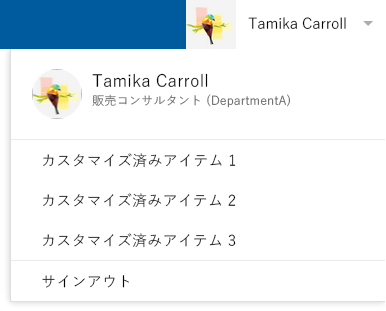

[!INCLUDE [Add the O365API repo styles](../includes/controls/addo365apistyles.xml)]

# Office 365 の JavaScript コントロール

_**適用対象:** Office 365_

Office 365 の JavaScript UI コントロールを使用すると、自分のアプリに Office 365 スタイルのナビゲーション バーを追加できます。また、ユーザーは Azure Active Directory (AAD) の人物に関するデータにアクセスできるようにもなります。このような JavaScript UI コントロールは、サーバー側のコードを必要としません。わずか数行のコードでシングルページ アプリケーション (SPA) に組み込むことができます。 

このようなコントロールの UI やデータ プロバイダーをカスタマイズする場合は、[OfficeDev – GitHub](https://github.com/OfficeDev) に次のものがあります。
*   [Office 365 People Controls](https://github.com/OfficeDev/Office-365-People-Controls)
*   [Office 365 AppChrome Control](https://github.com/OfficeDev/Office-365-AppChrome-Control)

これらの UI コントロールは、個別に動作させることも、組み合わせて動作させることもできます。その内容は、次のとおりです。 
* AppChrome - AppChrome コントロールを使用すると、自分のアプリで Office 365 スタイルのナビゲーション バーとカスタマイズしたリンクを表示できます。これにより、ユーザーは自分の Office 365 アカウントにサインインおよびサインアウトできるようになります。また、注目のサイトやページにユーザーを導くこともできます。
  
  __ユーザーがサインインする前の AppChrome コントロール__
  
 

  __ユーザーがサインインした後の AppChrome コントロール__
 
 

  __カスタマイズしたリンクを含む AppChrome コントロール__
  
 
 
 
 * People Picker - People Picker コントロールを使用すると、ユーザーはキーワードを入力することで、自分の組織内の人物を検索できます。ディレクトリ内で検索結果に一致した人物が表示されます。  

  _ユーザー選択ウィンドウ_

  

* Persona Card - インライン表示の Persona Card と詳細表示の Persona Card を使用すると、ユーザーは自分の組織内の個人に関する情報を確認できます。Persona Card には、People Picker コントロールなどを情報源にしたデータが表示されます。ユーザーがインライン表示の Persona Card をクリックすると、選択したユーザーに関する詳しい情報が詳細表示の Persona Card で確認できます。 

  __インライン表示の Persona Card__
  
   
  
  __詳細表示の Persona Card__
  
   

  __クリック後のインライン表示の Persona Card__
  
  

## Office 365 コントロールのコードの追加
* AppChrome コントロールのコードの追加
```html
<script src="https://controls.office.com/people/1.0/Office.Controls.People.min.js"></script>
<link href="https://controls.office.com/people/1.0/Office.Controls.People.min.css" rel="stylesheet">
<script src="https://controls.office.com/appChrome/1.0/Office.Controls.AppChrome.min.js"></script>
<link href="https://controls.office.com/appChrome/1.0/Office.Controls.AppChrome.min.css" rel="stylesheet">
```

* People コントロールのコードの追加
```html
<script src="https://controls.office.com/people/1.0/Office.Controls.People.min.js"></script>
<link href="https://controls.office.com/people/1.0/Office.Controls.People.min.css" rel="stylesheet">
```

#AppChrome 
## 始める前に

Office 365 の JavaScript コントロールをホストするシングルページ アプリが作成してある場合は、セットアップ手順の詳細について「[Office 365 API でアプリを作成する](https://msdn.microsoft.com/office/office365/howto/getting-started-Office-365-APIs?o365apifilter=javascript)」に目を通してください。

**注** OAuth 2.0 の暗黙的な付与フローを許可するようにアプリケーションを構成してください。

## SPA での AppChrome の作成

### AppChrome コントロールの作成

**構文**
```javascript
new Office.Controls.AppChrome(appTitle, container, loginProvider, options) 
```
**パラメーター**

|パラメーター | 型 | 説明 
|:-----|:-----|:-----|
|appTitle | String | AppChrome コントロールのナビゲーション バーに表示されるアプリ名。既定値は、"3rd Party App" です。 |
|container | Object | AppChrome コントロールを格納する HTML 要素。 |
|loginProvider | Object | AppChrome コントロールが必要とするサインイン ロジックを処理するオブジェクト。 |
|options | Object | 省略可能。 省略可能。AppChrome コントロールがサポートする、各種オプションを格納するオブジェクト。|

  **戻り値**
  
    Type: Object
    An AppChrome Object

### アクセス許可

AAD での構成に必要とされるアクセス許可

| コントロール名 |  Application Name | アプリケーション アクセス許可 | 委任されたアクセス許可 |
|:-----|:-----|:-----|:-----|
|AppChrome|Azure Active Directory||サインインおよびユーザー プロファイルの読み取り|   


### リファレンス

* #### options
```javascript
{
    "appHomeUrl": "", // type: String. description: The link for appTitle. The default value is null.
    "onSignIn": function() {}, // description: The Listener function will be called when user clicks the "Sign in" button.
    "onSignOut": function() {}, // description: The Listener function will be called when user clicks the "Sign out" button.
    "customizedItems": // type: Object. description: The custom items displayed in dropdown list below inline persona. The dropdown list will be available only when current user is signed in.
    { 
         <displayName1>: <linkUrl1>,         
         <displayName2>: <linkUrl2>,
         ...
         <displayNameN>: <linkUrlN>
    } 
}
```
* #### loginProvider object
 #### loginProvider オブジェクト  このオブジェクトでは、次に示す関数を公開する必要があります。これらの関数は AppChrome から呼び出されます。 
```javascript
{
    function login() {} // required. The function to call to sign in. When this function is called, the client app redirects the user to the Azure AD authorization endpoint. After authenticating, the user should be redirected back to the client application. 
    function logout() {} // required. The function to call to sign out. When this function is called, the user signs out. The client app redirects the user back to the specified endpoint. 
    function getUserInfoAsync(callback) {} // required.The function to get user data which will be displayed in the inline persona.   
       //  callback(error, userData)
       //      error: type: String. description: An error message if the call to get userData fails.
       //      userData: type: Object. description: Contains the below key-value pairs of user's information, displayed in inline Persona after login.
       //      { 
       //       "account": "", // type: String. description: Registered account name, displayed in inline persona. 
       //       "userName": "", // type: String. description: The user's name, displayed both in navigation bar and inline persona. 
       //       "imgSrc": "" // type: String. description: It's displayed both in navigation bar and inline persona. If it is not provided, a default image will be displayed.  
       //      } 
    function hasLogin() {} // optional. The function is used to check sign-in status. If this function isn't provided, the AppChrome control uses getUserInfoAsync(callback) to determine whether to show the user's sign-in status.
}
```
注: Implicit Grant Type を使用すると、ImplicitGrant loginProvider が使用できるようになります。詳細については、「ImplicitGrant loginProvider の作成方法」および Office.Controls.Login.js ("https://controls.office.com/appChrome/1.0/Office.Controls.Login.js") を参照してください。認証コードの付与フローを使用すると、サード パーティの開発者により loginProvider オブジェクトが提供されます。 
* ### ### ImplicitGrant loginProvider の作成方法
* ImplicitGrant loginProvider のコードの追加
```html
<script src="https://secure.aadcdn.microsoftonline-p.com/lib/1.0.0/js/adal.min.js"></script>
<script src="https://controls.office.com/appChrome/1.0/Office.Controls.Login.min.js"></script>
 ```
* ImplicitGrant loginProvider の作成
```javascript
var config = {
        var clientId = "********-****-****-****-************",  //Please replace with your clientID
        redirectUri: window.location.href,
        postLogoutRedirectUri: window.location,
        cacheLocation: 'localStorage' // enable this for Internet Explorer, as sessionStorage does not work for localhost.
};
var loginProvider = new Office.Controls.ImplicitGrantLogin(config);
```

#ユーザー選択ウィンドウ

## 始める前に

Office 365 の JavaScript UI コントロールをホストするシングルページ アプリが作成してある場合は、セットアップ手順の詳細について「[Office 365 API でアプリを作成する](https://msdn.microsoft.com/office/office365/howto/getting-started-Office-365-APIs?o365apifilter=javascript)」に目を通してください。

**注** OAuth 2.0 の暗黙的な付与フローを許可するようにアプリケーションを構成してください。

## SPA での People Picker の作成

### People Picker コントロールの作成

**構文**
```javascript
Office.Controls.PeoplePicker.create(container, authContext, options);
```
**パラメーター**

|パラメーター | 型 | 説明 
|:-----|:-----|:-----|
|コンテナー | Object | People Picker コントロールを格納する HTML 要素。 |
|authContext | Object | ADAL によって作成される Office 365 データにアクセスするためのオブジェクト。 |
|options | Object | 省略可能。 省略可能。People Picker コントロールがサポートする、各種オプションを格納するオブジェクト。|

  **戻り値**
  
    Type: Object

    A People Picker Object

### メソッド

**構文**
```javascript
function getAddedPeople()
```
**戻り値**
    
    Type: Object
    
    An array of person objects. These are the items picked from search results. 
    
### アクセス許可

AAD での構成に必要とされるアクセス許可

| コントロール名 |  Application Name | アプリケーション アクセス許可 | 委任されたアクセス許可 | コメント |
|:-----|:-----|:-----|:-----|:-----|
|People コントロール|Azure Active Directory||サインインおよびユーザー プロファイルの読み取り|すべての People コントロールは、このアクセス許可を必要とします|
|ユーザー選択ウィンドウ|Azure Active Directory||すべてのユーザーの基本的なプロファイルの読み取り|| 
|Persona Card|Azure Active Directory||すべてのユーザーの基本的なプロファイルの読み取り||  
|Persona Card|Azure Active Directory||すべてのユーザーの完全なプロファイルの読み取り|ユーザーの電話番号をアプリで取得する必要がある場合、AAD は、より高いアクセス許可を要求します。認証コードの付与フローで、パラメーター "prompt" に "admin_consent" を設定する必要があります。 ユーザーの電話番号をアプリで取得する必要がある場合、AAD は、より高いアクセス許可を要求します。認証コードの付与フローで、パラメーター "prompt" に "admin_consent" を設定する必要があります。|

  |

### リファレンス

* #### options
```javascript
{
    "allowMultipleSelections": false, // type: bool. default: false. description: determines whether a user can pick multiple people
    "showImage": true, // type: bool. default: true. description: determines whether to show a person's avatar image 
    "inputHint": "Type name...", // type: String. default: "Type name...". description: determines the hint text to show in the search input field
    "onChange": function(peoplePickerObject) {}// type: function. description: the event-handler function called when a person is picked or deleted
}
```
    
#Persona Card

## SPA での Persona Card の作成

### インライン表示の Persona Card の作成

**構文**
```javascript
Office.Controls.Persona.PersonaHelper.createInlinePersona(container, personObject, event);
```

**パラメーター**


| パラメーター     | 型   | 説明|
|:-----|:-----|:-----|
| コンテナー     | Object | インライン表示の Persona Card を格納する HTML 要素。|
| personObject| Object | 個人データ オブジェクト。|
| event         | String | 省略可能。 省略可能。詳細表示の Persona Card を表示または非表示にするイベント。サポートされる値は、click のみです。 The only supported value is **click**.|

### 詳細表示の Personal Card の作成

**構文**
```javascript
Office.Controls.Persona.PersonaHelper.createPersonaCard(container, personObject);
```

**パラメーター**

| パラメーター     | 型   | 説明|
|:-----|:-----|:-----|
| コンテナー     | Object | 詳細表示の Persona Card を格納する HTML 要素。|
| personObject| Object | 個人データ オブジェクト。|


### リファレンス

* #### #### 個人オブジェクト
```javascript
    {
       "displayName": "", // type: String. description: display name 
       "department": "", // type: String. description: department
       "description": "", // type: String. description: description of the person
       "jobTitle": "", // type: String. description: job title
       "mail": "", // type: String. description: e-mail address
       "workPhone": "", // type: String. description: work phone number
       "mobile": "", // type: String. description: mobile phone number
       "office": "", // type: String. description: office address
       "sipAddress": "", // type: String. description: sip address
       "alias": "", // type: String. description: alias
       "personId": "", // type: String. description: GUID of the person
       "imgSrc": ""// type:String. description: URL to avatar image
   }
```

# サンプル アプリケーション

この手順では、すべてのコントロールを含むシングルページ アプリケーションをセットアップします。AppChrome を使用して、ログイン プロセスを処理します。サインインしたユーザーは、People Picker と Persona Card を使用してデータを取得できます。

**Note** You should replace the '********-****-****-****-************' with a valid client ID for your application. See [Create an app with Office 365 APIs](https://msdn.microsoft.com/office/office365/howto/getting-started-Office-365-APIs?o365apifilter=javascript) for detailed instructions on getting set up. 注 OAuth 2.0 の暗黙的な付与フローを許可するようにアプリケーションを構成してください。

* 空の HTML ファイルを作成し、次に示すコードをコピーしてからファイルを保存します。サポート対象ブラウザーで、HTML ファイルを開きます。Office 365 資格情報を使用して AppChrome でサインインし、People Picker を使用して個人を選択します。その個人の情報は、Persona Card 内と JSON 形式で表示されます。 
```html
<!DOCTYPE html>
<html>
  <head>
      <title>Sample App with People controls</title>
      <script src="https://secure.aadcdn.microsoftonline-p.com/lib/1.0.0/js/adal.min.js"></script>
      <script src="https://controls.office.com/people/1.0/Office.Controls.People.min.js"></script>
      <link href="https://controls.office.com/people/1.0/Office.Controls.People.min.css" rel="stylesheet">
      <script src="https://controls.office.com/appChrome/1.0/Office.Controls.Login.min.js"></script>
      <script src="https://controls.office.com/appChrome/1.0/Office.Controls.AppChrome.min.js"></script>
      <link href="https://controls.office.com/appChrome/1.0/Office.Controls.AppChrome.min.css" rel="stylesheet">
      <script>
          window.onload = function() {
             var implicitGrantLogin = createLoginProvider();
             createAppChrome(implicitGrantLogin);
             var authContext = implicitGrantLogin.getAuthContext();
             showPeoplePicker(authContext);
          };

          function createLoginProvider() {
             var config = {
                clientId: "********-****-****-****-************", //Please replace with your clientID
                redirectUri: window.location.href,
                postLogoutRedirectUri: window.location,
                cacheLocation: 'localStorage' // enable this for IE, as sessionStorage does not work for localhost.
              };
              
            var loginProvider = new Office.Controls.ImplicitGrantLogin(config);
            return loginProvider;
          }

          function createAppChrome(loginProvider) {
            var ItemtoAdd = {
                "Customized Item 1": "http://www.contoso.com/item1", // put your customized item 1 page
                "Customized Item 2": "http://www.contoso.com/item2", // put your customized item 2 page
                "Customized Item 3": "http://www.contoso.com/item3" // put your customized item 3 page
              };
            options = new Object();
            options.appHomeUrl = "http://www.contoso.com/"; // put your home page url 
            options.customizedItems = ItemtoAdd;
            var appChrome = new Office.Controls.AppChrome("Contoso App", document.getElementById('container'), loginProvider, options);
          }

          function showPeoplePicker(userAuth) {
                  var options = {
                      "allowMultipleSelections": true,
                      "showImage": true,
                      "onChange": function(control) {
                          clear();
                          var pickedUsers = control.getAddedPeople();
                          document.getElementById("resultJSON").textContent = JSON.stringify(pickedUsers, null, 4);
                          if(pickedUsers != null) {
                            showInlinePersona(pickedUsers[pickedUsers.length - 1]);
                            showDetailedPersona(pickedUsers[pickedUsers.length - 1]);
                          }
                      }
                  };
                  Office.Controls.PeoplePicker.create(document.getElementById("payload"), userAuth, options);
          }
          
          function showInlinePersona(person) {
               var personaContainer = document.getElementById("inlinePersona");
               Office.Controls.Persona.PersonaHelper.createInlinePersona(personaContainer, person, "click");   
          }
          
          function showDetailedPersona(person) {
                var personaContainer = document.getElementById("detailedPersona");
                Office.Controls.Persona.PersonaHelper.createPersonaCard(personaContainer, person);
          }
          
          function clear(){
              document.getElementById("inlinePersona").innerHTML = "";
              document.getElementById("detailedPersona").innerHTML = "";
              document.getElementById("resultJSON").innerHTML = "";
          }
      </script>
  </head>
  <body>
      <div id="container"></div>
      <span id = "userProfile"></span>
      <div id = "payload"></div>
      <H5>InlinePersona(Recent Picked User):</h5>
      <div id = "inlinePersona"></div>
      <h5>Picked Users:</h5>
      <div id = "resultJSON"></div>
      <h5>DetailedPersona(Recent Picked User):</h5>
      <div id = "detailedPersona"></div>
  </body>
</html>
```

# サポート対象ブラウザー
Office 365 の JavaScript UI コントロールは、次に示すブラウザーでサポートされます。
* Internet Explorer 10 以上
* Chrome 43 以上
* Firefox 39 以上

# フィードバック
[Office Web ウィジェット](http://officespdev.uservoice.com/forums/224641-general/category/79970-office-web-widgets) カテゴリを使用して、UserVoice でフィードバックをお寄せください。